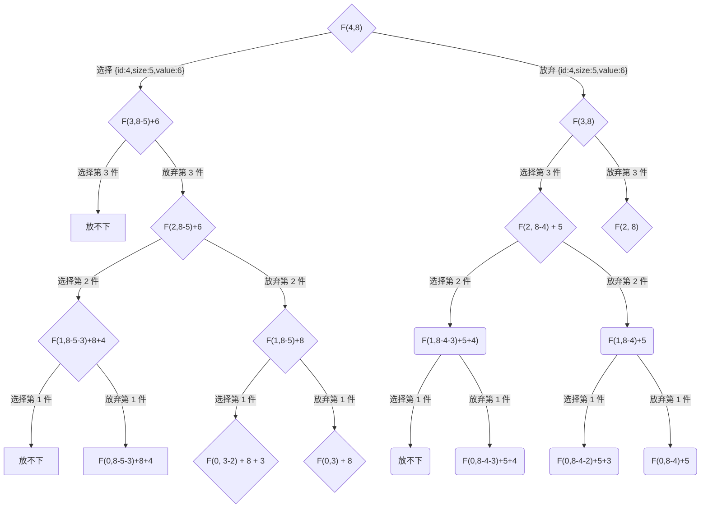

# 【动态规划】背包问题

## 题目

> 现在有四个物品，背包总容量为 8，背包最多能装入价值为多少的物品？
>
> | 物品编号 | 物品体积 | 物品价值 |
> | -------- | -------- | -------- |
> | 1        | 2        | 3        |
> | 2        | 3        | 4        |
> | 3        | 4        | 5        |
> | 4        | 5        | 6        |

| 物品编号/背包容量       | 0              | 1          | 2   | 3   | 4   | 5   | 6   | 7   | 8   |
| ----------------------- | -------------- | ---------- | --- | --- | --- | --- | --- | --- | --- |
| 0                       | ~~`f(0,0)=0`~~ | `f(0,1)=0` | 0   | 0   | 0   | 0   | 0   | 0   | 0   |
| `{id:4,size:5,value:6}` | `f(4,0)=0`     |            |     |     |     |     |     |     |     |
| `{id:3,size:4,value:5}` | 0              |            |     |     |     |     |     |     |     |
| `{id:2,size:3,value:4}` | 0              |            |     |     |     |     |     |     |     |
| `{id:1,size:2,value:3}` | 0              | `f(1,2)`   | 3   |     |     |     |     |     |     |

```
f(k, w) = k.w > w ? f(k-1,w) : max(f(k-1,w), f(k-1,w-k.w)+k.v )
```



```mermaid
flowchart TD
A["F(4,8)"] --> CHECK_4{"{id:4,size:5,value:6}"}
CHECK_4 -- "Y" --> Y4["F(3,8-5)+6 = F(3,3)+6"]
Y4 --> CHECK_3{"{id:3,size:4,value:5}"}
CHECK_3 -- "Y" --> Y4Y3["放不下"]
CHECK_3 -- "N" --> Y4N3["F(2,3)+6"]
Y4N3 -- CHECK_2{"{id:2,size:3,value:4}"}
```
