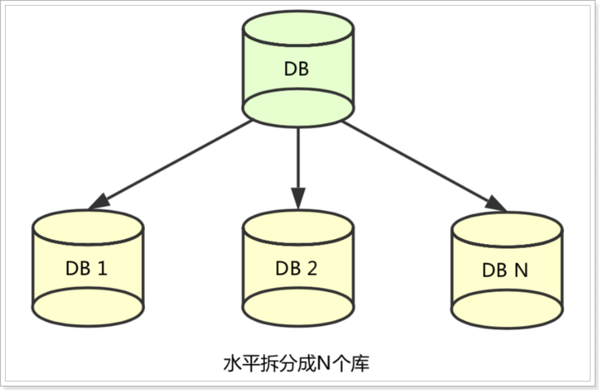
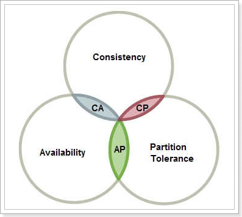
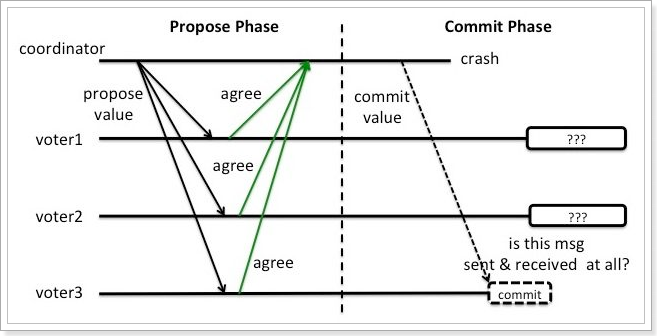
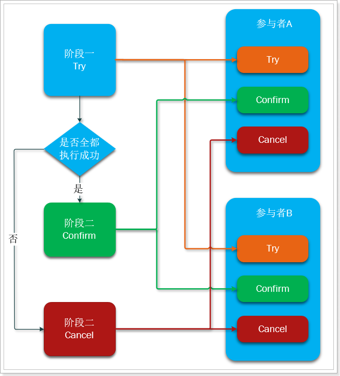
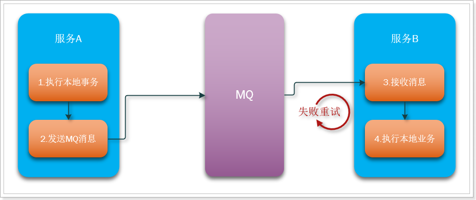
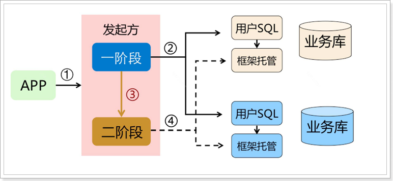
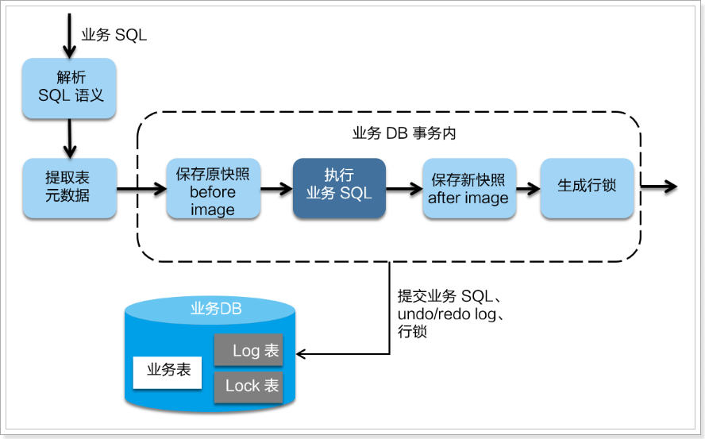
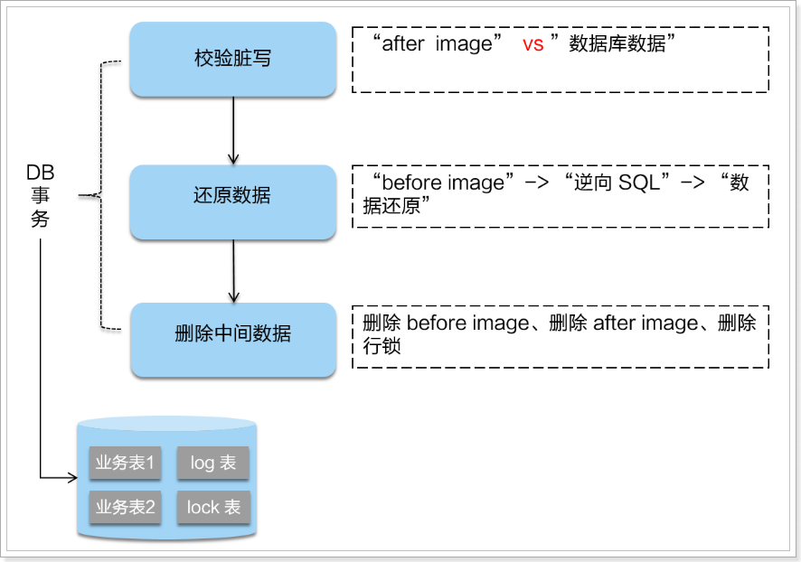
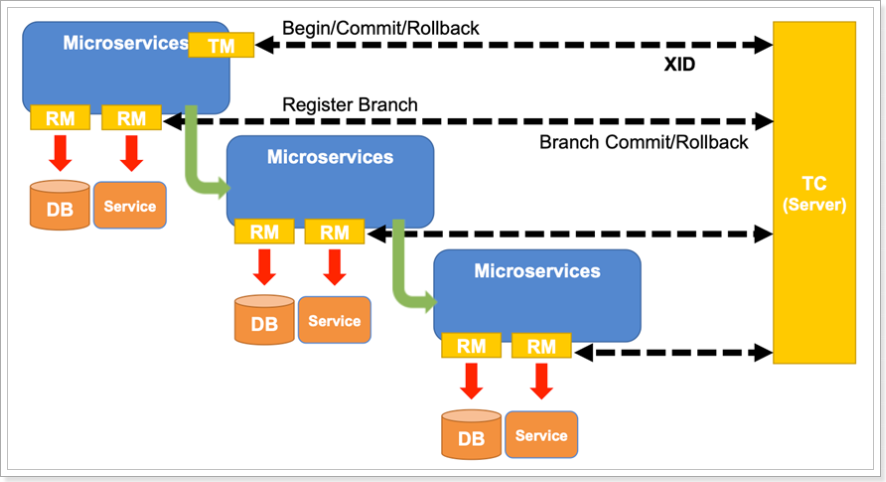
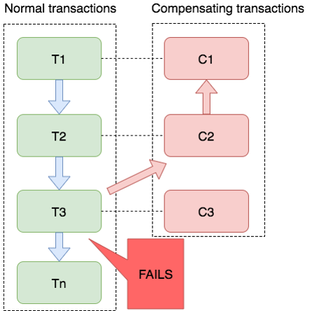

# 分布式事务

## 一、什么是分布式事务

### 1.1 本地事务

本地事务是指传统的单机数据库事务，必须具备 ACID 原则：

-   原子性(Atomicity)
    > 一个事务中的所有操作，要么全部完成，要么全部不完成，不会结束再中间某个环节。事务在执行过程中发生错误，会被恢复到事务开始前的状态，就像这个事务从来没有执行过一样。
-   一致性(Consistency)
    > 在事务开始之前和事务结束以后，数据库的完整性没有被破坏。这表示写入的资料必须完全符合所有的预设规则，这包含资料的精确度、串联性以及后续数据库可以自发性地完成预定的工作。
-   隔离性(Isolation)
    > 数据库允许多个并发事务同时对其数据进行读写和修改的能力，隔离性可以防止多个事务并发执行时交叉执行而导致数据的不一致。事务隔离分为不同级别，包括读未提交、读已提交、可重复读和串行化。
-   持久性(Durability)
    > 事务处理结束后，对数据的修改就是永久的，即便系统故障也不会丢失。

其中原子性和持久性就要靠 undo 和 redo 日志来实现。

 

### 1.2 undo 和 redo 日志

-   undo log 记录更新前数据，用于保证事务原子性。
-   redo log 记录更新后数据，用于保证事务的持久性。
-   redo log 有自己的内存 buffer，先写入到 buffer，事务提交时写入磁盘。
-   redo log 持久化之后，意味着事务是可以提交的。

 

### 1.3 分布式事务

分布式事务就是指不是在单个服务或单个数据库架构下产生的事务。

#### 1.3.1 跨数据源

随着业务数据规模的快速发展，数据量越来越大，单库单表逐渐成为瓶颈。所以我们对数据库进行了水平拆分，将原单库单表拆分成数据库分片，于是就产生了跨数据库事务问题。

#### 1.3.2 跨服务

在业务发展初期，“一块大饼”的单业务系统架构，能满足基本的业务需求。但是随着业务的快速发展，系统的访问量和业务复杂程度都在快速增长，单系统架构逐渐成为业务发展瓶颈，解决业务系统的高耦合、可伸缩问题的需求越来越强烈。

如下图所示，按照面向服务架构的设计原则，将单业务系统拆分成多个业务系统，降低了各系统之间的耦合度，使不同的业务系统专注于自身业务，更有利于业务的发展和系统容量的伸缩。

#### 1.3.3 分布式系统的数据一致性问题

在数据库水平拆分、服务垂直拆分之后，一个业务通常要跨多个数据库、服务才能完成，在分布式网络环境下，我们无法保障所有服务、数据库都百分百可用，一定会出现部分服务、数据库执行成功，而另一部分执行失败的问题。

 

 

## 二、解决分布式事务的思路

### 2.1 CAP 定理

#### 2.1.1 Consistency 和 Availability 的矛盾

一致性和可用性为什么不能同时成立？

答案很简单，因为可能通信失败（即出现分区容错）。

-   如果保证 G2 的一致性，那么 G1 必须在写操作时，锁定 G2 的读操作和写操作。只有数据同步后，才能重新开放读写。锁定期间，G2 不能读写，没有可用性。
-   如果保证 G2 的可用性，那么势必不能锁定 G2，所以一致性不成立。

综上所述，G2 无法同时做到一致性和可用性。系统设计时只能选择一个目标。如果追求一致性，那么无法保证所有节点的可用性；如果追求所有节点的可用性，那就没法做到一致性。

#### 2.1.2 怎么样才能同时满足 CA

除非是单点架构。

#### 2.1.3 何时满足 CP

对一致性要求高的场景。例如 ZooKeeper，在服务节点数据同步时，服务对外不可用。

#### 2.1.4 何时满足 AP

对可用性要求较高的场景。例如 Eureka，必须保证注册中心随时可用，不然拉取不到服务就可能出问题。

 

### 2.2 BASE 理论

BASE 是三个单词的缩写：

-   Basically Available(基本可用)
-   Soft state(软状态)
-   Eventually consistent(最终一致性)

而我们解决分布式事务，就是根据上述理论来实现。

还以下单减库存和扣款为例：

-   CP 方式

    > 现在如果要满足事务的强一致性，就必须在订单服务数据库锁定的同时，对库存服务、用户服务数据资源同时锁定。等待三个服务业务全部处理完成，才可以释放资源。此时如果有其他请求想要操作被锁定的资源就会被阻塞，这样就是满足了 CP。
    >
    > 这就是强一致，弱可用。

-   AP 方式

    > 三个服务的对应数据库个子独立执行自己的业务，执行本地事务，不要求互相锁定资源。但是这个中间状态下，我们去访问数据库，可能遇到数据不一致的情况，不过我们需要做一些后补措施，保证经过一段时间后，数据满足一致性。
    >
    > 这就是高可用，但弱一致（最终一致）。

由上面的两种思想，延伸出了很多的分布式事务解决方案：

-   XA
-   TCC
-   可靠消息最终一致
-   AT
-   Saga

 

### 2.3 分阶段提交

#### 2.3.1 DTP 和 XA

分布式事务的解决手段之一，就是两阶段提交协议。

1994 年，X/Open 组织定义了分布式事务处理的 DTP(Distributed Transaction Processing)模型。该模型包括这样几个角色：

-   应用程序(Application Program)
-   事务管理器(Transaction Manager)
-   资源管理器(Resource Manager)
-   通信资源管理器(Communication Resource Manager)
-   通信协议(Communication Protocol)

在该模型中，一个分布式事务(全局事务)可以被拆分成许多个本地事务，运行在不同的 AP 和 RM 上。每个本地事务的 ACID 很好实现，但是全局事务必须保证其中包含的每一个本地事务都能同时成功，若有一个本地事务失败，则所有其他事务都必须回滚。但问题是，本地事务处理过程中，并不知道其他事务的运行状态。因此，就需要通过 CRM 来通知各个本地事务，同步事务执行的状态。

因此，各个本地事务的通信必须有统一的标准，否则不同数据库间就无法通信。XA 就是 X/Open DTP 中 CRM 与 TM 间联系的借口规范，定义了用于通知事务开始、提交、终止、回滚等接口，各个数据库厂商都必须实现这些接口。

#### 2.3.2 二阶段提交

二阶段提交协议就是根据这一思想衍生出来的，将全局事务拆分成两个阶段来执行：

-   准备阶段：各个本地事务完成本地事务的准备工作。
-   执行阶段：各个本地事务根据上一阶段执行结果，进行提交或回滚。

这个过程中需要一个协调者，还有事务的参与者。

##### 单点故障问题

2PC 的缺点在于不能处理 fail-stop 形式的节点 failure。比如下图这种情况：

假设 coordinator 和 voter3 都在 commit 这个阶段 crash 了，而 voter1 和 voter2 没有收到 commit 消息。这时候 voter1 和 voter2 就陷入了一个困境。因为他们并不能判断现在是这两个场景中的哪一种：

-   上轮全票通过然后 voter3 第一个收到了 commit 的消息并在 commit 操作之后 crash 了。
-   上轮 voter3 反对所以干脆没有通过。

##### 阻塞问题

在准备阶段、提交阶段，每个事务参与者都会锁定本地资源，并等待其他事务的执行结果，阻塞时间较长，资源锁定时间太久，因此执行的效率就比较低了。

#### 2.3.3 使用场景

对事物有强一致性要去，对事物执行效率不敏感，并且不希望有太多代码侵入。

 

### 2.4 TCC

TCC 模式可以解决 2PC 中的资源锁定和阻塞问题，减少资源锁定时间。

#### 2.4.1 基本原理

TCC 本质是一种补偿的思路。事务运行过程包括三个方法：

-   Try：资源的检测和预留。
-   Confirm：执行的业务操作提交；要求 Try 成功 Confirm 一定要能成功。
-   Cancel：预留资源释放。

粗看似乎和两阶段提交没什么区别，但其实差别很大：

-   Try、Confirm、Cancel 都是独立的事务，不受其它参与者的影响，不会阻塞等待。
-   Try、Confirm、Cancel 由程序员在业务层编写，锁粒度由代码控制。

#### 2.4.2 优势和缺点

##### 优势

TCC 执行的每一个阶段都会提交本地事务并释放所，并不需要等待其它事务的执行结果。而如果其它事务执行失败，最后不是回滚，而是执行补偿操作。这样就避免了资源的长期锁定和阻塞等待，执行效率比较高，属于性能比较好的分布式事务方式。

##### 缺点

-   代码侵入：需要人为编写代码实现 Try、Confirm、Cancel，代码侵入比较多。
-   开发成本高：一个业务需要拆分成三个步骤，分别编写业务实现，业务编写比较复杂。
-   安全性考虑：Cancel 动作如果执行失败，资源就无法释放，需要引入重试机制，而重试机制可能导致重复执行，还要考虑重试时的幂等问题。

 

### 2.5 可靠消息服务

这种实现方式的思路，其实是源于 eBay，其基本的设计思想是将远程分布式事务拆分成一系列的本地事务。

#### 2.5.1 基本原理

一般分为事务的发起者 A 和事务的其它参与者 B：

-   事务发起者 A 执行本地事务
-   事务发起者 A 通过 MQ 将需要执行的事务消息发送给事务参与者 B
-   事务参与者 B 接收到消息后执行本地事务

几个注意事项：

-   事务发起者 A 必须确保本地事务成功后，消息一定发送成功
-   MQ 必须保证消息正确投递和持久化保存
-   事务参与者 B 必须确保消息最终一定能消费，如果失败需要多次重试
-   事务 B 执行失败，会重试，但不会导致事务 A 回滚

那么问题来了，我们如果保证消息发送一定成功？如果保证消费者一定能收到消息？

#### 2.5.2 RocketMQ 事务消息

RocketMQ 本身自带了事务消息，可以保证消息的可靠性，原理其实就是自带了本地消息表。

#### 2.5.3 RabbitMQ 的消息确认

RabbitMQ 确保消息不丢失的思路比较奇特，并没有使用传统的本地表，而是利用了消息的确认机制：

-   生产者确认机制：确保消息从生产者到达 MQ 不会有问题
    -   消息生产者发送消息到 RabbitMQ 时，可以设置一个异步的监听器，监听来自 MQ 的 ACK
    -   MQ 收到消息后，会返回一个回执给生产者
        -   消息到达交换机后路由失败，会返回失败 ACK
        -   消息路由成功，持久化失败，会返回失败 ACK
        -   消息路由成功，持久化成功，会返回成功 ACK
    -   生产者提前编写好不同回执的处理方式
        -   失败回执：等待一定时间后重新发送
        -   成功回执：记录日志等行为
-   消费者确认机制：确保消息能够被消费者正确消费
    -   消费者需要再监听队列的时候指定手动 ACK 模式
    -   RabbitMQ 把消息投递给消费者后，会等待消费者 ACK，接收到 ACK 后才删除消息，如果没有接收到 ACK 消息会一直保留在服务端，如果消费者断开连接或异常后，消息会投递给其它消费者。
    -   消费者处理完消息，提交事务后，手动 ACK。如果执行过程中抛出异常，则不会 ACK，业务处理失败，等待下一条消息。

经过上面的两种确认机制，可以确保从消息生产者到消费者的消息安全，再结合生产者和消费者两端的本地事务，即可保证一个分布式事务的最终一致性。

#### 2.5.4 消息事务的优缺点

##### 优点

-   业务相对简单，不需要编写三个阶段业务
-   是多个本地事务的结合，因此资源锁定周期短，性能好

##### 缺点

-   代码侵入
-   依赖于 MQ 的可靠性
-   消息发起者可以回滚，但是消息参与者无法引起事务回滚
-   事务时效性差，取决于 MQ 消息发送是否及时，还有消息参与者的执行情况

 

### 2.6 AT 模式

AT 模式是一种无侵入的分布式事务解决发难。可以看做是对 TCC 或者二阶段提交模型的一种优化，解决了 TCC 模式中的代码侵入、编码复杂等问题。

在 AT 模式下，用户只需关注自己的“业务 SQL”，用户的“业务 SQL”作为一阶段，Seata 框架会自动生成事务的二阶段提交和回滚操作。

#### 2.6.1 基本原理

AT 模式底层做的事情与 TCC 可完全不同，而且第二阶段根本不需要我们编写，全部由 Seata 自己实现了。也就是说我们写的代码与本地事务时的代码一样，无需手动处理分布式事务。

##### 一阶段

在一阶段，Seata 会拦截“业务 SQL”，首先解析 SQL 语义，找到“业务 SQL”要更新的业务数据，在业务数据被更新前，将其保存成 before image，然后执行“业务 SQL”更新业务数据，在业务数据更新之后，再将其保存成 after image，最后获取全局行锁，提交事务。以上操作全部在一个数据库事务内完成，这样保证了一阶段操作的原子性。

##### 二阶段提交

二阶段如果是提交的话，因为“业务 SQL”在一阶段已经提交至数据库，所以 Seata 框架只需将一阶段保存的快照数据和行锁删掉，完成数据清理即可。

##### 二阶段回滚

二阶段如果是回滚的话，Seata 就需要回滚一阶段已经执行的“业务 SQL”，还原业务数据。回滚方式便是用 before image 还原业务数据；但在还原之前首先要校验脏写，对比数据库当前业务数据和 after image，如果两份数据完全一致就说明没有脏写，可以还原业务数据，如果不一致就说明有脏写，出现脏写就需要转人工处理。

不过因为有全局锁机制，所以可以降低出现脏写的概率。

AT 模式的一阶段、二阶段提交和回滚均由 Seata 框架自动生成，用户只需编写“业务 SQL”，便能轻松接入分布式事务，AT 模式是一种对业务无任何侵入的分布式事务解决方案。

#### 2.6.2 详细架构与流程

Seata 中的几个基本概念：

-   事务协调者(Transaction Coordinator)

    > 维护全局和分支事务的状态，驱动全局事务提交或回滚。

-   事务管理器(Transaction Manager)

    > 定义全局事务的范围：开始全局事务、提交或回滚全局事务。

-   资源管理器(Resource Manager)

    > 管理分支事务处理的资源，与 TC 交谈以注册分支事务和报告分支事务的状态，并驱动分支事务提交或回滚。

##### 一阶段

-   TM 开启全局事务，并向 TC 声明全局事务，包括全局事务 XID 信息
-   TM 所在服务调用其它微服务
-   微服务主要由 RM 来执行
    -   查询 before image
    -   执行本地事务
    -   查询 after image
    -   生成 undo log 并写入数据库
    -   向 TC 注册分支事务，告知事务执行结果
    -   获取全局锁（阻止其它业务对数据的操作）
    -   释放本地锁（不影响其它业务对数据的操作）
-   待所有业务执行完毕，事务发起者 TM 会尝试向 TC 提交全局事务

##### 二阶段

-   TC 统计分支事务执行情况，根据结果判断下一步行为
    -   分支都成功：通知分支事务，提交事务
    -   有分支执行失败：通知执行成功的分支事务，回滚事务
-   分支事务的 RM
    -   提交事务：直接清空 before image 和 after image 信息，释放全局锁
    -   回滚事务：
        -   校验 after image，判断是否有脏写
        -   如果没有脏写，回滚数据到 before image，清除 before image 和 after image
        -   如果有脏写，请求人工介入

#### 2.6.3 优缺点

##### 优点

-   与 2PC 相比：每个分支事务都是独立提交，不互相等待，减少了资源锁定和阻塞时间
-   与 TCC 相比：二阶段的执行操作全部自动化完成，无代码侵入，开发成本低

##### 缺点

-   与 TCC 相比，需要动态生成二阶段的反向补偿操作，执行性能略低于 TCC

 

### 2.7 Sega 模式

#### 2.7.1 基本模型

在 Saga 模式下，分布式事务内有多个参与者，每一个参与者都是一个冲正补偿服务，需要用户根据业务场景实现其正向操作和逆向回滚操作。

分布式事务执行过程中，依次执行各参与者的正向操作，如果所有正向操作均执行成功，那么分布式事务提交。如果任何一个正向操作执行失败，那么分布式事务会退回去执行前面各参与者的逆向回滚操作，回滚已提交的参与者，使分布式事务回到初始状态。

Sega 模式下分布式事务通常是由事件驱动的，各个参与者之间是异步执行的，Sega 模式是一种长事务解决方案。

#### 2.7.2 适用场景

-   业务流程长、业务流程多
-   参与者包含其它公司或遗留系统服务，无法提供 TCC 模式要求的三个接口

#### 2.7.3 优势和缺点

##### 优势

-   一阶段提交本地事务，无锁，高性能
-   事件驱动架构，参与者可异步执行，高吞吐
-   补偿服务易于实现

##### 缺点

-   不保证隔离性
