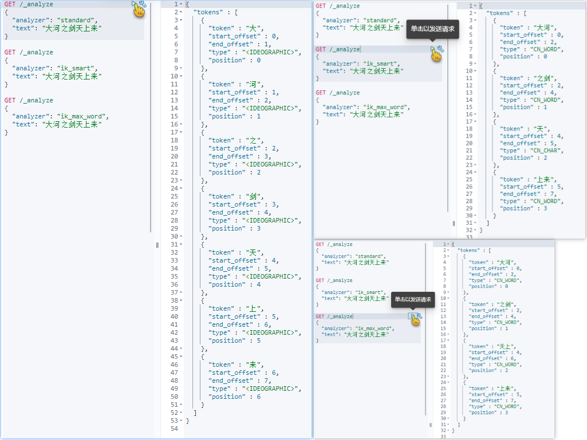
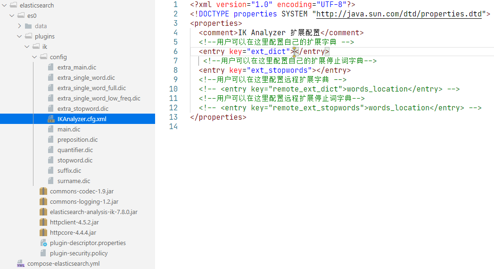
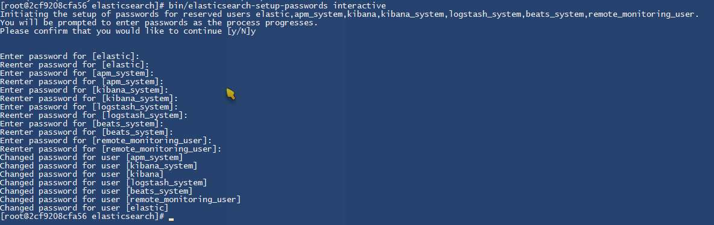
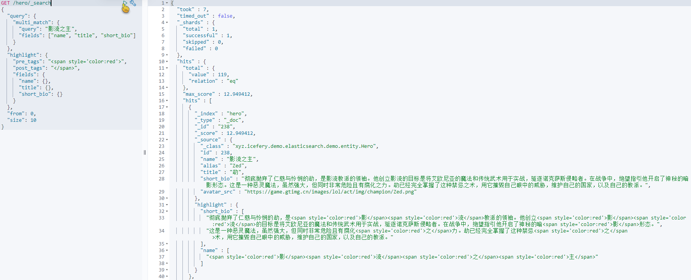
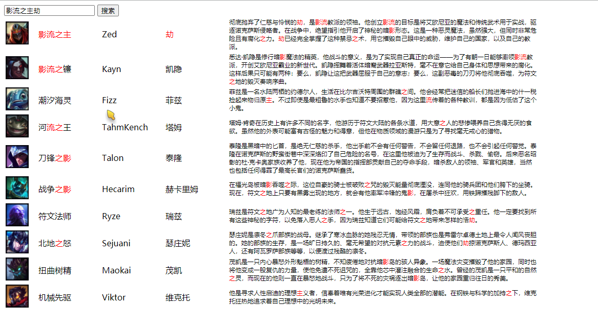

# Elasticsearch7.8.0 从安装到高亮搜索 LOL 英雄名

## 一、前言

环境：

-   ES 7.8.0
-   JDK11
-   SpringBoot 2.3.0（ES 7.6.2）

<br/><br/>

## 二、安装

### 2.1 (中文)IK 分词器

##### 2.1.1 分词器效果：



##### 2.1.2 GitHub 地址：

[https://github.com/medcl/elasticsearch-analysis-ik](https://github.com/medcl/elasticsearch-analysis-ik)

##### 2.1.3 下载：

为了避免在容器内下载过慢，教主选择了提前用迅雷下载下来，并以容器卷挂载的方式放到容器里去。大致的目录如下：

```shell
elasticsearch/
|--compose-elasticsearch.yml  # docker-compose.yml
|--es0/						  # es0 节点
|--plugins/					  # 插件卷
   |--ik/					  # 分词器插件
|--data/					  # 数据卷好东西就要分享出来：
```

另外容器卷挂载的方式还有个好处就是可以更加方便的添加用户词典：



##### 2.1.4 好东西分享出来：

GitHub 代下地址 [http://gitd.cc/](http://gitd.cc/)

<br/>

### 2.2 Elasticsearch

##### 2.2.1 创建(全局默认)网络：

```shell
docker network create local-net
```

##### 2.2.2 compose.yml：

```yaml
version: '3.8'
services:
  es0:
    image: elasticsearch:7.8.0
    restart: always
    ports:
      - 9200:9200
    volumes:
      - ./es0/data/:/usr/share/elasticsearch/data/
      - ./es0/plugins/:/usr/share/elasticsearch/plugins/
    environment:
      - node.name=es0
      - cluster.name=es-cluster
      - cluster.initial_master_nodes=es0
      - bootstrap.memory_lock=true
      - 'ES_JAVA_OPTS=-Xms512m -Xmx512m'
      - xpack.security.enabled=true
      - xpack.security.transport.ssl.enabled=true
    ulimits:
      memlock:
        soft: -1
        hard: -1
networks:
  default:
    external:
      name: local-net
```

##### 2.2.3 设置密码：

容器的工作目录已经在`/usr/share/elasticsearch/`目录下，进入容器后直接输入以下命令即可：

```shell
bin/elasticsearch-setup-passwords interactive
```



注意事项：

1. 设置密码后如果删除了新增的索引，下次登录时可能会登录不上，需要重新进入容器设置密码。
2. `elastic`用户相当于`root`用户

<br/>

### 2.3 Head 插件

Head 插件感觉起来可有可无(不是太好看)，有现成的 chrome 插件可用：[ElasticSearch Head](https://chrome.google.com/webstore/detail/elasticsearch-head/ffmkiejjmecolpfloofpjologoblkegm)

<br/>

### 2.4 Kibana

##### 2.4.1 compose.yml：

```yaml
version: '3.8'
services:
  kibana:
    image: kibana:7.8.0
    privileged: true
    ports:
      - 5601:5601
    volumes:
      - ./kibana/conf/kibana.yml:/usr/share/kibana/config/kibana.yml
networks:
  default:
    external:
      name: local-net
```

##### 2.4.2 配置文件 kibana.yml：

```yml
server.host: '0'
elasticsearch.hosts: ['http://es0:9200']
elasticsearch.username: 'elastic'
elasticsearch.password: '123456'
i18n.locale: 'zh-CN'
```

获取完整的配置文件可以从官网下载一份 Windows 版的进行参考。

##### 2.4.2 踩坑点：

1. 可见，在上面的 Compose 文件中教主选择了挂载配置文件，主要原因还是因为安装官网文档在`environment`中配置，但是结果不生效。
2. 需要特别注意的就是 kibana 默认允许的 HOST 为 127.0.0.1，只能容器内访问，需要设为 `0.0.0.0` 容器外映射端口才能进行访问。

<br/><br/>

## 三、集成 SpringBoot 高亮查询

### 3.1 连接配置

`spring.data`节点下的配置大部分已经`@Deprecated`了，使用 RestHighLevelClient 的`elasticsearch`节点直接在`spring`节点下：

```yml
spring:
  elasticsearch:
    rest:
      uris: http://127.0.0.1:9200
      username: elastic
      password: 123456
```

<br/>

### 3.2 创建规则

需要注意的是，就好比直接使用 REST API 插入数据并创建索引一样不会创建规则一样，尽管在实体属性的`@Field`注解上注明了字符串字段具体类型，也同样不会创建索引规则。例如如下方式不会自动创建规则：

```shell
PUT /hero/_doc/1
{
  "id": 1,
  "name": "黑暗之女",
  "alias": "Annie",
  "title": "安妮"
}
```

因此需要提前创建好规则(`keyword`不会被分词器分词，适合`term`查询)：

```shell
PUT /hero
{
  "mappings": {
    "properties": {
      "id": {
        "type": "integer"
      },
      "name": {
        "type": "text",
        "analyzer": "ik_smart"
      },
      "alias": {
        "type": "keyword"
      },
      "title": {
        "type": "text",
        "analyzer": "ik_smart"
      },
      "short_bio": {
        "type": "text",
        "analyzer": "ik_max_word"
      },
      "avatar_src": {
        "type": "keyword"
      }
    }
  }
}
```

<br/>

### 3.3 建立 Hero 实体

```java
@Data
@Accessors(chain = true)
@AllArgsConstructor
@NoArgsConstructor
@Document(indexName = "hero")
public class Hero {
    @Id
    @Field(type = FieldType.Integer)
    private Integer id;

    @Field(type = FieldType.Text, analyzer = "ik_smart")
    private String name;

    @Field(type = FieldType.Keyword)
    private String alias;

    @Field(type = FieldType.Text, analyzer = "ik_smart")
    private String title;

    @Field(value = "short_bio", type = FieldType.Text, analyzer = "ik_max_word")
    private String shortBio;

    @Field(value = "avatar_src", type = FieldType.Keyword)
    private String avatarSrc;
}
```

<br/>

### 3.4 导入 LOL 英雄数据

第一个英雄的接口为 [黑暗之女 / Annie / 安妮](https://game.gtimg.cn/images/lol/act/img/js/hero/1.js) ，目前从官网可见最大的 ID 为 856，但是实际上只有 148 条有效记录。对于不存在的接口会返回 404 ，Jsoup 会直接抛出异常，因此需要设置`ignoreHttpErrors(true)`。

请求到的 JSON 除了英雄本身的信息外，还有皮肤信息、技能信息等，即代码中的`wrapper / rootNode`，而我们暂时只需要`hero`节点，将其读取为`JsonNode`树状结构。

```java
@Slf4j
@SpringBootTest
public class ImportDataTest {
    @Autowired private ObjectMapper objectMapper;
    @Autowired private ElasticsearchRestTemplate elasticsearchRestTemplate;
    // @Autowired private MongoTemplate mongoTemplate;

    // 导入数据
    @Test
    void importDataTest() {
        final int start = 1;
        final int end = 856;
        List<Hero> list = new ArrayList<>();
        // List<Object> rootList = new ArrayList<>();
        for (int i = start; i <= end; i++) {
            try {
                Connection.Response response = Jsoup
                        .connect("https://game.gtimg.cn/images/lol/act/img/js/hero/" + i + ".js")
                        .timeout(30000)
                        // 忽略请求类型, 请求 JSON
                        .ignoreContentType(true)
                        // 忽略 404 等, 使用 statusCode 判断
                        .ignoreHttpErrors(true)
                        .execute();
                if (response.statusCode() == 200) {
                    // wrapper = { hero: { name: '' } }
                    String body = response.body();
                    JsonNode rootNode = objectMapper.readTree(body);

                    // 向 mongodb 存一份
                    // Object o = objectMapper.readValue(body, Object.class);
                    // rootList.add(o);

                    // hero = { name: '' }
                    JsonNode heroNode = rootNode.get("hero");
                    Hero hero = objectMapper.readValue(heroNode.toPrettyString(), Hero.class);

                    // hero = { id: i, name: '', avatarSrc: '' }
                    String avatarSrc = "https://game.gtimg.cn/images/lol/act/img/champion/" + hero.getAlias() + ".png";
                    hero.setAvatarSrc(avatarSrc);
                    hero.setId(i);

                    log.info(hero.toString());
                    list.add(hero);
                }
            } catch (IOException e) {
                e.printStackTrace();
            }
        }
        // mongoTemplate.insert(rootList, "hero_detail");
        elasticsearchRestTemplate.save(list);
    }
}
```

<br/>

### 3.5 高亮查询 REST API

```shell
GET /hero/_search
{
  "query": {
    "multi_match": {
      "query": "影流之主",
      "fields": ["name", "title", "short_bio"]
    }
  },
  "highlight": {
    "pre_tags": "<span style='color:red'>",
    "post_tags": "</span>",
    "fields": {
      "name": {},
      "title": {},
      "short_bio": {}
    }
  },
  "from": 0,
  "size": 10
}
```



<br/>

### 3.6 高亮查询 ElasticsearchRestTemplate

需要注意的是 PageRequest 的当前页（`page`）是从 0 开始的。默认按照命中率（`_score`）降序排序。

```java
@Slf4j
@Service
public class HeroService {
    @Autowired private ElasticsearchRestTemplate elasticsearchRestTemplate;

    public Map<String, Object> hightlightSearch(String keyword) {
        Map<String, Object> map = new HashMap<>();
        Query query = new NativeSearchQueryBuilder()
                .withQuery(
                        new MultiMatchQueryBuilder(keyword, "name", "title", "short_bio")
                )
                .withHighlightBuilder(
                        new HighlightBuilder()
                                .preTags("<span style='color:red'>")
                                .postTags("</span>")
                                .field("short_bio")
                                .field("title")
                                .field("name")
                )
                .withSort(
                        SortBuilders.scoreSort().order(SortOrder.DESC)
                )
                .withPageable(
                        PageRequest.of(0, 10)
                )
                .build();
        SearchHits<Hero> hits = elasticsearchRestTemplate.search(query, Hero.class);
        // 总命中数
        int total = (int) hits.getTotalHits();
        map.put("total", total);

        List<SearchHit<Hero>> hitList = hits.getSearchHits();

        // 本页命中数
        int size = hitList.size();
        map.put("size", size);

        List<Hero> list = new ArrayList<>();

        // 使用高亮字段替换实体字段
        for (SearchHit<Hero> hit : hitList) {
            Hero hero = hit.getContent();
            //
            List<String> highlightShortBioList = hit.getHighlightField("shortBio");
            if (!highlightShortBioList.isEmpty()) {
                String highlightShortBio = String.join("", highlightShortBioList);
                hero.setShortBio(highlightShortBio);
            }
            //
            List<String> highlightTitleList = hit.getHighlightField("title");
            if (!highlightTitleList.isEmpty()) {
                String highlightTitle = String.join("", highlightTitleList);
                hero.setTitle(highlightTitle);
            }
            //
            List<String> highlightNameList = hit.getHighlightField("name");
            if (!highlightNameList.isEmpty()) {
                String highlightName = String.join("", highlightNameList);
                hero.setName(highlightName);
            }
            list.add(hero);
        }
        // 命中单位集合
        map.put("list", list);

        return map;
    }
}
```

<br/>

### 3.7 HTML 展示

##### 3.7.1 页面跳转：

```java
@Controller
public class PageController {
    @GetMapping({"/", "/index", "index.html"})
    public String index() {
        return "index";
    }
}
```

##### 3.7.2 高亮查询接口：

```java
@RestController
public class HeroController {
    @Autowired private HeroService heroService;

    @GetMapping(value = "/highlight-search/{keyword}", produces = MediaType.APPLICATION_JSON_VALUE)
    public Map<String, Object> highlightSearch(@PathVariable("keyword") String keyword) {
        return heroService.hightlightSearch(keyword);
    }
}
```

##### 3.7.3 HTML 页面：

直接使用`v-html`指令显示带有样式的字段

```html
<!doctype html>
<html lang="en">
  <head>
    <meta charset="UTF-8" />
    <title>elasticsearch-demo</title>
    <script src="https://cdn.jsdelivr.net/npm/vue"></script>
    <script src="https://unpkg.com/axios/dist/axios.min.js"></script>
    <style>
      .width-45 {
        width: 45px;
      }
      .width-60 {
        width: 60px;
      }
      .width-120 {
        width: 120px;
      }
      .width-600 {
        width: 600px;
      }
      .font-12 {
        font-size: 12px;
      }
    </style>
  </head>
  <body>
    <div id="app">
      <label><input type="text" v-model="input" /></label>
      <button @click="request">搜索</button>
      <table v-if="showList">
        <tr v-for="(item, index) of list">
          <td class="width-60"></td>
          <td class="width-120" v-html="item.name"></td>
          <td class="width-120" v-html="item.alias"></td>
          <td class="width-120" v-html="item.title"></td>
          <td class="width-600 font-12 text-indent-cn" v-html="item.shortBio"></td>
        </tr>
      </table>
    </div>

    <script>
      new Vue({
        el: '#app',
        data() {
          return {
            input: '',
            showList: false,
            list: []
          }
        },
        methods: {
          request() {
            axios({
              url: `/highlight-search/${this.input}`
            }).then(response => {
              const { total, size, list } = response.data
              this.list = list
              this.showList = true
            })
          }
        }
      })
    </script>
  </body>
</html>
```

效果：



##### 3.7.4 IDEA Thymeleaf 踩坑点

SpringBoot 访问`/resources/static/`下的静态资源的方式为：`http://127.0.0.1:8080/js/vue.min.js`，在 thymleaf 中引用的方式为：

```html
<script th:src="@{/js/vue.min.js}"></script>
```

但在 IDEA2020.2 版本中，将文件复制进`/resources/static/`目录后，需要重启 IDEA 才能正常访问到。
