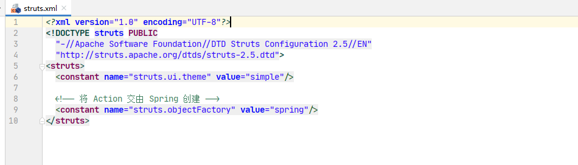
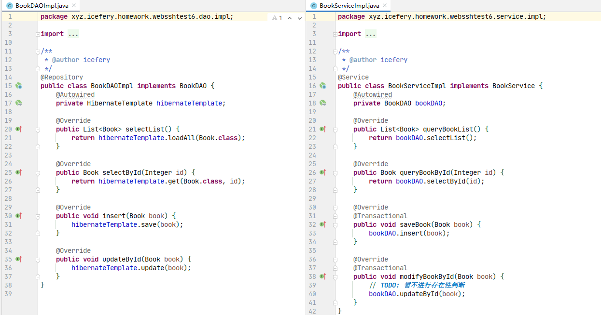
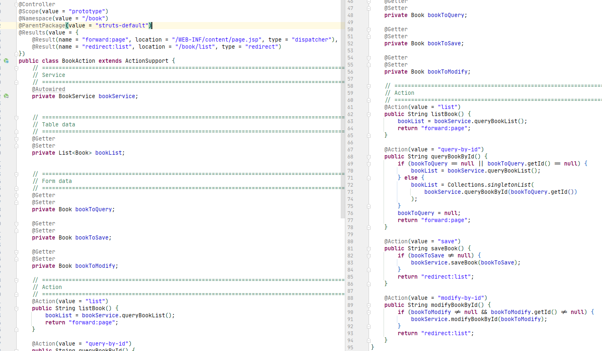

## 三、实验过程

### 3.1 依赖

-   Servlet API（`javax.servlet-api`）
-   MySQL 驱动（`mysql-connector-java`）
-   Druid 数据源（`druid`）
-   Spring （`spring-beans`、`spring-core`、`spring-context`、`spring-expression`、`spring-web`、`spring-orm`）
-   Hibernate（`hibernate-core`）
-   Struts2（`struts2-core`、`struts2-convention-plugin`、`struts2-spring-plugin`）

### 3.1 实体——表关系配置

### 3.2 `web.xml` 配置

### 3.3 Spring 配置

### 3.4 Struts 配置

### 3.5 DAO、Service

### 3.6 Action

### 3.7 页面

## 五、实验总结

1. Spring 整合 Struts 时，除了依赖其`spring-web`模块，还依赖于 Struts 的插件 `struts2-spring-plugin`
2. 直接在 Action 上定义公共的逻辑视图——物理视图的映射能简化 Action 方法
