# ClickHouse 笔记

## 一、ClickHouse 入门

ClickHouse 是由俄罗斯的 Yandex 于 2016 年开源的列式数据库，使用 C++ 语言编写，主要用于在线分析处理查询（OLAP），能够使用 SQL 查询实时生成分析数据报告。

### 1.1 ClickHouse 特点

#### 1.1.1 列式存储

列式存储的好处：

-   对于列的聚合、计数、求和等统计操作优于行式存储。
-   由于某一列的数据类型都是相同的，针对于数据存储更容易进行数据压缩，每一列选择更有的数据压缩算法，大大提高了数据的压缩比重。
-   由于数据压缩比更好，一方面节省了磁盘空间，另一方面对于 cache 也有了更大的发挥空间。

#### 1.1.2 DBMS 的功能

几乎覆盖了标准 SQL 的大部分语法，包括 DDL 和 DML，以及配套的各种函数，用户管理及权限管理，数据的备份与恢复。

#### 1.1.3 多样化引擎

ClickHouse 和 MySQL 类似，把表级别的存储引擎插件化，根据表的不同需求可以设定不同的存储引擎。目前包括合并树、日志、接口和其他四大类 20 多种引擎。

#### 1.1.4 高吞吐写入能力

ClickHouse 采用类 LSM Tree 的结构，数据写入后定期在后台 compaction。通过类 LSM Tree 的结构，ClickHouse 在数据导入时全部是顺序 append 写，写入后数据段不可更改，在后台 compaction 时也是多个段 merge sort 后顺序写回磁盘。顺序写的特性，充分利用了磁盘的吞吐能力，即便在 HDD 上也有着优异的写入性能。

官方公开 benchmark 测试显示能够达到 50MB-200MB/s 的写入吞吐能力，按照每行 100Byte 估算，大约相当于 50W-200W 条/s 的写入速度。

#### 1.1.5 数据分区与线程级并行

ClickHouse 将数据划分为多个 partition，每个 partition 再进一步划分为多个 index granularity（索引粒度），然后通过多个 CPU 核心分别处理其中的一部分来实现并行数据处理。在这种设计下，单条 Query 就能利用整机所有 CPU。极致的并行处理能力，极大的降低了查询延时。

所以，ClickHouse 即时对于大量数据的查询也能够化整为零平行处理。但是有一个弊端就是对于单条查询使用多 CPU，就不利用同时并发多条查询。所以对于高 QPS 的查询业务，ClickHouse 并不是强项。

<br/><br/>

## 二、ClickHouse 的安装

### 2.1 单机安装

> https://github.com/ClickHouse/ClickHouse/releases/tag/v23.3.3.52-lts

1. 下载

    ```shell
    VERSION=23.3.3.52
    ARCH=arm64
    PACKAGES=(
        clickhouse-common-static
        clickhouse-common-static-dbg
        clickhouse-server
        clickhouse-client
    )
    for package in "${PACKAGES[@]}"; do
        wget "https://github.com/ClickHouse/ClickHouse/releases/download/v${VERSION}-lts/${package}_${VERSION}_${ARCH}.deb"
    done
    ```

2. 安装

    ```shell
    apt install ./clickhouse-*.deb

    systemctl status clickhouse-server
    ```

3. 连接

    ```shell
    clickhouse-client -m
    ```

    ```sql
    select version();

    show databases;

    show tables;
    ```

<br/><br/>

## 三、数据类型

### 3.1 整型

-   `Int8`
-   `Int16`
-   `Int32`
-   `Int64`
-   `UInt8`
-   `UInt16`
-   `UInt32`
-   `UInt64`

<br/>

### 3.2 浮点型

-   `Float32`
-   `Float54`

<br/>

### 3.3 Decimal

有符号的浮点数，可在加、减和乘法运算过程中保持精度。对于除法，最低有效数字会被丢弃。

-   `Decimal32(s)`，相当于 `Decimal(9-s,s)`，有效位数为 1-9。
-   `Decimal64(s)`，相当于 `Decimal(18-s,s)`，有效位数为 1-18。
-   `Decimal128(s)`，相当于 `Decimal(38-s,s)`，有效位数为 1-38。

<br/>

### 3.4 字符串

-   `String`
-   `FixedString(N)`

<br/>

### 3.5 枚举类型

-   `Enum8`
-   `Enum16`

Enum 保存 `string=>integer`的对应关系。

1. 创建一个带有枚举 `Enum8('hello'=1, 'word'=2)`类型列的表。

    ```sql
    create table t_enum (
        x Enum8('hello'=1, 'world'=2)
    )
    engine = TinyLog;
    ```

2. 这个 `x` 列只能存储类型定义中的值 `hello` 或者`world`。

    ```sql
    insert into t_enum values ('hello'), ('world'), ('hello');
    ```

3. 如果尝试保存任何其他值，ClickHouse 会抛出异常。

    ```sql
    insert into t_enum values ('a');
    ```

    ```log
     Exception on client:
     Code: 691. DB::Exception: Unknown element 'a' for enum: while executing 'FUNCTION if(isNull(_dummy_0) : 3, defaultValueOfTypeName('Enum8(\'hello\' = 1, \'world\' = 2)') :: 2, _CAST(_dummy_0, 'Enum8(\'hello\' = 1, \'world\' = 2)') :: 4) -> if(isNull(_dummy_0), defaultValueOfTypeName('Enum8(\'hello\' = 1, \'world\' = 2)'), _CAST(_dummy_0, 'Enum8(\'hello\' = 1, \'world\' = 2)')) Enum8('hello' = 1, 'world' = 2) : 1': While executing ValuesBlockInputFormat: data for INSERT was parsed from query. (UNKNOWN_ELEMENT_OF_ENUM)
    ```

4. 如果需要看到对应行的数值，则必须将 Enum 值转换为整数类型。

    ```sql
    select cast(x, 'Int8') from t_enum;
    ```

    对一些状态、类型的字段算是一种空间优化，也算是一种数据约束。但是实际使用中往往因为一些数据内容的变化增加一定的维护成本，甚至是数据丢失问题。所以谨慎使用。

<br/>

### 3.6 时间类型

目前 ClickHouse 有三种时间类型：

-   `Date` 如 `2019-12-16`
-   `DateTime` 如 `2019-12-16 20:50:10`
-   `DateTime64` 如 `2019-12-16 20:50:10.66`

<br/>

### 3.7 数组

`Array(T)` 由 `T` 元素组成的数组。`T` 可以是任意类型，包含数组类型。但不推荐使用多维数组，ClickHouse 对多维数组的支持有限。例如，不能在 MergeTree 表中存储多维数组。

```sql
select array(1, 2) as x, toTypeName(x);

select [1, 2] as x, toTypeName(x);
```

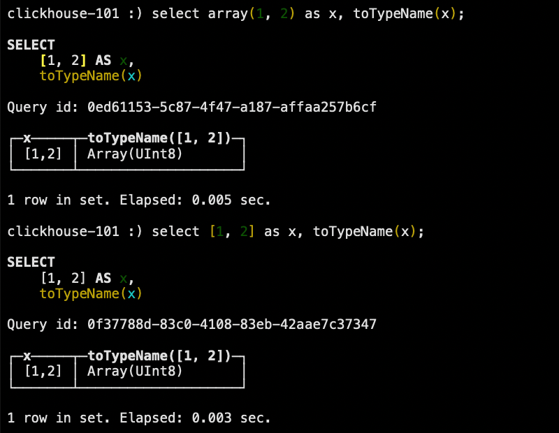

<br/><br/>

## 四、表引擎

表引擎是 ClickHouse 的一大特色。可以说，表引擎决定了如何存储表的数据。包括：

-   数据的存储方式和位置，写到哪里以及从哪里读取数据。
-   支持哪些查询以及如何支持。
-   并发数据访问。
-   索引的访问（如何存在）。
-   是否可以执行多线程请求。
-   数据复制参数。

表引擎的使用方式就是必须显式在创建表时定义该表使用的引擎，以及引擎使用的相关参数。
<br/>

### 4.1 TinyLog

以列文件的形式保存在磁盘上，不支持索引，没有并发控制。一般保存少量数据的小表，生产环境上作用有限。可以用于平时练习测试用。

```sql
create table t_tinylog (id String, name String) engine = TinyLog;
```

<br/>

### 4.2 Memory

内存引擎，数据以未压缩的原始形式直接保存在内存当中，服务器重启数据就会丢失。读写操作不会相互阻塞，不支持索引。简单查询下有非常非常高的性能表现（超过 10G/s）。

一般用到它的地方不多，除了用来测试，就是在需要非常高的性能，同时数据量又不太大（上限大搞 1 亿行）的场景。

<br/>

### 4.3 MergeTree

ClickHouse 中最强大的表引擎当属 MergeTree（合并树）引擎以及该系列（\*MergeTree）中的其他引擎，支持索引和分区，地位相当于 InnoDB 之于 MySQL。而且基于 MergeTree，还衍生出了很多小弟，也是非常有特色的引擎。

```sql
create table t_order_mt (
    id           UInt32,
    sku_id       String,
    total_amount Decimal(16,2),
    create_time  DateTime
)
engine = MergeTree
partition by toYYYYMMDD(create_time)
primary key (id)
order by (id, sku_id);
```

```sql
insert into t_order_mt values
(101, 'sku_001', 1000.00,  '2020-06-01 12:00:00'),
(102, 'sku_002', 2000.00,  '2020-06-01 11:00:00'),
(102, 'sku_004', 2500.00,  '2020-06-01 12:00:00'),
(102, 'sku_002', 2000.00,  '2020-06-01 13:00:00'),
(102, 'sku_002', 12000.00, '2020-06-01 13:00:00'),
(102, 'sku_002', 600.00,   '2020-06-02 12:00:00');
```

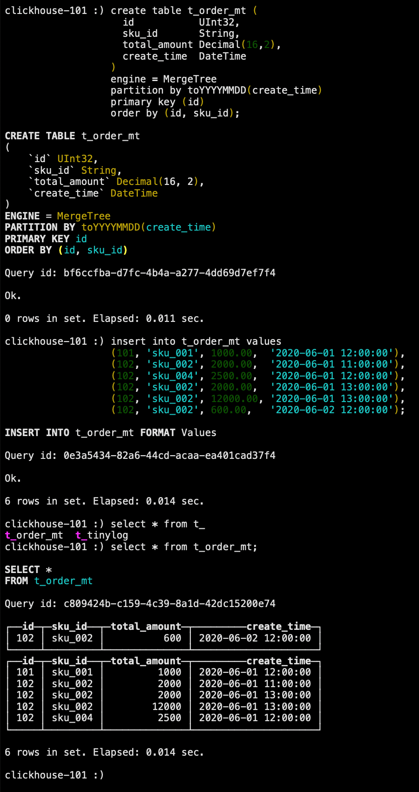

MergeTree 其实还有很多参数（绝大多数参数用默认值即可），但是有三个参数是更加重要的，也涉及了关于 MergeTree 的很多概念。

#### 4.3.1 `partition by` 分区（可选）

学过 Hive 的都不陌生，分区的目的主要还是降低扫描的范围，优化查询速度。如果不填，只会使用一个分区。MergeTree 是以列文件 + 索引文件 + 表定义文件组成的，但是如何设定了分区，那么这些文件就会保存到不同的分区目录中。分区后，面对涉及跨分区的查询统计，ClickHouse 会以分区为单位并行处理。

任何一个批次的数据写入都会产生一个临时分区，不会纳入任何一个已有的分区。写入后的某个时刻（大概 10-15 分钟后），ClickHouse 会自动执行合并操作（等不及也可以手动通过 `optimize` 执行），把临时分区的数据，合并到已有分区中。

```sql
optimize table t_order_mt final;
```

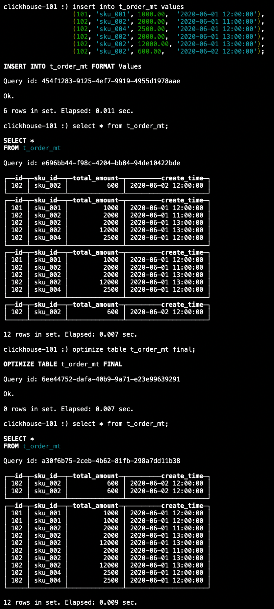

#### 4.3.2 `primary key`主键（可选）

ClickHouse 中的主键，和其他数据库不太一样，它只提供了数据的一级索引，但是却不是唯一约束。这就意味着是可以存在相同 `primary key`的数据的。

主键的设定主要依据是查询语句中的 `where` 条件。根据条件通过对主键进行某种形式的二分查找，能够定位到对应的 `index_granularity`，避免了全表扫描。

`index_granularity` 直接翻译的话就是索引粒度，指在稀疏索引中两个相邻索引对应数据的间隔。ClickHouse 中的 MergeTree 默认是 8192。官方不建议修改这个值，除非该列存在大量重复值，比如在一个分区中几万行才有一个不同数据。

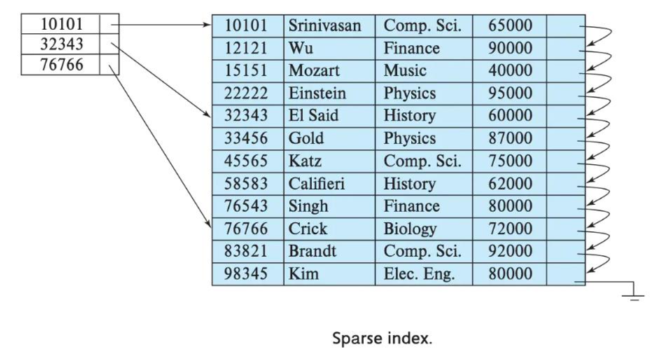

稀疏索引的好处就是可以用很少的索引数据，定位更多的数据，代价就是只能定位到索引粒度的第一行，然后再进行扫描。

#### 4.3.3 `order by`（必选）

`order by`设定了分区内的数据按照哪些字段顺序进行有序保存。`order by`是 MergeTree 中唯一一个必填项，甚至比 `primary key`还重要，因为当用户不设置主键的情况，很多处理依照 `order by` 的字段进行处理（比如后面会讲的去重和汇总）。

要求主键必须是 `order by`字段的前缀字段。比如 `order by`的字段是`(id, sku_id)`那么主键必须是 `(id)`或者 `(id, sku_id)`。

#### 4.3.4 二级索引

目前在 ClickHouse 的官网上二级索引的功能在 `v20.1.2.4` 之前是被标注为实验性的，在这个版本之后默认是开启的。

1. 创建测试表

    ```sql
    create table t_order_mt2 (
        id           UInt32,
        sku_id       String,
        total_amount Decimal(16,2),
        create_time  DateTime,
        index a total_amount type minmax granularity 5
    )
    engine = MergeTree
    partition by toYYYYMMDD(create_time)
    primary key (id)
    order by (id, sku_id);
    ```

    > 其中 `granularity N` 是设定二级索引对一级索引的粒度。

2. 插入数据

    ```sql
    insert into t_order_mt2 values
    (101, 'sku_001', 1000.00,  '2020-06-01 12:00:00'),
    (102, 'sku_002', 2000.00,  '2020-06-01 11:00:00'),
    (102, 'sku_004', 2500.00,  '2020-06-01 12:00:00'),
    (102, 'sku_002', 2000.00,  '2020-06-01 13:00:00'),
    (102, 'sku_002', 12000.00, '2020-06-01 13:00:00'),
    (102, 'sku_002', 600.00,   '2020-06-02 12:00:00');
    ```

3. 对比效果

    可以使用下面的语句进行测试，可以看出二级索引能够为非主键字段的查询发挥作用。

    ```shell
    clickhouse-client --send_logs_level=trace <<< 'select * from t_order_mt2  where total_amount > toDecimal32(900, 2)';
    ```

    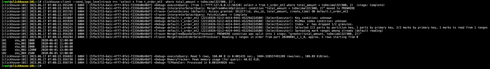

#### 4.3.5 数据 TTL

TTL 即 Time To Live，MergeTree 提供了可以管理数据表或者列的生命周期的功能。

-   列级别 TTL

    1. 创建测试表

        ```sql
        create table t_order_mt3 (
            id           UInt32,
            sku_id       String,
            total_amount Decimal(16,2) ttl create_time + interval 10 second,
            create_time  DateTime
        )
        engine = MergeTree
        partition by toYYYYMMDD(create_time)
        primary key (id)
        order by (id, sku_id);
        ```

    2. 插入数据

        ```sql
        insert into t_order_mt3 values
        (106, 'sku_001', 1000.00, '<当前时间>'),
        (107, 'sku_002', 2000.00, '<当前时间>'),
        (110, 'sku_003', 600.00,  '<当前时间>');
        ```

    3. 手动合并

        > 查看效果，到期后，指定的字段数据归 0。

        ```sql
        optimize table t_order_mt3 final;

        select * from t_order_mt3;
        ```

-   表级别 TTL

    下面的这条语句是数据会在 `create_time` 之后 10 秒丢失。

    ```sql
    alter table t_order_mt3 modify ttl create_time + interval 10 second;
    ```

    涉及判断的字段必须是 `Date` 或者 `DateTime` 类型，推荐使用分区的日期字段。能够使用的时间周期：

    -   `SECOND`
    -   `MINUTE`
    -   `HOUR`
    -   `DAY`
    -   `WEEK`
    -   `MONTH`
    -   `QUARTER`
    -   `YEAR`

<br/><br/>

### 4.4 ReplacingMergeTree

ReplacingMergeTree 是 MergeTree 的一个变种，它存储特性完全继承 MergeTree，只是多了一个去重的功能。尽管 MergeTree 可以设置主键，但是 `primary key` 其实没有唯一约束的功能。如何你想处理掉重复的数据，可以借助这个 ReplacingMergeTree。

#### 4.4.1 去重时机

数据的去重只会在合并的过程中出现。合并会在未知的时间在后台进行，所以你无法预先作出计划。有一些数据可能仍未被处理。

#### 4.4.2 去重范围

如何表经过了分区，去重只会在分区内部进行去重，不能执行跨分区的去重。所以 ReplacingMergeTree 能力有限，适用于在后台清除重复的数据以节省空间，但是它不保证没有重复的数据出现。

#### 4.4.3 案例演示

1. 创建表

    ```sql
    create table t_order_rmt (
        id           UInt32,
        sku_id       String,
        total_amount Decimal(16,2),
        create_time  DateTime
    )
    engine = ReplacingMergeTree(create_time)
    partition by toYYYYMMDD(create_time)
    primary key (id)
    order by (id, sku_id);
    ```

    > `ReplacingMergeTree()`填入的参数为版本字段，重复数据保留版本字段值最大的。如果不填版本字段，默认按照插入顺序保留最后一条。

2. 插入数据

    ```sql
    insert into t_order_rmt values
    (101, 'sku_001', 1000.00,  '2020-06-01 12:00:00'),
    (102, 'sku_002', 2000.00,  '2020-06-01 11:00:00'),
    (102, 'sku_004', 2500.00,  '2020-06-01 12:00:00'),
    (102, 'sku_002', 2000.00,  '2020-06-01 13:00:00'),
    (102, 'sku_002', 12000.00, '2020-06-01 13:00:00'),
    (102, 'sku_002', 600.00,   '2020-06-02 12:00:00');
    ```

3. 查询

    ```sql
    optimize table t_order_rmt final;

    select * from t_order_rmt;
    ```

#### 4.4.4 结论

-   实际上是使用 `order by` 字段作为唯一键。
-   去重不能跨分区。
-   只有同一批插入（新版本）或合并分区时才会进行去重。
-   认定重复的数据保留版本字段最大的。
-   如果版本字段相同则按插入顺序保留最后一笔。

<br/>

### 4.5 SummingMergeTree

对于不查询明细，只关心以维度进行汇总聚合结果的场景。如果只使用普通的 MergeTree 的话，无论是存储空间的开销，还是查询时临时聚合的开销都比较大。

ClickHouse 为了这种场景，提供了一种能够“预聚合”的引擎 SummingMergeTree。

#### 4.5.1 结论

-   以 `SummingMergeTree()`中指定的列作为汇总数据列。
-   可以填写多列必须数字列，如果不填，以所有非维度列切位数字列的字段为汇总数据列。
-   以 `order by`的列为准作为维度列。
-   其他的列按插入顺序保留第一行。
-   不在一个分区的数据不会被聚合。
-   只有在同一批插入（新版本）或合并分区时才会进行聚合。

#### 4.5.2 开发建议

涉及聚合表的话，唯一键值、流水号可以去掉，所有字段全部是维度、度量或者时间戳。

#### 4.5.3 问题

能不能直接执行以下 SQL 得到汇总值呢？

```sql
select total_amount from t_order_smt;
```

不行，可能会包含一些还没来得及聚合的临时明细。如果是要获取汇总值，还是需要使用 `sum` 进行聚合，这样效率会有一定的提高，但本身 ClickHouse 是列式存储的，效率提升有限，不会特别明显。

```sql
select sum(total_amount) from t_order_smt;
```

<br/><br/>

## 五、SQL 操作

### 5.1 Update 和 Delete

ClickHouse 提供了 Update 和 Delete 的能力，这类操作被称为 Mutation 查询，它可以看作 Alter 的一种。虽然可以实现修改和删除，但是和一般的 OLTP 数据库不一样，Mutation 语句是一种很“重”的操作，而且不支持事务。“重”的原因主要是每次修改或者删除都会导致放弃目标数据的原有分区，重建新分区。所以尽量做批量的变更，不要进行频繁小数据的操作。

-   删除操作

    ```sql
    alter table t_order_smt delete where sku_id = 'sku_001';
    ```

-   修改操作

    ```sql
    alter table t_order_smt update total_amount = toDecimal32(200.00, 2) where id = 102;
    ```

### 5.2 Alter 操作

-   新增字段

    ```sql
    alter table t1 add column col_2 String after col_1;
    ```

-   修改字段类型

    ```sql
    alter table t1 modify column col_2 col_2 String;
    ```

-   删除字段

    ```sql
    alter table t1 drop column col_2;
    ```

### 5.3 导出数据

```shell
clickhouse-client --query "select * from t_order_mt where create_time = '2020-06-01 12:00:00'" --format CSVWithNames > t_order_mt.csv
```

<br/>

<br/>

## 六、副本

副本的目的主要是保障数据的高可用性，即时一台 ClickHouse 节点宕机，那么也可以从其他服务器获得相同的数据。

### 6.1 副本写入流程

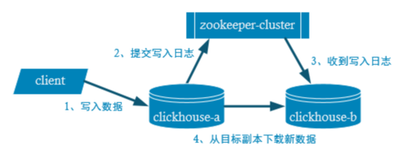

<br/>

### 6.2 配置步骤

1. 启动 ZooKeeper 集群。

2. 在 `/etc/clickhouse-server/config.d` 目录下创建一个名为 `metrika.xml` 的配置文件。配置内容如下：

    ```xml
    <?xml version="1.0" encoding="UTF-8"?>
    <yandex>
        <zookeeper-servers>
            <node>
                <host>clickhouse-101</host>
                <port>2181</port>
            </node>
            <node>
                <host>clickhouse-102</host>
                <port>2181</port>
            </node>
            <node >
                <host>clickhouse-103</host>
                <port>2181</port>
            </node>
        </zookeeper-servers>
    </yandex>
    ```

3. 修改 `/etc/clickhouse-server/config.xml` 配置文件。增加内容如下：

    ```xml
    <?xml version="1.0"?>
    <yandex>
         <!--  -->
         <zookeeper incl="zookeeper-servers" optional="true" />
         <include_from>/etc/clickhouse-server/config.d/metrika.xml</include_from>
    </yandex>
    ```

4. 同步配置。

    ```shell
    scp -r /etc/clickhouse-server clickhouse-102:/etc
    scp -r /etc/clickhouse-server clickhouse-103:/etc
    ```

5. 在各个节点上分别建表：

    > 副本只能同步数据，不能同步表结构，所以我们需要在每台机器上手动建表。

    - `clickhouse-101`节点

        ```sql
        create table t_order_rep (
            id           UInt32,
            sku_id       String,
            total_amount Decimal(16,2),
            create_time  Datetime
        )
        engine = ReplicatedMergeTree('/clickhouse/tables/shard-01/t_order_rep','replica-01')
        partition by toYYYYMMDD(create_time)
        primary key (id)
        order by (id,sku_id);
        ```

    - `clickhouse-102`节点

        ```sql
        create table t_order_rep (
            id           UInt32,
            sku_id       String,
            total_amount Decimal(16,2),
            create_time  Datetime
        )
        engine = ReplicatedMergeTree('/clickhouse/tables/shard-01/t_order_rep','replica-02')
        partition by toYYYYMMDD(create_time)
        primary key (id)
        order by (id, sku_id);
        ```

    参数解释：`ReplicatedMergeTree()`中，第一个参数是分片的 ZooKeeper 路径，一般按照 `/clickhouse/tables/{shard}/{table_name}`的格式写，如果只有一个分片就写 `01` 即可。第二个参数是副本名称，相同的分片中副本名称不能相同。

6. 在一个节点上执行插入语句。

    ```sql
    insert into t_order_rep values
    (101, 'sku_001', 1000.00, '2020-06-01 12:00:00'),
    (102, 'sku_002', 2000.00, '2020-06-01 12:00:00'),
    (103, 'sku_004', 2500.00, '2020-06-01 12:00:00'),
    (104, 'sku_002', 2000.00, '2020-06-01 12:00:00'),
    (105, 'sku_003', 600.00,  '2020-06-02 12:00:00');
    ```

7. 在另一个节点上执行查询语句，可以查询出结果，说明副本配置正确。

<br/><br/>

## 七、分片集群

副本虽然能够提高数据的可用性，降低丢失风险，但是每台服务器实际上必须容纳全量数据，对数据的横向扩容没有解决。

要解决数据水平切分的问题，需要引入分片的概念。通过分片把一份完整的数据进行切分，不同的分片分布到不同的节点上，再通过 Distributed 表引擎把数据拼接起来一同使用。

Distributed 表引擎本身不存储数据，有点类似于 MyCat 之于 MySQL，成为一种中间件，通过分布式逻辑表来写入、分发、路由来操作多台节点不同分片的分布式数据。

ClickHouse 的集群是表级别的，实际企业中，大部分做了高可用，但是没有用分片，避免降低查询性能以及操作集群的复杂性。

### 7.1 集群写入流程（3 分片 2 副本共 6 个节点）

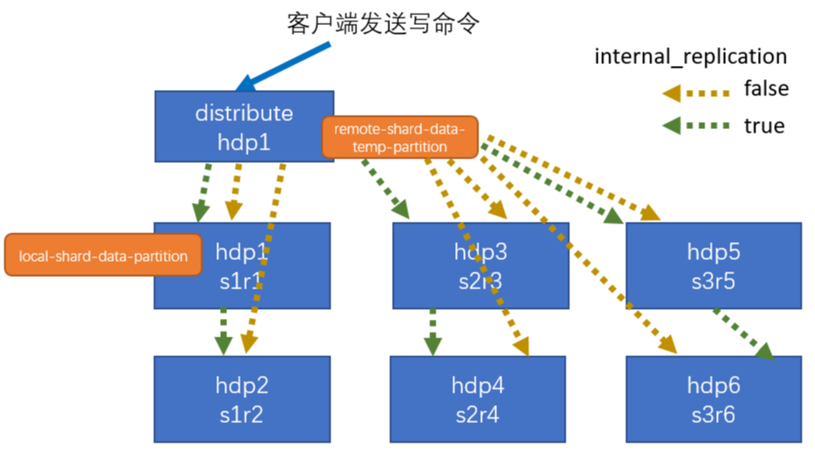

<br/>

### 7.2 集群读取流程（3 分片 2 副本共 6 个节点）

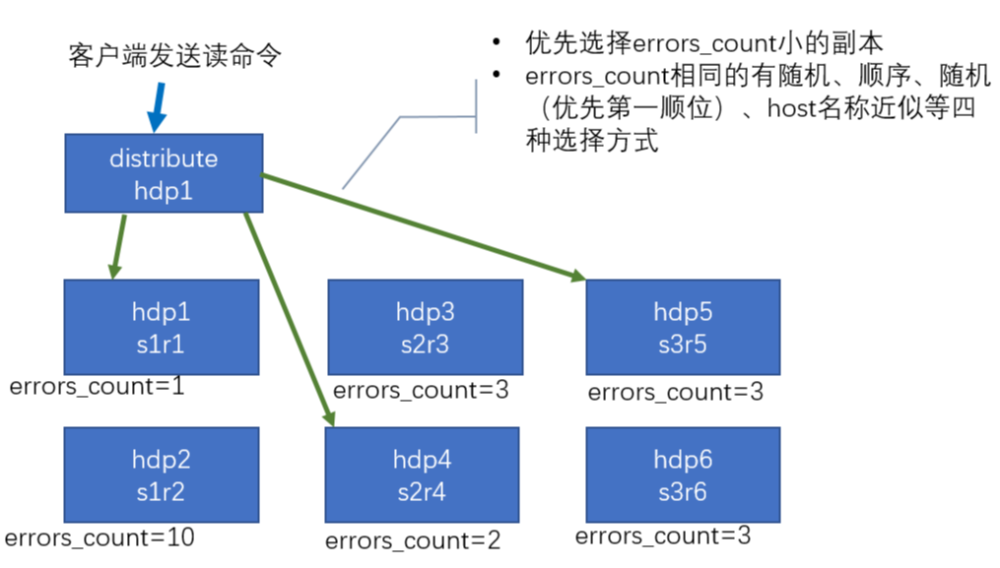

<br/>

### 7.2 集群配置（3 分片 2 副本共 6 个节点）

-   `/etc/clickhouse-server/config.d/metrika.xml`

    ```xml
    <?xml version="1.0" encoding="UTF-8"?>
    <yandex>
        <clickhouse_remote_servers>
            <default_cluster>
                <!-- 分片一 -->
                <shard>
                    <internal_replication>true</internal_replication>
                    <!-- 分片一副本一 -->
                    <replica>
                        <host>clickhouse-101</host>
                        <port>9000</port>
                    </replica>
                    <!-- 分片一副本二 -->
                    <replica>
                        <host>clickhouse-102</host>
                        <port>9000</port>
                    </replica>
                </shard>
                <!-- 分片二 -->
                <shard>
                    <internal_replication>true</internal_replication>
                    <!-- 分片二副本一 -->
                    <replica>
                        <host>clickhouse-103</host>
                        <port>9000</port>
                    </replica>
                    <!-- 分片二副本二 -->
                    <replica>
                        <host>clickhouse-104</host>
                        <port>9000</port>
                    </replica>
                </shard>
                <!-- 分片三 -->
                <shard>
                    <internal_replication>true</internal_replication>
                    <!-- 分片三副本一 -->
                    <replica>
                        <host>clickhouse-105</host>
                        <port>9000</port>
                    </replica>
                    <!-- 分片三副本二 -->
                    <replica>
                        <host>clickhouse-106</host>
                        <port>9000</port>
                    </replica>
                </shard>
            </default_cluster>
        </clickhouse_remote_servers>

        <zookeeper-servers>
            <node>
                <host>clickhouse-101</host>
                <port>2181</port>
            </node>
            <node>
                <host>clickhouse-102</host>
                <port>2181</port>
            </node>
            <node>
                <host>clickhouse-103</host>
                <port>2181</port>
            </node>
        </zookeeper-servers>
    </yandex>
    ```

<br/>

### 7.3 集群配置（3 分片 1 副本共 3 个节点）

#### 7.3.1 配置文件

-   `/etc/clickhouse-server/config.d/metrika.xml`（`clickhouse-101`）

    ```xml
    <?xml version="1.0" encoding="UTF-8"?>
    <yandex>
        <remote_servers>
            <default_cluster>
                <!-- 分片一副本一 -->
                <shard>
                    <internal_replication>true</internal_replication>
                    <replica>
                        <host>clickhouse-101</host>
                        <port>9000</port>
                    </replica>
                </shard>
                <!-- 分片二副本一 -->
                <shard>
                    <internal_replication>true</internal_replication>
                    <replica>
                        <host>clickhouse-102</host>
                        <port>9000</port>
                    </replica>
                </shard>
                <!-- 分片三副本一 -->
                <shard>
                    <internal_replication>true</internal_replication>
                    <replica>
                        <host>clickhouse-103</host>
                        <port>9000</port>
                    </replica>
                </shard>
            </default_cluster>
        </remote_servers>

        <!-- 节点一存放分片一副本一 -->
        <macros>
            <shard>shard-01</shard>
            <replica>replica-01</replica>
        </macros>

        <!-- 节点二存放分片二副本一 -->
        <!--
            <macros>
                <shard>02</shard>
                <replica>replica-01</replica>
            </macros>
        -->

        <!-- 节点三存放分片三副本一 -->
        <!--
            <macros>
                <shard>03</shard>
                <replica>replica-01</replica>
            </macros>
        -->

        <zookeeper-servers>
            <node>
                <host>clickhouse-101</host>
                <port>2181</port>
            </node>
            <node>
                <host>clickhouse-102</host>
                <port>2181</port>
            </node>
            <node>
                <host>clickhouse-103</host>
                <port>2181</port>
            </node>
        </zookeeper-servers>
    </yandex>
    ```

#### 7.3.2 创建本地表

> 分片和副本名称从配置文件中的宏定义中获取。

```sql
create table st_order_mt on cluster default_cluster (
    id           UInt32,
    sku_id       String,
    total_amount Decimal(16,2),
    create_time  Datetime
)
engine = ReplicatedMergeTree('/clickhouse/tables/{shard}/st_order_mt','{replica}')
partition by toYYYYMMDD(create_time)
primary key (id)
order by (id, sku_id);
```

#### 7.4.3 创建分布式表

```sql
create table st_order_mt_all on cluster default_cluster (
    id           UInt32,
    sku_id       String,
    total_amount Decimal(16,2),
    create_time  Datetime
)
engine = Distributed(default_cluster, default, st_order_mt, hiveHash(sku_id));
```

> 参数含义：`Distributed(<集群名称>, <库名>, <本地表名>, <分片键>)`。其中分片键必须是整型数字，所以用 `hiveHash()`函数转换，也可以使用 `rand()`。

#### 7.3.4 插入测试数据

```sql
insert into st_order_mt_all values
(201, 'sku_001', 1000.00, '2020-06-01 12:00:00'),
(202, 'sku_002', 2000.00, '2020-06-01 12:00:00'),
(203, 'sku_004', 2500.00, '2020-06-01 12:00:00'),
(204, 'sku_002', 2000.00, '2020-06-01 12:00:00'),
(205, 'sku_003', 600.00,  '2020-06-02 12:00:00');
```

#### 7.3.5 通过查询分布式表和本地表观察输出结果

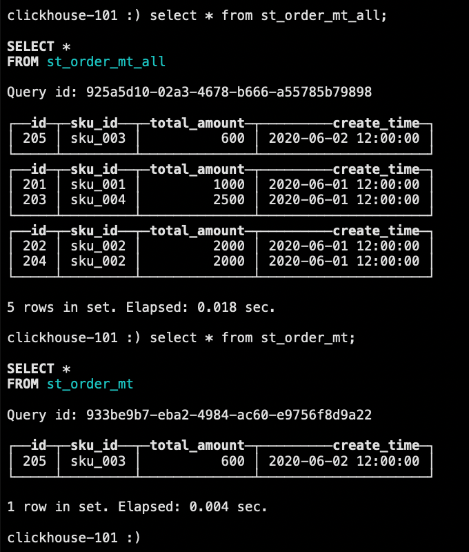

<br/>

<br/>

## 八、查看执行计划

在 ClickHouse 20.6 版本之前要查看 SQL 语句的执行计划需要设置日志级别为 trace 才可以看到，并且真正执行 SQL，在执行日志里面查看。在 20.6 版本引入了原生的执行计划的语法。在 20.6.3 版本成为正式版本的功能。

### 8.1 案例实操

#### 8.1.1 查看 `PLAN`（默认）

```sql
-- 简单查询
explain plan select arrayJoin([1,2,3,null,null]);

-- 复杂 SQL
explain
select database, table, count(1) as cnt
from system.parts
where database in ('datasets','system')
group by database, table
order by database, cnt desc
limit 2 by database;

-- 打开全部参数的执行计划
explain header=1, actions=1, description=1 select number from system.numbers limit 10;
```

#### 8.1.2 查看 `AST` 语法树

```sql
explain ast select number from system.numbers limit 10;
```

#### 8.1.3 查看 `SYNTAX` 语法优化

```sql
-- 简单查询
select number = 1 ? 'hello' : (number = 2 ? 'world' : 'clickhouse') from numbers(10);

-- 查看语法优化
explain syntax select number = 1 ? 'hello' : (number = 2 ? 'world' : 'clickhouse') from numbers(10);

-- 开启三元运算符优化
set optimize_if_chain_to_multiif = 1;

-- 再次查看语法优化
explain syntax select number = 1 ? 'hello' : (number = 2 ? 'world' : 'clickhouse') from numbers(10);
```

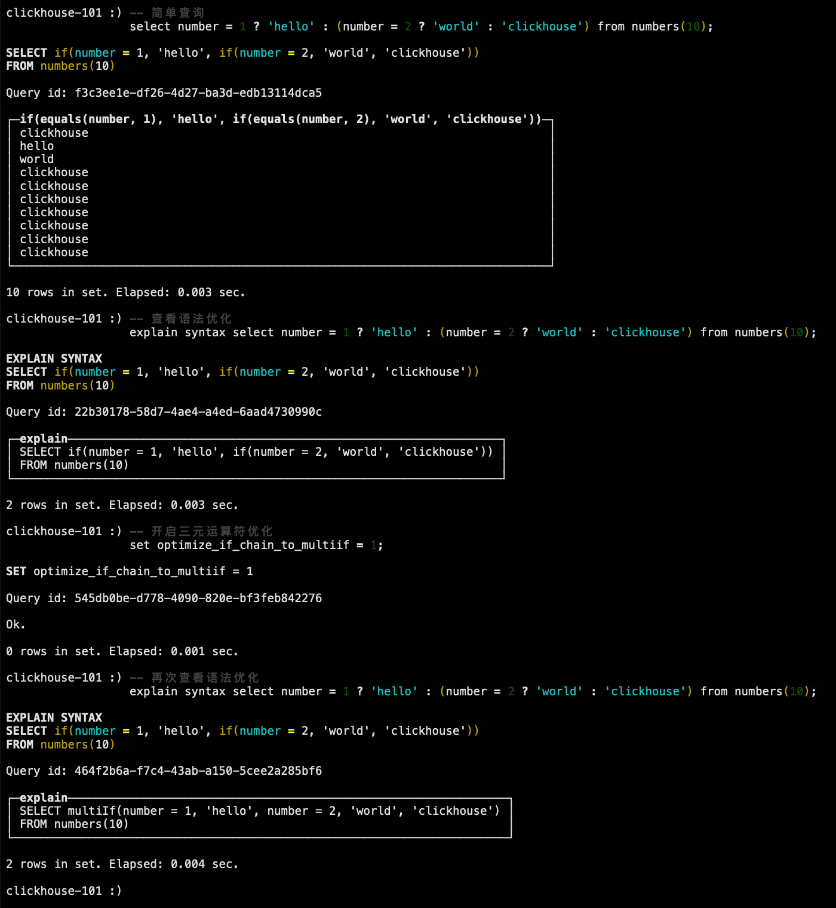

#### 8.1.4 查看 `PIPELINE`

```sql
explain pipeline select sum(number) from numbers_mt(100000) group by number % 20;
```

<br/><br/>

## 九、建表优化

### 9.1 数据类型

#### 9.1.1 时间字段的类型

建表时能用数值型或日期类型表示的字段就不要用字符串，全 `String` 类型在 Hive 为中心的数仓建设中常见，但 ClickHouse 环境不应受此影响。

虽然 ClickHouse 底层将 `DateTime` 存储为时间戳 `Long` 类型，但不建议存储 `Long` 类型，因为 `DateTime` 不需要经过函数转换处理，执行效率高，可读性好。

#### 9.1.2 空值存储类型

官方已经指出 `Nullable` 类型几乎总是会拖累性能，因为存储 `Nullable` 列时需要创建一个额外的文件来存储 NULL 的标志，并且 `Nullable` 列无法被索引。因此除非极特殊情况，应直接使用字段默认值表示空，或者自行指定一个在业务中无意义的值（例如用 -1 表示没有商品 ID）。

```sql
create table t_null (x Int8, y Nullable(Int8)) engine = TinyLog;

insert into t_null values (1, null), (2, 3);

select x + y from t_null;
```

查看存储的文件：

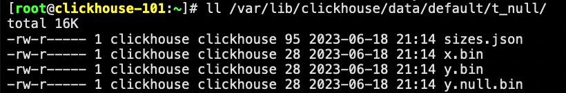

<br/>

### 9.2 分区和索引

分区粒度根据业务特定决定，不宜过粗或过细。一般选择按天分区，也可以指定为 `Tuple()`，以单表一亿数据为例，分区大小控制在 10-30 个位最佳。

必须指定索引列，ClickHouse 中的索引即排序列，通过 `order by`指定。一般在查询条件中经常被用来充当筛选条件的属性可以被纳入进来；可以是单一维度，也可以是组合维度的索引；通常需要满足高级列在前、查询频率大在前的原则；还有基数特别大的不适合做索列。

<br/>

### 9.3 表参数

`index_granularity`是用来控制索引粒度的，默认是 8192，如非必须不建议调整。

如果表中不是必须保留全量历史数据，建议指定 TTL，可以免去手动处理过期历史数据的麻烦，TTL 也可以通过 `alter table` 语句随时修改。

<br/>

### 9.4 写入和删除优化

-   进来不要执行单条或小批量删除和插入操作，这样会产生小分区文件，给后台 Merge 任务带来巨大压力。
-   不要一次写入太多分区或数据写入太快，数据写入太快会导致 merge 速度跟不上而报错，一般建议每秒钟发起 2-3 次写入操作，每次操作写入 2W-3W 条数据（依服务器性能而定）。
    -   在服务器内存充裕的情况下增加内存配额，一般通过 `max_memory_usage` 来实现；
    -   在服务器内存不充裕的情况下，建议将超出部分的内存分配到系统硬盘上，但会降低执行速度，一般通过 `max_bytes_before_external_group_by`、`max_bytes_before_external_sort`参数来实现。

<br/>

### 9.5 常见配置

#### 9.5.1 CPU 资源

| 参数                                        | 描述                                                                                                                                             |
| :------------------------------------------ | :----------------------------------------------------------------------------------------------------------------------------------------------- |
| `background_pool_size`                      | 后台线程池的大小、merge 线程就是在该线程池中执行，该线程池不仅仅是给 merge 线程用的。默认值 16，允许的前提下建议改成 CPU 个数的 2 倍（线程数）。 |
| `background_schedule_pool_size`             | 执行后台任务（复制表、Kafka 流、DNS 缓存更新）的线程数。默认值 128，建议改成 CPU 个数的 2 倍（线程数）。                                         |
| `background_distributed_schedule_pool_size` | 设置为分布式发送执行后台任务的线程数。默认值 16，建议改成 CPU 个数的 2 倍（线程数）。                                                            |
| `max_concurrent_queries`                    | 最大并发处理的请求数（包含 `select`、`insert` 等）。默认值 100，推荐 150-300。                                                                   |
| `max_threads`                               | 设置单个查询所能使用的最大 CPU 个数。默认值是 CPU 核数。                                                                                         |

#### 9.5.2 内存资源

| 参数                                 | 描述                                                                                                                                                                                               |
| :----------------------------------- | :------------------------------------------------------------------------------------------------------------------------------------------------------------------------------------------------- |
| `max_memory_usage`                   | 此参数在 `users.xml`。表示单词 Query 占用内存最大值，该值可以设置的比较大，这样可以提升集群查询的上限。保留一点给 OS，比如 128GB 内存的机器，设置为 100GB。                                        |
| `max_bytes_before_external_group_by` | 因为 ClickHouse 聚合分为两个阶段：查询并建立中间数据、合并中间数据。一般按照 `max_memory_usage`的一半设置内存，当 `group by` 使用内存超过阈值后会刷新到磁盘进行。                                  |
| `max_bytes_before_external_sort`     | 当 `order by`已使用`max_bytes_before_external_sort`内存就进行溢写磁盘（基于磁盘排序），如果不设置该值，那么当内存不够时直接抛错，设置了该值 `order by`可以正常完成，但是速度相对内存来说会慢很多。 |
| `max_table_size_to_drop`             | 此参数在 `config.xml` 中。应用于需要删除表或分区的情况，默认是 50GB，意思是如果删除 50GB 以上的分区表会失败。建议修改为 0，这样不管多大的分区表都可以删除。                                        |

#### 9.5.3 存储

ClickHouse 不支持设置多数据目录，为了提升 IO 性能，可以挂载虚拟卷组，一个卷组绑定多块物理磁盘提升读写性能。

<br/><br/>

## 十、ClickHouse 语法优化规则

ClickHouse 的 SQL 优化规则是基于 RBO（Rule Based Optimization），下面是一些优化规则。

### 10.1 准备测试用表

> 官方文档：https://clickhouse.com/docs/en/getting-started/example-datasets/metrica#download-and-ingest-the-data

1. 创建测试数据集库

    ```shell
    clickhouse-client --query "CREATE DATABASE IF NOT EXISTS datasets"
    ```

2. `hits_v1` 数据集

    ```shell
    curl https://datasets.clickhouse.com/hits/tsv/hits_v1.tsv.xz | unxz --threads=`nproc` > hits_v1.tsv
    ```

    ```shell
    clickhouse-client --query "CREATE TABLE datasets.hits_v1 ( WatchID UInt64,  JavaEnable UInt8,  Title String,  GoodEvent Int16,  EventTime DateTime,  EventDate Date,  CounterID UInt32,  ClientIP UInt32,  ClientIP6 FixedString(16),  RegionID UInt32,  UserID UInt64,  CounterClass Int8,  OS UInt8,  UserAgent UInt8,  URL String,  Referer String,  URLDomain String,  RefererDomain String,  Refresh UInt8,  IsRobot UInt8,  RefererCategories Array(UInt16),  URLCategories Array(UInt16), URLRegions Array(UInt32),  RefererRegions Array(UInt32),  ResolutionWidth UInt16,  ResolutionHeight UInt16,  ResolutionDepth UInt8,  FlashMajor UInt8, FlashMinor UInt8,  FlashMinor2 String,  NetMajor UInt8,  NetMinor UInt8, UserAgentMajor UInt16,  UserAgentMinor FixedString(2),  CookieEnable UInt8, JavascriptEnable UInt8,  IsMobile UInt8,  MobilePhone UInt8,  MobilePhoneModel String,  Params String,  IPNetworkID UInt32,  TraficSourceID Int8, SearchEngineID UInt16,  SearchPhrase String,  AdvEngineID UInt8,  IsArtifical UInt8,  WindowClientWidth UInt16,  WindowClientHeight UInt16,  ClientTimeZone Int16,  ClientEventTime DateTime,  SilverlightVersion1 UInt8, SilverlightVersion2 UInt8,  SilverlightVersion3 UInt32,  SilverlightVersion4 UInt16,  PageCharset String,  CodeVersion UInt32,  IsLink UInt8,  IsDownload UInt8,  IsNotBounce UInt8,  FUniqID UInt64,  HID UInt32,  IsOldCounter UInt8, IsEvent UInt8,  IsParameter UInt8,  DontCountHits UInt8,  WithHash UInt8, HitColor FixedString(1),  UTCEventTime DateTime,  Age UInt8,  Sex UInt8,  Income UInt8,  Interests UInt16,  Robotness UInt8,  GeneralInterests Array(UInt16), RemoteIP UInt32,  RemoteIP6 FixedString(16),  WindowName Int32,  OpenerName Int32,  HistoryLength Int16,  BrowserLanguage FixedString(2),  BrowserCountry FixedString(2),  SocialNetwork String,  SocialAction String,  HTTPError UInt16, SendTiming Int32,  DNSTiming Int32,  ConnectTiming Int32,  ResponseStartTiming Int32,  ResponseEndTiming Int32,  FetchTiming Int32,  RedirectTiming Int32, DOMInteractiveTiming Int32,  DOMContentLoadedTiming Int32,  DOMCompleteTiming Int32,  LoadEventStartTiming Int32,  LoadEventEndTiming Int32, NSToDOMContentLoadedTiming Int32,  FirstPaintTiming Int32,  RedirectCount Int8, SocialSourceNetworkID UInt8,  SocialSourcePage String,  ParamPrice Int64, ParamOrderID String,  ParamCurrency FixedString(3),  ParamCurrencyID UInt16, GoalsReached Array(UInt32),  OpenstatServiceName String,  OpenstatCampaignID String,  OpenstatAdID String,  OpenstatSourceID String,  UTMSource String, UTMMedium String,  UTMCampaign String,  UTMContent String,  UTMTerm String, FromTag String,  HasGCLID UInt8,  RefererHash UInt64,  URLHash UInt64,  CLID UInt32,  YCLID UInt64,  ShareService String,  ShareURL String,  ShareTitle String,  ParsedParams Nested(Key1 String,  Key2 String, Key3 String, Key4 String, Key5 String,  ValueDouble Float64),  IslandID FixedString(16),  RequestNum UInt32,  RequestTry UInt8) ENGINE = MergeTree() PARTITION BY toYYYYMM(EventDate) ORDER BY (CounterID, EventDate, intHash32(UserID)) SAMPLE BY intHash32(UserID) SETTINGS index_granularity = 8192"
    ```

    ```shell
    cat hits_v1.tsv | clickhouse-client --query "INSERT INTO datasets.hits_v1 FORMAT TSV" --max_insert_block_size=100000
    ```

    ```shell
    clickhouse-client --query "SELECT COUNT(*) FROM datasets.hits_v1"
    ```

3. `visits_v1` 数据集

    ```shell
    curl https://datasets.clickhouse.com/visits/tsv/visits_v1.tsv.xz | unxz --threads=`nproc` > visits_v1.tsv
    ```

    ```shell
    clickhouse-client --query "CREATE TABLE datasets.visits_v1 ( CounterID UInt32,  StartDate Date,  Sign Int8,  IsNew UInt8,  VisitID UInt64,  UserID UInt64,  StartTime DateTime,  Duration UInt32,  UTCStartTime DateTime,  PageViews Int32,  Hits Int32,  IsBounce UInt8,  Referer String,  StartURL String,  RefererDomain String,  StartURLDomain String,  EndURL String,  LinkURL String,  IsDownload UInt8,  TraficSourceID Int8,  SearchEngineID UInt16,  SearchPhrase String,  AdvEngineID UInt8,  PlaceID Int32,  RefererCategories Array(UInt16),  URLCategories Array(UInt16),  URLRegions Array(UInt32),  RefererRegions Array(UInt32),  IsYandex UInt8,  GoalReachesDepth Int32,  GoalReachesURL Int32,  GoalReachesAny Int32,  SocialSourceNetworkID UInt8,  SocialSourcePage String,  MobilePhoneModel String,  ClientEventTime DateTime,  RegionID UInt32,  ClientIP UInt32,  ClientIP6 FixedString(16),  RemoteIP UInt32,  RemoteIP6 FixedString(16),  IPNetworkID UInt32,  SilverlightVersion3 UInt32,  CodeVersion UInt32,  ResolutionWidth UInt16,  ResolutionHeight UInt16,  UserAgentMajor UInt16,  UserAgentMinor UInt16,  WindowClientWidth UInt16,  WindowClientHeight UInt16,  SilverlightVersion2 UInt8,  SilverlightVersion4 UInt16,  FlashVersion3 UInt16,  FlashVersion4 UInt16,  ClientTimeZone Int16,  OS UInt8,  UserAgent UInt8,  ResolutionDepth UInt8,  FlashMajor UInt8,  FlashMinor UInt8,  NetMajor UInt8,  NetMinor UInt8,  MobilePhone UInt8,  SilverlightVersion1 UInt8,  Age UInt8,  Sex UInt8,  Income UInt8,  JavaEnable UInt8,  CookieEnable UInt8,  JavascriptEnable UInt8,  IsMobile UInt8,  BrowserLanguage UInt16,  BrowserCountry UInt16,  Interests UInt16,  Robotness UInt8,  GeneralInterests Array(UInt16),  Params Array(String),  Goals Nested(ID UInt32, Serial UInt32, EventTime DateTime,  Price Int64,  OrderID String, CurrencyID UInt32),  WatchIDs Array(UInt64),  ParamSumPrice Int64,  ParamCurrency FixedString(3),  ParamCurrencyID UInt16,  ClickLogID UInt64,  ClickEventID Int32,  ClickGoodEvent Int32,  ClickEventTime DateTime,  ClickPriorityID Int32,  ClickPhraseID Int32,  ClickPageID Int32,  ClickPlaceID Int32,  ClickTypeID Int32,  ClickResourceID Int32,  ClickCost UInt32,  ClickClientIP UInt32,  ClickDomainID UInt32,  ClickURL String,  ClickAttempt UInt8,  ClickOrderID UInt32,  ClickBannerID UInt32,  ClickMarketCategoryID UInt32,  ClickMarketPP UInt32,  ClickMarketCategoryName String,  ClickMarketPPName String,  ClickAWAPSCampaignName String,  ClickPageName String,  ClickTargetType UInt16,  ClickTargetPhraseID UInt64,  ClickContextType UInt8,  ClickSelectType Int8,  ClickOptions String,  ClickGroupBannerID Int32,  OpenstatServiceName String,  OpenstatCampaignID String,  OpenstatAdID String,  OpenstatSourceID String,  UTMSource String,  UTMMedium String,  UTMCampaign String,  UTMContent String,  UTMTerm String,  FromTag String,  HasGCLID UInt8,  FirstVisit DateTime,  PredLastVisit Date,  LastVisit Date,  TotalVisits UInt32,  TraficSource    Nested(ID Int8,  SearchEngineID UInt16, AdvEngineID UInt8, PlaceID UInt16, SocialSourceNetworkID UInt8, Domain String, SearchPhrase String, SocialSourcePage String),  Attendance FixedString(16),  CLID UInt32,  YCLID UInt64,  NormalizedRefererHash UInt64,  SearchPhraseHash UInt64,  RefererDomainHash UInt64,  NormalizedStartURLHash UInt64,  StartURLDomainHash UInt64,  NormalizedEndURLHash UInt64,  TopLevelDomain UInt64,  URLScheme UInt64,  OpenstatServiceNameHash UInt64,  OpenstatCampaignIDHash UInt64,  OpenstatAdIDHash UInt64,  OpenstatSourceIDHash UInt64,  UTMSourceHash UInt64,  UTMMediumHash UInt64,  UTMCampaignHash UInt64,  UTMContentHash UInt64,  UTMTermHash UInt64,  FromHash UInt64,  WebVisorEnabled UInt8,  WebVisorActivity UInt32,  ParsedParams    Nested(Key1 String,  Key2 String,  Key3 String,  Key4 String, Key5 String, ValueDouble    Float64),  Market Nested(Type UInt8, GoalID UInt32, OrderID String,  OrderPrice Int64,  PP UInt32,  DirectPlaceID UInt32,  DirectOrderID  UInt32,  DirectBannerID UInt32,  GoodID String, GoodName String, GoodQuantity Int32,  GoodPrice Int64),  IslandID FixedString(16)) ENGINE = CollapsingMergeTree(Sign) PARTITION BY toYYYYMM(StartDate) ORDER BY (CounterID, StartDate, intHash32(UserID), VisitID) SAMPLE BY intHash32(UserID) SETTINGS index_granularity = 8192"
    ```

    ```shell
    cat visits_v1.tsv | clickhouse-client --query "INSERT INTO datasets.visits_v1 FORMAT TSV" --max_insert_block_size=100000
    ```

    ```shell
    clickhouse-client --query "SELECT COUNT(*) FROM datasets.visits_v1"
    ```

<br/>

### 10.2 COUNT 优化

在调用 count 函数时，如果使用的是 `count()` 或者 `count(*)`，切没有 where 条件，则会直接使用 `system.tables` 的 `table_rows`，例如：

```sql
explain select count() from datasets.hits_v1;

explain select count(CounterID) from datasets.hits_v1;
```

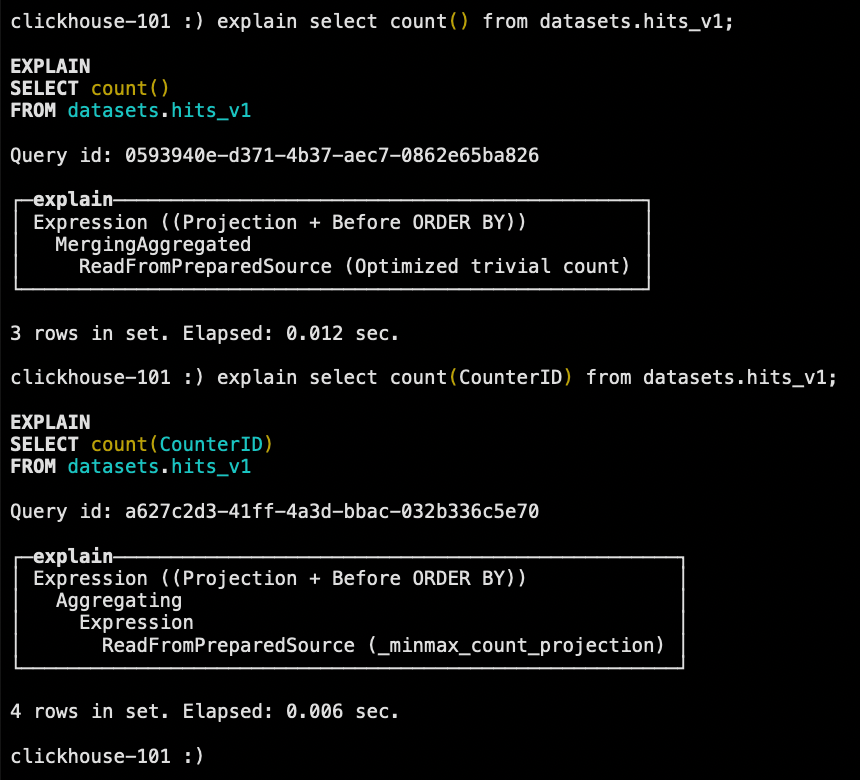

注意 `Optimized trivial count` 这是对 count 的优化，如果 count 具体的列字段，则不会使用此项优化。

<br/>

### 10.3 消除子查询重复字段

下面语句子查询中有连个重复的 `UserID`字段，会被去重：

```sql
explain syntax
select
    a.UserID,
    b.VisitID,
    a.URL,
    b.UserID
from datasets.hits_v1 as a
left join (
    select
        UserID,
        UserID as HaHa,
        VisitID
    from datasets.visits_v1
) as b
using (UserID)
limit 3;
```

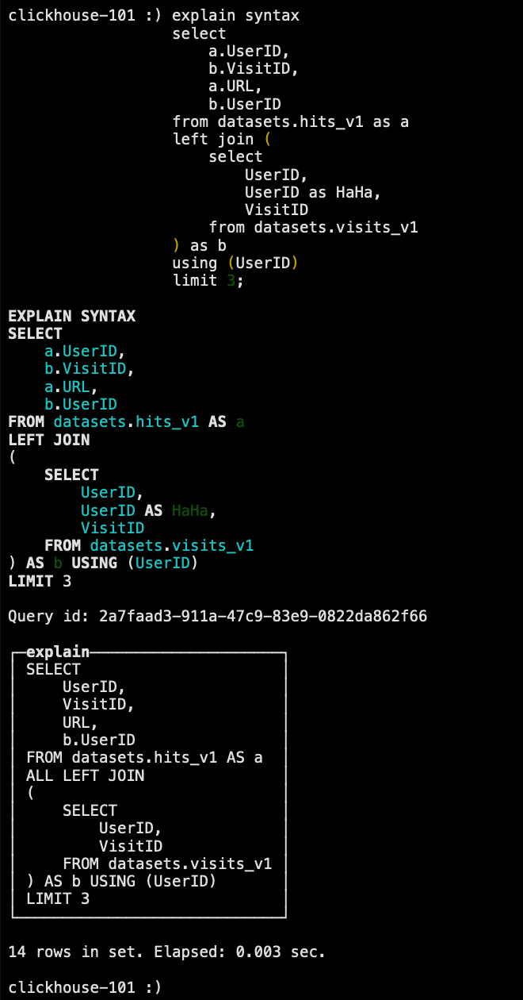

<br/>

### 10.3 谓词下推

当 `group by` 有 `having`子句，但是没有 `with cube`、`with rollup`、`with totals` 修饰的时候，`having` 过滤会下推到 `where` 提前过滤。

```sql
-- having 谓词下推
explain syntax
select UserID
from datasets.hits_v1
group by UserID
having UserID = '8585742290196126178';

-- 子查询谓词下推
explain syntax
select *
from (
    select UserID from datasets.visits_v1
)
where UserID = '8585742290196126178';

-- union all 谓词下推
explain syntax
select *
from (
    select *
    from (
        select UserID from datasets.visits_v1
    )
    union all
    select *
    from (
        select UserID from datasets.visits_v1
    )
)
where UserID = '8585742290196126178';
```

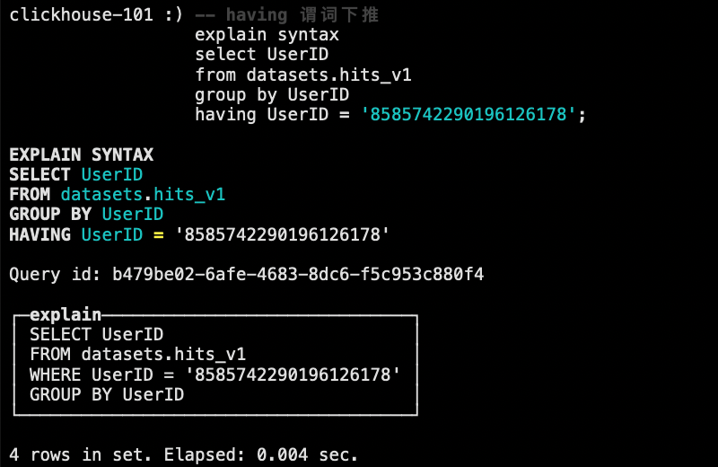

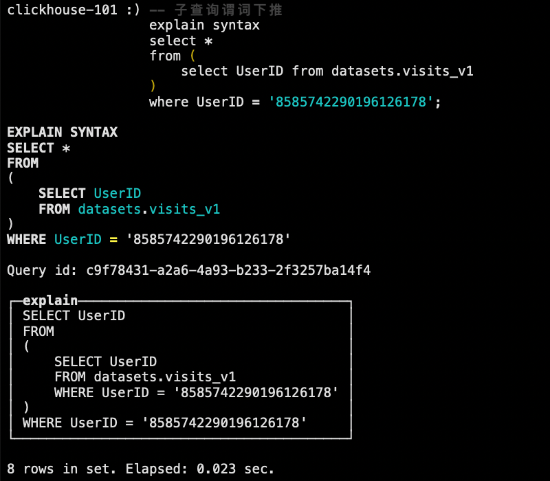

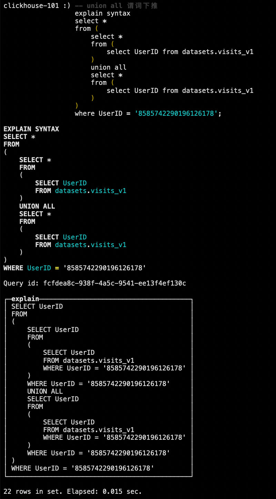

<br/>

### 10.5 聚合计算外推

```sql
explain syntax
select sum(UserID * 2)
from datasets.visits_v1;
```

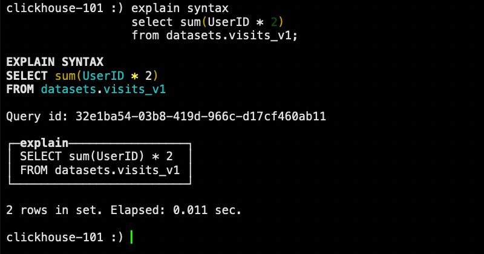

<br/>

### 10.6 聚合函数消除

```sql
explain syntax
select
    sum(UserID * 2),
    max(VisitID),
    max(UserID)
from datasets.visits_v1
group by UserID;
```

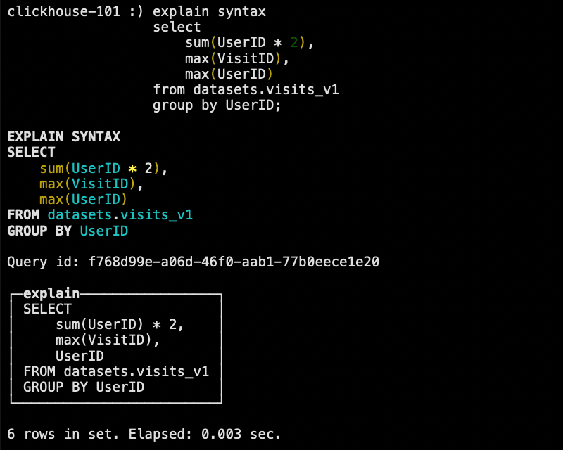

<br/>

### 10.7 删除重复的 order by key

```sql
explain syntax
select *
from datasets.visits_v1
order by
    UserID  asc,
    UserID  asc,
    VisitID asc,
    VisitID asc;
```

<br/>

### 10.8 删除重复的 limit by key

```sql
explain syntax
select *
from datasets.visits_v1
limit 3 by VisitID, VisitID
limit 10;
```

<br/>

### 10.9 删除重复的 using key

```sql
explain syntax
select
    a.UserID,
    a.UserID,
    b.VisitID,
    a.URL,
    b.UserID
from datasets.hits_v1 as a
left join datasets.visits_v1 as b using (UserID, UserID);
```

<br/>

### 10.10 标量替换

如果子查询只返回一行数据，在被引用的时候用标量替换。

```sql
explain syntax
with (
    select sum(bytes) from system.parts where active
) as total_disk_usage
select
    (sum(bytes) / total_disk_usage) * 100 as table_disk_usage,
    table
from system.parts
group by table
order by table_disk_usage desc
limit 10;
```

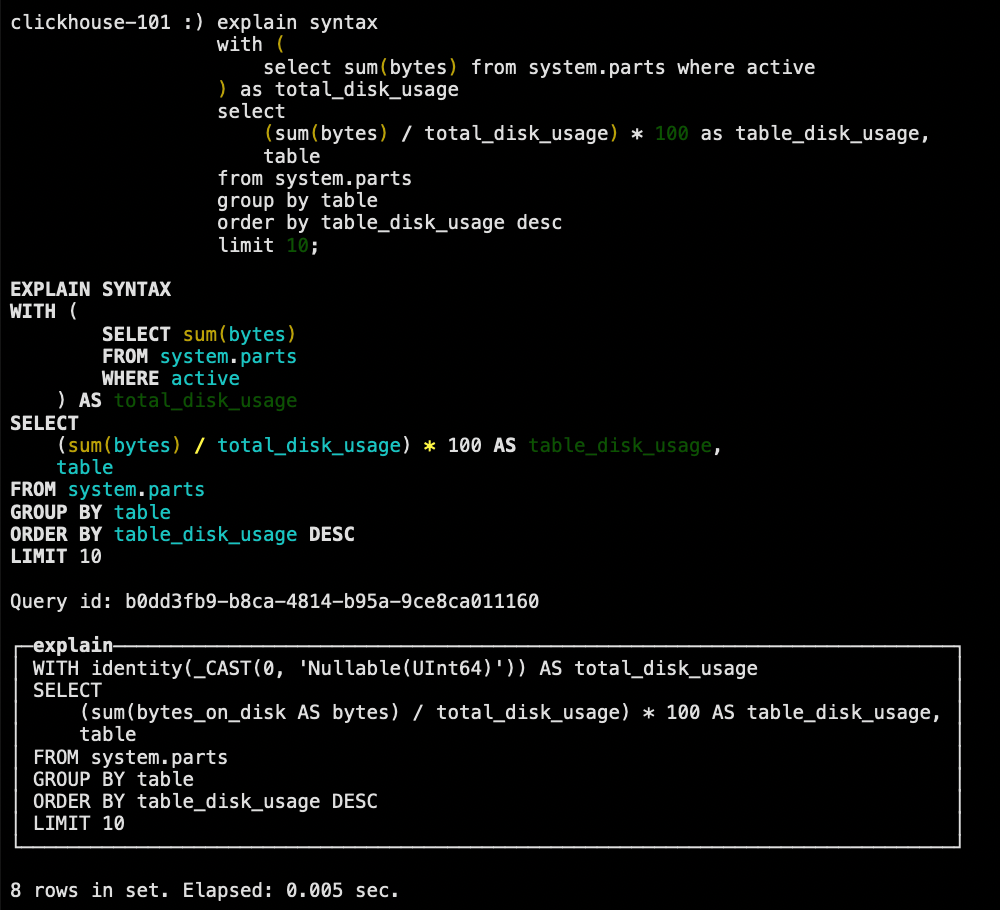

<br/>

### 10.11 三元运算优化

如果开启了 `optimize_if_chain_to_multiif`参数，三元运算符会被替换成 ``

```sql
explain syntax
select number = 1 ? 'hello' : (number = 2 ? 'world' : 'clickhouse')
from numbers(10)
settings optimize_if_chain_to_multiif = 1;
```

<br/><br/>

## 十一、查询优化

### 11.1 单表查询

#### 11.1.1 `prewhere` 替代 `where`

`prewhere` 和 `where` 语句的作用相同，用来过滤数据。不同之处在于 `prewhere` 只支持 \*MergeTree 族系列引擎的表，首先会读取指定的列数据，来判断数据过滤，等待数据过滤之后再读取 `select` 声明的列字段来补全其余属性。

当查询列明显多余筛选列时使用 `prewhere` 可十倍提升查询性能，`prewhere` 会自动优化执行过滤阶段的数据读取方式，降低 IO 操作。

在某些场合下，`prewhere` 语句比 `where` 语句处理数据的数据量更少性能更高。

```sql
set optimize_move_to_prewhere = 0;
```

默认情况下，我们肯定不会关闭 `where` 自动优化成 `prewhere`，但是某些场景即时开启优化，也不会自动转换成 `prewhere`，需要手动手动指定的情况：

-   使用常量表达式
-   使用默认值为 alias 类型的字段
-   包含了 `arrayJoin`、`globalIn`、`globalNotIn` 或者 `indexHint` 的查询
-   `select`查询的列字段和 `where` 的谓词相同
-   使用了主键字段

#### 11.1.2 数据采样

通过采样运算可极大提升数据分析的性能。

```sql
select Title, count(*) as PageViews
from datasets.hits_v1
sample 0.1
where CounterID = 57
group by Title
order by PageViews desc
limit 1000;
```

#### 11.1.3 列裁剪与分区裁剪

数据量太大时应避免使用 `select *` 操作，查询的性能会与查询的字段大小和数量成线性相关，字段越少，消耗的 IO 资源越少，性能就会越高。分区裁剪就是只读取需要的分区，在过滤条件中指定。

#### 11.1.4 `order by`结合 `where`、`limit`

千万以上数据集进行 `order by` 查询时需要搭配 `where` 条件和 `limit` 语句一起使用。

#### 11.1.5 避免构建虚拟列

如非必须，不要在结果集上构建虚拟列，虚拟列非常消耗资源浪费性能，可以考虑在前端进行处理，或者在表中构造实际字段进行额外存储。

#### 11.1.6 `uniqCombined` 替代`distinct`

性能可提升 10 倍以上， `uniqCombined`底层采用类似 HyperLogLog 算法实现，能接受 2% 左右的数据误差，可直接使用这种去重方式提升查询性能。`count(distinct)` 会使用 `uniqExact`精确去重。

不建议在千万级不同数据上执行 `distinct` 去重查询，改为近似去重 `uniqCombined`。

#### 11.1.7 使用物化视图

#### 11.1.8 其它注意事项

-   查询熔断

    > 为了避免因个别慢查询引起的服务雪崩的问题，除了可以为单个查询设置超时以外，还可以配置周期熔断，在一个查询周期内，如果用户频繁进行慢查询操作超出阈值后将无法继续进行查询操作。

-   关闭虚拟内存

    > 物理内存和虚拟内存的数据交换，会导致查询变慢，资源允许的情况下关闭虚拟内存。

-   配置 `join_use_nulls`

    > 为每一个账户添加 `join_use_nulls`配置，左表中的一条记录在右表中不存在，右表的相应字段会返回该字段相应数据类型的默认值，而不是标准 SQL 的 NULL 值。

-   批量写入时先排序

    > 批量写入数据时，必须控制每个批次的数据中涉及到的分区的数量，在写入之前最好对需要导入的数据进行排序。无序的数据或者涉及的分区太多，会导致 ClickHouse 无法及时对新导入的数据进行合并，从而影响查询性能。

-   关注 CPU

    > CPU 一般在 50% 左右会出现查询波动，达到 70% 会出现大范围的查询超时，CPU 是最关键的指标，要非常关注。

<br/>

### 11.2 多表关联

#### 11.2.1 准备表和数据

```sql
-- 创建小表
create table visits_v2
engine = CollapsingMergeTree(Sign)
partition by toYYYYMM(StartDate)
order by (CounterID, StartDate, intHash32(UserID), VisitID)
sample by intHash32(UserID)
settings index_granularity = 8192
as
select * from datasets.visits_v1 limit 10000;

-- 创建 join 结果表（避免控制台疯狂打印数据）
create table hits_v2
engine = MergeTree()
partition by toYYYYMM(EventDate)
order by (CounterID, EventDate, intHash32(UserID))
sample by intHash32(UserID)
settings index_granularity = 8192
as
select * from datasets.hits_v1 where 1 = 0;
```

#### 11.2.2 用 `in` 代替 `join`

当多表联查时，查询的数据仅从其中一张表出时，可考虑用 `in` 操作而不是 `join`。

```sql
insert into hits_v2
select a.*
from datasets.hits_v1 a
where a.CounterID in (
    select CounterID from datasets.visits_v1
);
```

#### 11.2.3 大小表 `join`

多表 `join` 时要满足小表在右的原则，右表关联时被加载到内存中与左表进行比较，ClickHouse 中无论是 `left join`、`right join`还是 `inner join` 永远都是拿着右表中的每一条记录到左表中查找该记录是否存在，所以右表必须是小表。

```sql
insert into table hits_v2
select a.*
from datasets.hits_v1 a
left join visits_v2 b on a.CounterID = b.CounterID;
```

#### 11.2.4 注意谓词下推

ClickHouse 在 `join`查询时不会主动发起谓词下推的操作，需要每个子查询提前完成过滤操作，需要注意的是，是否执行谓词下推，对性能影响差别很大（新版本中已经不存在此问题，但是需要注意谓词的位置的不同依然有性能的差异）。

#### 11.2.5 分布式表使用 `global`

两张分布式表上的 `in` 和 `join` 之前必须加上 `global`关键字，右表智慧在接收查询请求的那个节点查询一次，并将其分发到其他节点上。如果不加 `global` 关键字的话，每个节点都会单独发起一次对右表的查询，而右表又是分布式表，就导致右表一共会被查询 N<sup>2</sup>次（N 是该分布式表的分片数量），这就是查询放大，会带来很大开销。

#### 11.2.6 使用字典表

将一些需要关联分析的业务创建成字典表进行 `join`操作，前提是字典表不宜过大，因为字典表会常驻内存。

#### 11.2.7 提前过滤

通过增加逻辑过滤可以减少数据扫描，达到提高执行速度及降低内存消耗的目的。

<br/><br/>

## 十二、数据一致性

查询 ClickHouse 手册发现，即便对数据一致性支持最好的 MergeTree，也只是保证最终一致性。我们在使用 ReplacingMergeTree、SummingMergeTree 这类表引擎的时候，会出现短暂数据不一致的情况，在某些对一致性非常敏感的场景，通常有以下几种解决方案。

### 12.1 准备测试表和数据

#### 12.1.1 创建表

```sql
create table test_a (
    user_id     UInt64,
    score       String,
    deleted     UInt8    default 0,
    create_time DateTime default toDateTime(0)
)
engine = ReplacingMergeTree(create_time)
order by user_id;
```

#### 12.1.2 写入 1000 万测试数据

```sql
insert into table test_a (user_id,score)
with (
    select ['A','B','C','D','E','F','G']
) as dict
select number as user_id, dict[number%7+1] from numbers(10000000);
```

#### 12.1.3 修改前 540 万行数据，修改内容包括 `name` 和 `create_time` 字段

```sql
insert into table test_a (user_id,score,create_time)
with (
    select ['AA','BB','CC','DD','EE','FF','GG']
) as dict
select number as user_id, dict[number%7+1], now() as create_time from numbers(500000);
```

#### 12.1.4 统计总数

```sql
select count(*) from test_a;
```

<br/>

### 12.2 手动 `optimize`

在写入数据后，立即执行 `optimize` 强制触发新写入分区的合并动作。

```sql
optimize table test_a final;
```

<br/>

### 12.3 通过 `group by` 去重

#### 12.3.1 执行去重的查询

```sql
select
    user_id,
    argMax(score, create_time) as score,
    argMax(deleted, create_time) as deleted,
    max(create_time) as ctime
from test_a
group by user_id
having deleted = 0;
```

函数说明：

-   `argMax(field1, field2)`：按照 `field2` 的最大值取 `field1` 的值。当我们更新数据时，会写入一行新的数据，例如上面语句中，通过查询最大的 `create_time` 得到修改后的 `score` 字段值。

#### 12.3.2 创建视图，方便测试

```sql
create view view_test_a as
select
    user_id,
    argMax(score, create_time) as score,
    argMax(deleted, create_time) as deleted,
    max(create_time) as ctime
from test_a
group by user_id
having deleted = 0;
```

#### 13.3.2 插入重复数据，再次查询

```sql
insert into table test_a (user_id, score, create_time) values (0, 'AAAA', now());

select * from view_test_a where user_id = 0;
```

#### 13.3.3 删除数据测试

```sql
insert into table test_a (user_id, score, deleted, create_time) values (0, 'AAAA', 1, now());

-- 再次查询发现刚才那条数据看不到了
select * from view_test_a where user_id = 0;
```

这行数据并没有被真正的删除，而是被过滤掉了。在一些合适的场景下，可以结合表级别的 TTL 最终将物理数据删除。

<br/>

### 12.4 通过 `final` 查询

在查询语句后增加 `final` 修饰符，这样在查询的过程中将会执行 Merge 的特俗逻辑（例如数据去重、预聚合等）。

但是这种方法在早期版本基本没有人使用，因为在增加 `final` 之后，我们的查询将会变成一个单线程的执行过程，查询速度非常慢。

在 v20.5.2.7-stable 版本中，`final`查询支持多线程执行，并且可以通过 `max_final_threads` 参数控制单个查询的线程数，但是目前读取 part 部分的动作依然是串行的。

`final` 查询最终的性能要和很多因素相关，列字段的大小、分区的数量等等都会影响到最终的查询时间，所以还要结合实际场景取舍。

#### 12.4.1 普通语句查询

```sql
explain pipeline select * from datasets.visits_v1 where StartDate = '2014-03-17' limit 100 settings max_threads = 2;
```

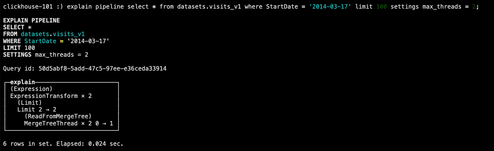

明显将由 2 个线程并行读取 part 查询。

#### 12.4.2 `final` 查询

```sql
explain pipeline select * from datasets.visits_v1 final where StartDate = '2014-03-17' limit 100 settings max_final_threads = 2;
```

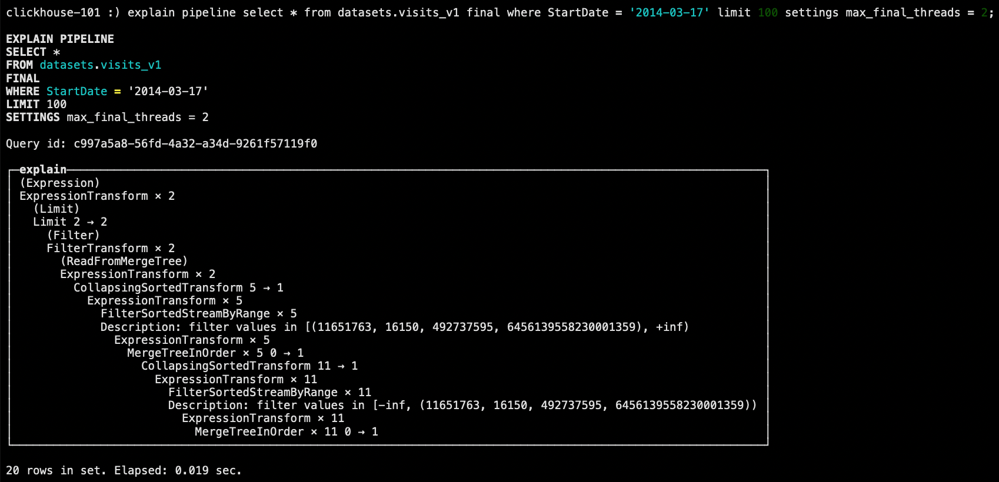

查询速度没有普通的查询快，但是相比之前已经有了一些提升，从 `CollapsingSortedTransform` 这一块开始已经是多线程执行，但是读取 part 部分的动作还是串行。

<br/><br/>

## 十三、物化视图

ClickHouse 的物化视图是一种查询结果的持久化，它确实是给我们带来了查询效率的提升。用户查起来跟表没什么区别，它就是一张表，它也像是一张时时刻刻在预计算的表。

查询结果集的范围很宽泛，可以是基础表中部分数据的一份简单拷贝，也可以是多表 `join` 之后产生的结果或子集，或者原始数据的聚合指标等等。所以，物化视图不会随着基础表的变化而变化，所以它也称为快照。

### 13.1 概述

#### 13.1.1 物化视图与普通视图的区别

普通视图不保存数据，保存的仅仅是个查询语句，查询的时候还是从原表读取数据，可以将普通视图理解为是个子查询。物化视图则是把查询的结果根据相应的引擎存入到了磁盘或内存中，对数据重新进行了组织，你可以理解物化视图是完全的一张新表。

#### 13.1.2 优缺点

-   优点

    查询速度快，要是把物化视图这些规则全部写好，它比原始数据查询快了很多，总的行数少了，因为都预计算好了。

-   缺点

    它的本质是一个流式数据的使用场景，是累加器的技术，所以要用历史数据做去重、去核这样的分析，在物化视图里面是不太好用的。在某些场景的使用也是有限的。而且如果一张表加了好多物化视图，在写这张表的时候，就会消耗很多机器的资源，比如数据带宽占满、存储一下子增加了很多。

<br/>

### 13.2 案例实操

对于一些确定的数据模型，可将统计指标通过物化视图的方式进行构建，这样可避免查询时重复计算的过程，物化视图会在有新数据插入时进行更新。

#### 13.2.1 准备测试用表和数据

1. 建表

    ```sql
    create table hits_test (
        EventDate Date,
        CounterID UInt32,
        UserID UInt64,
        URL String,
        Income UInt8
    )
    engine = MergeTree()
    partition by toYYYYMM(EventDate)
    order by (CounterID, EventDate, intHash32(UserID))
    sample by intHash32(UserID)
    settings index_granularity = 8192;
    ```

2. 导入一些数据

    ```sql
    insert into hits_test
    select EventDate, CounterID, UserID, URL, Income
    from datasets.hits_v1
    limit 10000;
    ```

#### 13.2.3 创建物化视图

```sql
create materialized view hits_mv
engine = SummingMergeTree
partition by toYYYYMM(EventDate)
order by (EventDate, intHash32(UserID))
as
select
    UserID,
    EventDate,
    count(URL) as ClickCount,
    sum(Income) AS IncomeSum
from hits_test
where EventDate >= '2014-03-20'
group by UserID, EventDate;
```

#### 13.2.4 导入增量数据

```sql
insert into hits_test
select
    EventDate,
    CounterID,
    UserID,
    URL,
    Income
from datasets.hits_v1
where EventDate >= '2014-03-23'
limit 10;

select * from hits_mv;
```

#### 13.2.5 导入历史数据

```sql
insert into hits_mv
select
    UserID,
    EventDate,
    count(URL) as ClickCount,
    sum(Income) AS IncomeSum
from hits_test
where EventDate = '2014-03-20'
group by UserID, EventDate

select * from hits_mv;
```

<br/><br/>

## 十四、MaterializeMySQL 引擎

### 14.1 概述

MySQL 的用户群体很大，为了能够增强数据的实时性，很多解决方案会利用 binlog 将数据写入到 ClickHouse。为了能够监听 binlog 事件，我们需要用到类似 Canal 这样的第三方中间件，这无疑增加了系统的复杂度。

ClickHouse v20.8.2.3 版本增加了 MaterializeMySQL 引擎，该 database 能映射到 MySQL 中的某个 database，并自动在 ClickHouse 中创建对应的 ReplacingMergeTree。ClickHouse 服务作为 MySQL 副本，读取 binlog 并执行 DDL 和 DML 请求，实现了基于 MySQL binlog 机制的业务数据库实时同步功能。

#### 14.1.1 特点

-   MaterializeMySQL 同时支持全量和增量同步，在 database 创建之初会全量同步 MySQL 中的表和数据，之后则会通过 binlog 进行增量同步。
-   MaterializeMySQL database 为其所创建的每张 ReplacingMergeTree 自动增加了 `_sign` 和 `_version` 字段。其中 `_version` 用作 ReplacingMergeTree 的 ver 版本参数，每当监听到 insert、update、delete 事件时，在 database 内全局自增。而 `_sign`则用于标记是否被删除，取值 1 或者 -1。

<br/>

### 14.2 案例实操

#### 14.2.1 MySQL 开启 binlog 和 GTID 模式

```toml
server-id=1
log-bin=mysql-bin
binlog_format=row

gtid-mode=on
enforce-gtid-consistency=1
log-slave-updates=1
```

如果 ClickHouse 使用的是 v20.8 prestable 之后发布的版本，那么 MySQL 还需要配置开启 GTID 模式，这种方式在 MySQL 主从模式下可以确保数据同步的一致性（主从切换时）。

GTID 是 MySQL 复制增强版，从 MySQL 5.7 版本开始支持，目前已经是 MySQL 主流复制模式。它为每个 Event 分配一个全局唯一 ID 和序号，我么可以不用关心 MySQL 集群主从拓扑结构，直接告知 MySQL 这个 GTID 即可。

#### 14.2.2 准备 MySQL 表和数据

1. 在 MySQL 中创建数据表并写入数据

    ```sql
    create database testck;

    create table testck.t_organization (
        id         int  not null auto_increment,
        code       int  not null,
        name       text,
        updatetime datetime,
        primary key (id),
        unique key (code)
    )
    engine = InnoDB;

    insert into testck.t_organization (code, name, updatetime) values (1000, 'Realinsight',now());
    insert into testck.t_organization (code, name, updatetime) values (1001, 'Realindex',  now());
    insert into testck.t_organization (code, name, updatetime) values (1002, 'EDT',        now());
    ```

2. 创建第二张表

    ```sql
    create table testck.t_user (
        id   int not null auto_increment,
        code int,
        primary key (id)
    )
    engine = InnoDB;

    insert into testck.t_user (code) values (1);
    ```

#### 14.2.3 开启 ClickHouse 物化引擎

```sql
set allow_experimental_database_materialized_mysql = 1;
```

#### 14.2.4 创建复制管道

```sql
create database test_binlog engine = MaterializeMySQL('192.168.8.101:3306','testck','root','root');

use test_binlog;

show tables;

select * from test_binlog.t_user;
```

#### 14.2.5 修改数据

1. 在 MySQL 中修改数据

```sql
update testck.t_organization set name = concat(name, '-v1') where id = 1;
```

2. 在 ClickHouse 中查看数据

```sql
select * from test_binlog.t_organization;
```

#### 14.2.6 删除数据

1. MySQL 删除数据

    ```sql
    delete from testck.t_organization where id = 2;
    ```

2. 在 ClickHouse 中查看数据

    ```sql
    select *, _sign, _version from test_binlog.t_organization order by _sign desc, _version desc;
    ```

    在查询时，对于已经被删除的数据，`_sign = -1`，ClickHouse 会自动重写 SQL，将 `_sign = -1` 的数据过滤掉。

#### 14.2.7 删除表

在 MySQL 执行删除表操作，此时在 ClickHouse 处会同步删除对应表，如果查询会报错，MySQL 新建表，ClickHouse 可以查询到。

<br/><br/>

## 十五、常见问题排查

### 15.1 分布式 DDL 某数据节点的副本不执行

#### 15.1.1 问题

使用分布式 DDL 执行命令 `create table on cluster xxx` 某个节点上没有创建表，但是 client 返回正常，查看日志有如下报错：

```log
<Error> xxx.xxx: Retrying createReplica(), because some other replicas
were created at the same time
```

#### 15.1.2 解决办法

重启该部执行的节点。

<br/>

### 15.2 数据副本表和数据数据不一致

#### 15.2.1 问题

由于某个数据节点副本异常，导致两数据副本表不一致，某个数据副本缺少表，需要将两个数据副本调整一致。

#### 15.2.2 解决办法

在缺少表的数据副本上创建缺少的表，创建为本地表，表结构可以在其它数据副本通过 `create table on cluster` 获取。表结构创建后，ClickHouse 会自动从其它副本同步该表数据，验证数据一致性即可。

<br/>

### 15.3 副本节点全量恢复

#### 15.3.1 问题

某个数据副本异常无法启动，需要重新搭建副本。

#### 15.3.2 解决办法

1. 清空异常副本节点的 `metadata` 和 `data` 目录。
2. 从另一个正常副本将 `metadata` 目录拷贝过来（这一步之后可以重启数据库，但是只有表结构没有数据）。
3. 执行 `sudo -u clickhouse touch /data/clickhouse/flags/force_restore_data`。
4. 启动数据库。

<br/>

### 15.4 数据副本启动缺少 ZK 表

#### 15.4.1 问题

某个数据副本在 ZK 上丢失数据，或者不存在，但是 `metadata` 元数据里存在，导致启动异常，报错：

```
Can’t get data for node /clickhouse/tables/01-
02/xxxxx/xxxxxxx/replicas/xxx/metadata: node doesn’t exist (No node):
Cannot attach table xxxxxxx
```

#### 15.4.2 解决办法

1. `metadata`中移除该表的结构文件，如果多个表报错就都移除：

    ```shell
    mv metadata/xxxxxx/xxxxxx.sql /tmp
    ```

2. 启动数据库。

3. 手动创建缺少的表，表结构从其它节点 `show create table` 获取。

4. 创建后自动同步数据，验证数据是否一致。

<br/>

### 15.5 ZK table replicas 数据未删除，导致重建表错误

#### 15.5.1 问题

重建表过程中，先试用 `drop table xxx on cluster xxx`，各节点在 ClickHouse 上 table 已物理删除，但是 ZK 里面针对某个 ClickHouse 节点的 table meta 信息未被删除（低概率事件），因 ZK 里仍存有表的 meta 信息，导致再次创建该表 `create table xxx on cluster xxx`，该节点无法创建表（其他节点创建表成功），报错：

```
Replica /clickhouse/tables/01-03/xxxxxx/xxx/replicas/xxx already exists..
```

#### 15.5.2 解决办法

从其他数据副本 CP 该 table 的 metadata sql 过来。重启节点。

<br/>

### 15.6 ClickHouse 节点意外关闭

#### 15.6.1 问题

模拟其中一个节点意外宕机，在大量 `insert` 数据的情况下，关闭某个节点。数据写入不受影响、数据查询受影响、建表 DDL 执行到异常节点会卡住，报错：

```log
Code: 159. DB::Exception: Received from localhost:9000. DB::Exception:
Watching task /clickhouse/task_queue/ddl/query-0000565925 is executing
longer than distributed_ddl_task_timeout (=180) seconds. There are 1
unfinished hosts (0 of them are currently active), they are going to
execute the query in background.
```

#### 15.6.2 解决办法

启动异常及诶打你，期间其他副本写入数据会自动同步过来，其他副本的建表 DDL 也会同步。

<br/>

### 15.7 其他问题参考

[首页/云数据库 ClickHouse/常见问题](https://help.aliyun.com/document_detail/162815.html)

<br/><br/>

## 十六、备份及恢复

### 16.1 手动实现备份及恢复

ClickHouse 允许使用 `alter table ... freeze partition ...` 查询以创建分区的本地副本。这是利用硬链接到 `/var/lib/clickhouse/shadow` 文件夹中实现的，所以它通常不会因为旧数据而占用额外的磁盘空间。创建的文件副本不由 ClickHouse 服务器处理，所以不需要任何额外的外部系统就有一个简单的备份。防止硬件问题，最好将它们远程复制到另一个位置，然后删除本地副本。

#### 15.1.1 创建备份路径

```shell
sudo mkdir -p /var/lib/clickhouse/shadow
sudo chown -R clickhouse:clickhouse /var/lib/clickhouse/shadow
```

#### 15.1.2 执行备份命令

```shell
echo -n 'alter table t_order_mt freeze' | clickhouse-client
```

#### 15.1.3 将备份数据保存到其他路径

```shell
sudo mkdir -p /var/lib/clickhouse/backup

sudo cp -r /var/lib/clickhouse/shadow /var/lib/clickhouse/backup/my-backup-name

sudo rm -rf /var/lib/clickhouse/shadow/*
```

#### 15.1.4 恢复数据

1. 模拟删除备份过的表

    ```shell
    echo -n 'drop table t_order_mt' | clickhouse-client
    ```

2. 重新重建表

3. 将备份复制到 `detached` 目录

    ```shell
    sudo cp -rl /var/lib/clickhouse/backup/my-backup-name/1/store/7a4/7a45b5db-1a1a-4b2a-b4d1-9663d634a45b/* /var/lib/clickhouse/data/default/t_order_mt/detached

    sudo chown -R /var/lib/clickhouse/data/default/t_order_mt/detached/*
    ```

    ClickHouse 使用文件系统硬链接来实现即时备份，而不会导致 ClickHouse 服务停机（或锁定）。这些硬链接可以进一步用于有效的备份存储。在支持硬链接的文件系统（例如本地文件系统或 NFS）上，将 `cp` 与 `-l` 标志一起使用（或将 `rsync` 与 `--hard-links` 和 `--numeric-ids`标志一起使用）以避免复制数据。

4. 执行 `attach`

    ```shell
    echo -n 'alter table t_order_mt attach partition 20200601' | clickhouse-client
    ```

5. 查看数据

    ```shell
    echo -n 'select count(*) from t_order_mt' | clickhouse-client
    ```
