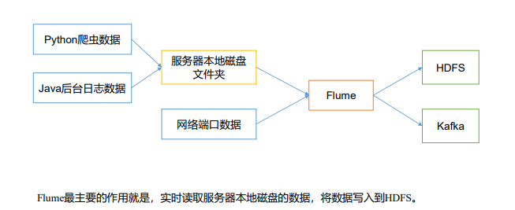

## 一、Flume 概述

### 1.1 Flume 定义

Flume 是 Cloudera 提供的一个高可用的，高可靠的，分布式的海量日志采集、聚合和传输的系统。Flume 基于流式架构，灵活简单。



<br/>

### 1.2 Flume 基础架构


#### Agent

Agent 是一个 JVM 进程，它以事件的形式将数据从源头传送至目的地。

Agent 主要由三个部分组成：Source、Channel、Sink。

#### Source

Source 是负责接收数据到 Flume Agent 的组件。Source 组件可以处理各种类型、各种格式的日志数据，包括 avro、thrift、exec、jms、spooling directory、netcat、taildir、sequence generator、syslog、http、legacy。

#### Sink

Sink 不断第轮询 Channel 中的事件且批量地移除它们，并将这些事件批量写入到存储或索引系统。或者被发送到另一个 Flume Agent。

Sink 组件目的地包括 hdfs、logger、avro、thrift、ipc、file、hbase、solr、自定义。

#### Channel

Channel 是位于 Source 和 Sink 之间的缓冲区。因此 Channel 允许 Source 和 Sink 运作在不同的速率上。Channel 是线程安全的，可以同时处理几个 Source 的写入操作和几个 Sink 的读取操作。

Flume 自带两种 Channel：

-   Memory Channel

    Memory Channel 是内存中的队列。Memory Channel 在不需要关系数据丢失的情景下适用。如果需要关系数据丢失，那么 Memory Channel 就不应该适用，因为程序死亡、及其宕机或者重启都会导致数据丢失。

-   File Channel

    File Channel 将所有事件写到磁盘。因此在程序关闭或机器宕机的情况下不会丢失数据。

#### Event

Flume 数据传输的基本单元，以 Event 的形式将数据从源头送至目的地。Event 由 Header 和 Body 两部分组成，Header 用来存放该 Event 的一些属性，为 K-V 结构，Body 用来存放该条数据，形式为字节数组。

<br/>

<br/>

## 二、Flume 入门

### 2.1 Flume 安装部署

-   下载解压

    ```shell
    tar -zxvf apache-flume-1.9.0-bin.tar.gz -C /opt
    mv /opt/apache-flume-1.9.0-bin.tar.gz /opt/flume
    ```

-   配置环境变量

    ```shell
    echo 'export FLUME_HOME=/opt/flume' >> /etc/bash.profile
    source /etc/profile
    ```

-   兼容 Guava 依赖

    ```shell
    rm $(find $FLUME_HOME/lib -name 'guava-*')
    cp $(find $HADOOP_HOME/share/hadoop/common/lib -name 'guava-*' | head -n 1) $FLUME_HOME/lib
    ```

-   兼容 SLF4J 依赖

    ```shell
    rm $(find $FLUME_HOME/lib -name 'slf4j-*')
    ```

-   调整内存

    ```shell
    cd $FLUME_HOME

    cp conf/flume-env.sh.template conf/flume-env.sh

    vim conf/flume-env.sh
    ```

    修改相应注释行为：

    ```shell
    export JAVA_OPTS="-Xms1024m -Xmx1024m -Dcom.sun.management.jmxremote"
    ```

<br/>

### 2.2 Flume 入门案例

#### 2.2.1 监控端口数据官方案例

##### 案例需求

使用 Flume 监听一个端口，收集该端口数据，并打印到控制台。

##### 实现步骤

-   检查 44444 端口是否被占用

    ```shell
    netstat -nlp | grep 44444
    ```

-   创建 Flume 配置文件 `jobs/flume-netcat-logger.conf`

    ```shell
    cd $FLUME_HOME

    mkdir -p jobs

    vim jobs/flume-netcat-logger.conf
    ```

    ```properties
    # Agent
    a1.sources = r1
    a1.sinks = k1
    a1.channels = c1

    # Memory Channel
    a1.channels.c1.type = memory

    # NetCat TCP Source
    a1.sources.r1.channels = c1
    a1.sources.r1.type = netcat
    a1.sources.r1.bind=localhost
    a1.sources.r1.port = 44444

    # Logger Sink
    a1.sinks.k1.channel = c1
    a1.sinks.k1.type = logger
    ```

-   启动任务

    ```shell
    bin/flume-ng agent                          \
      --conf conf/                              \
      --conf-file jobs/flume-netcat-logger.conf \
      --name a1                                 \
      -Dflume.root.logger=INFO,console
    ```

-   向本机 44444 端口发送数据

    ```shell
    nc localhost 44444
    ```

#### 2.2.2 实时监控单个追加文件

##### 案例需求

实时监控 `/opt/flume/input/a.txt` 文件，并上传至 HDFS。

##### 实现步骤

-   创建 Flume 配置文件 `jobs/flume-file-hdfs.conf`

    ```properties
    # Agent
    a1.sources = r1
    a1.sinks = k1
    a1.channels = c1

    # Memory Channel
    a1.channels.c1.type = memory

    # Exec Source
    a1.sources.r1.channels = c1
    a1.sources.r1.type = exec
    a1.sources.r1.command = tail -F /opt/flume/input/a.txt
    a1.sources.r1.shell = /bin/bash -c

    # HDFS Sink
    a1.sinks.k1.channel = c1
    a1.sinks.k1.type = hdfs
    a1.sinks.k1.hdfs.path = hdfs://node6:9000/flume/%Y-%m-%d/%H
    a1.sinks.k1.hdfs.round = true
    a1.sinks.k1.hdfs.fileType = DataStream
    a1.sinks.k1.hdfs.useLocalTimeStamp = true
    ```

-   启动任务

    ```shell
    bin/flume-ng agent -c conf/ -f jobs/flume-file-hdfs.conf -n a1
    ```

-   追加文件

    ```shell
    mkdir -p /opt/flume/input
    echo $RANDOM >> /opt/flume/input/a.txt
    ```

#### 2.2.3 实时监控目录下的多个新文件

##### 案例需求

使用 Flume 监听 `/opt/flume/input`整个目录的文件，并上传至 HDFS。

##### 实现步骤

-   创建 Flume 配置文件 `jobs/flume-dir-hdfs.conf`

    ```properties
    a1.sources = r1
    a1.sinks = k1
    a1.channels = c1

    # Memory Channel
    a1.channels.c1.type = memory

    # Spooling Directory Source
    a1.sources.r1.channels = c1
    a1.sources.r1.type = spooldir
    a1.sources.r1.spoolDir = /opt/flume/input
    a1.sources.r1.fileHeader = true

    # HDFS Sink
    a1.sinks.k1.channel = c1
    a1.sinks.k1.type = hdfs
    a1.sinks.k1.hdfs.path = hdfs://node6:9000/flume/%Y-%m-%d/%H
    a1.sinks.k1.hdfs.round = true
    a1.sinks.k1.hdfs.fileType = DataStream
    a1.sinks.k1.hdfs.useLocalTimeStamp = true
    ```

-   启动任务

    ```shell
    bin/flume-ng agent -c conf/ -f jobs/flume-dir-hdfs.conf -n a1
    ```

-   新建文件

    ```shell
    touch /opt/flume/input/1.txt
    touch /opt/flume/input/2.txt
    ```

-   查看目录变化

    ```shell
    watch ls /opt/flume/input
    ```

##### 说明

`spoolDir` 不支持 `~` 路径。比如 `~/input` 会报错：

```
java.lang.IllegalStateException: Directory does not exist: /opt/flume/~/input
```

在使用 Spooling Directory Source 时：

1. 不要再监控目录中创建并持续修改文件
2. 上传完成的文件会以 `.COMPLETED` 结尾
3. 被监控文件夹每 500 毫秒扫描一次文件变动

#### 2.2.4 实时监控目录下的多个追加文件

##### 介绍

Exec Source 适用于监控一个实时追加的文件，不能实现断点续传；Spooling Directory Source 适用于同步新文件，但不适合对实时追加日志的文件进行监听并同步；而 Taildir Source 适合用于监听多个实时追加的文件，并且能够实现断点续传。

##### 案例需求

使用 Flume 监听整个目录的实时追加文件，并上传至 HDFS。

##### 实现步骤

-   创建 Flume 配置文件 `jobs/flume-taildir-hdfs.conf`

    ```properties
    # Agent
    a1.sources = r1
    a1.sinks = k1
    a1.channels = c1

    # Memory Channel
    a1.channels.c1.type = memory

    # Taildir Source
    a1.sources.r1.channels = c1
    a1.sources.r1.type = TAILDIR
    a1.sources.r1.filegroups = f1
    a1.sources.r1.filegroups.f1 = /opt/flume/input/.*txt.*
    a1.sources.r1.positionFile = /opt/flume/taildir_position.json
    a1.sources.r1.fileHeader = true

    # HDFS Sink
    a1.sinks.k1.channel = c1
    a1.sinks.k1.type = hdfs
    a1.sinks.k1.hdfs.path = hdfs://node6:9000/flume/%Y-%m-%d/%H
    a1.sinks.k1.hdfs.round = true
    a1.sinks.k1.hdfs.fileType = DataStream
    a1.sinks.k1.hdfs.useLocalTimeStamp = true
    ```

-   启动任务

    ```shell
    bin/flume-ng agent -c conf/ -f jobs/flume-taildir-hdfs.conf -n a1
    ```

-   追加文件

    ```shell
    echo $RANDOM >> /opt/flume/input/a.txt
    echo $RANDOM >> /opt/flume/input/b.txt
    ```

##### 说明

Taildir Source 维护了一个 JSON 格式的 Position File，会定期的往 Position File 中更新每个文件读取到的最新的位置，因此能够实现断点续传。Position File 格式如下：

```json
[
  { "inode": 1579598, "pos": 12, "file": "/opt/flume/input/a.txt" },
  { "inode": 1579593, "pos": 6, "file": "/opt/flume/input/b.txt" }
]
```

Linux 中存储文件元数据区域叫做 inode，每个 inode 都有一个号码，操作系统用 inode 号码识别不同的文件，Unix/Linux 系统内部不使用文件名，而使用 inode 号码来识别文件。

<br/>

<br/>

## 三、Flume 进阶

### 3.1 Flume 事务


<br/>

### 3.2 Flume Agent 内部原理


#### ChannelSelector

ChannelSelector 的作用就是选出 Event 将要被发往哪个 Channel。其共有两种类型，分别是 Replicating（复制）和 Multiplexing（多路复用）。

ReplicatingSelector 会将同一个 Event 发往所有的 Channel，MultiplexingSelector 会根据相应的原则，将不同的 Event 发往不同的 Channel。

#### SinkProcessor

SinkProcessor 共有三种类型，分别是：

-   DefaultSinkProcessor：对应的是单个的 Sink。
-   LoadBalancingSinkProcessor：对应的是 Sink Group，可以实现负载均衡的功能。
-   FailoverSinkProcessor：对应的是 Sink Group，可以实现故障恢复的功能。

<br/>

### 3.3 Flume 拓扑结构

#### 简单串联


这种模式是将多个 Flume 顺序连接起来了，从最初的 Source 开始到最终 Sink 传送的目的存储系统。

此模式不建议桥接过多的 Flume 数量，Flume 数量过多不仅会影响传输速率，而且一旦传输过程中某个节点 Flume 宕机，会影响整个传输系统 。

#### 复制和多路复用


Flume 支持将事件流向一个或者多个目的地。这种模式可以将相同数据复制到多个 Channel 中，或者将不同数据分发到不同的 Channel 中，Sink 可以选择传送到不同的目的地。

#### 负载均衡和故障转移


Flume 支持使用多个 Sink 逻辑上分到一个 Sink 组，Sink 组配合不同的 SinkProcessor 可以实现负载均衡和故障恢复的功能。

#### 聚合


这种模式是我们最常见的，也非常实用，日常 Web 应用通常分布在上百个服务器，大者甚至上千个、上万个服务器。产生的日志，处理起来也非常麻烦。

用 Flume 的这种组合方式能很好的解决这一问题，每台服务器都部署一个 Flume 采集系统，传送到一个集中收集日志的 Flume，再由此 Flume 上传至 HDFS、Hive、Hbase 等，进行日志分析。

<br/>

### 3.4 Flume 开发案例

#### 3.4.1 复制和多路复用

##### 案例需求

使用 Flume1 监控文件变动，Flume1 将变动内容传递给 Flume2，Flume2 负责存储到 HDFS。同时 Flume1 将变动内容传递给 Flume3，Flume3 负责输出到 Local File System。

##### 实现步骤

-   创建接收文件的 Flume 配置文件 `jobs/flume1-file-flume.conf`

    ```properties
    # Agent
    a1.sources = r1
    a1.sinks = k1 k2
    a1.channels = c1 c2

    # Memory Channel
    a1.channels.c1.type = memory

    # Memory Channel
    a1.channels.c2.type = memory

    # Exec Source
    a1.sources.r1.selector.type = replicating
    a1.sources.r1.channels = c1 c2
    a1.sources.r1.type = exec
    a1.sources.r1.command = tail -F /opt/flume/input/a.txt
    a1.sources.r1.shell = /bin/bash -c

    # Avro Sink
    a1.sinks.k1.channel = c1
    a1.sinks.k1.type = avro
    a1.sinks.k1.hostname = localhost
    a1.sinks.k1.port = 4141

    # Avro Sink
    a1.sinks.k2.channel = c2
    a1.sinks.k2.type = avro
    a1.sinks.k2.hostname = localhost
    a1.sinks.k2.port = 4142
    ```

-   创建输入到 HDFS 的 Flume 配置文件 `jobs/flume2-flume-hdfs.conf`

    ```properties
    # Agent
    a1.sources = r1
    a1.sinks = k1
    a1.channels = c1

    # Memory Channel
    a1.channels.c1.type = memory

    # Avro Source
    a1.sources.r1.channels = c1
    a1.sources.r1.type = avro
    a1.sources.r1.bind = localhost
    a1.sources.r1.port = 4141

    # HDFS Sink
    a1.sinks.k1.channel = c1
    a1.sinks.k1.type = hdfs
    a1.sinks.k1.hdfs.path = hdfs://node6:9000/flume/%Y-%m-%d/%H
    a1.sinks.k1.hdfs.round = true
    a1.sinks.k1.hdfs.roundValue = 1
    a1.sinks.k1.hdfs.fileType = DataStream
    a1.sinks.k1.hdfs.useLocalTimeStamp = true
    ```

-   创建输出到本地目录的 Flume 配置文件 `jobs/flume3-flume-dir.conf`

    ```properties
    # Agent
    a1.sources = r1
    a1.sinks = k1
    a1.channels = c1

    # Memory Channel
    a1.channels.c1.type = memory

    # Avro Source
    a1.sources.r1.channels = c1
    a1.sources.r1.type = avro
    a1.sources.r1.bind = localhost
    a1.sources.r1.port = 4142

    # File Roll Sink
    a1.sinks.k1.channel = c1
    a1.sinks.k1.type = file_roll
    a1.sinks.k1.sink.directory = /opt/flume/output
    ```

    注意：输出的目录必须数已经存在的目录，如果该目录不存在，并不会自动创建目录。

    ```shell
    mkdir -p /opt/flume/output
    ```

-   按顺序启动任务

    ```shell
    bin/flume-ng agent -c conf/ -f jobs/flume3-flume-dir.conf -n a1

    bin/flume-ng agent -c conf/ -f jobs/flume2-flume-hdfs.conf -n a1

    bin/flume-ng agent -c conf/ -f jobs/flume1-file-flume.conf -n a1
    ```

-   写入文件

    ```shell
    echo $RANDOM >> /opt/flume/input/a.txt
    ```

-   查看 HDFS 和本地目录

    ```shell
    watch ls /opt/flume/output
    ```

#### 3.4.2 负责均衡和故障转移

##### 案例需求

使用 Flume1 监控一个端口，其 Sink 组中的 Sink 分别对接 Flume2 和 Flume3，采用 FailoverSinkProcessor 实现故障转移。

##### 实现步骤

-   创建接收端口数据的 Flume 配置文件 `jobs/flume1-netcat-flume.conf`

    ```properties
    # Agent
    a1.sources = r1
    a1.sinkgroups = g1
    a1.sinks = k1 k2
    a1.channels = c1

    # Memory Channel
    a1.channels.c1.type = memory

    # NetCat TCP Source
    a1.sources.r1.channels = c1
    a1.sources.r1.type = netcat
    a1.sources.r1.bind = localhost
    a1.sources.r1.port = 44444

    # Sink Group
    a1.sinkgroups.g1.sinks = k1 k2
    a1.sinkgroups.g1.processor.type = failover
    a1.sinkgroups.g1.processor.priority.k1 = 5
    a1.sinkgroups.g1.processor.priority.k2 = 10
    a1.sinkgroups.g1.processor.maxpenalty = 10000

    # Avro Sink
    a1.sinks.k1.channel = c1
    a1.sinks.k1.type = avro
    a1.sinks.k1.hostname = localhost
    a1.sinks.k1.port = 4141

    # Avro Sink
    a1.sinks.k2.channel = c1
    a1.sinks.k2.type = avro
    a1.sinks.k2.hostname = localhost
    a1.sinks.k2.port = 4142
    ```

-   创建两个输出到本地控制台的 Flume 配置文件 `jobs/flume2-flume-console.conf`、`jobs/flume3-flume-console.conf`

    ```properties
    # Agent
    a1.sources = r1
    a1.sinks = k1
    a1.channels = c1

    # Memory Channel
    a1.channels.c1.type = memory

    # Avro Source
    a1.sources.r1.channels = c1
    a1.sources.r1.type = avro
    a1.sources.r1.bind = localhost
    a1.sources.r1.port = 4141

    # Logger Sink
    a1.sinks.k1.channel = c1
    a1.sinks.k1.type = logger
    ```

    ```properties
    # Agent
    a1.sources = r1
    a1.sinks = k1
    a1.channels = c1

    # Memory Channel
    a1.channels.c1.type = memory

    # Avro Source
    a1.sources.r1.channels = c1
    a1.sources.r1.type = avro
    a1.sources.r1.bind = localhost
    a1.sources.r1.port = 4142

    # Logger Sink
    a1.sinks.k1.channel = c1
    a1.sinks.k1.type = logger
    ```

-   顺序启动任务

    ```shell
    bin/flume-ng agent -c conf/ -f jobs/flume2-flume-console.conf -n a1 -Dflume.root.logger=INFO,console

    bin/flume-ng agent -c conf/ -f jobs/flume3-flume-console.conf -n a1 -Dflume.root.logger=INFO,console

    bin/flume-ng agent -c conf/ -f jobs/flume1-netcat-flume.conf -n a1
    ```

-   向本机端口发送数据

    ```shell
    nc loclahost 44444
    ```

-   查看 Flume2 及 Flume3 控制台日志打印情况

-   停止 Flume2 查看 Flume3 控制台日志打印情况

#### 3.4.3 聚合

##### 案例需求

-   Flume1 监控文件 `/opt/flume/input/a.txt`
-   Flume2 监控端口 44444
-   Flume1 与 Flume2 将数据发送给 Flume3，Flume3 将最终数据打印到控制台

##### 实现步骤

-   监控文件的 Flume1 配置文件 `jobs/flume1-file-flume.conf`

    ```shell
    # Agent
    a1.sources = r1
    a1.sinks = k1
    a1.channels = c1

    # Memory Channel
    a1.channels.c1.type = memory

    # Exec Source
    a1.sources.r1.channels = c1
    a1.sources.r1.type = exec
    a1.sources.r1.command = tail -F /opt/flume/input/a.txt
    a1.sources.r1.shell = /bin/bash -c

    # Avro Sink
    a1.sinks.k1.channel = c1
    a1.sinks.k1.type = avro
    a1.sinks.k1.hostname = localhost
    a1.sinsk.k1.port = 4141
    ```

-   Hadoop102 上监控端口数据的 Flume2 配置文件 `jobs/flume2-netcat-flume.conf`

    ```shell
    # Agent
    a1.sources = r1
    a1.sinks = k1
    a1.channels = c1

    # Memory Channel
    a1.channels.c1.type = memory

    # NetCat TCP Source
    a1.sources.r1.channels = c1
    a1.sources.r1.type = netcat
    a1.sources.r1.bind = localhost
    a1.sources.r1.port = 44444

    # Avro Sink
    a1.sinks.k1.channel = c1
    a1.sinks.k1.type = avro
    a1.sinks.k1.hostname = localhost
    a1.sinsk.k1.port = 4141
    ```

-   Hadoop103 上聚合输出到控制台的 Flume3 配置文件 `jobs/flume3-flume-logger.conf`

    ```properties
    # Agent
    a1.sources = r1
    a1.sinks = k1
    a1.channels = c1

    # Memory Channel
    a1.channels.c1.type = memory

    # Avro Source
    a1.sources.r1.channels = c1
    a1.sources.r1.type = arvo
    a1.sources.r1.bind = localhost
    a1.sources.r1.port = 4141

    # Logger Sink
    a1.sinks.k1.channel = c1
    a1.sinks.k1.type = logger
    ```

-   启动任务

    ```shell
    # Flume3
    bin/flume-ng agent -c conf/ -f jobs/flume3-flume-logger.conf -n a1 -Dflume.root.logger=INFO,console

    # Flume2
    bin/flume-ng agent -c conf/ -f jobs/flume2-netcat-flume.conf -n a1

    # Flume1
    bin/flume-ng agent -c conf/ -f jobs/flume1-file-flume.conf -n a1
    ```

-   追加文件并向端口发送数据

    ```shell
    # Flume1
    echo $RANDOM >> /opt/flume/input/a.txt

    # Flume1
    nc localhost 44444
    ```

-   查看 Flume3 控制台打印情况

<br/>

### 3.5 自定义 Interceptor

##### 案例需求

使用 Flume 采集服务器本地日志，需要按照日志类型的不同，将不同的日志发往不同的分析系统。

##### 需求分析

在实际的开发中，一台服务器产生的日志类型可能有很多种，不同类型的日志可能需要发送到不同的分析系统。

此时会用到 Flume 拓扑结构中的 Multiplexing 结构，Multiplexing 的原理是：根据 Event 中 Header 的某个 Key 的值，将不同的 Event 发送到不同的 Channel。所以我们需要自定义一个 Interceptor，为不同类型的 Event 的 Header 的 Key 赋予不同的值。

##### 实现步骤

-   创建 Maven 项目并引入依赖

    ```xml
    <dependency>
      <groupId>org.apache.flume</groupId>
      <artifactId>flume-ng-core</artifactId>
      <version>1.9.0</version>
    </dependency>
    ```

-   创建自定义 Interceptor 并实现 `Interceptor` 接口

    ```java
    import org.apache.flume.Context;
    import org.apache.flume.Event;
    import org.apache.flume.interceptor.Interceptor;
    import java.util.ArrayList;
    import java.util.List;
    import java.util.Map;

    public class MyInterceptor implements Interceptor {
        private List<Event> eventList;

        @Override
        public void initialize() {
            eventList = new ArrayList<>();
        }

        // 单个事件拦截
        @Override
        public Event intercept(Event event) {
            Map<String, String> headers = event.getHeaders();
            String body = new String(event.getBody());
            if (body.contains("info")) {
                headers.put("type", "info");
            } else if (body.contains("error")) {
                headers.put("type", "error");
            }
            return event;
        }

        // 批量事件拦截
        @Override
        public List<Event> intercept(List<Event> events) {
            eventList.clear();
            for (Event event : events) {
                eventList.add(intercept(event));
            }
            return eventList;
        }

        @Override
        public void close() { }

        public static class Builder implements Interceptor.Builder {
            @Override
            public Interceptor build() {
                return new MyInterceptor();
            }

            @Override
            public void configure(Context context) { }
        }
    }
    ```

-   Flume 配置文件 `flume1-netcat-flume.conf`

    ```properties
    # Agent
    a1.sources = r1
    a1.sinks = k1 k2
    a1.channels = c1 c2

    # Memory Channel
    a1.channels.c1.type = memory

    # Memory Channel
    a1.channels.c2.type = memory

    # NetCat TCP Source
    a1.sources.r1.channels = c1 c2
    a1.sources.r1.type = netcat
    a1.sources.r1.bind = localhost
    a1.sources.r1.port = 44444
    a1.sources.r1.interceptors = i1
    a1.sources.r1.interceptors.i1.type = xyz.icefery.demo.interceptor.MyInterceptor$Builder
    a1.sources.r1.selector.type = multiplexing
    a1.sources.r1.selector.header = type
    a1.sources.r1.selector.mapping.info = c1
    a1.sources.r1.selector.mapping.error = c2

    # Avro Sink
    a1.sinks.k1.channel = c1
    a1.sinks.k1.type = avro
    a1.sinks.k1.hostname = localhost
    a1.sinks.k1.port = 4141

    # Avro Sink
    a1.sinks.k2.channel = c2
    a1.sinks.k2.type = avro
    a1.sinks.k2.hostname = localhost
    a1.sinks.k2.port = 4142
    ```

-   Flume 配置文件 `flume2-flume-logger.conf`

    ```properties
    # Agent
    a1.sources = r1
    a1.sinks = k1
    a1.channels = c1

    # Memory Channel
    a1.channels.c1.type = memory

    # Avro Source
    a1.sources.r1.channels = c1
    a1.sources.r1.type = avro
    a1.sources.r1.bind = localhost
    a1.sources.r1.port = 4141

    # Logger Sink
    a1.sinks.k1.channel = c1
    a1.sinks.k1.type = logger
    ```

-   Flume 配置文件 `flume3-flume-logger.conf`

    ```properties
    # Agent
    a1.sources = r1
    a1.sinks = k1
    a1.channels = c1

    # Memory Channel
    a1.channels.c1.type = memory

    # Avro Source
    a1.sources.r1.channels = c1
    a1.sources.r1.type = avro
    a1.sources.r1.bind = localhost
    a1.sources.r1.port = 4142

    # Logger Sink
    a1.sinks.k1.channel = c1
    a1.sinks.k1.type = logger
    ```

-   启动任务 Flume2、Flume3、Flume1

-   向端口发送数据

    ```shell
    echo 'info' | nc localhost 44444
    ```

<br/>

### 3.6 自定义 Source

##### 介绍

Source 是负责接收数据到 Flume Agent 的组件。Source 组件可以处理各种类型、各种格式的日志数据，包括 Avro、Thrift、Exec、JMS、Spooling Directory、NetCat、Sequence Generator、Syslog、HTTP、Legacy。

官方提供的 Source 类型已经很多，但是有时候并不能满足实际开发当中的需求，此时我们就需要根据实际需求自定义某些 Source。

##### 需求

使用 Flume 接收数据，并给每条数据添加前缀，输出到控制台。前缀课从 Flume 配置文件中配置。

##### 编码

-   自定义 Source，继承 `AbstractSource` 类，实现 `Configurable` 和 `PollableSource` 接口

    ```java
    public class MySource extends AbstractSource implements Configurable, PollableSource {
        private Long delay;
        private String field;

        @Override
        public void configure(Context context) {
            delay = context.getLong("delay");
            field = context.getString("field");
        }

        @Override
        public Status process() throws EventDeliveryException {
            try {
                Map<String, String> headers = new HashMap<>();
                Event event = new SimpleEvent();
                for (int i = 0; i < 5; i++) {
                    event.setHeaders(headers);
                    event.setBody((field + i).getBytes());
                    getChannelProcessor().processEvent(event);
                    TimeUnit.MILLISECONDS.sleep(delay);
                }
                return Status.READY;
            } catch (InterruptedException e) {
                e.printStackTrace();
                return Status.BACKOFF;
            }
        }

        @Override
        public long getBackOffSleepIncrement() {
            return 0;
        }

        @Override
        public long getMaxBackOffSleepInterval() {
            return 0;
        }
    }
    ```

    打包并上传至 Flume 的 `lib` 目录下。

-   配置文件 `flume-custom-logger.conf`

    ```properties
    # Agent
    a1.sources = r1
    a1.sinks = k1
    a1.channels = c1

    # Memory Channel
    a1.channels.c1.type = memory

    # Custom Source
    a1.sources.r1.channels = c1
    a1.sources.r1.type = xyz.icefery.demo.source.MySource
    a1.sources.r1.prefix = custom-

    # Logger Sink
    a1.sinks.k1.channel = c1
    a1.sinks.k1.type = logger
    ```

<br/>

### 3.7 自定义 Sink

##### 介绍

Sink 不断地轮询 Channel 中的事件且批量地移除它们，并将这些事件批量写入到存储或索引系统、或者被发送到另一个 Flume Agent。

Sink 是完全事务性的，在从 Channel 批量删除数据之前，每个 Sink 用 Channel 启动一个事务。批量事件一旦成功写出到存储系统或下一个 Flume Agent，Sink 就利用 Channel 提交事务。事务一旦被提交，该 Channel 从自己的内部缓冲区删除事件。

Sink 组件目的地包括 HDFS、Avro、Thrift、IPC、File、Null、HBase、Solr、自定义。官方提供的 Sink 类型已经很多，但是有时候并不能满足实际开发当中的需求，此时我们就需要根据实际需求自定义某些 Sink。

##### 需求

使用 Flume 接收数据，并在 Sink 端给每条数据天添加前缀和后缀，输出到控制台。前后缀可在 Flume 任务配置文件中配置。

##### 编码

-   自定义 Sink，继承 `AbstractSink`，实现 `Configurable` 接口

    ```java
    import org.apache.flume.Channel;
    import org.apache.flume.Context;
    import org.apache.flume.Event;
    import org.apache.flume.EventDeliveryException;
    import org.apache.flume.Transaction;
    import org.apache.flume.conf.Configurable;
    import org.apache.flume.sink.AbstractSink;
    import org.slf4j.Logger;
    import org.slf4j.LoggerFactory;

    public class MySink extends AbstractSink implements Configurable {
        private static final Logger log = LoggerFactory.getLogger(AbstractSink.class);

        private String prefix;
        private String suffix;

        @Override
        public void configure(Context context) {
            prefix = context.getString("prefix");
            suffix = context.getString("suffix");
        }

        @Override
        public Status process() throws EventDeliveryException {
            Channel channel = getChannel();
            Transaction tx = channel.getTransaction();
            tx.begin();
            // 读取 Channel 中的事件
            Event event;
            while (true) {
                event = channel.take();
                if (event != null) {
                    break;
                }
            }
            // 处理事件
            Status status;
            try {
                log.info(prefix + new String(event.getBody()) + suffix);
                tx.commit();
                status = Status.READY;
            } catch (Exception e) {
                tx.rollback();
                status = Status.BACKOFF;
            } finally {
                tx.close();
            }
            return status;
        }
    }
    ```

    打包上传至 Flume 的 `lib` 目录。

-   配置文件 `flume-netcat-custom.conf`

    ```properties
    # Agent
    a1.sources = r1
    a1.sinks = k1
    a1.channels = c1

    # Memory Channel
    a1.channels.c1.type = memory

    # NetCat TCP Source
    a1.sources.r1.channels = c1
    a1.sources.r1.type = netcat
    a1.sources.r1.bind = localhost
    a1.sources.r1.port = 44444

    # Custom Sink
    a1.sinks.k1.channel = c1
    a1.sinks.k1.type = xyz.icefery.demo.sink.MySink
    a1.sinks.k1.prefix = custom-
    a1.sinks.k1.suffix = -custom
    ```

<br/>

<br/>

## 四、面试题

### 4.1 你是如何实现 Flume 数据传输的监控的？

使用第三方框架 Ganglia 实时监控 Flume。

<br/>

### 4.2 Flume 的 Source、Sink、Channel 的作用？你们 Source 是什么类型？

#### 作用

-   Source 组件是专门用来收集数据的，可以处理各种类型、各种格式的日志数据，包括 Avro、Thrift、Exec、JMS、Spooling Directory、NetCat、Sequence Generator、Syslog、HTTP、Legacy。
-   Sink 组件是用于把数据发送到目的地的组件，目的地包括 HDFS、Logger、Avro、Thrift、IPC、File、HBase、Solor、自定义。
-   Channel 组件对采集到的数据进行缓存，可以存放在 Memory 或在 File 中。

#### Source 类型

-   监控后台日志：Exec
-   监控后台产生日志的端口：NetCat

<br/>

### 4.3 Flume 的 Channel Selectors


### 4.4 Flume 参数调优

#### Source

增加 Source 个数可以增加 Source 读取数据的能力（使用 Taildir Source 时可增加 FileGroup 个数）。例如：当一个目录产生的文件过多时需要将这个文件目录拆分成多个文件目录，同时配置好多个 Source 以保证 Source 有足够的能力获取到新产生的数据。

`batchSize`参数决定 Source 一次批量运输到 Channel 的 Event 条数，适当调大这个参数可以提高 Source 搬运 Event 到 Channel 时的性能。

#### Channel

`type` 选择 `memory` 时 Channel 的性能最好，但是如果 Flume 进程意外挂掉可能会丢失数据。`type` 选择 `file`时 Channel 的容错性更好，但是性能会比 Memory Channel 差。

使用 File Channel 时 `dataDirs` 配置多个不同盘下的目录可以提高性能。

`capacity` 参数决定 Channel 可容纳最大的 Event 条数。`transactionCapacity` 参数决定每次 Source 往 Channel 里面写的最大 Event 条数和每次 Sink 从 Channel 里面读的最大的 Event 条数。`transactionCapacity` 需要大于 Source 和 Sink 的 `batchSize` 参数。

#### Sink

增加 Sink 的个数可以增加 Sink 消费 Event 的能力。Sink 也不是越多越好，够用就行，过多的 Sink 会占用系统资源，造成系统资源不必要的浪费。

`batchSize` 参数决定 Sink 一次批量从 Channel 读取的 Event 条数，适当调大这个参数可以提高 Sink 从 Channel 搬出 Event 的性能。

<br/>

### 4.5 Flume 的事务机制

Flume 使用两个独立的事务分别负责从 Source 到 Channel，以及从 Channel 到 Sink 的事件传递。

比如 Spooling Directory Source 为文件的每一行创建一个事件，一旦事务中所有的事件全部传递到 Channel 且提交成功，那么 Source 就将该文件标记为完成。

同理，事务以类似的方式处理 Channel 到 Sink 的传递过程，如果因为某种原因使得事件无法记录，那么事务将会回滚。且所有的事件都会保持到 Channel 中，等待重新传递。

<br/>

### 4.6 Flume 采集数据会丢失吗？

根据 Flume 的架构原理，Flume 是不可能丢失数据的，其内部有完善的事务机制， Source 到 Channel 是事务性的，Channel 到 Sink 是事务性的，因此这两个环节不会出现数据的丢失，唯一可能丢失数据的情况是 Channel 采用 Memory Channel，Agent 宕机导致数据丢失，或者 Channel 存储数据已满，导致 Source 不再写入，未写入的数据丢失。

Flume 不会丢失数据，但是有可能造成数据的重复，例如数据已经由 Sink 发出，但是没有接收到响应，Sink 会再次发送数据，此时可能会导致数据的重复。
