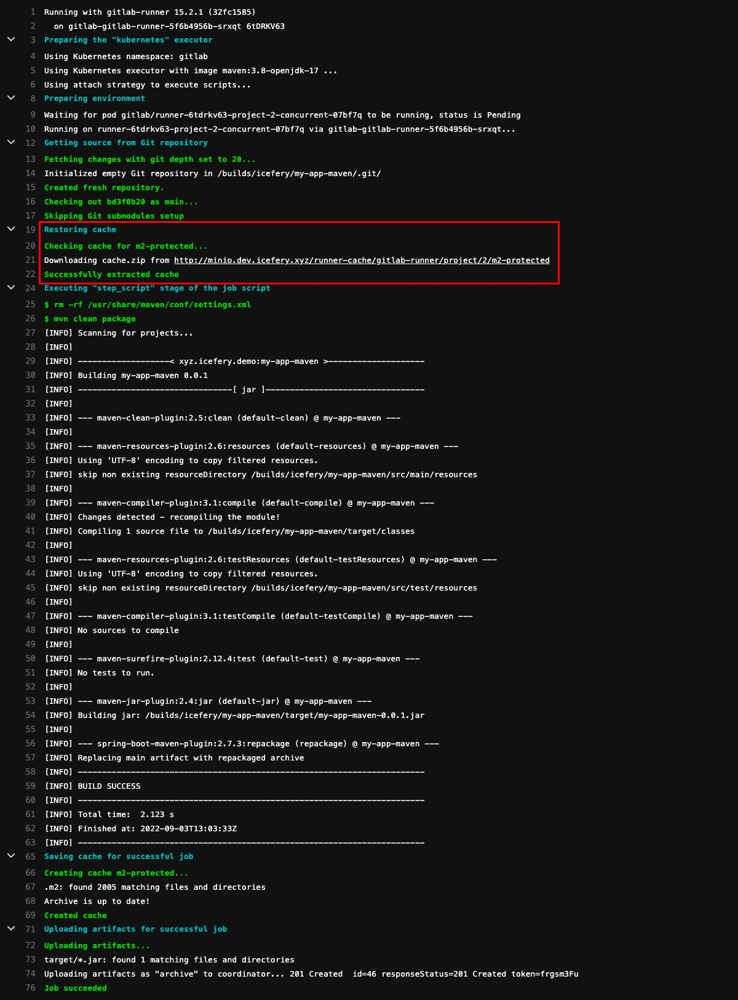

## 环境准备

### 基础组件

-   K8S 单节点集群（`v1.24.4+k3s1`）、Ingress Controller、Storage Class
-   Containerd（`v1.6.6`）、BuildKit
-   `kubectl`、`helm`、`nerdctl`

<br/>

### GitLab

#### 安装

通过 Helm 安装 GitLab 默认配置至少需要 8C32G 资源，但是 GitLab 文档中也提供了针对 MiniKube 满足 2C4G 资源的配置 [values-minikube-minimum.yaml](https://gitlab.com/gitlab-org/charts/gitlab/-/blob/master/examples/values-minikube-minimum.yaml)。

最终的配置文件如下，并且禁用了一些非必要的组件：

-   HTTPS
-   Cert Manager
-   Nginx Ingress Controller（使用自定义的 Ingress Controller）
-   Prometheus
-   Docker Registry（使用 Harbor）
-   GitLab Agent Server

需要注意的配置是 `global.ingress.class` 需要设置为 `none`才会让 GitLab 使用默认的 Ingress Controller。

```yaml
global:
  edition: ce
  hosts:
    domain: dev.icefery.xyz
    https: false
  ingress:
    configureCertmanager: false
    class: none
    tls:
      enabled: false
  kas:
    enabled: false
  rails:
    bootsnap:
      enabled: false
  time_zone: Asia/Shanghai
certmanager:
  install: false
nginx-ingress:
  enabled: false
prometheus:
  install: false
registry:
  enabled: false
gitlab-runner:
  install: true
  rbac:
    create: true
    clusterWideAccess: true
  runners:
    privileged: true
    config: |
      [[runners]]
        [runners.kubernetes]
          image = "ubuntu:22.04"
          {{- if .Values.global.minio.enabled }}
          [runners.cache]
            Type = "s3"
            Path = "gitlab-runner"
            Shared = true
            [runners.cache.s3]
              ServerAddress = {{ include "gitlab-runner.cache-tpl.s3ServerAddress" . }}
              BucketName = "runner-cache"
              BucketLocation = "us-east-1"
              Insecure = true
          {{ end }}
gitlab:
  webservice:
    minReplicas: 1
    maxReplicas: 1
  sidekiq:
    minReplicas: 1
    maxReplicas: 1
  gitlab-shell:
    minReplicas: 1
    maxReplicas: 1
```

图表采用了 `gitlab-jh/gitlab`，因为极狐 GitLab 与原生 GitLab 使用相同的配置文件，并且默认情况下系统界面是中文的不需要再频繁做调整，所以只需要修改 Chart 仓库即可。

```shell
# helm repo add gitlab http://charts.gitlab.io/
helm repo add gitlab-jh https://charts.gitlab.cn

helm repo update

# helm upgrade gitlab gitlab/gitlab --install --namespace gitlab --create-namespace --values gitlab.yaml
helm upgrade gitlab gitlab-jh/gitlab --install --namespace gitlab --create-namespace --values gitlab.yaml

# 查看 root 密码
kubectl get secret -n gitlab gitlab-gitlab-initial-root-password -ojsonpath='{.data.password}' | base64 --decode ; echo
```


<br/>

### Harbor

#### 安装

Harbor 的安装使用了 Bitnami 系列的图表，并且禁用了 HTTPS 以及 Ingress 的自动跳转。

不过需要注意的是，因为 Docker 无法使用 HTTP 注册表，当 Harbor 禁用了 TLS 后也即无法再在 Docker 上进行使用了，因此这里采用的镜像构建工具是 Containerd 和 `nerdctl`，这两者的搭配相比于 Docker 及其 CLI 功能会更多一些，并且在多平台镜像构建方便相比 Docker CLI 的 `docker buildx` 限制更少。

```yaml
adminPassword: admin
externalURL: http://core.harbor.dev.icefery.xyz
exposureType: ingress
ingress:
  core:
    hostname: core.harbor.dev.icefery.xyz
    annotations:
      ingress.kubernetes.io/ssl-redirect: 'false'
      nginx.ingress.kubernetes.io/ssl-redirect: 'false'
  notary:
    hostname: notary.harbor.dev.icefery.xyz
    annotations:
      ingress.kubernetes.io/ssl-redirect: 'false'
      nginx.ingress.kubernetes.io/ssl-redirect: 'false'
```

```shell
helm upgrade harbor bitnami/harbor --install --namespace harbor --create-namespace --values values.yaml
```

#### 镜像注册表配置

安装完 Harbor 后，可以将 Harbor 添加到 Containerd 以及 K3S 内置的 Containerd 中。

相比于 Docker 换源，Containerd 的换源过程可能会麻烦一些，具体可以参考官方文档 [registry.md](https://github.com/containerd/containerd/blob/main/docs/cri/registry.md)：

-   更改 Containerd 配置文件

    ```shell
    mkdir -p /etc/containerd/

    cat > /etc/containerd/config.toml <<- "EOF"
    version = 2
    [plugins."io.containerd.grpc.v1.cri".registry]
      config_path = "/etc/containerd/certs.d"
    EOF
    ```

-   添加镜像注册表配置

    > 如果 Ingress Controller 暴露的端口不是 80 则不能省略 Harbor 地址中的端口，例如 `core.harbor.dev.icefery.xyz:30080`。

    ```shell
    mkdir -p /etc/containerd/certs.d/core.harbor.dev.icefery.xyz/

    cat > /etc/containerd/certs.d/core.harbor.dev.icefery.xyz/hosts.toml <<- "EOF"
    server = "http://core.harbor.dev.icefery.xyz"
    [host."http://core.harbor.dev.icefery.xyz"]
      skip_verify = true
    EOF
    ```

-   对 `docker.io` 进行换源

    ```shell
    mkdir -p /etc/containerd/certs.d/docker.io/

    cat > /etc/containerd/certs.d/docker.io/hosts.toml <<- "EOF"
    server = "https://registry-1.docker.io"
    [host."https://uwk49ut2.mirror.aliyuncs.com"]
      capabilities = ["pull"]
    EOF
    ```

以上的配置方式来源于 1.6.6 版本的 Containerd 文档，是一种较新的配置方式，但是这种方式下并不能指定 Harbor 的密码。如果在 Harbor 创建的是私有项目，那么就需要使用原先的配置方式：

```shell
cat > /etc/containerd/config.toml <<- "EOF"
version = 2
[plugins."io.containerd.grpc.v1.cri".registry]
  config_path = "/etc/containerd/certs.d"
[plugins."io.containerd.grpc.v1.cri".registry.mirrors]
[plugins."io.containerd.grpc.v1.cri".registry.mirrors."docker.io"]
  endpoint = ["https://uwk49ut2.mirror.aliyuncs.com"]
[plugins."io.containerd.grpc.v1.cri".registry.mirrors."core.harbor.dev.icefery.xyz"]
  endpoint = ["http://core.harbor.dev.icefery.xyz"]
[plugins."io.containerd.grpc.v1.cri".registry.configs."core.harbor.dev.icefery.xyz".tls]
  insecure_skip_verify = true
[plugins."io.containerd.grpc.v1.cri".registry.configs."core.harbor.dev.icefery.xyz".auth]
  username = "admin"
  password = "admin"
EOF
```

K3S 提供了一个更简单的方法去配置内置 Containerd 的镜像注册表，虽然最终也会同步到`/var/lib/rancher/k3s/agent/etc/containerd/config.toml`中：

```shell
cat > /etc/rancher/k3s/registries.yaml <<- "EOF"
mirrors:
  docker.io:
    endpoint:
      - "https://uwk49ut2.mirror.aliyuncs.com"
  "core.harbor.dev.icefery.xyz":
    endpoint:
      - "http://core.harbor.dev.icefery.xyz"
configs:
  "core.harbor.dev.icefery.xyz":
    tls:
      insecure_skip_verify: true
    auth:
      username: admin
      password: admin
EOF
```

#### 多平台镜像构建配置

默认从 GitHub 的 `containerd/nerdctl` 安装完成后并没有启动 BuildKit，为了启用 BuildKit 以及支持多平台镜像构建，还需要执行如下命令：

```shell
systemctl enable --now buildkit

nerdctl run --privileged --rm tonistiigi/binfmt --install all
```

#### 图表仓库配置

为了能够推送到 Harbor 内置的 ChartMuseum 仓库，还需为 Helm 安装 `helm-push` 差距：

```shell
helm plugin install https://github.com/chartmuseum/helm-push
```

<br/>

### Nexus 安装

#### 安装

```yaml
ingress:
  enabled: true
  ingressClassName: ''
  hostRepo: nexus.dev.icefery.xyz
```

```shell
helm repo add sonatype https://sonatype.github.io/helm3-charts/

helm repo update

helm upgrade nexus sonatype/nexus-repository-manager --install --namespace nexus --create-namespace --values values.yaml

# 查看 admin 密码
kubectl exec -n nexus pods/<POD> -- cat /nexus-data/admin.password
```


#### Maven 代理仓库配置

Nexus 有三种类型的仓库：

-   `proxy` 代理仓库，只读
-   `hosted` 宿主仓库，存储自定义 JAR 包，可写
-   `group` 组仓库，聚合代理仓库和宿主仓库，为其提供统一的服务地址，可写

参考以下的配置，通过代理阿里云云效 Maven 和默认的 `repo.maven.apache.org` 基本可以缓存大部分仓库的访问。

```yaml
- { type: proxy, name: maven-proxy-aliyun-public, url: https://maven.aliyun.com/repository/public }
- { type: proxy, name: maven-proxy-aliyun-google, url: https://maven.aliyun.com/repository/google }
- { type: proxy, name: maven-proxy-aliyun-spring, url: https://maven.aliyun.com/repository/spring }
- { type: proxy, name: maven-proxy-aliyun-spring-plugin, url: https://maven.aliyun.com/repository/spring-plugin }
- { type: proxy, name: maven-proxy-aliyun-gradle-plugin, url: https://maven.aliyun.com/repository/gradle-plugin }
- { type: proxy, name: maven-proxy-repo, url: https://repo.maven.apache.org/maven2 }
```


<br/><br/>

## GitLab CI

### GitLab Runner

#### 执行器对比

GitLab Runner 各种类型的 Runner 对比如下[Executors](https://docs.gitlab.com/runner/executors/)：

| 执行器                   | SSH  | Shell | VirtualBox | Parallels | Docker | Kubernetes |  自定义  |
| :----------------------- | :--: | :---: | :--------: | :-------: | :----: | :--------: | :------: |
| 为每个构建清理构建环境   |  ✗   |   ✗   |     ✓      |     ✓     |   ✓    |     ✓      | 有条件的 |
| 重用之前的克隆（如果有） |  ✓   |   ✓   |     ✗      |     ✗     |   ✓    |     ✗      | 有条件的 |
| 保护 Runner 文件系统访问 |  ✓   |   ✗   |     ✓      |     ✓     |   ✓    |     ✓      | 有条件的 |
| 迁移 Runner 机器         |  ✗   |   ✗   |    部分    |   部分    |   ✓    |     ✓      |    ✓     |
| 并发构建的零配置支持     |  ✗   |   ✗   |     ✓      |     ✓     |   ✓    |     ✓      | 有条件的 |
| 复杂构建环境             |  ✗   |   ✗   |     ✓      |     ✓     |   ✓    |     ✓      |    ✓     |
| 修复构建问题             | 简单 | 简单  |    困难    |   困难    |  适中  |    适中    |   适中   |

#### Kubernetes 执行器

通过 Helm 安装 GitLab 时已经默认安装了一个 Kubernetes 执行器，这里给需要它设置一个执行器的标签（`executor=kubernetes`）。标签是用于给 GitLab CI 选择 GitLab Runner 的，后续在创建注册 Shell 执行器的 GitLab Runner 时也会为其添加标签。


#### Shell 执行器


其中将 GitLab Runner 安装为服务的命令需要调整一下：

```shell
# 直接使用 root 用户运行 runner 但是工作目录依然在原先的用户主目录下
mkdir -p /home/gitlab-runner

gitlab-runner install --user=root --working-directory=/home/gitlab-runner
```

针对 Shell 执行器，直接使用 `root` 用户启动 GitLab Runner 后续的配置相对会少很多也最为简单：

-   使用 `gitlab-runner` 用户执行需要配置免密`sudo`。

    ```shell
    echo "gitlab-runner ALL=(ALL:ALL)  NOPASSWD:ALL" > /etc/sudoers.d/gitlab-runner

    # 在 Ubuntu 环境下需要先清空 `gitlab-runner` 用户主目录下的一些配置文件才能正常执行作业
    cd /home/gitlab-runner

    rm -rf .bash_history  .bash_logout  .bashrc  .profile  .sudo_as_admin_successful
    ```

    > 但是即遍已经配置免密`sudo` 和 `KUBECONFIG`，通过 `sudo` 命令运行 `helm` 命令时还是报 `Error: Kubernetes cluster unreachable: Get "http://localhost:8080/version": dial tcp 127.0.0.1:8080: connect: connection refused` 的问题，目前暂未解决。

-   注册为 SSH 执行器也仍然需要连接的机器安装（不需启动） GitLab Runner 才能在任务间传递 Artifacts，并且针对只能使用 PublicKey 登录的情况还需为 GitLab Runner 挂载 SSH Key。

    ```yaml
    services:
      gitlab-runner-ssh:
        image: gitlab/gitlab-runner:ubuntu-v15.3.0
        container_name: gitlab-runner-ssh
        volumes:
          - /root/.ssh/gitlab-runner:/root/.ssh/gitlab-runner
    networks:
      default:
        external: true
        name: compose
    ```

注册完 GitLab Runner 后如果没有填写 Tag 还可以在 GitLab 进行修改：


<br/>

### Maven 项目

#### 创建项目

我们可以创建一个简单的 Spring Boot 项目：

-   `pom.xml`

    

-   `App.java`

    

-   `Dockerfile`

    

-   `kubectl.yaml`

    

#### GitLab CI 流水线

```yaml
variables:
  # 镜像注册表
  IMAGE_REGISTRY_NAME: core.harbor.dev.icefery.xyz
  IMAGE_REGISTRY_USERNAME: admin
  IMAGE_REGISTRY_PASSWORD: admin
  # 应用
  APP_GROUP: icefery
  APP_NAME: my-app-maven
  APP_VERSION: 0.0.1

stages:
  - package
  - build
  - deploy

package-jar:
  image: maven:3.8-openjdk-17
  stage: package
  tags:
    # 选择执行器为 Kubernetes 的 GitLab Runner 执行作业
    - executor=kubernetes
  variables:
    MAVEN_OPTS: -Dmaven.repo.local=${CI_PROJECT_DIR}/.m2
  cache:
    key: m2
    paths:
      - .m2
  before_script:
    # 移除 Maven 镜像中默认的配置文件
    - rm -rf /usr/share/maven/conf/settings.xml
  script:
    - mvn clean package
  artifacts:
    paths:
      - target/*.jar

build-docker-image:
  stage: build
  tags:
    # 选择执行器为 Shell 并且可以执行 nerdctl 命令的 GitLab Runner 执行作业
    - executor=shell
    - command=nerdctl
  before_script:
    # non-interactively shell 需要手动配置环境变量
    - source /etc/custom.sh
  script:
    # 构建镜像
    - nerdctl build --tag ${IMAGE_REGISTRY_NAME}/${APP_GROUP}/${APP_NAME}:${APP_VERSION} --platform linux/amd64,linux/arm64 .
    # 登录镜像注册表
    - nerdctl login http://${IMAGE_REGISTRY_NAME} --username ${IMAGE_REGISTRY_USERNAME} --password ${IMAGE_REGISTRY_PASSWORD}
    # 推送镜像
    - nerdctl push ${IMAGE_REGISTRY_NAME}/${APP_GROUP}/${APP_NAME}:${APP_VERSION} --all-platforms

deploy-to-kubernetes:
  stage: deploy
  tags:
    - executor=shell
    - command=kubectl
  before_script:
    - source /etc/custom.sh
  script:
    - kubectl apply -f ci/kubectl.yaml
```

由于 Maven 后续的高版本中会阻止 HTTP 类型仓库的访问，导致 `pom.xml` 中配置的 `<repository>` 和 `<pluginRepository>` 无效，因此需要先删除该文件，当然将本地的 `settings.xml` 文件带入项目版本控制随着流水线一起 `mvn --settings ci/settings.xml clean package` 也可行。


#### 缓存到 Nexus 中的 Jar


<br/>

### NPM 项目

#### 创建项目

-   `index.js`

    

-   `Dockerfile`

    

-   `chart/templates/my-app-npm.yaml`

    

#### GitLab CI 流水线

对于 NodeJS 项目可能多阶段构建镜像会更适用一些，因为在执行 `npm install` 下载包时并不像 Maven 那样透明并且下载过程很可能会执行一些依赖于平台的工作，如果像打包 Jar 包那样放在 GitLab Runner 的作业中，虽然可以对 `node_moduels` 进行缓存，但也有可能因为某些依赖的平台绑定，导致后续的多平台镜像无法正常使用。

```yaml
variables:
  # 镜像注册表
  IMAGE_REGISTRY_NAME: core.harbor.dev.icefery.xyz
  IMAGE_REGISTRY_USERNAME: admin
  IMAGE_REGISTRY_PASSWORD: admin
  # 图表仓库
  CHART_REPO_NAME: icefery
  CHART_REPO_URL: http://core.harbor.dev.icefery.xyz/chartrepo/icefery
  CHART_REPO_USERNAME: admin
  CHART_REPO_PASSWORD: admin
  # 应用
  APP_GROUP: icefery
  APP_NAME: my-app-npm
  APP_VERSION: 0.0.1

stages:
  - build
  - deploy

build-docker-image:
  stage: build
  tags:
    # 选择执行器为 Shell 并且可以执行 nerdctl 命令的 GitLab Runner 执行作业
    - executor=shell
    - command=nerdctl
  before_script:
    # non-interactively shell 需要手动配置环境变量
    - source /etc/custom.sh
  script:
    # 构建镜像
    - nerdctl build -t ${IMAGE_REGISTRY_NAME}/${APP_GROUP}/${APP_NAME}:${APP_VERSION} --platform linux/amd64,linux/arm64 .
    # 登录镜像注册表
    - nerdctl login http://${IMAGE_REGISTRY_NAME} --username ${IMAGE_REGISTRY_USERNAME} --password ${IMAGE_REGISTRY_PASSWORD}
    # 推送镜像
    - nerdctl push ${IMAGE_REGISTRY_NAME}/${APP_GROUP}/${APP_NAME}:${APP_VERSION} --all-platforms

build-helm-chart:
  stage: build
  tags:
    - executor=shell
    - command=helm
  before_script:
    - source /etc/custom.sh
    - mkdir -p artifacts
  script:
    # 添加图表仓库
    - helm repo add ${CHART_REPO_NAME} ${CHART_REPO_URL} --username=${CHART_REPO_USERNAME} --password=${CHART_REPO_PASSWORD} || echo "忽略错误"
    # 推送图表
    - helm cm-push chart/ ${CHART_REPO_NAME}
    # 导出图表
    - helm package chart/ --destination artifacts
  artifacts:
    paths:
      - artifacts/*.tgz

deploy-to-kubernetes:
  stage: deploy
  tags:
    - executor=shell
    - command=helm
  before_script:
    - source /etc/custom.sh
  script:
    - echo "$(whoami)"
    # 卸载
    - helm uninstall ${APP_NAME} --namespace ${APP_GROUP} || echo "忽略错误"
    # 更新
    - helm repo update
    # 安装
    - helm install ${APP_NAME} ${CHART_REPO_NAME}/${APP_NAME} --namespace ${APP_GROUP} --create-namespace --version ${APP_VERSION}
```

#### 上传到 Harbor 的镜像


<br/><br/>

## 常见问题

### GitLab CI 缓存

对于通过 Maven 构建 Jar 包的作业，虽然我们已经配置了 Nexus 作为 Jar 包的一级缓存，但是将 Jar 包从 Nexus 下载到本地仓库依然需要消耗大量资源，如果能够将本地仓库缓存起来作业的执行速度将会快不少。

GitLab CI 默认是本地缓存，对于 Kubernetes 等通过启动一个容器执行的 GitLab Runner 来说即便设置了缓存下次也无法进行复用。在通过 Helm 安装 GitLab 时我们在配置了图表自带的 MinIO 作为 CI 作业的分布式缓存：


因此在通过 Maven 构建 Jar 包时可以直接复用缓存（从 MinIO 下载）：



要查看 GitLab 图表中自带的 MinIO 或者需要为其它 GitLab Runner 配置分布式缓存，需要先拿到其 AccessKey 和 Secret Key：

```shell
kubectl get -n gitlab secrets gitlab-minio-secret -ojsonpath='{.data.accesskey}' | base64 --decode

kubectl get -n gitlab secrets gitlab-minio-secret -ojsonpath='{.data.secretkey}' | base64 --decode
```


<br/>

### 内网 DNS

Nexus 和 Harbor 都是需要暴露出来供客户端使用的服务，并且 CI 作业同样需要频繁的访问 Nexus 和 Harbor 等服务，那么如果非要通过 Ingress 访问服务不可，在不考虑 Ingress Controller 的分流方案的情况下，还可以通过两个 DNS 服务来分别解析 Ingress 的"虚拟主机" 来达到宿主机内和宿主机外的分流效果。

之前，我们使用 ExternalDNS + ETCD + CoreDNS 实现了局域网的 DNS 自动注册，除此之外，还有个更轻量级的 DNS 服务————DNSmasq。相比 CoreDNS 使用 DNSmasq 可以更方便的配置泛解析：

```shell
apt install -y dnsmasq

echo "address=/dev.icefery.xyz/192.192.192.6" > /etc/dnsmasq.conf

systemctl restart dnsmasq
```

然后再将集群内的 CoreDNS 兜底 `forward` 到该 DNS 服务，这样无论是`gitlab.dev.icefery.xyz`还是 `nexus.dev.icefery.xyz` 都将解析到 `192.192.192.6` 这个宿主机内的 IP 上，这对使用 HostNetwork + NodeSelector 的 Ingress Controller 会更加方便一些。
