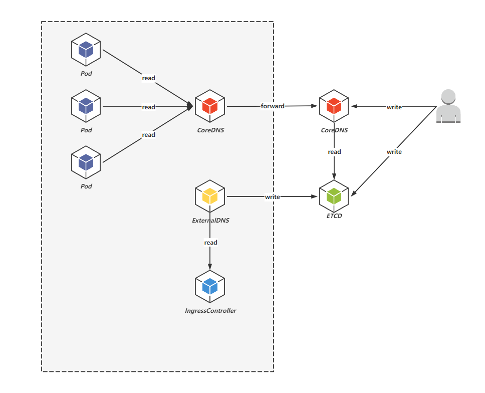
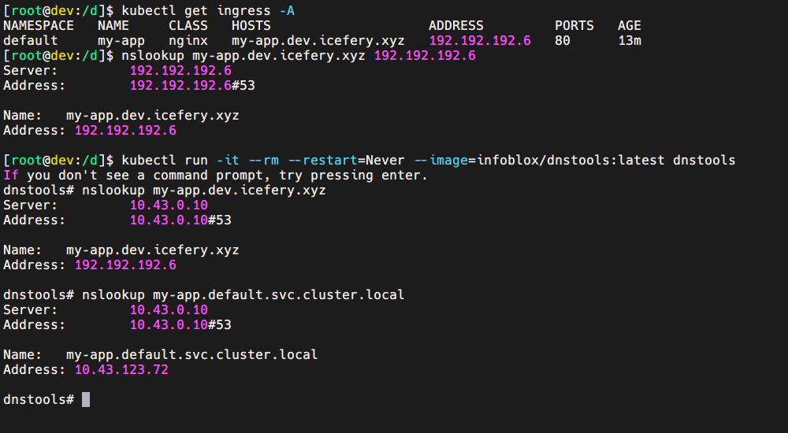

## 目的

对于 HTTP 类型的服务，我们可以通过 Ingress 资源以“虚拟主机”的形式将服务暴露出来，但是在内网环境下，这些域名通常都无法直接访问，于是有了配置 `hosts` 文件进行本地域名解析的方式，但是当集群稍微复杂一些，就会遇到以下几个问题：

-   如何在各个节点以及客户端同步域名解析配置？
-   如何进行泛解析？
-   如何在集群内也能进行域名解析？
-   如何在 Ingress 资源变动时自动更新域名解析配置？

前两个问题其实是想引出自建 DNS 服务的话题，通过自建 DNS 服务，可以很方便的实现内网环境中各节点以及客户端的域名解析，第三个问题是指将集群的 CoreDNS 做一个兜底 `forward` 到自建 DNS 服务，第四个问题是指通过 ExternalDNS 将 Ingress 资源的配置自动同步到自建 DNS 中。

## 实践

单纯自建 DNS 的话其实可以使用的软件有很多，但是出于对轻量级和配置 [ExternalDNS](https://github.com/kubernetes-sigs/external-dns) 的考虑就直接使用 [CoreDNS](https://github.com/coredns/coredns) 作为 DNS 服务器软件。另外 CoreDNS 本身已经能够实现域名解析了，但也仅仅是只能进行静态域名解析，因此需要给它搭配一个 [ETCD](https://github.com/etcd-io/etcd) 数据库，后续 ExternalDNS 在读取到 Ingress 配置后也会将其写入到 ETCD 中。

此时自建 DNS 已经能够解析 Ingress 资源中配置的域名了，但是为了让集群内也能通过自建 DNS 进行域名解析，还需配置集群内的 CoreDNS 进行兜底 `forward` 到自建 DNS。

最终的各个组件之间的关系如下图所示：



### 环境准备

为了测试 Ingress 的效果，需要有一个 IngressController。其次，安装 CoreDNS、ETCD、ExternalDNS 时会用到 Helm，也可以通过 Docker、Containerd 将其安装在集群外。

### 安装自建 ETCD

ETCD 并没有采用官方推荐的 `etcd-operator` 方式进行安装，而是直接使用了 [Bitnami Chart](https://artifacthub.io/packages/helm/bitnami/etcd)，因为 Bitnami Chart 的镜像基本都在 DockerHub，易于访问。

暂时只修改了认证配置和服务暴露配置（`kube-apiserver` 端口范围已放开）：

-   `values.yaml`

    ```yaml
    auth:
      rbac:
        create: false

    service:
      type: NodePort
      nodePorts:
        client: 2379
    ```

-   安装

    ```shell
    helm repo add bitnami https://charts.bitnami.com/bitnami

    helm repo update

    helm upgrade etcd bitnami/etcd --install --namespace etcd --create-namespace --values values.yaml --version 8.3.7
    ```

-   `etcdctl` 命令行测试工具

    ```shell
    kubectl run etcd-client --restart="Never" --image docker.io/bitnami/etcd:3.5.4-debian-11-r22 --env ETCDCTL_ENDPOINTS="etcd.etcd.svc.cluster.local:2379" --namespace etcd --command -- sleep infinity

    kubectl exec --namespace etcd -it etcd-client -- bash
    ```

### 安装自建 CoreDNS

主要修改了服务暴露方式以及直接改写的 [CoreDNS Chart](https://artifacthub.io/packages/helm/coredns/coredns) 默认的 `Corefile` 插件配置：

-   `values.yaml`

    ```yaml
    serviceType: NodePort

    isClusterService: false

    servers:
      - zones:
          - zone: .
        port: 53
        nodePort: 53
        plugins:
          - name: errors
          - name: health
            configBlock: |-
              lameduck 5s
          - name: ready
          - name: hosts
            configBlock: |-
              fallthrough
          - name: etcd
            configBlock: |-
              endpoint http://etcd.etcd.svc.cluster.local:2379
              fallthrough
          - name: forward
            parameters: . 114.114.114.114
          - name: cache
            parameters: 30
          - name: loop
          - name: reload
          - name: loadbalance
    ```

-   安装

    ```shell
    helm repo add coredns https://coredns.github.io/helm

    helm repo update

    helm upgrade coredns coredns/coredns --install --namespace coredns --create-namespace --values values.yaml --version 1.19.4
    ```

-   命令行测试工具

    ```shell
    kubectl run -it --rm --restart=Never --image=infoblox/dnstools:latest dnstools
    ```

因为 CoreDNS 本身就只有一个几兆大小的二进制文件，直接本地运行或者通过在 Docker 等集群外运行时，需要的 `Corefile` 其实更简洁：

```groovy
.: 53 {
    hosts {
        fallthrough
    }
    etcd {
        endpoint http://192.192.192.6:2379
        fallthrough
    }
    forward . 114.114.114.114
}
```

其中 `endpoint` 是指 ETCD 数据库的地址，由于安装 ETCD 时已经通过 NodePort 方式暴露了端口因而可以直接采用宿主机地址 + 端口的方式访问。可以在 `hosts` 插件块中硬编码一些域名解析，也可以让其直接引用宿主机的 `hosts` 文件，还可以借助 [template 插件](https://coredns.io/plugins/template/) 配置泛解析。最后兜底转发到 114 DNS 服务器。

### 安装 ExternalDNS

ExternalDNS 也是为了图镜像易于访问直接使用 [Bitnami Chart](https://artifacthub.io/packages/helm/bitnami/external-dns)：

-   `values.yaml`

    ```yaml
    provider: coredns

    coredns:
      etcdEndpoints: 'http://etcd.etcd.svc.cluster.local:2379'
    ```

-   安装

    ```shell
    helm repo add bitnami https://charts.bitnami.com/bitnami

    helm repo update

    helm upgrade external-dns bitnami/external-dns --install --namespace external-dns --create-namespace --values values.yaml --version 6.7.4
    ```

-   日志：当 Ingress 资源变动时可以从 ExternalDNS 的日志中看到新的 DNS 记录被写入到 ETCD 中。

### 将集群内的 CoreDNS 兜底转发到自建 DNS

对于集群内默认的 CoreDNS 我们可以通过修改其 ConfigMap 的方式进行配置（具体可参考 [自定义 DNS 服务](https://kubernetes.io/zh-cn/docs/tasks/administer-cluster/dns-custom-nameservers/)）：

-   查看默认 ConfigMap

    ```shell
    kubectl -n kube-system edit ConfigMap coredns
    ```

-   `cm.yaml`

    ```yaml
    apiVersion: v1
    kind: ConfigMap
    metadata:
      name: coredns
      namespace: kube-system
    data:
      Corefile: |
        .:53 {
            errors
            health
            ready
            kubernetes cluster.local in-addr.arpa ip6.arpa {
               pods insecure
               fallthrough in-addr.arpa ip6.arpa
            }
            prometheus :9153
            forward . 192.192.192.6 114.114.114.114
            cache 30
            loop
            reload
            loadbalance
        }
    ```

-   Apply

    ```shell
    kubectl apply -f cm.yaml
    ```

## 效果


