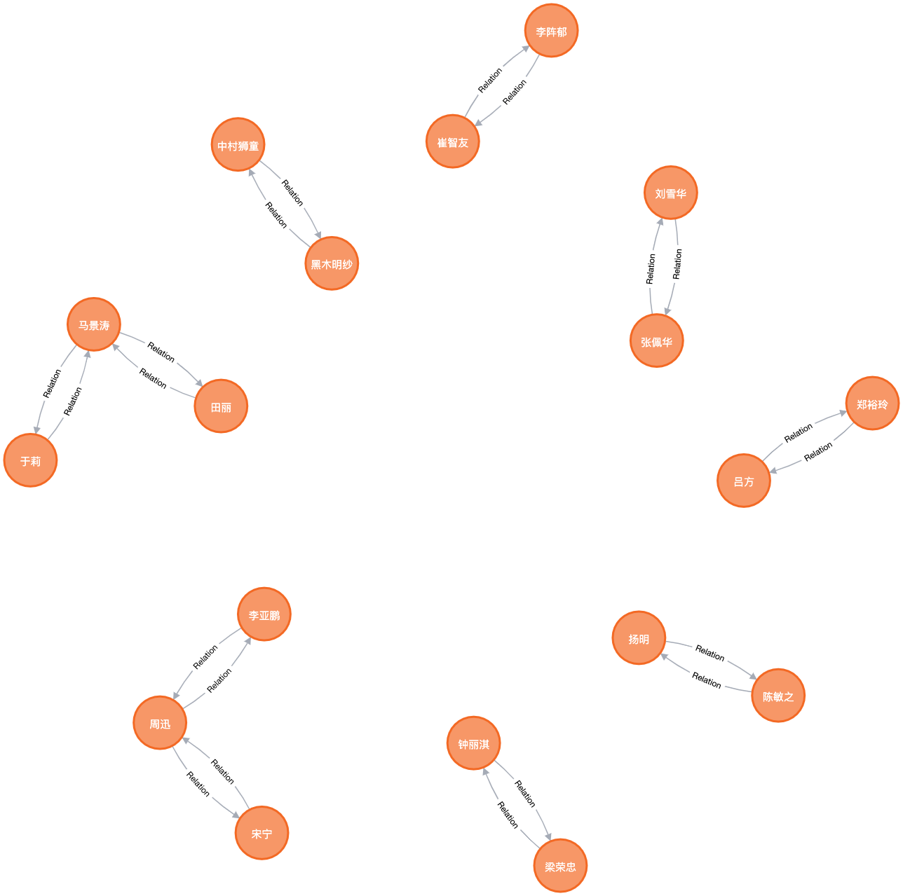
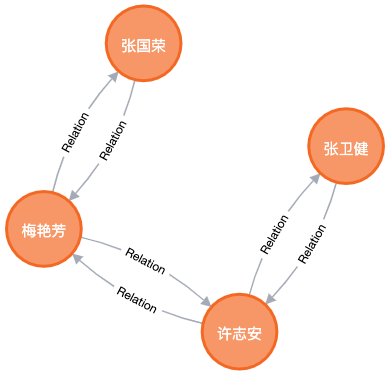

# Neo4j

## 明星关系图谱

-   导入数据

    ```cypher
    LOAD CSV WITH HEADERS FROM 'https://raw.githubusercontent.com/DesertsX/gulius-projects/master/5_YuLeQuan_Neo4j/ylq_star_nodes.csv' AS row
    CREATE (:Star{name:row.name, id: row.id});

    LOAD CSV WITH HEADERS FROM 'https://raw.githubusercontent.com/DesertsX/gulius-projects/master/5_YuLeQuan_Neo4j/ylq_star_relations.csv' AS row
    MATCH (n1:Star{name: row.subject}) , (n2:Star{name: row.object})
    CREATE (n1) - [:Relation{relation: row.relation}] -> (n2);
    ```

-   查询特定关系

    ```cypher
    MATCH p = () - [:Relation{relation: '旧爱'}] -> () RETURN p LIMIT 25;
    ```

    

-   查询最短路径

    ```cypher
    MATCH p = shortestpath((:Star{name:"张国荣"}) - [*..5] -> (:Star{name:"张卫健"})) RETURN p;
    ```

    
