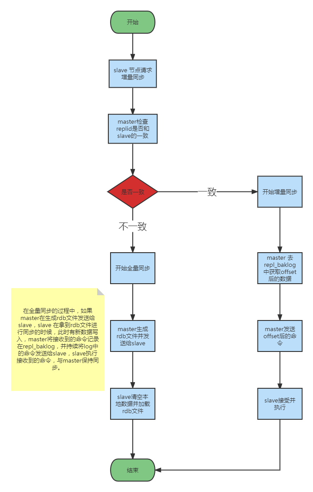

# Redis 哨兵模式模式与集群模式搭建

## 主从复制


### 主从复制作用

通过持久化功能，Redis 保证了即使在服务器重启的时候也不会丢失（或少量丢失）数据，因为持久化会把内存中数据保存到硬盘上，重启会从硬盘上加载数据。但是由于数据是存储在一台服务器上的，如果这台服务器出现硬盘故障等问题，也会导致数据丢失。

为了避免单点故障，通常的做法是将数据复制多个副本以部署在不同的服务器上，这样即使有一台服务器出现故障，其他服务器依然可以继续提供服务。

为此，Redis 提供了复制（Replication）功能，可以实现当一台数据库中的数据更新后，自动将更新的数据同步到其他数据库上。

在复制的概念中，数据库分为两类，一类是主数据库（Master），另一类是从数据库（Slave）。主数据库可以进行读写操作，当写操作导致数据变化时会自动将数据同步给从数据库。而从数据库一般是只读的，并接收主数据库同步过来的数据。一个主数据库可以拥有哦多个从数据库，而一个从数据库只能拥有一个主数据库。

总结：引入主从复制的目的有两个，一个是读写分离，分担 Master 的读写压力，另一个数方便做容灾恢复。

### 主从复制原理



### 主从复制优点

-   支持主从复制，主机会自动将数据同步到从机，可以进行读写分离；
-   为了分载 Master 的读操作压力，Slave 服务器可以为客户端提供只读操作的服务，写服务仍然必须由 Master 来完成;
-   Slave 同样可以接收其它 Slave 的连接和同步请求，这样可以有效的分载 Master 的同步压力；
-   Master 是以非阻塞的方式为 Slave 提供服务。所以在 Master-Slave 同步期间，客户端仍然可以提交查询或修改请求；
-   Slave 同样是以非阻塞的方式完成数据同步。在同步期间，如果有客户端提交查询请求，Redis 则返回之前的数据；

### 主从复制缺点

-   Redis 不具备自动容错和恢复功能，主机从机的宕机都会导致部分读写请求失败，需要等待机器重启或者手动切 IP 才能恢复（也就是要人工介入）；
-   主机宕机，宕机前有部分数据未能及时同步到从机，切换 IP 后还会引入数据不一致的问题，降低了系统的可用性；
-   如果多个 Slave 断线了，需要重启的时候，尽量不要再同一时间段进行重启。因为只要 Slave 启动，就会发送 sync 请求和主机全量同步，当多个 Slave 重启的时候，可能会导致 Master IO 剧增从而宕机；
-   Redis 较难支持在线扩容，在集群容量达到上限时在线扩容会变得很复杂；

<br/><br/>

## 哨兵模式


### 哨兵模式作用

-   通过发送命令，让 Redis 服务器返回监控其运行状态，包括主服务器和从服务器；
-   当哨兵监测到 Master 宕机，会自动将 Slave 切换成 Master，然后通过发布订阅模式通知其它的从服务器，修改配置文件，让它们切换主机；

### 哨兵模式故障切换的过程

假设主服务器宕机，哨兵 1 先监测到这个结果，系统并不会马上进行 failover 过程，仅仅是哨兵 1 主观的认为主服务器不可用，这个线下称为主观下线。当后面的哨兵也监测到主服务器不可用，并且达到一定值时，那么哨兵之间就会进行一次投票，投票的结果由一个哨兵发起，进行 failover 操作。切换成功后，就会通过发布订阅模式，让各个哨兵把自己监控的从服务器实现切换主机，这个过程称为可观下线。这样对客户端而言，一切都是透明的。

### 哨兵模式搭建(相同主机不同端口)

#### 配置文件

-   Master(`redis_6379.conf`)

    ```properties
    bind 0.0.0.0
    port 6379
    requirepass 1234
    protected-mode no
    daemonize yes
    pidfile /var/run/redis_6379.pid
    dbfilename dump_6379.rdb
    logfile redis_6379.log
    ```

-   Slave(`redis_6380.conf`)

    > 对应修改其它从节点配置文件的端口。

    ```properties
    bind 0.0.0.0
    port 6380
    requirepass 1234
    protected-mode no
    daemonize yes
    pidfile /var/run/redis_6380.pid
    dbfilename dump_6380.rdb
    logfile redis_6380.log

    replicaof 127.0.0.1 6379
    masterauth 1234
    ```

-   Sentinel(`sentinel_26379.conf`)
    > 对应修改其它哨兵节点配置文件的端口，并且需要指定主节点服务器的 IP，否则 Java 客户端连接不成功。
    ```properties
    port 26379
    requirepass 1234
    protected-mode no
    daemonize yes
    pidfile /var/run/redis-sentinel_26379.pid
    logfile redis-sentinel_26379.log
    # sentinel monitor <master-group-name> <ip> <port> <quorum>
    sentinel monitor master 192.192.192.101 6379 2
    sentinel auth-pass master 1234
    ```

#### 启动集群

```shell
redis-server redis_6379.conf
redis-server redis_6380.conf
redis-server redis_6381.conf
redis-sentinel sentinel_26379.conf
redis-sentinel sentinel_26380.conf
redis-sentinel sentinel_26381.conf
```

#### 查看集群信息

```shell
redis-cli -h 127.0.0.1 -p 6379 -a 1234

127.0.0.1:6379> info replication
```

#### Spring Boot 连接

```xml
<dependency>
    <groupId>org.springframework.boot</groupId>
    <artifactId>spring-boot-starter-data-redis</artifactId>
</dependency>
```

```yaml
spring:
  redis:
    sentinel:
      nodes:
        - 192.192.192.101:26379
        - 192.192.192.101:26380
        - 192.192.192.101:26381
      password: 1234
      master: master
    password: 1234
```

<br/><br/>

## 集群模式


### 集群模式特点

-   集群完全去中心化，采用多主多从；所有的 Redis 节点彼此互联，内部使用二进制协议优化传输速度和带宽。
-   客户端与 Redis 节点直连，不需要中间代理层。客户端不需要连接集群所有节点，连接集群中任何一个可用节点即可。
-   每一个分区都是由一个主机和多个从机组成，分片和分片之间是相互平行的。
-   每一个 Master 节点负责维护一部分槽，以及槽所映射的键值数据；集群中每个节点都有全量的槽信息，通过槽每个节点都知道具体数据存储在哪个节点上。

### 集群模式搭建(相同主机不同端口)

#### 集群配置文件

-   Master(`redis_6379.conf`)
    > 对应修改其它主节点的端口号。
-   `redis_6379.conf`

    ```properties
    bind 0.0.0.0
    port 6379
    requirepass 1234
    protected-mode no
    daemonize yes
    pidfile /var/run/redis_6379.pid
    dbfilename dump_6379.rdb
    logfile redis_6379.log

    cluster-enabled yes
    cluster-config-file nodes_6379.conf
    masterauth 1234
    ```

#### 启动集群

```shell
redis-server redis_6379.conf
redis-server redis_6380.conf
redis-server redis_6381.conf
redis-server redis_6382.conf
redis-server redis_6383.conf
redis-server redis_6384.conf

# --cluster-replicas 1 指定创建 master 时同时创建一个 slave
redis-cli --cluster create 192.192.192.101:6379 192.192.192.101:6380 192.192.192.101:6381 192.192.192.101:6382 192.192.192.101:6383 192.192.192.101:6384 --cluster-replicas 1 -a 1234
```

#### 查看集群信息

```shell
# 集群模式下需要带上参数 -c
redis-cli -c -h 127.0.0.1 -p 6379 -a 1234

127.0.0.1:6379> cluster nodes
```

#### Spring Boot 连接

```yaml
spring:
  redis:
    cluster:
      nodes:
        - 192.192.192.101:6379
        - 192.192.192.101:6380
        - 192.192.192.101:6381
        - 192.192.192.101:6382
        - 192.192.192.101:6383
        - 192.192.192.101:6384
    password: 1234
```
