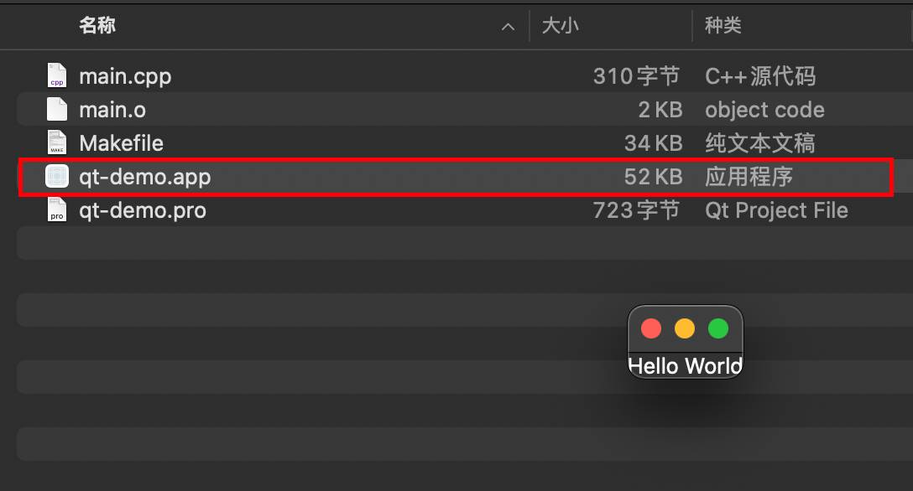

# Qt 笔记

## 一、环境搭建

### 1.1 MacOS 安装 Qt

#### 1.1.1 在线安装

> -   https://www.qt.io/download-qt-installer

#### 1.1.2 升级维护


#### 1.1.3 文档


### 1.2 编译运行

#### 1.2.1 环境配置

-   将 Qt 库的 `bin` 目录加入 `PATH` 环境变量：

    ```shell
    export PATH=$PATH:/opt/qt/6.2.2/macos/bin
    ```

#### 1.2.2 示例项目

1.  创建项目目录

    ```shell
    mkdir -p qt-demo

    cd qt-demo
    ```

2.  编辑源代码文件

    ```shell
    vim main.cpp
    ```

    

3.  QMake 生成 `.pro` 文件

    ```shell
    qmake -project
    ```

    

4.  编辑 `.pro` 文件添加构建选项

    ```shell
    vim qt-demo.pro
    ```

    ```makefile
    QT += widgets
    ```

    

5.  生成 `Makefile`

    ```shell
    qmake
    ```

    

6.  编译链接

    ```shell
    make
    ```

    

7.  运行

    

8.  打包

    ```shell
    macdeployqt qt-demo.app -dmg
    ```

## 二、窗口

### 2.1 介绍

创建控件时，可以指定停靠在某个父窗口上面，这时控件将作为子窗口被束缚在其父窗口的内部，并伴随父窗口一起移动、隐藏、显示和关闭，否则该控件将作为独立窗口显示在屏幕上，且游离于其它窗口之外。

`QWidgets` 及其子类的对象都可以作为其它控件的父窗口，常见的父窗口类有如下三个：

-   `QWidgets`
-   `QMainWindow`：`QWidgets` 的直接子类
-   `QDialog`：`QWidgets` 的直接子类

### 2.2 析构函数

父窗口的析构函数会自动销毁其所有子窗口对象，因此即使子窗口对象是通过 `new` 操作符动态创建的，也可以不显式的执行 `delete` 操作，而且不用担心内存泄漏的问题，只要保证父窗口对象被正确销毁 u，其子窗口也将随之被销毁。

### 2.3 设置窗口的位置和大小

```cpp
void move(int x, int y);
void resize(int w, int h);
```

## 三、信号和槽

### 3.1 介绍

-   信号和槽是 Qt 自行定义的一种通信机制，实现对象之间的数据交互。
-   当用户或系统触发了一个动作，导致某个控件的状态发送了改变，该控件就会发射一个信号，即调用其类中一个特定的成员函数（信号），同时还可能携带有必要的参数。
-   槽和普通的成员函数几乎没有太多区别，可以是公有的、保护的或私有的，可以被重载，也可以被覆盖，其参数可以是任意类型，并可以像普通成员函数一样调用。
-   槽函数与普通成员函数的差别不在于其语法特性，而在于其功能。槽函数更多体现为对某种特定信号的处理，可以将槽和其它对象信号建立连接，这样当发射信号时，槽函数将被触发和执行，进而来完成具体功能。

### 3.2 信号和槽的连接

#### 3.2.1 函数签名

```cpp
QObject:connect(
  const QObject* sender,
  const char* signal,
  const QObject* receiver,
  const char* method
);
```

-   `sender`：信号发送对象指针
-   `signal`：要发送的信号函数，可以使用 `SIGNAL()` 宏进行类型转换
-   `receiver`：信号的接收对象指针
-   `method`：接收信号后要执行的槽函数，可以使用 `SLOT()` 宏进行类型转换

#### 3.2.2 应用

-   一个信号可以被连接到多个槽（一对多）
-   多个信号也可以连接同一个槽（多对一）
-   两个信号可以直接连接（信号级联）

### 3.3 案例

#### 3.3.1 点击按钮关闭标签、退出程序

```cpp
#include <QApplication>
#include <QDialog>
#include <QLabel>
#include <QPushButton>

int main(int argc, char* argv[]) {
    QApplication app(argc, argv);

    QDialog parent;
    parent.resize(320, 240);

    QLabel label("标签", &parent);
    label.move(50, 50);

    QPushButton button1("关闭标签", &parent);
    button1.move(50, 140);

    QPushButton button2("退出程序", &parent);
    button1.move(200, 140);

    parent.show();

    QObject::connect(
        &button1,
        SIGNAL(clicked()),
        &label,
        SLOT(close())
    );

    QObject::connect(
        &button2,
        SIGNAL(clicked()),
        &app,
        SLOT(quit())
    );

    return QApplication::exec();
}
```

#### 3.3.2 滑块联动选值框

```cpp
#include <QApplication>
#include <QDialog>
#include <QSlider>
#include <QSpinBox>

int main(int argc, char** argv) {
    QApplication app(argc, argv);

    QDialog parent;
    parent.resize(320, 240);

    // 创建水平滑块
    QSlider slider(Qt::Horizontal, &parent);
    slider.move(20, 100);
    slider.setRange(0, 200);

    // 创建选值框
    QSpinBox spinBox(&parent);
    spinBox.move(220, 100);
    spinBox.setRange(0, 200);

    // 滑块滑动让选值随值改变
    QObject::connect(&slider, SIGNAL(valueChanged(int)), &spinBox, SLOT(setValue(int)));

    // 选值框数值改变让滑块随之滑动
    QObject::connect(&spinBox, SIGNAL(valueChanged(int)), &slider, SLOT(setValue(int)));

    parent.show();

    return QApplication::exec();
}
```

### 3.4 信号和槽连接的语法要求

-   信号和槽参数要一致

    ```cpp
    QObject::connect(A, SIGNAL(sigfun(int)), B, SLOT(slotfun(int))); // OK

    QObject::connect(A, SIGNAL(sigfun(int)), B, SLOT(slotfun(int, int))); // ERROR
    ```

-   可以带有缺省参数

    ```cpp
    QObject::connect(A, SIGNAL(sigfun(int)), B, SLOT(slotfun(int, int=0))); // OK
    ```

-   信号函数的参数可以多于槽函数，多于参数将被忽略

    ```cpp
    QObject::connect(A, SIGNAL(sigfun(int, int)), B, SLOT(slotfun(int))); // OK
    ```

## 四、面向对象

### 4.1 介绍

-   完全不使用任何面向对象技术，而只是利用 Qt 所提供的类创建对象，并调用对象的接口以满足用户的需要是可能，但这样构建的应用程序其功能必然是十分有限的。
-   首先，Qt 类保护成员中的诸多实现无法在类的外部被复用，Qt 试图通多态实现的很多机制，如事件处理，完全无法使用。
-   再次，Qt 提供的信号和槽不可能满足用户所有的需求，自定义信号和槽需要面向对象技术。
-   最后，Qt 设计师、Qt 创建器等工具链都以面向对象的方式使用 Qt，反其道而行之不会有好结果。

### 4.2 案例

#### 4.2.1 加法计算器

-   `calculator_dialog.h`

    ```cpp
    #ifndef CALCULATOR_DIALOG_H
    #define CALCULATOR_DIALOG_H

    #include <QDialog>
    #include <QDoubleValidator>
    #include <QHBoxLayout>
    #include <QLabel>
    #include <QLineEdit>
    #include <QPushButton>

    class CalculatorDialog : public QDialog {
        Q_OBJECT

    public:
        // 构造函数
        CalculatorDialog() {
            // 1. 界面初始化
            this->setFixedSize(320, 240);
            this->setWindowTitle("计算器");
            // 左操作数
            this->editX = new QLineEdit(this);
            this->editX->setAlignment(Qt::AlignRight);             // 设置文本对齐
            this->editX->setValidator(new QDoubleValidator(this)); // 设置数字验证器
            // 右操作数
            this->editY = new QLineEdit(this);
            this->editY->setAlignment(Qt::AlignRight);
            this->editY->setValidator(new QDoubleValidator(this));
            // 显示结果
            this->editZ = new QLineEdit(this);
            this->editZ->setAlignment(Qt::AlignRight);
            this->editZ->setReadOnly(true); // 设置只读
            // "+"
            this->plusButton = new QLabel("+", this);
            // "="
            this->equalButton = new QPushButton("=", this);
            this->equalButton->setEnabled(false); // 设置禁用
            // 布局器(自动调整每个控件的大小和位置)(按水平方向以此将控件添加到布局容器中)
            this->layout = new QHBoxLayout(this);
            this->layout->addWidget(editX);
            this->layout->addWidget(plusButton);
            this->layout->addWidget(editY);
            this->layout->addWidget(equalButton);
            this->layout->addWidget(editZ);
            this->setLayout(this->layout);

            // 2. 信号和槽函数连接
            // 左右操作数文本改变时发送信号 textChanged()
            connect(editX, SIGNAL(textChanged(QString)), this, SLOT(enableButton()));
            connect(editY, SIGNAL(textChanged(QString)), this, SLOT(enableButton()));
            // 点击按钮发送信号 clicked()
            connect(equalButton, SIGNAL(clicked()), this, SLOT(calc()));
        }

    private slots:
        // 启用等号按钮
        void enableButton() {
            bool xOk;
            bool yOk;
            editX->text().toDouble(&xOk);
            editY->text().toDouble(&yOk);
            // 当左右操作数都输入了有效数据，则使能等号按钮
            equalButton->setEnabled(xOk && yOk);
        }

        // 计算和显示结果
        void calc() {
            double result = editX->text().toDouble() + editY->text().toDouble();
            // 显示字符串形式结果
            QString str = QString::number(result);
            editZ->setText(str);
        }

    private:
        QHBoxLayout* layout;      // 水平布局
        QLineEdit* editX;         // 左操作数
        QLineEdit* editY;         // 右操作数
        QLineEdit* editZ;         // 显示结果
        QLabel* plusButton;       // "+"
        QPushButton* equalButton; // "="
    };

    #endif // CALCULATOR_DIALOG_H
    ```

-   `main.cpp`

    ```cpp
    #include "calculator_dialog.h"
    #include <QApplication>

    int main(int argc, char** argv) {
        QApplication app(argc, argv);

        CalculatorDialog dialog;
        dialog.show();

        return QApplication::exec();
    }
    ```

-   效果

    
    

#### 4.2.2 获取系统当前时间

-   `time_dialog.h`

    ```cpp
    #ifndef TIME_DIALOG_H
    #define TIME_DIALOG_H

    #include <QDialog>
    #include <QFont>
    #include <QLabel>
    #include <QPushButton>
    #include <QTime>       // 时间
    #include <QVBoxLayout> // 垂直布局器

    class TimeDialog : public QDialog {
        Q_OBJECT

    public:
        TimeDialog() {
            // 1. 初始化界面
            // 字体
            QFont font;
            font.setPointSize(20);
            // 标签
            this->label = new QLabel(this);
            this->label->setFrameStyle(QFrame::Panel | QFrame::Sunken);     // 设置边框
            this->label->setAlignment(Qt::AlignHCenter | Qt::AlignVCenter); // 设置文本对齐
            this->label->setFont(font);                                     // 设置字体
            // 按钮
            this->button = new QPushButton("获取系统当前时间", this);
            this->button->setFont(font);
            // 垂直布局器
            this->layout = new QVBoxLayout(this);
            this->layout->addWidget(label);
            this->layout->addWidget(button);
            setLayout(layout);

            // 2. 信号和槽函数
            connect(button, SIGNAL(clicked()), this, SLOT(getTime()));
            // 通过自定义信号触发 Label 的 setText() 槽函数执行
            connect(this, SIGNAL(mySignal(QString)), label, SLOT(setText(QString)));
        }

    private slots:
        void getTime() {
            qDebug("getTime()");
            qDebug() << "getTime()";
            // 获取当前系统时间
            QTime time = QTime::currentTime();
            // 将时间对象转换为字符串
            QString str = time.toString("hh:mm:ss");
            // 发射信号(emit 是 Qt 关键字，标记当前是发射信号)
            emit mySignal(str);
        }

        signals:
            // 自定义信号(只需申明不能定义)
            void mySignal(const QString&);
    private:
        QVBoxLayout* layout;
        QLabel* label;
        QPushButton* button;
    };

    #endif // TIME_DIALOG_H
    ```

-   `main.cpp`

    ```cpp
    #include "time_dialog.h"
    #include <QApplication>

    int main(int argc, char** argv) {
        QApplication app(argc, argv);

        TimeDialog timeDialog;
        timeDialog.show();

        return QApplication::exec();
    }
    ```

-   效果

    

## 五、网络模块

### 5.1 案例

#### 5.1.1 网络聊天室

##### 5.1.1.1 服务端

-   `chat-room-server.pro`

    ```makefile
    QT += core gui network

    greaterThan(QT_MAJOR_VERSION, 4): QT += widgets

    CONFIG += c++11

    SOURCES += \
        main.cpp \
        dialog.cpp

    HEADERS += \
        dialog.h

    FORMS += \
        dialog.ui
    ```

-   `dialog.ui`

    ```xml
    <?xml version="1.0" encoding="UTF-8" ?>
    <ui version="4.0">
        <class>Dialog</class>
        <widget class="QDialog" name="Dialog">
            <property name="geometry">
                <rect>
                    <x>0</x>
                    <y>0</y>
                    <width>526</width>
                    <height>372</height>
                </rect>
            </property>
            <property name="font">
                <font>
                    <family>Inconsolata</family>
                    <pointsize>16</pointsize>
                </font>
            </property>
            <property name="windowTitle">
                <string>聊天室服务端</string>
            </property>
            <layout class="QVBoxLayout" name="verticalLayout">
                <item>
                    <layout class="QHBoxLayout" name="horizontalLayout">
                        <item>
                            <spacer name="horizontalSpacer">
                                <property name="orientation">
                                    <enum>Qt::Horizontal</enum>
                                </property>
                                <property name="sizeHint" stdset="0">
                                    <size>
                                        <width>40</width>
                                        <height>20</height>
                                    </size>
                                </property>
                            </spacer>
                        </item>
                        <item>
                            <widget class="QListWidget" name="listWidget">
                                <property name="minimumSize">
                                    <size>
                                        <width>480</width>
                                        <height>270</height>
                                    </size>
                                </property>
                                <property name="maximumSize">
                                    <size>
                                        <width>480</width>
                                        <height>270</height>
                                    </size>
                                </property>
                            </widget>
                        </item>
                        <item>
                            <spacer name="horizontalSpacer_2">
                                <property name="orientation">
                                    <enum>Qt::Horizontal</enum>
                                </property>
                                <property name="sizeHint" stdset="0">
                                    <size>
                                        <width>40</width>
                                        <height>20</height>
                                    </size>
                                </property>
                            </spacer>
                        </item>
                    </layout>
                </item>
                <item>
                    <layout class="QGridLayout" name="gridLayout">
                        <item row="0" column="0">
                            <widget class="QLabel" name="portLabel">
                                <property name="text">
                                    <string> 服务器端口：</string>
                                </property>
                            </widget>
                        </item>
                        <item row="0" column="1">
                            <widget class="QLineEdit" name="portEdit">
                                <property name="text">
                                    <string>8080</string>
                                </property>
                            </widget>
                        </item>
                    </layout>
                </item>
                <item>
                    <widget class="QPushButton" name="createButton">
                        <property name="text">
                            <string>创建服务器</string>
                        </property>
                    </widget>
                </item>
            </layout>
        </widget>
        <resources />
        <connections />
    </ui>
    ```

    

-   `dialog.h`

    ```cpp
    #ifndef DIALOG_H
    #define DIALOG_H

    #include "ui_dialog.h"
    #include <QDialog>
    #include <QTcpServer>
    #include <QTcpSocket>
    #include <QTimer>

    QT_BEGIN_NAMESPACE
    namespace Ui {
        class Dialog;
    }
    QT_END_NAMESPACE

    class Dialog : public QDialog {
        Q_OBJECT

    public:
        Dialog() {
            this->ui = new Ui::Dialog();
            this->ui->setupUi(this);
            connect(&tcpServer, SIGNAL(newConnection()), this, SLOT(onNewConnection()));
            connect(&timer, SIGNAL(timeout()), SLOT(onTimeout()));
        }

    private slots:
        // 创建服务器按钮点击槽函数
        void on_createButton_clicked() {
            port = ui->portEdit->text().toShort();
            if (tcpServer.listen(QHostAddress::Any, port)) {
                qDebug() << "创建服务器成功";
                ui->createButton->setEnabled(false);
                ui->portEdit->setEnabled(false);
                // 开启定时器
                timer.start(3000);
            } else {
                qDebug() << "创建服务器失败";
            }
        }

        // 响应客户端连接请求槽函数
        void onNewConnection() {
            // 后去和客户端通信的套接字
            QTcpSocket* tcpSocket = tcpServer.nextPendingConnection();
            // 保存套接字到容器
            tcpClientList.append(tcpSocket);
            // 当客户端向服务器发送消息时通信套接字发送 readyRead() 信号
            connect(tcpSocket, SIGNAL(readyRead()), this, SLOT(onReadyRead()));
        }

        // 接收客户端消息槽函数
        void onReadyRead() {
            // 遍历容器获取哪个客户端给服务器发送了消息
            for (int i = 0; i < tcpClientList.size(); i++) {
                // 返回 0 表示没有消息
                if (tcpClientList.at(i)->bytesAvailable() != 0) {
                    // 读取消息
                    QByteArray buf = tcpClientList.at(i)->readAll();
                    // 显示消息
                    ui->listWidget->addItem(buf);
                    ui->listWidget->scrollToBottom();
                    // 转发消息给所有在线客户端
                    sendMessage(buf);
                }
            }
        }

        // 通信断开检查槽函数
        void onTimeout() {
            // 遍历检查容器中保存的通信套接字是否已经断开连接，如果是则删除
            for (int i = 0; i < tcpClientList.size(); i++) {
                if (tcpClientList.at(i)->state() == QAbstractSocket::UnconnectedState) {
                    tcpClientList.removeAt(i);
                    i--;
                }
            }
        }

    private:
        // 转发聊天消息到其它客户端
        void sendMessage(const QByteArray& buf) {
            for (int i = 0; i < tcpClientList.size(); i++) {
                tcpClientList.at(i)->write(buf);
            }
        }

    private:
        Ui::Dialog* ui;
        QTcpServer tcpServer;
        quint16 port;
        QList<QTcpSocket*> tcpClientList;
        QTimer timer;
    };

    #endif // DIALOG_H
    ```

##### 5.1.1.2 客户端

-   `chat-room-client.pro`

    ```makefile
    QT += core gui network

    greaterThan(QT_MAJOR_VERSION, 4): QT += widgets

    CONFIG += c++11

    SOURCES += \
        main.cpp \
        dialog.cpp

    HEADERS += \
        dialog.h

    FORMS += \
        dialog.ui
    ```

-   `dialog.ui`

    ```xml
    <?xml version="1.0" encoding="UTF-8" ?>
    <ui version="4.0">
        <class>Dialog</class>
        <widget class="QDialog" name="Dialog">
            <property name="geometry">
                <rect>
                    <x>0</x>
                    <y>0</y>
                    <width>526</width>
                    <height>491</height>
                </rect>
            </property>
            <property name="font">
                <font>
                    <family>Inconsolata</family>
                    <pointsize>16</pointsize>
                </font>
            </property>
            <property name="windowTitle">
                <string>聊天室客户端</string>
            </property>
            <layout class="QVBoxLayout" name="verticalLayout">
                <item>
                    <layout class="QHBoxLayout" name="horizontalLayout">
                        <item>
                            <spacer name="horizontalSpacer">
                                <property name="orientation">
                                    <enum>Qt::Horizontal</enum>
                                </property>
                                <property name="sizeHint" stdset="0">
                                    <size>
                                        <width>40</width>
                                        <height>20</height>
                                    </size>
                                </property>
                            </spacer>
                        </item>
                        <item>
                            <widget class="QListWidget" name="listWidget">
                                <property name="minimumSize">
                                    <size>
                                        <width>480</width>
                                        <height>270</height>
                                    </size>
                                </property>
                                <property name="maximumSize">
                                    <size>
                                        <width>480</width>
                                        <height>270</height>
                                    </size>
                                </property>
                            </widget>
                        </item>
                        <item>
                            <spacer name="horizontalSpacer_2">
                                <property name="orientation">
                                    <enum>Qt::Horizontal</enum>
                                </property>
                                <property name="sizeHint" stdset="0">
                                    <size>
                                        <width>40</width>
                                        <height>20</height>
                                    </size>
                                </property>
                            </spacer>
                        </item>
                    </layout>
                </item>
                <item>
                    <layout class="QGridLayout" name="gridLayout">
                        <item row="0" column="1">
                            <widget class="QLineEdit" name="hostEdit">
                                <property name="text">
                                    <string>127.0.0.1</string>
                                </property>
                            </widget>
                        </item>
                        <item row="2" column="1">
                            <widget class="QLineEdit" name="nicknameEdit">
                                <property name="text">
                                    <string />
                                </property>
                            </widget>
                        </item>
                        <item row="2" column="0">
                            <widget class="QLabel" name="nicknameLabel">
                                <property name="text">
                                    <string>聊天室昵称：</string>
                                </property>
                            </widget>
                        </item>
                        <item row="0" column="0">
                            <widget class="QLabel" name="hostLabel">
                                <property name="text">
                                    <string>服务器地址：</string>
                                </property>
                            </widget>
                        </item>
                        <item row="1" column="0">
                            <widget class="QLabel" name="portLabel">
                                <property name="text">
                                    <string>服务器端口：</string>
                                </property>
                            </widget>
                        </item>
                        <item row="1" column="1">
                            <widget class="QLineEdit" name="portEdit">
                                <property name="text">
                                    <string>8080</string>
                                </property>
                            </widget>
                        </item>
                    </layout>
                </item>
                <item>
                    <widget class="QPushButton" name="connectButton">
                        <property name="text">
                            <string>连接服务器</string>
                        </property>
                    </widget>
                </item>
                <item>
                    <layout class="QHBoxLayout" name="horizontalLayout_2">
                        <item>
                            <widget class="QLineEdit" name="messageEdit" />
                        </item>
                        <item>
                            <widget class="QPushButton" name="sendButton">
                                <property name="enabled">
                                    <bool>false</bool>
                                </property>
                                <property name="text">
                                    <string>发送</string>
                                </property>
                            </widget>
                        </item>
                    </layout>
                </item>
            </layout>
        </widget>
        <resources />
        <connections />
    </ui>
    ```

    

-   `dialog.h`

    ```cpp
    #ifndef DIALOG_H
    #define DIALOG_H

    #include "ui_dialog.h"
    #include <QDialog>
    #include <QMessageBox>
    #include <QTcpSocket>

    QT_BEGIN_NAMESPACE
    namespace Ui {
        class Dialog;
    }
    QT_END_NAMESPACE

    class Dialog : public QDialog {
        Q_OBJECT

    public:
        Dialog() {
            this->ui = new Ui::Dialog();
            this->ui->setupUi(this);
            this->alive = false;
            connect(&tcpSocket, SIGNAL(connected()), this, SLOT(onConnected()));
            connect(&tcpSocket, SIGNAL(disconnected()), this, SLOT(onDisconnected()));
            connect(&tcpSocket, SIGNAL(readyRead()), this, SLOT(onReadyRead()));
            connect(&tcpSocket, SIGNAL(errorOccurred(QAbstractSocket::SocketError)), this, SLOT(onErrorOccurred(QAbstractSocket::SocketError)));
        }

    private slots:
        void on_connectButton_clicked() {
            // 如果当前是离线状态，则建立和服务器的连接，否则端口和服务器的连接
            if (!alive) {
                host.setAddress(ui->hostEdit->text());
                port = ui->portEdit->text().toShort();
                nickname = ui->nicknameEdit->text();
                tcpSocket.connectToHost(host, port);
            } else {
                QString message = "系统: " + nickname + "离开了聊天室";
                tcpSocket.write(message.toUtf8());
                tcpSocket.disconnectFromHost();
            }
        }

        void on_sendButton_clicked() {
            QString message = ui->messageEdit->text();
            if (message == "") {
                return;
            }
            message = nickname + ": " + message;
            tcpSocket.write(message.toUtf8());
            ui->messageEdit->clear();
        }

        void onConnected() {
            alive = true;
            ui->sendButton->setEnabled(true);
            ui->hostEdit->setEnabled(false);
            ui->portEdit->setEnabled(false);
            ui->nicknameEdit->setEnabled(false);
            ui->connectButton->setText("离开聊天室");
            // 发送系统提示消息
            QString message = "系统: " + nickname + "进入了聊天室";
            tcpSocket.write(message.toUtf8());
        }

        void onDisconnected() {
            alive = false;
            ui->sendButton->setEnabled(false);
            ui->hostEdit->setEnabled(true);
            ui->portEdit->setEnabled(true);
            ui->nicknameEdit->setEnabled(true);
            ui->connectButton->setText("连接服务器");
        }

        void onReadyRead() {
            if (tcpSocket.bytesAvailable() != 0) {
                QByteArray buf = tcpSocket.readAll();
                ui->listWidget->addItem(buf);
                ui->listWidget->scrollToBottom();
            }
        }

        // 网络异常槽函数
        void onErrorOccurred(QAbstractSocket::SocketError) {
            QMessageBox::critical(this, "Error", tcpSocket.errorString());
        }

    private:
        Ui::Dialog* ui;
        bool alive;
        QTcpSocket tcpSocket;
        QHostAddress host;
        quint16 port;
        QString nickname;
    };

    #endif // DIALOG_H
    ```

##### 5.1.1.3 效果


## 六、数据库模块

### 6.1 案例

#### 6.1.3 学习成绩管理系统

-   `student-management.pro`

    ```shell
    QT += core gui sql

    greaterThan(QT_MAJOR_VERSION, 4): QT += widgets

    CONFIG += c++11

    SOURCES += \
        main.cpp \
        dialog.cpp

    HEADERS += \
        dialog.h

    FORMS += \
        dialog.ui
    ```

-   `dialog.ui`

    ```xml
    <?xml version="1.0" encoding="UTF-8" ?>
    <ui version="4.0">
        <class>Dialog</class>
        <widget class="QDialog" name="Dialog">
            <property name="geometry">
                <rect>
                    <x>0</x>
                    <y>0</y>
                    <width>600</width>
                    <height>400</height>
                </rect>
            </property>
            <property name="font">
                <font>
                    <family>Inconsolata</family>
                    <pointsize>16</pointsize>
                </font>
            </property>
            <property name="windowTitle">
                <string>学生成绩管理系统</string>
            </property>
            <layout class="QVBoxLayout" name="verticalLayout">
                <item>
                    <layout class="QHBoxLayout" name="horizontalLayout">
                        <item>
                            <widget class="QComboBox" name="sortColumnComboBox">
                                <item>
                                    <property name="text">
                                        <string>id</string>
                                    </property>
                                </item>
                                <item>
                                    <property name="text">
                                        <string>score</string>
                                    </property>
                                </item>
                            </widget>
                        </item>
                        <item>
                            <widget class="QComboBox" name="sortTypeComboBox">
                                <item>
                                    <property name="text">
                                        <string>ASC</string>
                                    </property>
                                </item>
                                <item>
                                    <property name="text">
                                        <string>DESC</string>
                                    </property>
                                </item>
                            </widget>
                        </item>
                        <item>
                            <widget class="QPushButton" name="sortButton">
                                <property name="text">
                                    <string>排序</string>
                                </property>
                            </widget>
                        </item>
                    </layout>
                </item>
                <item>
                    <widget class="QTableView" name="tableView" />
                </item>
                <item>
                    <layout class="QGridLayout" name="gridLayout">
                        <item row="0" column="0">
                            <widget class="QLabel" name="idLabel">
                                <property name="text">
                                    <string>学生学号：</string>
                                </property>
                            </widget>
                        </item>
                        <item row="0" column="1">
                            <widget class="QLineEdit" name="idEdit" />
                        </item>
                        <item row="1" column="0">
                            <widget class="QLabel" name="nameLabel">
                                <property name="text">
                                    <string>学生姓名：</string>
                                </property>
                            </widget>
                        </item>
                        <item row="1" column="1">
                            <widget class="QLineEdit" name="nameEdit" />
                        </item>
                        <item row="2" column="0">
                            <widget class="QLabel" name="scoreLabel">
                                <property name="text">
                                    <string>学生成绩：</string>
                                </property>
                            </widget>
                        </item>
                        <item row="2" column="1">
                            <widget class="QLineEdit" name="scoreEdit" />
                        </item>
                    </layout>
                </item>
                <item>
                    <layout class="QHBoxLayout" name="horizontalLayout_2">
                        <item>
                            <widget class="QPushButton" name="insertButton">
                                <property name="text">
                                    <string>插入</string>
                                </property>
                            </widget>
                        </item>
                        <item>
                            <widget class="QPushButton" name="deleteButton">
                                <property name="text">
                                    <string>删除</string>
                                </property>
                            </widget>
                        </item>
                        <item>
                            <widget class="QPushButton" name="updateButton">
                                <property name="font">
                                    <font>
                                        <family>Inconsolata</family>
                                        <pointsize>16</pointsize>
                                    </font>
                                </property>
                                <property name="text">
                                    <string>更新</string>
                                </property>
                            </widget>
                        </item>
                    </layout>
                </item>
            </layout>
        </widget>
        <resources />
        <connections />
    </ui>
    ```

-   `dialog.h`

    ```cpp
    #ifndef DIALOG_H
    #define DIALOG_H

    #include <QDialog>
    #include <QMessageBox>
    #include <QSqlError>
    #include <QSqlQuery>
    #include <QSqlQueryModel>
    #include <ui_dialog.h>

    QT_BEGIN_NAMESPACE
    namespace Ui {
        class Dialog;
    }
    QT_END_NAMESPACE

    class Dialog : public QDialog {
        Q_OBJECT

    public:
        Dialog() {
            this->setFixedSize(600, 400);
            this->ui = new Ui::Dialog();
            this->ui->setupUi(this);
            createDB();
            createTable();
            queryTable();
        }

    private slots:
        void on_insertButton_clicked() {
            int id = ui->idEdit->text().toInt();
            if (id == 0) {
                QMessageBox::critical(this, "Error", "学号输入错误");
                return;
            }
            QString name = ui->nameEdit->text();
            if (name == "") {
                QMessageBox::critical(this, "Error", "姓名输入错误");
                return;
            }
            double score = ui->scoreEdit->text().toDouble();
            if (score < 0 || score > 100) {
                QMessageBox::critical(this, "Error", "成绩输入错误");
                return;
            }
            QString sql = QString("INSERT INTO student(id, name, score) VALUES(%1, '%2', %3)").arg(id).arg(name).arg(score);
            QSqlQuery query(db);
            if (!query.exec(sql)) {
                qDebug() << sql << query.lastError();
            } else {
                qDebug() << "插入数据成功";
                queryTable();
            }
        }

        void on_deleteButton_clicked() {
            int id = ui->idEdit->text().toInt();
            QString sql = "DELETE FROM student WHERE id = :id";
            QSqlQuery query(db);
            query.prepare(sql);
            query.bindValue(":id", id);
            if (!query.exec()) {
                qDebug() << sql << query.lastError();
            } else {
                qDebug() << "删除数据成功";
                queryTable();
            }
        }

        void on_updateButton_clicked() {
            int id = ui->idEdit->text().toInt();
            if (id == 0) {
                QMessageBox::critical(this, "Error", "学号输入错误");
                return;
            }
            double score = ui->scoreEdit->text().toDouble();
            if (score < 0 || score > 100) {
                QMessageBox::critical(this, "Error", "成绩输入错误");
                return;
            }
            QString sql = "UPDATE student SET score = :score WHERE id = :id";
            QSqlQuery query(db);
            query.prepare(sql);
            query.bindValue(":id", id);
            query.bindValue(":score", score);
            if (!query.exec()) {
                qDebug() << sql << query.lastError();
            } else {
                qDebug() << "更新数据成功";
                queryTable();
            }
        }

        void on_sortButton_clicked() {
            QString sortColumn = ui->sortColumnComboBox->currentText();
            QString sortType = ui->sortTypeComboBox->currentText();
            QString sql = QString("SELECT * FROM student ORDER BY %1 %2").arg(sortColumn).arg(sortType);
            QSqlQueryModel* model = new QSqlQueryModel();
            model->setQuery(sql, db);
            ui->tableView->setModel(model);
        }

    private:
        void createDB() {
            // 添加数据库驱动
            db = QSqlDatabase::addDatabase("QSQLITE");
            // 设置库名(文件名)
            db.setDatabaseName("student.db");
            // 打开数据库
            if (!db.open()) {
                qDebug() << "创建/打开数据库失败";
            } else {
                qDebug() << "创建/打开数据库成功";
            }
        }

        void createTable() {
            QString sql = QString("CREATE TABLE student ("
                                  "id    INT  NOT NULL PRIMARY KEY,"
                                  "name  TEXT NOT NULL,"
                                  "score REAL NOT NULL"
                                  ")");
            QSqlQuery query(db);
            if (!query.exec(sql)) {
                qDebug() << sql << query.lastError();
            } else {
                qDebug() << "建表成功";
            }
        }

        void queryTable() {
            QString sql = "SELECT * FROM student";
            QSqlQueryModel* model = new QSqlQueryModel();
            model->setQuery(sql, db);
            ui->tableView->setModel(model);
        }

    private:
        Ui::Dialog* ui;
        QSqlDatabase db;
    };

    #endif // DIALOG_H
    ```

-   
