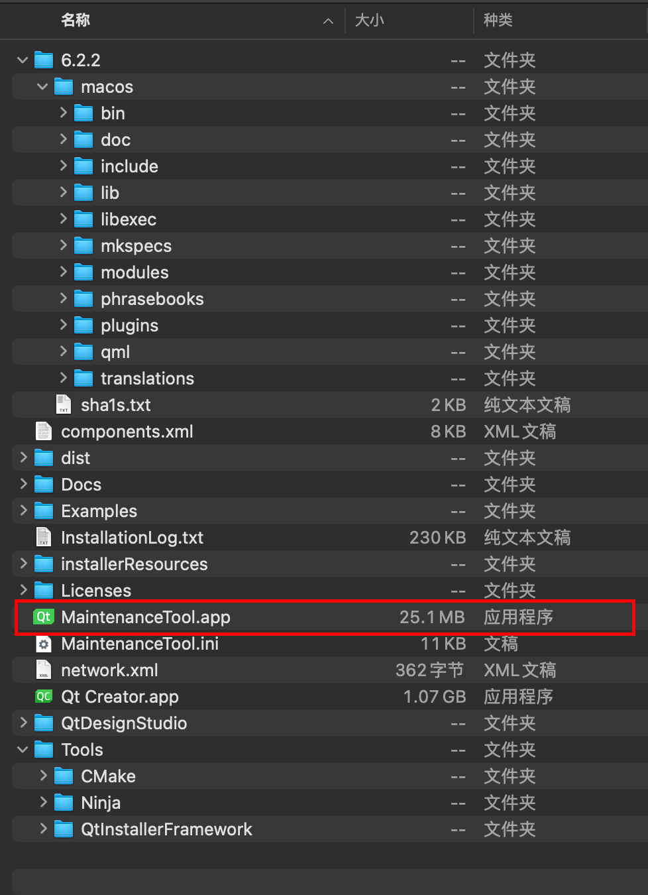
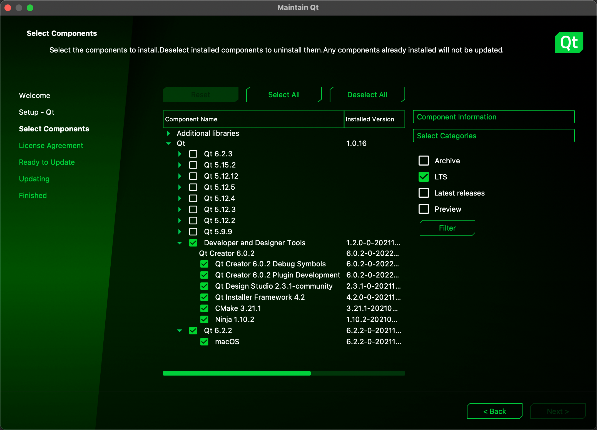
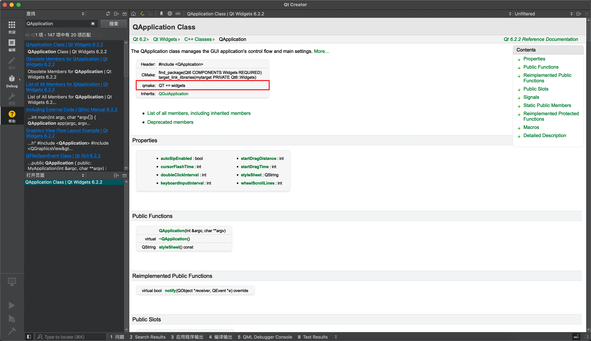
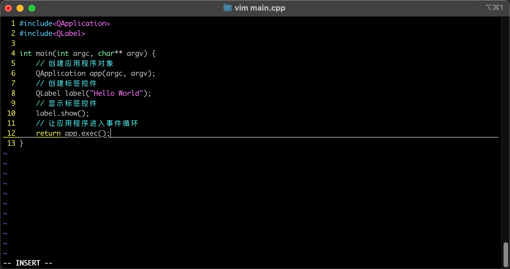
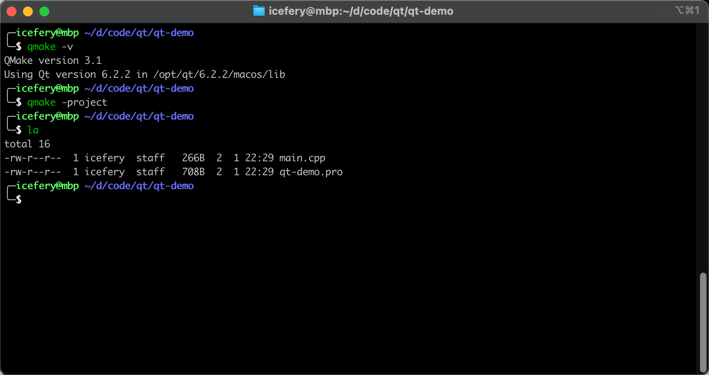
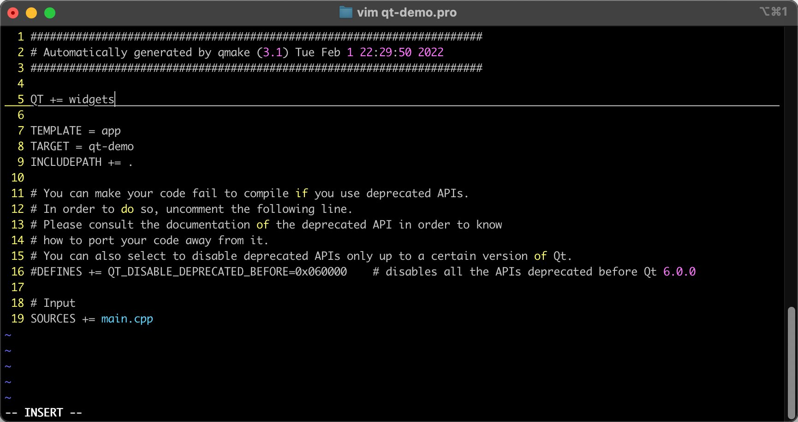
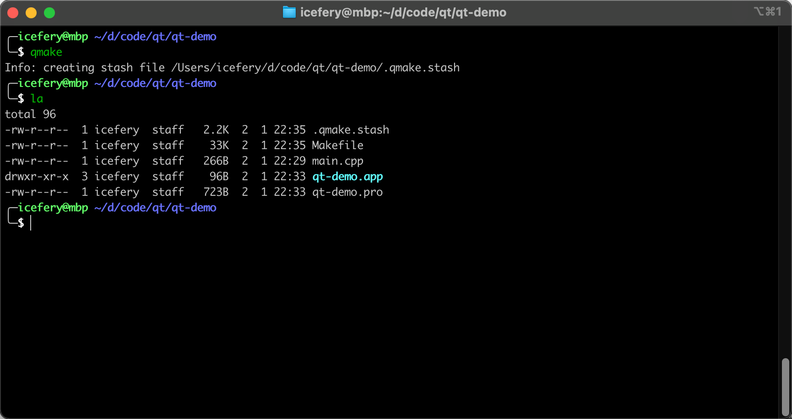
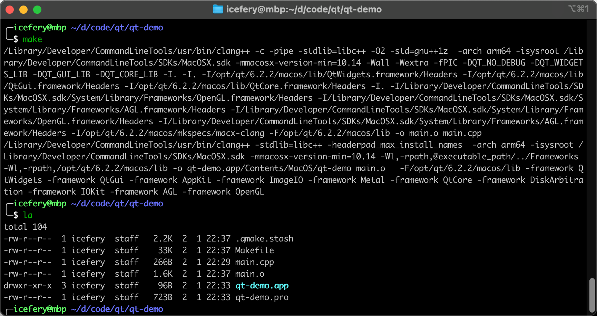
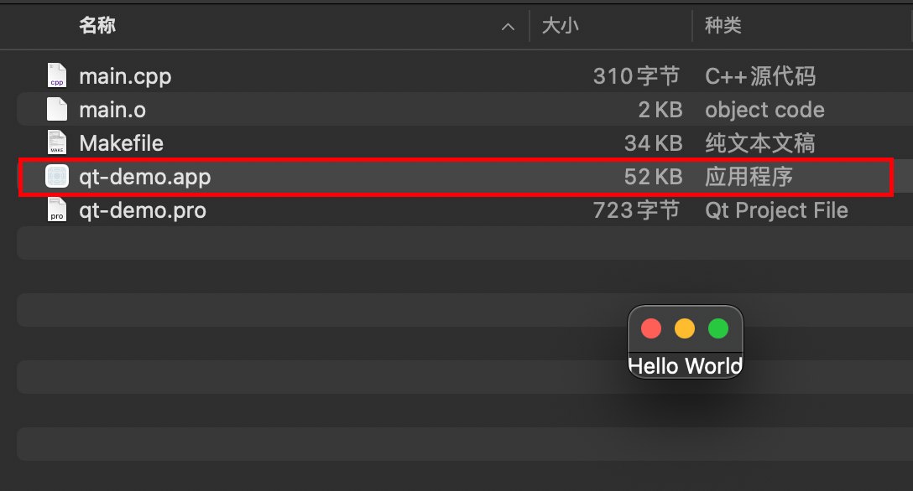

## 一、安装相关

### 1.1 在线安装

- https://www.qt.io/download-qt-installer

### 1.2 升级维护





### 1.3 文档



## 二、命令行编译运行

### 2.1 环境变量

将 Qt 库的 `bin` 目录加入 `PATH` 环境变量：

```bash
export PATH=$PATH:/opt/qt/6.2.2/macos/bin
```

### 2.2 示例

1. 手动创建项目目录

   ```bash
   mkdir -p qt-demo
   ```

2. `main.cpp`

   

3. QMake 生成 `.pro` 文件

   ```bash
   qmake -project
   ```

   

4. 手动添加构建选项

   ```bash
   QT += widgets
   ```

   

5. 生成 `Makefile`

   ```bash
   qmake
   ```

   

6. 编译链接

   ```bash
   make
   ```

   

7. 运行

   
