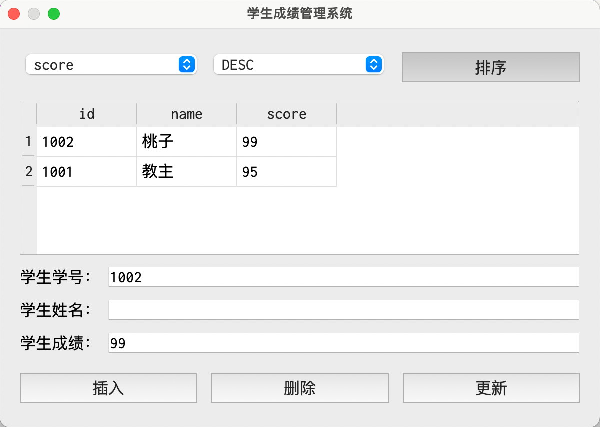

### 案例——学习成绩管理系统

-   `student-management.pro`

    ```bash
    QT       += core gui sql

    greaterThan(QT_MAJOR_VERSION, 4): QT += widgets

    CONFIG += c++11

    SOURCES += \
        main.cpp \
        dialog.cpp

    HEADERS += \
        dialog.h

    FORMS += \
        dialog.ui
    ```

-   `dialog.ui`

    ```xml
    <?xml version="1.0" encoding="UTF-8"?>
    <ui version="4.0">
     <class>Dialog</class>
     <widget class="QDialog" name="Dialog">
      <property name="geometry">
       <rect>
        <x>0</x>
        <y>0</y>
        <width>600</width>
        <height>400</height>
       </rect>
      </property>
      <property name="font">
       <font>
        <family>Inconsolata</family>
        <pointsize>16</pointsize>
       </font>
      </property>
      <property name="windowTitle">
       <string>学生成绩管理系统</string>
      </property>
      <layout class="QVBoxLayout" name="verticalLayout">
       <item>
        <layout class="QHBoxLayout" name="horizontalLayout">
         <item>
          <widget class="QComboBox" name="sortColumnComboBox">
           <item>
            <property name="text">
             <string>id</string>
            </property>
           </item>
           <item>
            <property name="text">
             <string>score</string>
            </property>
           </item>
          </widget>
         </item>
         <item>
          <widget class="QComboBox" name="sortTypeComboBox">
           <item>
            <property name="text">
             <string>ASC</string>
            </property>
           </item>
           <item>
            <property name="text">
             <string>DESC</string>
            </property>
           </item>
          </widget>
         </item>
         <item>
          <widget class="QPushButton" name="sortButton">
           <property name="text">
            <string>排序</string>
           </property>
          </widget>
         </item>
        </layout>
       </item>
       <item>
        <widget class="QTableView" name="tableView"/>
       </item>
       <item>
        <layout class="QGridLayout" name="gridLayout">
         <item row="0" column="0">
          <widget class="QLabel" name="idLabel">
           <property name="text">
            <string>学生学号：</string>
           </property>
          </widget>
         </item>
         <item row="0" column="1">
          <widget class="QLineEdit" name="idEdit"/>
         </item>
         <item row="1" column="0">
          <widget class="QLabel" name="nameLabel">
           <property name="text">
            <string>学生姓名：</string>
           </property>
          </widget>
         </item>
         <item row="1" column="1">
          <widget class="QLineEdit" name="nameEdit"/>
         </item>
         <item row="2" column="0">
          <widget class="QLabel" name="scoreLabel">
           <property name="text">
            <string>学生成绩：</string>
           </property>
          </widget>
         </item>
         <item row="2" column="1">
          <widget class="QLineEdit" name="scoreEdit"/>
         </item>
        </layout>
       </item>
       <item>
        <layout class="QHBoxLayout" name="horizontalLayout_2">
         <item>
          <widget class="QPushButton" name="insertButton">
           <property name="text">
            <string>插入</string>
           </property>
          </widget>
         </item>
         <item>
          <widget class="QPushButton" name="deleteButton">
           <property name="text">
            <string>删除</string>
           </property>
          </widget>
         </item>
         <item>
          <widget class="QPushButton" name="updateButton">
           <property name="font">
            <font>
             <family>Inconsolata</family>
             <pointsize>16</pointsize>
            </font>
           </property>
           <property name="text">
            <string>更新</string>
           </property>
          </widget>
         </item>
        </layout>
       </item>
      </layout>
     </widget>
     <resources/>
     <connections/>
    </ui>
    ```

-   `dialog.h`

    ```cpp
    #ifndef DIALOG_H
    #define DIALOG_H

    #include <QDialog>
    #include <QSqlDatabase>
    #include <QSqlQuery>
    #include <QSqlQueryModel>
    #include <QSqlError>
    #include <QMessageBox>

    QT_BEGIN_NAMESPACE
    namespace Ui { class Dialog; }
    QT_END_NAMESPACE

    class Dialog : public QDialog {
    Q_OBJECT
    public:
        Dialog(QWidget* parent = nullptr);
        ~Dialog();
    private slots:
        void on_insertButton_clicked();
        void on_deleteButton_clicked();
        void on_updateButton_clicked();
        void on_sortButton_clicked();
    private:
        void createDB();
        void createTable();
        void queryTable();
    private:
        Ui::Dialog* ui;
        QSqlDatabase db;
    };

    #endif // DIALOG_H
    ```

-   `dialog.cpp`

    ```cpp
    #include "dialog.h"
    #include "ui_dialog.h"

    Dialog::Dialog(QWidget* parent) : QDialog(parent), ui(new Ui::Dialog) {
        ui->setupUi(this);
        createDB();
        createTable();
        queryTable();
    }

    Dialog::~Dialog() {
        delete ui;
    }

    void Dialog::on_insertButton_clicked() {
        int id = ui->idEdit->text().toInt();
        if (id == 0) {
            QMessageBox::critical(this, "Error", "学号输入错误");
            return;
        }
        QString name = ui->nameEdit->text();
        if (name == "") {
            QMessageBox::critical(this, "Error", "姓名输入错误");
            return;
        }
        double score = ui->scoreEdit->text().toDouble();
        if (score < 0 || score > 100) {
            QMessageBox::critical(this, "Error", "成绩输入错误");
            return;
        }
        QString sql = QString("INSERT INTO student(id, name, score) VALUES(%1, '%2', %3)").arg(id).arg(name).arg(score);
        QSqlQuery query(db);
        if (!query.exec(sql)) {
            qDebug() << sql << query.lastError();
        } else {
            qDebug() << "插入数据成功";
            queryTable();
        }
    }

    void Dialog::on_deleteButton_clicked() {
        int id = ui->idEdit->text().toInt();
        QString sql = "DELETE FROM student WHERE id = :id";
        QSqlQuery query(db);
        query.prepare(sql);
        query.bindValue(":id", id);
        if (!query.exec()) {
            qDebug() << sql << query.lastError();
        } else {
            qDebug() << "删除数据成功";
            queryTable();
        }
    }

    void Dialog::on_updateButton_clicked() {
        int id = ui->idEdit->text().toInt();
        if (id == 0) {
            QMessageBox::critical(this, "Error", "学号输入错误");
            return;
        }
        double score = ui->scoreEdit->text().toDouble();
        if (score < 0 || score > 100) {
            QMessageBox::critical(this, "Error", "成绩输入错误");
            return;
        }
        QString sql = "UPDATE student SET score = :score WHERE id = :id";
        QSqlQuery query(db);
        query.prepare(sql);
        query.bindValue(":id", id);
        query.bindValue(":score", score);
        if (!query.exec()) {
            qDebug() << sql << query.lastError();
        } else {
            qDebug() << "更新数据成功";
            queryTable();
        }
    }

    void Dialog::on_sortButton_clicked() {
        QString sortColumn = ui->sortColumnComboBox->currentText();
        QString sortType = ui->sortTypeComboBox->currentText();
        QString sql = QString("SELECT * FROM student ORDER BY %1 %2").arg(sortColumn).arg(sortType);
        QSqlQueryModel* model = new QSqlQueryModel();
        model->setQuery(sql, db);
        ui->tableView->setModel(model);
    }

    void Dialog::createDB() {
        // 添加数据库驱动
        db = QSqlDatabase::addDatabase("QSQLITE");
        // 设置库名(文件名)
        db.setDatabaseName("student.db");
        // 打开数据库
        if (!db.open()) {
            qDebug() << "创建/打开数据库失败";
        } else {
            qDebug() << "创建/打开数据库成功";
        }
    }

    void Dialog::createTable() {
        QString sql = QString(
            "CREATE TABLE student ("
            "id    INT NOT NULL PRIMARY KEY,"
            "name  TEXT NOT NULL,"
            "score REAL NOT NULL"
            ")"
        );
        QSqlQuery query(db);
        if (!query.exec(sql)) {
            qDebug() << sql << query.lastError();
        } else {
            qDebug() << "建表成功";
        }
    }

    void Dialog::queryTable() {
        QString sql = "SELECT * FROM student";
        QSqlQueryModel* model = new QSqlQueryModel();
        model->setQuery(sql, db);
        ui->tableView->setModel(model);
    }
    ```

    #### 效果


