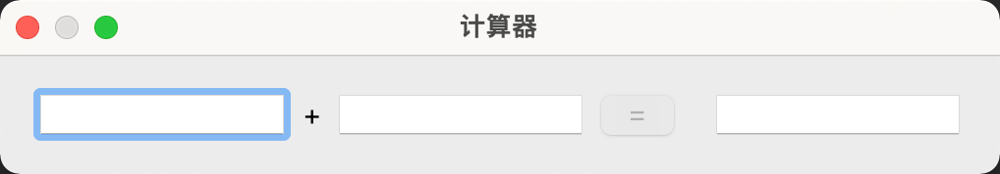
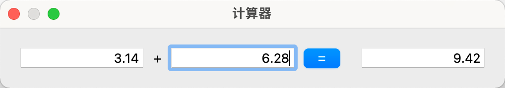
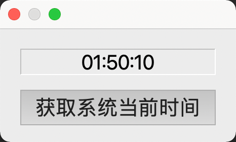

## 一、父窗口

### 1.1 介绍

创建控件时，可以指定停靠在某个父窗口上面，这时控件将作为子窗口被束缚在其父窗口的内部，并伴随父窗口一起移动、隐藏、显示和关闭，否则该控件将作为独立窗口显示在屏幕上，且游离于其它窗口之外。

`QWidgets` 及其子类的对象都可以作为其它控件的父窗口，常见的父窗口类有如下三个：

- `QWidgets`
- `QMainWindow`：`QWidgets` 的直接子类
- `QDialog`：`QWidgets` 的直接子类

### 1.2 析构函数

父窗口的析构函数会自动销毁其所有子窗口对象，因此即使子窗口对象是通过 `new` 操作符动态创建的，也可以不显式的执行 `delete` 操作，而且不用担心内存泄漏的问题，只要保证父窗口对象被正确销毁 u，其子窗口也将随之被销毁。

### 1.3 设置窗口的位置和大小

```cpp
void move(int x, int y);
void resize(int w, int h);
```

## 二、信号和槽

### 2.1 介绍

- 信号和槽是 QT 自行定义的一种通信机制，实现对象之间的数据交互。
- 当用户或系统触发了一个动作，导致某个控件的状态发送了改变，该控件就会发射一个信号，即调用其类中一个特定的成员函数（信号），同时还可能携带有必要的参数。
- 槽和普通的成员函数几乎没有太多区别，可以是公有的、保护的或私有的，可以被重载，也可以被覆盖，其参数可以是任意类型，并可以像普通成员函数一样调用。
- 槽函数与普通成员函数的差别不在于其语法特性，而在于其功能。槽函数更多体现为对某种特定信号的处理，可以将槽和其它对象信号建立连接，这样当发射信号时，槽函数将被触发和执行，进而来完成具体功能。

### 2.2 信号和槽的连接

#### 函数签名

```cpp
QObject:connect(
  const QObject* sender,
  const char* signal,
  const QObject* receiver,
  const char* method
);
```

- `sender`：信号发送对象指针
- `signal`：要发送的信号函数，可以使用 `SIGNAL()` 宏进行类型转换
- `receiver`：信号的接收对象指针
- `method`：接收信号后要执行的槽函数，可以使用 `SLOT()` 宏进行类型转换

#### 应用

- 一个信号可以被连接到多个槽（一对多）
- 多个信号也可以连接同一个槽（多对一）
- 两个信号可以直接连接（信号级联）

### 2.3 案例

#### 点击按钮关闭标签、退出程序

```cpp
#include<QApplication>
#include<QDialog>
#include<QLabel>
#include<QPushButton>

int main(int argc, char* argv[]) {
    QApplication app(argc, argv);

    QDialog parent;
    parent.resize(320, 240);

    QLabel label("标签", &parent);
    label.move(50, 50);

    QPushButton button1("关闭标签", &parent);
    button1.move(50, 140);

    QPushButton button2("退出程序", &parent);
    button1.move(200, 140);

    parent.show();

    QObject::connect(
        &button1,
        SIGNAL(clicked()),
        &label,
        SLOT(close())
    );

    QObject::connect(
        &button2,
        SIGNAL(clicked()),
        &app,
        SLOT(quit())
    );
    return app.exec();
}
```

#### 滑块联动选值框

```cpp
#include<QApplication>
#include<QDialog>
#include<QSlider>
#include<QSpinBox>

int main(int argc, char ** argv) {
    QApplication app(argc, argv);

    QDialog parent;
    parent.resize(320, 240);

    // 创建水平滑块
    QSlider slider(Qt::Horizontal, &parent);
    slider.move(20,100);
    slider.setRange(0,200);

    // 创建选值框
    QSpinBox spinBox(&parent);
    spinBox.move(220,100);
    spinBox.setRange(0,200);

    // 滑块滑动让选值随值改变
    QObject::connect(
        &slider,
        SIGNAL(valueChanged(int)),
        &spinBox,
        SLOT(setValue(int))
    );

    // 选值框数值改变让滑块随之滑动
    QObject::connect(
        &spinBox,
        SIGNAL(valueChanged(int)),
        &slider,
        SLOT(setValue(int))
    );

    parent.show();

    return app.exec();
}
```

### 2.4 信号和槽连接的语法要求

- 信号和槽参数要一致

  ```cpp
  QObject::connect(A, SIGNAL(sigfun(int)), B, SLOT(slotfun(int))); // OK

  QObject::connect(A, SIGNAL(sigfun(int)), B, SLOT(slotfun(int, int))); // ERROR
  ```

- 可以带有缺省参数

  ```cpp
  QObject::connect(A, SIGNAL(sigfun(int)), B, SLOT(slotfun(int, int=0))); // OK
  ```

- 信号函数的参数可以多于槽函数，多于参数将被忽略

  ```cpp
  QObject::connect(A, SIGNAL(sigfun(int, int)), B, SLOT(slotfun(int))); // OK
  ```

## 三、面向对象 QT 编程

### 3.1 介绍

- 完全不使用任何面向对象技术，而只是利用 QT 所提供的类创建对象，并调用对象的接口以满足用户的需要是可能，但这样构建的应用程序其功能必然是十分有限的。
- 首先，Qt 类保护成员中的诸多实现无法在类的外部被复用，Qt 试图通多态实现的很多机制，如事件处理，完全无法使用。
- 再次，Qt 提供的信号和槽不可能满足用户所有的需求，自定义信号和槽需要面向对象技术。
- 最后，Qt 设计师、Qt 创建器等工具链都以面向对象的方式使用 Qt，反其道而行之不会有好结果。

### 3.2 案例

#### 3.2.1 加法计算器

##### `CalculatorDialog`

- `calculator_dialog.h`

  ```cpp
  #ifndef CALCULATOR_DIALOG_H

  #include<QDialog>
  #include<QLabel>
  #include<QPushButton>
  #include<QLineEdit>        // 行编辑控件
  #include<QHBoxLayout>      // 水平布局器
  #include<QDoubleValidator> // 验证器

  class CalculatorDialog : public QDialog {
  Q_OBJECT // moc

  public:
      // 构造函数
      CalculatorDialog();

  public slots:
      // 启用等号按钮
      void enableButton();
      // 计算和显示结果
      void calc();

  private:
      QLineEdit* m_editX;    // 左操作数
      QLineEdit* m_editY;    // 右操作数
      QLineEdit* m_editZ;    // 显示结果
      QLabel* m_label;       // "+"
      QPushButton* m_button; // "="
  };

  #endif // CALCULATOR_DIALOG_H
  ```

- `calculator_dialog.cpp`

  ```cpp
  #include "calculator_dialog.h"

  // 构造函数
  CalculatorDialog::CalculatorDialog() {
      // 1. 界面初始化
      setWindowTitle("计算器");
      // 左操作数
      m_editX = new QLineEdit(this);
      m_editX->setAlignment(Qt::AlignRight);               // 设置文本对齐
      m_editX->setValidator(new QDoubleValidator(this)); // 设置数字验证器
      // 右操作数
      m_editY = new QLineEdit(this);
      m_editY->setAlignment(Qt::AlignRight);
      m_editY->setValidator(new QDoubleValidator(this));
      // 显示结果
      m_editZ = new QLineEdit(this);
      m_editZ->setAlignment(Qt::AlignRight);
      m_editZ->setReadOnly(true); // 设置只读
      // "+"
      m_label = new QLabel("+", this);
      // "="
      m_button = new QPushButton("=", this);
      m_button->setEnabled(false); // 设置禁用
      // 创建布局器(自动调整每个控件的大小和位置)(按水平方向以此将控件添加到布局容器中)
      QHBoxLayout* layout = new QHBoxLayout(this);
      layout->addWidget(m_editX);
      layout->addWidget(m_label);
      layout->addWidget(m_editY);
      layout->addWidget(m_button);
      layout->addWidget(m_editZ);
      setLayout(layout);

      // 2. 信号和槽函数连接
      // 左右操作数文本改变时发送信号 textChanged()
      connect(m_editX, SIGNAL(textChanged(QString)), this, SLOT(enableButton()));
      connect(m_editY, SIGNAL(textChanged(QString)), this, SLOT(enableButton()));
      // 点击按钮发送信号 clicked()
      connect(m_button, SIGNAL(clicked()), this, SLOT(calc()));
  }

  // 启用等号按钮
  void CalculatorDialog::enableButton() {
      bool xOk;
      bool yOk;
      m_editX->text().toDouble(&xOk);
      m_editY->text().toDouble(&yOk);
      // 当左右操作数都输入了有效数据，则使能等号按钮
      m_button->setEnabled(xOk && yOk);
  }

  // 计算和显示结果
  void CalculatorDialog::calc() {
      double result = m_editX->text().toDouble() + m_editY->text().toDouble();
      // 显示字符串形式结果
      QString str = QString::number(result);
      m_editZ->setText(str);
  }
  ```

##### `main.cpp`

```cpp
#include<QApplication>

#include "calculator_dialog.h"

int main(int argc, char** argv) {
    QApplication app(argc, argv);

    CalculatorDialog dialog;
    dialog.show();

    return QApplication::exec();
}
```

##### 效果




#### 3.2.2 获取系统当前时间

##### `TimeDialog`

- `time_dialog.h`

  ```cpp
  #ifndef TIME_DIALOG_H
  #define TIME_DIALOG_H

  #include <QDialog>
  #include <QLabel>
  #include <QPushButton>
  #include <QVBoxLayout> // 垂直布局器
  #include <QTime>       // 时间

  class TimeDialog : public QDialog {
  Q_OBJECT // moc

  public:
      TimeDialog();

  public slots:
      void getTime();

  signals:
      // 自定义信号(只需申明不能定义)
      void mySignal(const QString&);
  private:
      QLabel* m_label;
      QPushButton* m_button;
  };

  #endif // TIME_DIALOG_H
  ```

- `time_dialog.cpp`

  ```cpp
  #include <QFont>

  #include "time_dialog.h"

  TimeDialog::TimeDialog() {
      // 1. 初始化界面
      // 字体
      QFont font;
      font.setPointSize(20);
      // 标签
      m_label = new QLabel(this);
      m_label->setFrameStyle(QFrame::Panel | QFrame::Sunken);     // 设置边框
      m_label->setAlignment(Qt::AlignHCenter | Qt::AlignVCenter); // 设置文本对齐
      m_label->setFont(font);                                     // 设置字体
      // 按钮
      m_button = new QPushButton("获取系统当前时间", this);
      m_button->setFont(font);
      // 垂直布局器
      QVBoxLayout* layout = new QVBoxLayout(this);
      layout->addWidget(m_label);
      layout->addWidget(m_button);
      setLayout(layout);

      // 2. 信号和槽函数
      connect(m_button, SIGNAL(clicked()), this, SLOT(getTime()));
      // 通过自定义信号触发 Label 的 setText() 槽函数执行
      connect(this, SIGNAL(mySignal(const QString &)), m_label, SLOT(setText(QString)));
  }

  void TimeDialog::getTime() {
      qDebug("getTime()");
      qDebug() << "getTime()";
      // 获取当前系统时间
      QTime time = QTime::currentTime();
      // 将时间对象转换为字符串
      QString str = time.toString("hh:mm:ss");
      // 发射信号(emit 是 Qt 关键字，标记当前是发射信号)
      emit mySignal(str);
  }
  ```

##### `main.cpp`

```cpp
#include <QApplication>

#include "time_dialog.h"

int main(int argc, char* argv[]) {
    QApplication app(argc, argv);
    TimeDialog time;
    time.show();
    return QApplication::exec();
}
```

##### 效果


