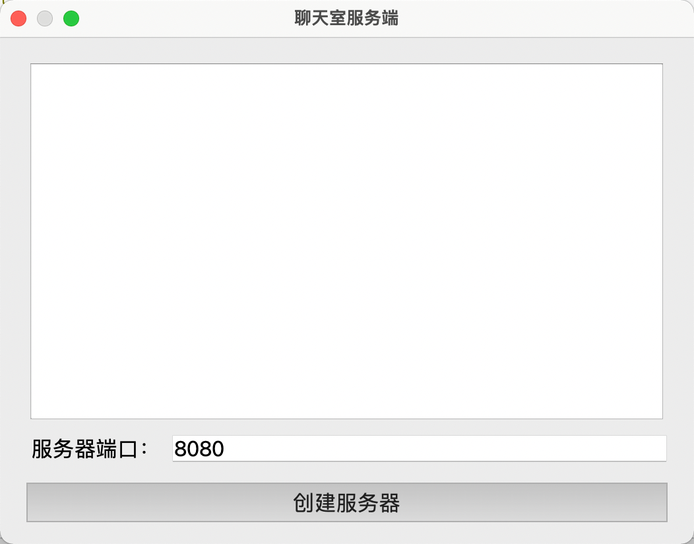
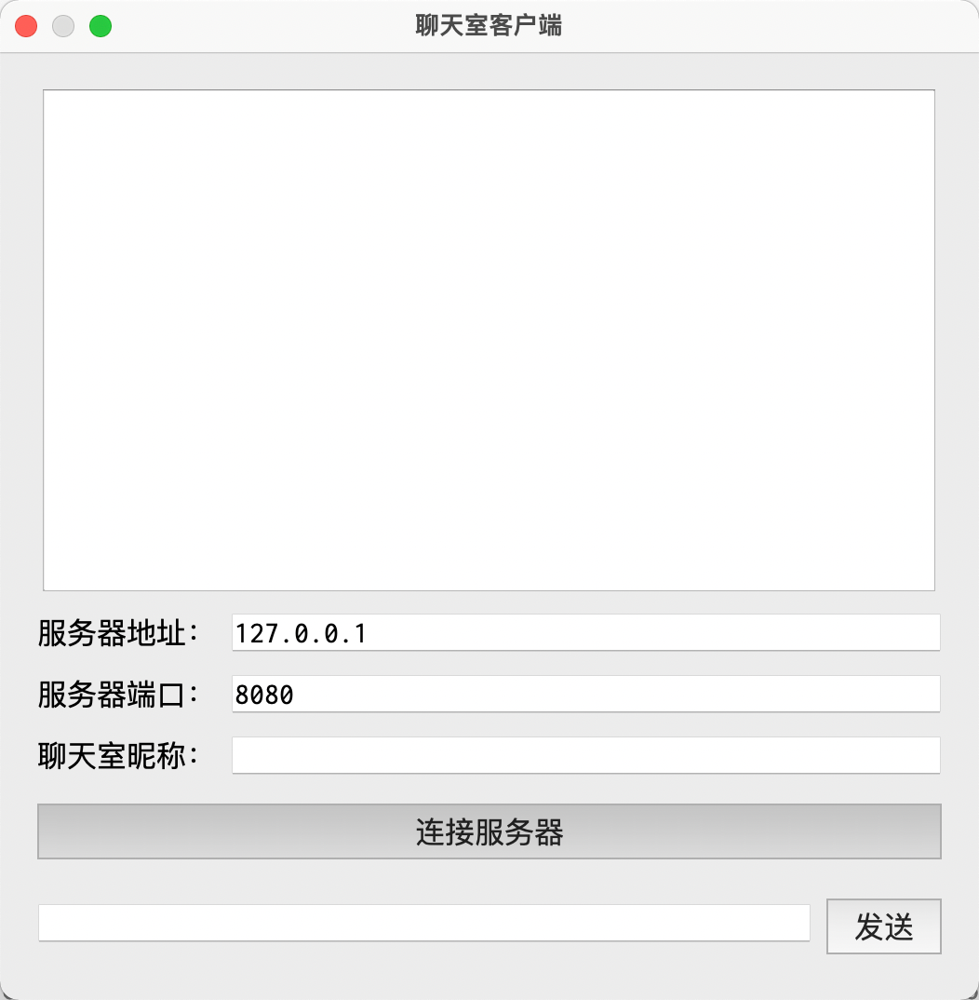
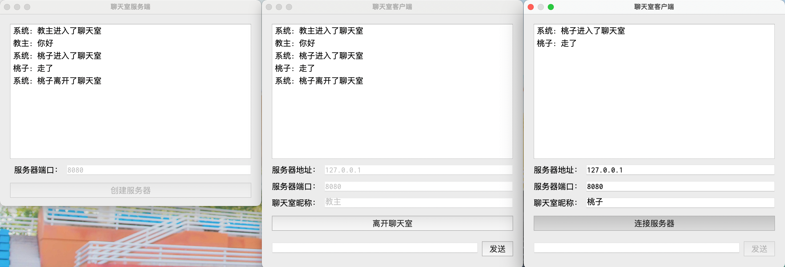

### 案例——网络聊天室

#### 服务端

- `chat-room-server.pro`

  ```bash
  QT       += core gui network

  greaterThan(QT_MAJOR_VERSION, 4): QT += widgets

  CONFIG += c++11

  SOURCES += \
      main.cpp \
      dialog.cpp

  HEADERS += \
      dialog.h

  FORMS += \
      dialog.ui
  ```

- `dialog.ui`

  ```xml
  <?xml version="1.0" encoding="UTF-8"?>
  <ui version="4.0">
   <class>Dialog</class>
   <widget class="QDialog" name="Dialog">
    <property name="geometry">
     <rect>
      <x>0</x>
      <y>0</y>
      <width>526</width>
      <height>372</height>
     </rect>
    </property>
    <property name="font">
     <font>
      <family>Inconsolata</family>
      <pointsize>16</pointsize>
     </font>
    </property>
    <property name="windowTitle">
     <string>聊天室服务端</string>
    </property>
    <layout class="QVBoxLayout" name="verticalLayout">
     <item>
      <layout class="QHBoxLayout" name="horizontalLayout">
       <item>
        <spacer name="horizontalSpacer">
         <property name="orientation">
          <enum>Qt::Horizontal</enum>
         </property>
         <property name="sizeHint" stdset="0">
          <size>
           <width>40</width>
           <height>20</height>
          </size>
         </property>
        </spacer>
       </item>
       <item>
        <widget class="QListWidget" name="listWidget">
         <property name="minimumSize">
          <size>
           <width>480</width>
           <height>270</height>
          </size>
         </property>
         <property name="maximumSize">
          <size>
           <width>480</width>
           <height>270</height>
          </size>
         </property>
        </widget>
       </item>
       <item>
        <spacer name="horizontalSpacer_2">
         <property name="orientation">
          <enum>Qt::Horizontal</enum>
         </property>
         <property name="sizeHint" stdset="0">
          <size>
           <width>40</width>
           <height>20</height>
          </size>
         </property>
        </spacer>
       </item>
      </layout>
     </item>
     <item>
      <layout class="QGridLayout" name="gridLayout">
       <item row="0" column="0">
        <widget class="QLabel" name="portLabel">
         <property name="text">
          <string> 服务器端口：</string>
         </property>
        </widget>
       </item>
       <item row="0" column="1">
        <widget class="QLineEdit" name="portEdit">
         <property name="text">
          <string>8080</string>
         </property>
        </widget>
       </item>
      </layout>
     </item>
     <item>
      <widget class="QPushButton" name="createButton">
       <property name="text">
        <string>创建服务器</string>
       </property>
      </widget>
     </item>
    </layout>
   </widget>
   <resources/>
   <connections/>
  </ui>
  ```

  

- `dialog.h`

  ```cpp
  #ifndef DIALOG_H
  #define DIALOG_H

  #include <QDialog>
  #include <QTcpServer>
  #include <QTcpSocket>
  #include <QTimer>

  QT_BEGIN_NAMESPACE
  namespace Ui { class Dialog; }
  QT_END_NAMESPACE

  class Dialog : public QDialog {
  Q_OBJECT
  public:
      Dialog(QWidget* parent = nullptr);
      ~Dialog();
  private slots:
      // 创建服务器按钮点击槽函数
      void on_createButton_clicked();
      // 响应客户端连接请求槽函数
      void onNewConnection();
      // 接收欧客户端消息槽函数
      void onReadyRead();
      // 通信断开检查槽函数
      void onTimeout();
  private:
      // 转发聊天消息到其它客户端
      void sendMessage(const QByteArray& buf);
  private:
      Ui::Dialog* ui;
      QTcpServer tcpServer;
      quint16 port;
      QList<QTcpSocket*> tcpClientList;
      QTimer timer;
  };

  #endif // DIALOG_H
  ```

- `dialog.cpp`

  ```cpp
  #include "dialog.h"
  #include "ui_dialog.h"

  Dialog::Dialog(QWidget* parent) : QDialog(parent), ui(new Ui::Dialog) {
      ui->setupUi(this);
      connect(&tcpServer, SIGNAL(newConnection()), this, SLOT(onNewConnection()));
      connect(&timer, SIGNAL(timeout()), SLOT(onTimeout()));
  }

  Dialog::~Dialog() {
      delete ui;
  }

  // 创建服务器按钮点击槽函数
  void Dialog::on_createButton_clicked() {
      port = ui->portEdit->text().toShort();
      if (tcpServer.listen(QHostAddress::Any, port)) {
          qDebug() << "创建服务器成功";
          ui->createButton->setEnabled(false);
          ui->portEdit->setEnabled(false);
          // 开启定时器
          timer.start(3000);
      } else {
          qDebug() << "创建服务器失败";
      }
  }

  // 响应客户端连接请求槽函数
  void Dialog::onNewConnection() {
      // 后去和客户端通信的套接字
      QTcpSocket* tcpSocket = tcpServer.nextPendingConnection();
      // 保存套接字到容器
      tcpClientList.append(tcpSocket);
      // 当客户端向服务器发送消息时通信套接字发送 readyRead() 信号
      connect(tcpSocket, SIGNAL(readyRead()), this, SLOT(onReadyRead()));

  }

  // 接收欧客户端消息槽函数
  void Dialog::onReadyRead() {
      // 遍历容器获取哪个客户端给服务器发送了消息
      for (int i = 0; i < tcpClientList.size(); i++) {
          // 返回 0 表示没有消息
          if (tcpClientList.at(i)->bytesAvailable() != 0) {
              // 读取消息
              QByteArray buf = tcpClientList.at(i)->readAll();
              // 显示消息
              ui->listWidget->addItem(buf);
              ui->listWidget->scrollToBottom();
              // 转发消息给所有在线客户端
              sendMessage(buf);
          }
      }
  }

  // 通信断开检查槽函数
  void Dialog::onTimeout() {
      // 遍历检查容器中保存的通信套接字是否已经断开连接，如果是则删除
      for (int i = 0; i < tcpClientList.size(); i++) {
          if (tcpClientList.at(i)->state() == QAbstractSocket::UnconnectedState) {
              tcpClientList.removeAt(i);
              i--;
          }
      }
  }

  // 转发聊天消息到其它客户端
  void Dialog::sendMessage(const QByteArray& buf) {
      for (int i = 0; i < tcpClientList.size(); i++) {
          tcpClientList.at(i)->write(buf);
      }
  }
  ```

#### 客户端

- `dialog.ui`

  ```xml
  <?xml version="1.0" encoding="UTF-8"?>
  <ui version="4.0">
   <class>Dialog</class>
   <widget class="QDialog" name="Dialog">
    <property name="geometry">
     <rect>
      <x>0</x>
      <y>0</y>
      <width>526</width>
      <height>491</height>
     </rect>
    </property>
    <property name="font">
     <font>
      <family>Inconsolata</family>
      <pointsize>16</pointsize>
     </font>
    </property>
    <property name="windowTitle">
     <string>聊天室客户端</string>
    </property>
    <layout class="QVBoxLayout" name="verticalLayout">
     <item>
      <layout class="QHBoxLayout" name="horizontalLayout">
       <item>
        <spacer name="horizontalSpacer">
         <property name="orientation">
          <enum>Qt::Horizontal</enum>
         </property>
         <property name="sizeHint" stdset="0">
          <size>
           <width>40</width>
           <height>20</height>
          </size>
         </property>
        </spacer>
       </item>
       <item>
        <widget class="QListWidget" name="listWidget">
         <property name="minimumSize">
          <size>
           <width>480</width>
           <height>270</height>
          </size>
         </property>
         <property name="maximumSize">
          <size>
           <width>480</width>
           <height>270</height>
          </size>
         </property>
        </widget>
       </item>
       <item>
        <spacer name="horizontalSpacer_2">
         <property name="orientation">
          <enum>Qt::Horizontal</enum>
         </property>
         <property name="sizeHint" stdset="0">
          <size>
           <width>40</width>
           <height>20</height>
          </size>
         </property>
        </spacer>
       </item>
      </layout>
     </item>
     <item>
      <layout class="QGridLayout" name="gridLayout">
       <item row="0" column="1">
        <widget class="QLineEdit" name="hostEdit">
         <property name="text">
          <string>127.0.0.1</string>
         </property>
        </widget>
       </item>
       <item row="2" column="1">
        <widget class="QLineEdit" name="nicknameEdit">
         <property name="text">
          <string/>
         </property>
        </widget>
       </item>
       <item row="2" column="0">
        <widget class="QLabel" name="nicknameLabel">
         <property name="text">
          <string>聊天室昵称：</string>
         </property>
        </widget>
       </item>
       <item row="0" column="0">
        <widget class="QLabel" name="hostLabel">
         <property name="text">
          <string>服务器地址：</string>
         </property>
        </widget>
       </item>
       <item row="1" column="0">
        <widget class="QLabel" name="portLabel">
         <property name="text">
          <string>服务器端口：</string>
         </property>
        </widget>
       </item>
       <item row="1" column="1">
        <widget class="QLineEdit" name="portEdit">
         <property name="text">
          <string>8080</string>
         </property>
        </widget>
       </item>
      </layout>
     </item>
     <item>
      <widget class="QPushButton" name="connectButton">
       <property name="text">
        <string>连接服务器</string>
       </property>
      </widget>
     </item>
     <item>
      <layout class="QHBoxLayout" name="horizontalLayout_2">
       <item>
        <widget class="QLineEdit" name="messageEdit"/>
       </item>
       <item>
        <widget class="QPushButton" name="sendButton">
         <property name="enabled">
          <bool>false</bool>
         </property>
         <property name="text">
          <string>发送</string>
         </property>
        </widget>
       </item>
      </layout>
     </item>
    </layout>
   </widget>
   <resources/>
   <connections/>
  </ui>
  ```

  

- `dialog.h`

  ```cpp
  #ifndef DIALOG_H
  #define DIALOG_H

  #include <QDialog>
  #include <QTcpSocket>
  #include <QHostAddress>
  #include <QMessageBox>

  QT_BEGIN_NAMESPACE
  namespace Ui { class Dialog; }
  QT_END_NAMESPACE

  class Dialog : public QDialog {
  Q_OBJECT
  public:
      Dialog(QWidget* parent = nullptr);
      ~Dialog();
  private slots:
      void on_connectButton_clicked();
      void on_sendButton_clicked();
      void onConnected();
      void onDisconnected();
      void onReadyRead();
      // 网络异常槽函数
      void onErrorOccurred(QAbstractSocket::SocketError);
  private:
      Ui::Dialog* ui;
      bool alive;
      QTcpSocket tcpSocket;
      QHostAddress host;
      quint16 port;
      QString nickname;
  };

  #endif // DIALOG_H
  ```

- `dialog.cpp`

  ```cpp
  #include "dialog.h"
  #include "ui_dialog.h"

  Dialog::Dialog(QWidget* parent) : QDialog(parent), ui(new Ui::Dialog) {
      ui->setupUi(this);
      alive = false;
      connect(&tcpSocket, SIGNAL(connected()), this, SLOT(onConnected()));
      connect(&tcpSocket, SIGNAL(disconnected()), this, SLOT(onDisconnected()));
      connect(&tcpSocket, SIGNAL(readyRead()), this, SLOT(onReadyRead()));
      connect(&tcpSocket, SIGNAL(errorOccurred(QAbstractSocket::SocketError)), this, SLOT(onErrorOccurred(QAbstractSocket::SocketError)));
  }

  Dialog::~Dialog() {
      delete ui;
  }

  void Dialog::on_connectButton_clicked() {
      // 如果当前是离线状态，则建立和服务器的连接，否则端口和服务器的连接
      if (!alive) {
          host.setAddress(ui->hostEdit->text());
          port = ui->portEdit->text().toShort();
          nickname = ui->nicknameEdit->text();
          tcpSocket.connectToHost(host, port);
      } else {
          QString message = "系统: " + nickname + "离开了聊天室";
          tcpSocket.write(message.toUtf8());
          tcpSocket.disconnectFromHost();
      }
  }

  void Dialog::on_sendButton_clicked() {
      QString message = ui->messageEdit->text();
      if (message == "") {
          return;
      }
      message = nickname + ": " + message;
      tcpSocket.write(message.toUtf8());
      ui->messageEdit->clear();
  }

  void Dialog::onConnected() {
      alive = true;
      ui->sendButton->setEnabled(true);
      ui->hostEdit->setEnabled(false);
      ui->portEdit->setEnabled(false);
      ui->nicknameEdit->setEnabled(false);
      ui->connectButton->setText("离开聊天室");
      // 发送系统提示消息
      QString message = "系统: " + nickname + "进入了聊天室";
      tcpSocket.write(message.toUtf8());
  }

  void Dialog::onDisconnected() {
      alive = false;
      ui->sendButton->setEnabled(false);
      ui->hostEdit->setEnabled(true);
      ui->portEdit->setEnabled(true);
      ui->nicknameEdit->setEnabled(true);
      ui->connectButton->setText("连接服务器");
  }

  void Dialog::onReadyRead() {
      if (tcpSocket.bytesAvailable() != 0) {
          QByteArray buf = tcpSocket.readAll();
          ui->listWidget->addItem(buf);
          ui->listWidget->scrollToBottom();
      }
  }

  // 网络异常槽函数
  void Dialog::onErrorOccurred(QAbstractSocket::SocketError) {
      QMessageBox::critical(this, "Error", tcpSocket.errorString());
  }
  ```

#### 效果


