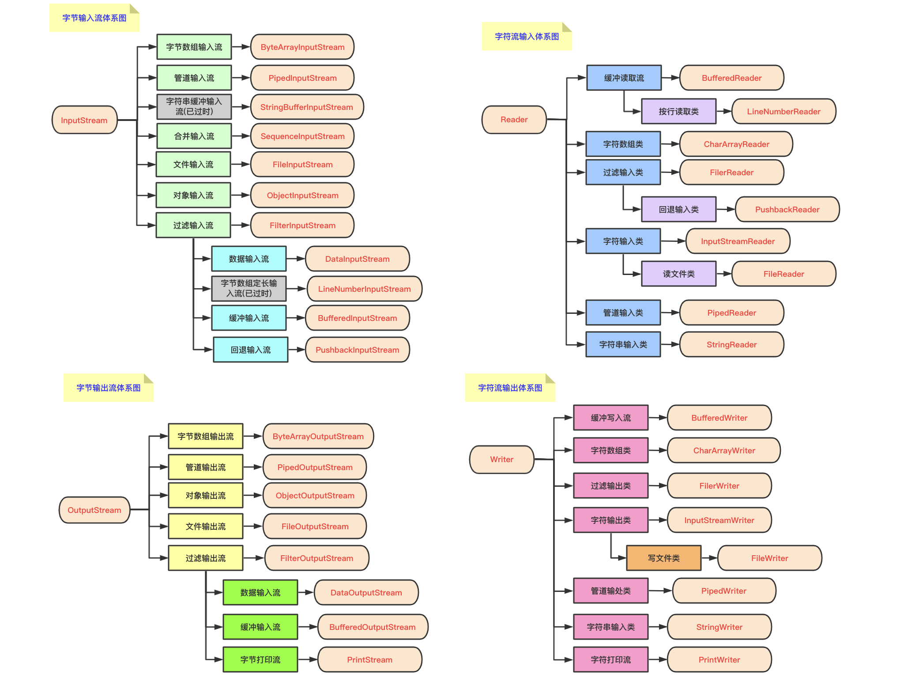

### Java IO 分类

> 

### 既然有了字节流，为什么还要有字符流

> 不管是文件读取还是网络发送接收，信息的最小存储单位都是字节，那为什么 IO 流操作要分为字节流操作和字符流操作呢？

> 字符流是由 Java 虚拟机将字节转换得到的，问题就出在这个过程还算是非常耗时，并且，如果我们不知道编码类型就很容易出现乱码问题。所以，IO 流就干脆提供了一个直接操作字符的接口，方便我们平时对字符进行流操作。如果是音频、图片等媒体文件用字节流比较好，如果涉及到字符的话使用字符流比较好。

### BIO、NIO、AIO 有什么区别

-   BIO（Blocking IO）

    > 同步阻塞 IO 模式，数据的读取写入必须阻塞在一个线程内等待其完成。在活动连接数不是特别高（小于单机 1000）的情况下，这种模型是比较不错的，可以让每一个连接专注于自己的 IO 并且编程模型简单，也不用多考虑系统的过载、限流等问题。线程池本身就是一个天然的漏斗，可以缓冲一些系统处理不了的连接或请求。但是当面对十万甚至百万级连接的时候，传统的 BIO 模型是无能为力的。因此，我们需要一种更高效的 IO 处理模型来应对更高的并发量。

-   NIO（Non-blocking IO）

    > NIO 是一种同步非阻塞的 IO 模型，在 Java 1.4 中引入来 NIO 框架，对应来 `java.nio` 包，提供了 `Channel`、`Selector`、`Buffer` 等抽象。它支持面向缓冲的，基于通道的 IO 操作方法。NIO 提供了与传统 BIO 模型中的 `Socket`和 `ServerSocket`相对应的 `SocketChannel` 和 `ServerSocketChannel` 两种不通过的套接字通道实现，两种通道都支持阻塞和非阻塞两种模式。阻塞模式使用就像传统中的支持一样，比较简单，但是性能和可靠性都不好；非阻塞模式正好与之相反。对于低负载、低并发的应用程序，可以使用同步阻塞 IO 来提升开发速率和更好的维护性；对于高负载、高并发（网络）应用，应使用 NIO 的非阻塞模式来开发。

-   AIO（Asynchronous IO）

    > AIO 也就是 NIO2。在 Java7 中引入来 NIO 的改进版 NIO2，它是异步非阻塞的 IO 模型。异步 IO 是基于事件和回调机制实现的，也就是应用操作之后会直接返回，不会阻塞在那里，当后台处理完成，操作系统会通知相应的线程进行后续的操作。对于 NIO 来说，我们的业务线程是在 IO 操作准备好时，得到通知，接着就由这个线程自行进行 IO 操作，IO 操作本身是同步的。

    > 目前 AIO 的应用还不是很广泛，Netty 之前也尝试使用过 AIO，不过又放弃了。
