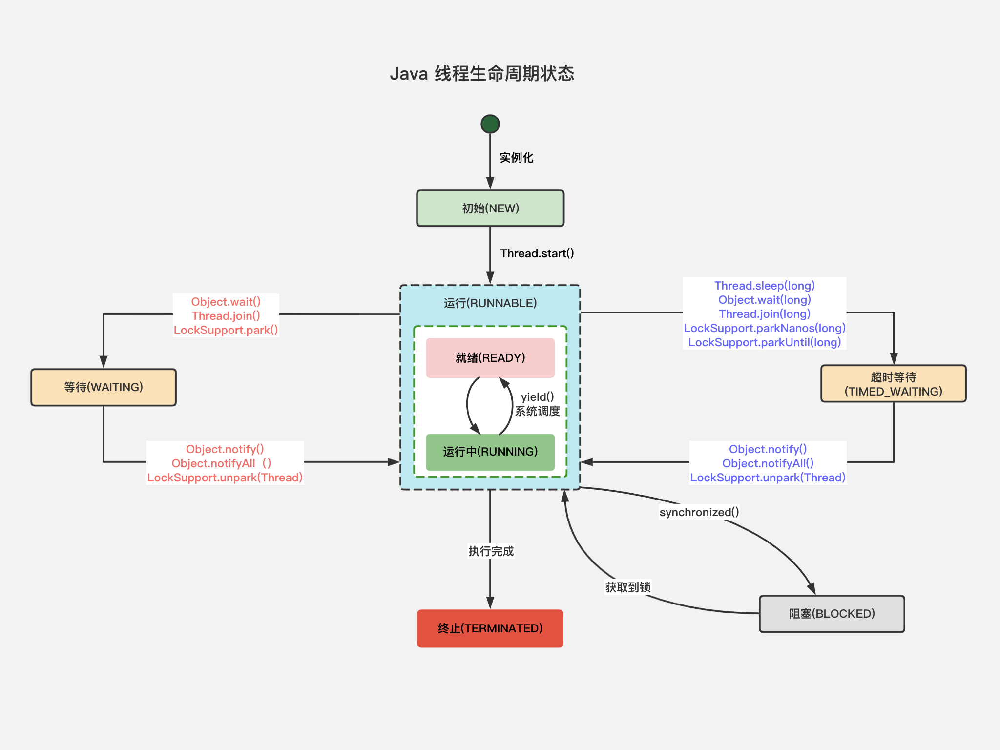

### 简述线程、程序、进程的基本概念，以及它们之间的关系是什么

> 线程与进程相似，但线程是一个比进程更小的执行单位。一个进程在其执行过程中可以产生多个线程。与进程不同的是同类的多个线程共享同一块内存空间和一组系统资源，所以系统在产生一个线程，或是在各个线程之间做切换工作时，负担要比进程小得多，也正因为如此，线程也别称为轻量级进程。

> 程序是含有指令和数据的文件，被存储在磁盘或是其他的数据存储设备中。也就是说程序是静态的代码。

> 进程是程序的一次执行过程，是系统运行程序的基本单位，因此进程是动态的。系统运行一个程序即是一个进程从创建、运行到消亡的过程。简单来说，一个进程就是一个执行中的程序，它在计算机中一个指令接着一个指令地执行着，同时，每个进程还占有着某些系统资源如 CPU 时间，内存空间，文件，输入输出设备的使用权。换句话说，当程序在执行时，将会被操作系统载入内存中。

> 线程是进程划分成的更小的运行单位。线程和进程最大的不同在于基本上各进程是独立的，而各线程则不一定，因为同一进程中的线程极有可能会相互影响。从另一角度来说，进程属于操作系统的范畴，主要是同一个时间内，可以同时执行一个以上的程序，而线程则是在同一程序内几乎同时执行一个以上的程序段。

### 线程有哪些基本状态

> 

> 操作系统隐藏 Java 虚拟机中的 READY 和 RUNNING 状态，它只能看到 RUNNABLE 状态。

### 请简要描述线程与进程的关系，区别及优缺点

> 线程是进程划分成的更小的运行单位。线程与进程最大的不同在于基本上各进程是独立的，而各线程则不一定，因为同一进程中的线程极有可能会相互影响。线层执行开销小，但不利于资源的管理和保护，而进程正相反。

### 程序计数器为什么是私有的

> 程序计算器主要有下面两个作用：
>
> 1. 字节码解释器通过改变程序计数器来依次读取指令，从而实现代码的流程控制，如顺序执行、选择、循环、异常处理。
> 2. 在多线程的情况下，程序计数器用于记录当前线程执行的位置，从而当线程被切换回来的时候能够知道该线层上次运行到哪儿了。

> 需要注意的是，如果执行的是 Native 方法，那么程序计数器记录的是 undefined 地址，只有执行的是 Java 代码时程序计数器记录的才是下一条指令的地址。

> 所以程序计数器私有主要是为了线层切换后能够恢复到正确的执行位置。

### 虚拟机栈和本地方法栈为什么是私有的

-   虚拟机栈

    > 每个 Java 方法在执行的同时会创建一个栈帧用于存储局部变量表。操作数栈、常量池引用等信息。从方法调用直至执行完成的过程，就对应着一个栈帧在 Java 虚拟机栈中入栈和出栈的过程。

-   本地方法栈

    > 和虚拟机栈所发挥的作用非常相似，区别是：虚拟机栈为虚拟机执行 Java 按方法（也就是字节码）服务，而本地方法栈则为虚拟机使用到的 Native 方法服务。在 HotSpot 虚拟机中和 Java 虚拟机栈合二为一。

> 所以，为了保证线程中的局部变量不被被额线程访问到，虚拟机栈和本地方法栈是线程私有的。

### 一句话简单了解堆和方法区

> 堆和方法区是所有线程共享的资源，其中堆是进程中最大的一块内存，主要用于存放新创建的对象（所有对象都在这里分配内存），方法区主要用于存放已被加载的类信息、常量、静态变量、即时编译器编译后的代码等数据。

### 什么是上下文切换

> 多线程编程中一般线程的个数都大于 CPU 核心的个数，而一个 CPU 核心在任意时刻只能被一个线程使用，为了让这些线程都能得到有效执行，CPU 采取的策略是每个线程分配时间片并轮转的形式。当一个线程的时间片用完的时候就会重新处于就绪状态让给其它程序使用，这个过程就属于一次上下文切换。

> 概括来说就是：当前任务在执行完 CPU 时间片切换到另一个任务之前会先保存自己的状态，以便下次再切换回这个任务时，可以再加载这个任务的状态。任务从保存到再加载的过程就是一次上下文切换。

> 上下文切换通常是计算密集型的。也就是说，它需要相当可观的处理器时间，在每秒几十上百次的切换中，每次切换都需要纳秒量级的时间。所以，上下文切换对系统来说意味着消耗大量的 CPU 时间，事实上，可能是操作系统时间消耗最大的操作。

> Linux 相比其它操作系统（包括其它类 Unix 系统）有很多的优点，其中有一项就是，其上下文切换和模式切换的时间消耗非常少。

### 什么是线程死锁、如何避免死锁

> -   破坏互斥条件：这个条件我们没有办法破坏，因为我们用锁本来就是让它们互斥的（临界资源需要互斥访问）。
> -   破坏请求与保持条件：一次性申请所有的资源。
> -   破坏不剥夺条件：占用部分资源的线程进一步申请其它资源时，如果申请不到，可以主动释放它占有的资源。
> -   破坏循环等待条件：靠按序申请资源来预防。按某一顺序申请资源，释放资源则反序释放。

### 说说 `sleep()` 方法和 `wait()` 方法区别和共同点

> -   两者主最要的区别在于 `sleep()` 方法没有释放锁，而 `wait()` 方法释放了锁。
> -   两者都可以暂停线程的执行。
> -   `wait()`通常被用于线程间交互 / 通信，`sleep()`通常被用于暂停执行。
> -   `wait()` 方法被调用后，线程不会自动苏醒，需要别的线程调用同一个对象上的 `notify()` 或者 `notifyAll()` 方法。`sleep()` 方法执行完成后，线程会自动苏醒。或者可以使用 `wait(timeout)` 超时后线程会自动苏醒。

### 构造方法可以使用 `synchronized` 关键字修饰吗

> 构造方法不能使用 `syncronized` 关键字修饰。构造方法本身就属于线程安全的，不存在同步的构造方法一说。

### 讲一讲 `syncronized` 关键字的底层原理

> -   `syncronized` 同步语句块的实现使用的 `monitorenter` 和 `monitorexit` 指令，其中 `monitorenter` 指令指向同步代码块的开始位置，`monitorexit`指令则指明同步代码块的结束位置。

> -   `syncronized` 修饰的方法并没有 `monitorenter` 和 `monitorexit` 指令，取而代之的是 `ACC_SYNCRONIZED` 标识，该标识指明了该方法是一个同步方法。

> 不过两者的本质都是对对象监视器 `monitor` 的获取。
