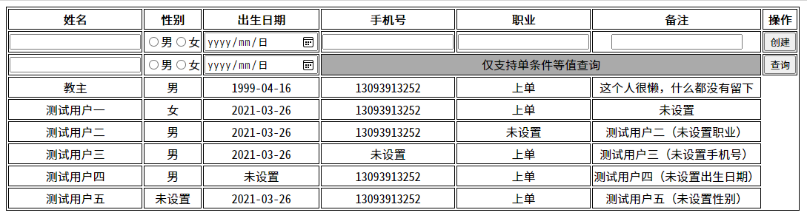
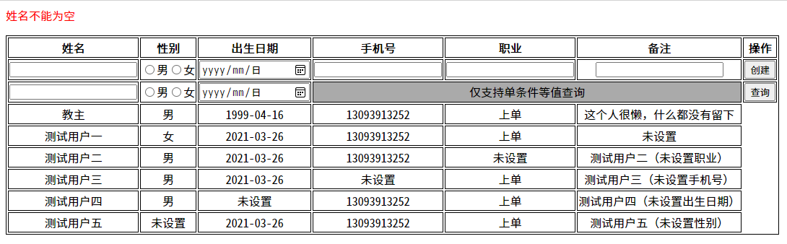
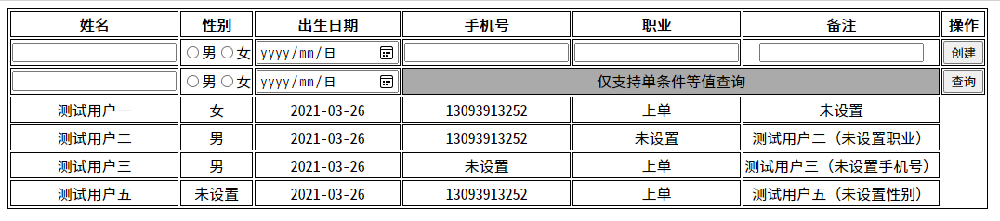

### 环境

| 环境   | 版本   | 其它                                                             |
| ------ | ------ | ---------------------------------------------------------------- |
| JDK    | 11     |                                                                  |
| MySQL  | 8.0.23 | 用户名（`root`）密码（`root`）配置（`lower_case_table_names=1`） |
| Tomcat | 9.0.38 | 参数（`-Dfile.encoding=UTF-8`）                                  |

### 依赖

```xml
<dependency>
    <groupId>javax.servlet</groupId>
    <artifactId>javax.servlet-api</artifactId>
    <version>4.0.1</version>
</dependency>

<dependency>
    <groupId>org.apache.taglibs</groupId>
    <artifactId>taglibs-standard-compat</artifactId>
    <version>1.2.5</version>
</dependency>

<dependency>
    <groupId>mysql</groupId>
    <artifactId>mysql-connector-java</artifactId>
    <version>8.0.23</version>
</dependency>
```

### 目录

```
test/
|--pom.xml
|--db
   |--test.sql                                     # 数据库初始化脚本
|--src/main/
   |--java/
      |--xyz.icefery.test.
         |--entity
            |--Customer                            # 客户实体类
         |--dao
            |--CustomerDAO                         # 客户创建、查询操作（静态方法）
         |--filter
            |--RequestCharacterEncodingFilter      # 设置 request 编码为 UTF-8
         |--servlet
            |--CusomerServlet                      # 客户创建、查询控制器（静态内部类）
               |--CreateServlet
               |--ListServlet
   |--webapp/                                      # WEB 根目录
      |--WEB-INF/
         |--web.xml
         |--index.jsp                              # 展示页面
```

### 预览

**首页（列表页）**



**校验失败**



**根据出生日期查询**


