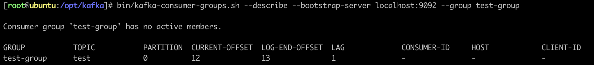

## 什么是 MQ

很多人都说：MQ 通过讲消息的发送和接收分离来实现应用程序的异步和解耦，这个给人的直觉是——MQ 就是异步的，是用来解耦的，但这个只是 MQ 的效果而不是目的。MQ 真正的目的是为了通讯，屏蔽底层复杂的通讯协议，定义了一套应用层的更加简单的通讯协议。

一个分布式系统中两个模块之间通讯要么是 HTTP，要么是自己开发的 TCP，但是这两种协议其实都是原始的协议。HTTP 协议很难实现两端通讯——模块 A 可以调用 B，B 也可以主动调用 A，如果要做到这个，两端都要背上 WebServer，而且还不长连接（HTTP 2.0 的库根本找不到）。TCP 就更加原始了，粘包、心跳、私有的协议，想一想就头皮发麻。

MQ 所要做的就是在这些协议之上构建一个简单的“协议”——生产者 / 消费者模型。MQ 带给我们的“协议”不是具体的通讯协议，而是更高层次的通讯模型。

<br/>

## 消息队列的流派

### 有 Broker 的 MQ

这个流派通常有一台服务器作为 Broker，所有的消息都通过它中转。生产者把消息发送给它就结束自己的任务了，Broker 则把消息主动推给消费者（或者消费者主动轮询）

#### 重 Topic （Kafka、ActiveMQ、JMS）

生产者会发送 Key 和数据到 Broker，由 Broker 比较 Key 之后决定给哪个消费者。这种模式是我们最常见的模式，是我们对 MQ 最多的印象。在这种模式下，一个 Topic 往往是一个比较大的概念，甚至一个系统中就可能只有一个 Topic，Topic 某种意义上就是 Queue，生产者发送 Key 相当于说：“Hi，把数据放到 Key 的队列中”。

> 虽然架构一样但是 Kafka 的性能要比 JMS 的性能不知道高多少倍，所以基本上这种类型的 MQ 只有 Kafka 一种备选方案。

#### 轻 Topic（RabbitMQ 或者 AMQP 协议）

生产者发送 Key 和数据，消费者定义订阅的队列，Broker 收到数据之后会通过一定的逻辑计算出 Key 对应的队列，然后把数据交给队列。

这种模式下解耦了 Key 和 Queue，在这种架构中 Queue 是非常轻量级的（在 RabbitMQ 中它的上限取决于你的内存），消费者关心的知识自己的 Queue，生产者不必关心数据最终给谁，只要指定 Key 就行了，中间的那层映射在 AMQP 中叫做 Exchange。

AMQP 中有四种 Exchange：

|                 |                                                                                                 |
| :-------------- | :---------------------------------------------------------------------------------------------- |
| Direct Exchange | Key 就等于 Queue                                                                                |
| Fanout Exchange | 无视 Key，给所有的 Queue 都来一份                                                               |
| Topic Exchange  | Key 可以用“宽字符”模糊匹配 Queue                                                                |
| Header Exchange | 无视 Key，通过查看消息的头部元数据来决定发给哪个 Queue（AMQP 头部元数据非常丰富并且可以自定义） |

这种结构的架构给通讯带来了很大的灵活性，我们能想到的通讯方式都可以用这四种 Exchange 表达出来。

### 无 Broker 的 MQ

#### ZeroMQ

无 Broker 的 MQ 的代表是 ZeroMQ。该作者非常睿智，他非常敏锐的意识到——MQ 是更高级的 Socket，它是解决通讯问题的，所以 ZeroMQ 被设计成了一个“库”而不是一个中间件。

节点之间通讯的消息都是发送到彼此的队列中，每个节点都既是生产者又是消费者。ZeroMQ 做的事情就是封装出一套类似于 Socket 的 API，可以完成发送数据、读取数据。

ZeroMQ 其实就是一个跨语言的、重量级的 Actor 模型邮箱库。你可以把自己的程序想象成一个 Actor，ZeroMQ 就是提供邮箱功能的库。ZeroMQ 可以实现同一台机器的 RPC 通讯也可以实现不同机器上的 TCP、UDP 通讯。

> 如果你需要一个强大的、灵活、野蛮的通讯能力，别犹豫 ZeroMQ。

<br/>

## Kafka 介绍

Kafka 最初由 LinkedIn 公司开发，是一个分布式的、支持分区的（Partition）、多副本的（Replica）、基于 Zookeeper 协调的消息系统，它最大的特性就是可以实时的处理大量数据以满足各种需求场景。由 Scala 语言编写，LinkedIn 与 2010 年贡献给了 Apache 基金会并成为顶级开源项目。

### Kafka 的使用场景

-   日志收集

    > 一个公司可以用 Kafka 收集各种服务的 Log，通过 Kafka 以统一接口服务的方式开放给各种 Consumer，例如 Hadoop、HBase、Solr 等。

-   消息系统：

    > 解耦生产者和消费者、缓存消息等。

-   用户活动跟踪

    > Kafka 经常被用来记录 Web 用户或者 app 用户的各种活动，如浏览网页、搜索、点击等活动，这些活动信息被各个服务器发吧到 Kafka 的 Topic 中，然后订阅者通过订阅这些 Topic 来做实时的监控分析，后者装载到 Hadoop、数据仓库中做离线分析和挖掘。

-   运营指标

    > Kafka 也经常被用来记录运营监控数据，包括收集各种分布式应用的数据，生产各种操作的集中反馈，比如报警和报告。

### Kafka 的基本概念

Kafka 是一个分布式的，分区的消息服务（官方称之为 Commit Log），它提供一个消息系统应该具备的功能，但是却有着独特的设计。

> 可以这样来说，Kafka 借鉴了 JMS 规范的思想，但是确并没有完全遵循 JMS 规范。

基础的消息相关术语：

|                |                                                                                                                                                         |
| :------------- | :------------------------------------------------------------------------------------------------------------------------------------------------------ |
| Broker         | 消息中间件处理节点，一个 Kafka 节点就是一个 Broker，一个或者多个 Broker 可以组成一个 Kafka 集群                                                         |
| Topic          | Kafka 根据 Topic 对消息进行归类，发布到 Kafka 集群的每条消息都需要指定一个 Topic                                                                        |
| Producer       | 消息生产者，向 Broker 发送消息的客户端                                                                                                                  |
| Consumer       | 消息消费者，从 Broker 读取消息的客户端                                                                                                                  |
| Consumer Group | 每个 Consumer 属于一个特定的 Consumer Group，一条消息可以被多个不同的 Consumer Group 消费，但是一个 Consumer Group 中只能有一个 Consumer 能够消费该消息 |
| Partition      | 物理上的概念，一个 Topic 可以分为多个 Partition，每个 Partition 内部消息是有序的                                                                        |

服务端（Broker）和客户端（Producer、Consumer）之间通信通过 TCP 协议来完成。

<br/>

## Kafka 安装

### 环境准备

-   jdk
-   zookeeper

### 配置文件

-   `config/server.properties`

    ```properties
    # The id of the broker. This must be set to a unique integer for each broker.
    broker.id=6

    # Hostname and port the broker will advertise to producers and consumers.
    advertised.listeners=PLAINTEXT://192.192.192.6:9092

    # A comma separated list of directories under which to store log files.
    log.dirs=/opt/kafka/data

    # Zookeeperi connection string.
    zookeeper.connect=192.192.192.6:2181
    ```

### 启动 Kafka 服务器

-   启动 Zookeeper
    ```shell
    cd /opt/zookeeper
    bin/zkServer.sh start
    ```
-   启动 Kafka
    ```shell
    cd /opt/kafka
    bin/kafka-server-start.sh -daemon config/server.properties
    ```
-   验证是否启动成功（进入 ZK 查看指定 ID 的 Broker 是否存在）
    ```shell
    cd /opt/zookeeper
    bin/zkCli.sh
    ```
    ```shell
    ls /brokers/ids
    ```

### 创建主题、发送消息、消费消息

```shell
# 创建主题
bin/kafka-topics.sh --create --bootstrap-server localhost:9092 --replication-factor 1 --partitions 1 --topic test

# 查看 Kafka 有哪些 Topic
bin/kafka-topics.sh --list --bootstrap-server localhost:9092

# 发送消息
bin/kafka-console-producer.sh --bootstrap-server localhost:9092 --topic test

# 消费最新消息
bin/kafka-console-consumer.sh --bootstrap-server localhost:9092

# 从头开始消费
bin/kafka-console-consumer.sh --bootstrap-server localhost:9092 --topic test --from-beginning
```

### 关于消息的细节

-   生产者将消息发送给 Broker，Broker 会将消息保存在本地的日志文件中
    ```
    /opt/kafka/data/<主题>-<分区>/00000000000000000000.log
    ```
-   消息的保存是有序的，通过 Offset 偏移量来描述消息的有序性
-   消费者消费消息时也是通过 Offset 来描述当前要消费的那条消息的位置

<br/>

## 单播消息和多播消息

### 单播消息

在一个 Kafka 的 Topic 中，启动两个消费者和一个生产者，问：生产者发送消息，这条消息是否同时会被两个消费者消费？

如果两个消费者在同一个消费组，那么只有一个消费者可以收到订阅的 Topic 中的消息。

> 换言之，同一个消费组中只能有一个消费者收到一个 Topic 中的消息。

```shell
bin/kafka-console-consumer.sh --bootstrap-server localhost:9092 --topic test --consumer-property group.id=test-group
```

### 多播消息

不同的消费组订阅同一个 Topic，那么不同的消费组中只有一个消费者能收到消息。

> 实际上也是多个消费组中的多个消费者收到了同一个消息。

```shell
bin/kafka-console-consumer.sh --bootstrap-server localhost:9092 --topic test --consumer-property group.id=test-group-1

bin/kafka-console-consumer.sh --bootstrap-server localhost:9092 --topic test --consumer-property group.id=test-group-2
```

### 查看消费组的详细信息

```shell
bin/kafka-consumer-groups.sh --describe --bootstrap-server localhost:9092 --group test-group
```



重点关注以下几个信息：

|                |                                  |
| -------------- | :------------------------------- |
| CURRENT-OFFSET | 最后被消费的消息的偏移量         |
| LOG-END-OFFSET | 最后一条消息的偏移量（消息总量） |
| LAG            | 积压了多少条消息                 |

<br/>

## Kafka 中主题和分区的概念

### 主题

Topic 在 Kafka 中是一个逻辑的概念，Kafka 通过 Topic 将消息进行分类，不同的 Topic 会被订阅该 Topic 的消费者消费。

但是有一个问题，如果说这个 Topic 中的消息非常非常多，因为消息是会被保存到 Log 日志文件中的，为了解决这个文件过大的问题， Kafka 提出了 Partition 的概念。

### 分区

通过 Partition 将一个 Topic 中的消息分区来存储。这样的好处有多个：

-   分区存储，可以解决存储文件过大的问题
-   提供了读写的吞吐量，读和写可以同时在多个分区中进行

### Kafka 中消息日志文件中保存的内容

-   `00000000000000000000.log`

    > 这个文件中保存的就是消息。文件中保存的消息，默认保存 7 天，7 天后消息会被删除。

-   `__consumer_offsets-49`

    > Kafka 内部创建了`__consumer_offsets` 主题，包含了 50 个分区，这个主题用来存放消费者消费某个主题的偏移量。每个消费者会把消费的主题的偏移量自主上报给 Kafka 的默认主题 `__consumer_offsets`，因此 Kafka 为了提升这个主题的并发性，默认设置了 50 个分区。

    -   提交到哪个分区

        > 通过 Hash 函数 `hash(<Consumer Group ID>) % <__consumer_offsets 主题的分区数>`

    -   提交到该主题的内容

        > Key 为 `<Consumer Group ID>` + `<Topic>` + `<分区号>`，Value 就是当前 Offset 的值

<br/>

## Kafka 集群操作

### 副本的概念

副本是为了主题中的分区创建多个备份，在 Kafka 集群的多个 Broker 中，会有一个副本作为 Leader，其它是 Follower。

查看 Topic 情况：

```shell
bin/kafka-topics.sh --describe --bootstrap-server localhost:9092 --topic my-replicated-topic
```

|          |                                                                                                                                                 |
| :------- | :---------------------------------------------------------------------------------------------------------------------------------------------- |
| Leader   | Kafka 的写和读的操作，都发生在 Leader 上。Leader 负责把数据同步给 Follower。当 Leader 挂了，经过主从选举，从多个 Follower 中选举一个新的 Leader |
| Follower | 接收 Leader 的同步的数据                                                                                                                        |
| Isr      | 可以同步和已同步的节点会被放入到 Isr 集群。如果 Isr 中的节点性能较差，会被踢出 Isr 集合                                                         |

集群中有多个 Broker，创建主题时可以指明主题有多少个分区（把消息拆分到不同的分区中存储），可以为分区创建多个副本，不同的副本存放在不同的 Broker 里。

### 集群消费中分区分消费组的细节

-   一个 Parittion 只能被一个消费组中的一个消费者消费，目的是为了保证消息的顺序性，但是多个 Partition 的多个消费者消费的总顺序是得不到保证的。
-   Partition 的数量决定了消费组中消费者的数量，建议同一个消费者的数量不要超过 Partition 的数量，否则多的消费者消费不到消息。
-   如果消费者挂了，那么就会触发 Rebalance 机制，会让其它消费者来消费该分区。

<br/>

## 客户端 API

### 依赖

```xml
<dependency>
    <groupId>org.apache.kafka</groupId>
    <artifactId>kafka-clients</artifactId>
    <version>3.0.0</version>
</dependency>
```

### 生产者

```java
public class MyProducer {
    public static void main(String[] args) throws Exception {
        // 设置参数
        Properties props = new Properties();
        props.put(ProducerConfig.BOOTSTRAP_SERVERS_CONFIG, "192.192.192.6:9092");
        props.put(ProducerConfig.KEY_SERIALIZER_CLASS_CONFIG, StringSerializer.class.getName());
        props.put(ProducerConfig.VALUE_SERIALIZER_CLASS_CONFIG, StringSerializer.class.getName());
        // 创建生产者
        Producer<String, String> producer = new KafkaProducer<>(props);
        // 创建消息
        ProducerRecord<String, String> record = new ProducerRecord<>("my-topic", "my-key", "my-value");
        // 发送消息
        Future<RecordMetadata> future = producer.send(record);
        // 获取消息发送的元数据
        RecordMetadata metadata = future.get();
        System.out.printf("topic=%s partition=%d offset=%d\n", metadata.topic(), metadata.partition(), metadata.offset());
    }
}
```

#### 生产者的同步发送消息

如果生产者发送消息没有收到 Ack，生产者会阻塞，阻塞到 3s 的时间，如果还没有收到消息，会进行重试，重试的次数为 3 次。

```java
Future<RecordMetadata> future = producer.send(record);
RecordMetadata metadata = future.get();
```

#### 生产者的异步发送消息

异步发送，生产者发送完消息后就可以执行之后的业务，Broker 在收到 消息后异步调用生产者提供的 Callback 回调方法。

```java
producer.send(record, (RecordMetadata metadata, Exception e) -> {
    if (e != null) {
        System.out.println("消息发送失败");
    }
});
```

#### 生产者中 Ack 配置

在同步发送的前提下，生产者在获得集群返回的 Ack 之前会一直阻塞，那么集群什么时候返回 Ack 呢？此时 Ack 有 3 个配置：

-   `ack=0`

    > Kafka 集群不需要任何的 Broker 收到消息，就立刻返回 Ack 给生产者。最容易丢消息，效率最高。

-   `ack=1`（默认）

    > 多副本之间的 Leader 已经收到消息，并把消息写入到本地的 Log 中，才会返回 Ack 给生产者。性能和安全性是最均衡的。

-   `ack=-1` / `ack=all`

    > 有配置 `min.insync.replicas=2`（默认为 1，推荐配置大于等于 2），此时就需要 Leader 和一个 Follower 同步完后，才会返回 Ack 给生产者，此时集群中有 2 个 Broker 已完成数据的接收。这种方式最安全，但性能最差。

下面是关于 Ack 和重试的配置（如果没有收到 Ack 就开启重试）：

```java
props.put(ProducerConfig.ACKS_CONFIG, "1");
props.put(ProducerConfig.RETRIES_CONFIG, 3);
// 重试间隔设置（发送失败会重试，默认间隔 100ms，重试能保证消息发送的可靠性，但是也可能造成消息重复发送，比如网络抖动，所以需要再接收者那边做好消息接收的幂等性处理）
props.put(ProducerConfig.RETRY_BACKOFF_MS_CONFIG, 100);
```

#### 关于消息发送的缓冲区

-   Kafka 默认会创建一个消息缓冲区，用来存放要发送的消息，缓冲区是 32m
    ```java
    props.put(ProducerConfig.BUFFER_MEMORY_CONFIG, 33554432);
    ```
-   Kafka 本地线程会去缓冲区中一次拉 16k 的数据发送给 Broker
    ```java
    props.put(ProducerConfig.BATCH_SIZE_CONFIG, 16384);
    ```
-   如果线程拉不到 16k 的数据，间隔 10ms 也会将已拉到的数据发送给 Broker
    ```java
    props.put(ProducerConfig.LINGER_MS_CONFIG, 10);
    ```

### 消费者

```java
public class MyConsumer {
    public static void main(String[] args) {
        // 设置参数
        Properties props = new Properties();
        props.put(ConsumerConfig.BOOTSTRAP_SERVERS_CONFIG, "192.192.192.6:9092");
        props.put(ConsumerConfig.KEY_DESERIALIZER_CLASS_CONFIG, StringDeserializer.class.getName());
        props.put(ConsumerConfig.VALUE_DESERIALIZER_CLASS_CONFIG, StringDeserializer.class.getName());
        // 消费组
        props.put(ConsumerConfig.GROUP_ID_CONFIG, "test-group");

        // 创建消费者客户端
        KafkaConsumer<String, String> consumer = new KafkaConsumer<>(props);

        // 消费者订阅主题列表
        consumer.subscribe(List.of("test"));

        while (true) {
            // poll() 是拉取消息的长轮询
            ConsumerRecords<String, String> records = consumer.poll(Duration.ofMillis(1000));
            for (ConsumerRecord<String, String> record : records) {
                System.out.printf("partitoin=%d offset=%d key=%s value=%s\n", record.partition(), record.offset(), record.key(), record.value());
            }
        }
    }
}
```

#### 关于消费者自动提交和手动提交 Offset

##### 提交的内容

消费者无论是自动提交还是手动提交，都需要把所属的消费组 + 消费的主题 + 消费的分区 + 消费的偏移量这样的信息提交到集群的 `__consumer_offsets` 主题里面。

##### 自动提交

消费者 `poll` 消息下来后就会自动提交 Offset。自动提交会丢消息，因为消费者在消费前提交 Offset，有可能提交完后还没消费就挂了。

```java
// 是否自动提交 Offset（默认为 true）
props.put(ConsumerConfig.ENABLE_AUTO_COMMIT_CONFIG, "true");
// 自动提交 Offset 的间隔时间
props.put(ConsumerConfig.AUTO_COMMIT_INTERVAL_MS_CONFIG, "1000");
```

##### 手动提交

```java
props.put(ConsumerConfig.ENABLE_AUTO_COMMIT_CONFIG, "false");
```

手动提交又分成了两种：

-   手动同步提交
    > 在消费完消息后调用同步提交的方法，当集群返回 Ack 前一直阻塞，返回 Ack 后表示提交成功，执行之后的逻辑。
    ```java
    while (true) {
        ConsumerRecords<String, String> records = consumer.poll(Duration.ofMillis(1000));
        for (ConsumerRecord<String, String> record : records) {
            System.out.printf("partitoin=%d offset=%d key=%s value=%s\n", record.partition(), record.offset(), record.key(), record.value());
        }
        if (records.count() > 0) {
            // 手动同步提交 Offset，当前线程会阻塞，直到 Offset 提交成功
            consumer.commitAsync();
        }
    }
    ```
-   手动异步提交
    > 在消息消费完后提交，不需要等集群 Ack，直接执行之后的逻辑，可以设置一个回调方法供集群调用。
    ```java
    while (true) {
        ConsumerRecords<String, String> records = consumer.poll(Duration.ofMillis(1000));
        for (ConsumerRecord<String, String> record : records) {
            System.out.printf("partitoin=%d offset=%d key=%s value=%s\n", record.partition(), record.offset(), record.key(), record.value());
        }
        consumer.commitAsync((Map<TopicPartition, OffsetAndMetadata> offsets, Exception e) -> {
            if (e != null) {
                System.out.println("提交失败");
            }
        });
    }
    ```

#### 长轮询 `poll` 消息

默认情况下，消费者一次会 `poll` 500 条消息。代码中设置了长轮询的时间为 1000 毫秒，意味着：

-   如果一次 `poll` 到 500 条，就直接执行 `for` 循环
-   如果这一次没有 `poll` 到 500 条，且时间在 1 秒内，那么长轮询继续 `poll`，要么到 500 条，要么到 1 秒
-   如果两次 `poll` 都没到 500 条，且 1 秒时间到了，那么直接执行 `for` 循环

如果两次 `poll` 的间隔超过 30 秒，集群会认为该消费者的消费能力过弱，该消费者会被踢出消费组，触发 Rebalance 机制，Rebalance 机制会造成性能开销。可以通过设置这个参数，让一次 `poll` 的消息少一点：

```java
props.put(ConsumerConfig.MAX_POLL_RECORDS_CONFIG, 500);
props.put(ConsumerConfig.MAX_POLL_INTERVAL_MS_CONFIG, 30 * 1000);
```

#### 消费者的健康状态检查

消费者每隔 1 秒向 Kafka 集群发送心跳，集群发现如果有超过 10 秒没有续约的消费者，将踢出消费组，触发该消费组的 Rebalance 机制，将分区交给消费组里的其它消费者进行消费。

```java
props.put(ConsumerConfig.HEARTBEAT_INTERVAL_MS_CONFIG, 1000);
props.put(ConsumerConfig.SESSION_TIMEOUT_MS_CONFIG, 10 * 1000);
```

#### 指定分区、偏移量、时间消费

-   指定分区消费
    ```java
    consumer.assign(List.of(new TopicPartition("test", 0)));
    ```
-   指定 Offset 消费
    ```java
    // 从头消费
    consumer.seekToBeginning(List.of(new TopicPartition("test", 0)));
    // 指定 Offset 消费
    consumer.seek(new TopicPartition("test", 0), 10);
    ```
-   指定时间消费
    > 根据时间，去所有的 Partition 中确定该时间对应的 Offset，然后去所有的 Partition 中找到该 Offset 之后的消息开始消费。
    ```java
    // long timestamp = new Date().getTime() - 1000 * 60 * 60;
    long timestamp = LocalDateTime.now().plusHours(-1).atZone(ZoneId.systemDefault()).toInstant().toEpochMilli();
    Map<TopicPartition, Long> timestampsToSearch = consumer
        .partitionsFor(topic)
        .stream()
        .collect(Collectors.toMap(
            (PartitionInfo it) -> new TopicPartition(topic, it.partition()),
            (PartitionInfo it) -> timestamp,
            (v1, v2) -> v2
        ));
    consumer
        .offsetsForTimes(timestampsToSearch)
        .forEach((TopicPartition key, OffsetAndTimestamp value) -> {
            // 如果查询偏移量的时间点大于最大的索引记录时间那么 value 就会为空
            if (value != null) {
                // 根据 timestamp 确定 offset
                long offset = value.offset();
                consumer.assign(List.of(key));
                consumer.seek(key, offset);
            }
        });
    ```

#### 新消费组的消费 Offset 规则

新消费组中的消费者在启动以后，默认会从当前分区的最后一条消息的 `offset + 1` 开始消费（消费新消息）。通过以下的设置，让新的消费者第一次从头开始消费，之后开始消费新消息。

-   `latest`（默认）

    > 消费新消息。

-   `earliest`

    > 第一次从头开始消费，之后开始消费新消息。这个需要区别于 `consumer.seekToBeginning()`（每次都从头开始消费）。

```java
props.put(ConsumerConfig.AUTO_OFFSET_RESET_CONFIG, "earliest");
```

<br/>

## Spring Boot 中使用 Kafka

### 依赖

```xml
<dependency>
    <groupId>org.springframework.kafka</groupId>
    <artifactId>spring-kafka</artifactId>
    <version>2.8.1</version>
</dependency>
```

### 配置文件

-   `application.properties`

    ```properties
    spring.kafka.bootstrap-servers=192.192.192.6:9092

    spring.kafka.producer.key-serializer=org.apache.kafka.common.serialization.StringSerializer
    spring.kafka.producer.value-serializer=org.apache.kafka.common.serialization.StringSerializer
    spring.kafka.producer.acks=1

    spring.kafka.consumer.group-id=test-group
    spring.kafka.consumer.enable-auto-commit=false
    spring.kafka.consumer.auto-offset-reset=earliest

    spring.kafka.listener.ack-mode=MANUAL_IMMEDIATE
    ```

    |                    |                                                                                               |
    | :----------------- | :-------------------------------------------------------------------------------------------- |
    | `RECORD`           | 当每一条记录被消费者监听器处理之后提交                                                        |
    | `BATCH`            | 当每一批 `poll` 的数据被消费者监听器处理之后提交                                              |
    | `TIME`             | 当每一批 `poll` 的数据被消费者监听器处理之后，距离上次提交时间大于 `ack-time`时提交           |
    | `COUNT`            | 当每一批 `poll` 的数据被消费者监听器处理之后，被处理的 Record 数量大于等于 `ack-count` 时提交 |
    | `COUNT_TIME`       | `TIME` 和 `COUNT` 有一个条件满足时提交                                                        |
    | `MANUAL`           | 当每一批 `poll` 的数据被消费者监听器处理之后，手动调用 `Acknowledgment.acknowledge()` 后提交  |
    | `MANUAL_IMMEDIATE` | 手动调用 `Acknowledgment.acknowledge()` 后立即提交                                            |

### 生产者

```java
@RestController
public class MyKafkaController {
    @Autowired
    private KafkaTemplate<String, String> kafkaTemplate;

    @GetMapping("/send")
    public void send() {
        ListenableFuture<SendResult<String, String>> future = kafkaTemplate.send("test", 0, "key", "消息");
    }
}
```

### 消费者

```java
@Component
public class MyConsumer {
    @KafkaListener(topics = {"test"}, groupId = "test-group")
    public void listen(ConsumerRecord<String, String> record, Acknowledgment ack) {
        System.out.println(record);
        // 手动提交 Offset
        ack.acknowledge();
    }
}
```

#### 消费者中配置主题、分区、偏移量

```java
@KafkaListener(
    groupId = "test-group",
    topicPartitions = {
        @TopicPartition(
            topic = "topic-1",
            partitions = {"0", "1"},
            partitionOffsets = {@PartitionOffset(partition = "1", initialOffset = "100")}
        ),
        @TopicPartition(topic = "topic-2")
    },
    // 同组下的消费者个数，即并发消费数，建议小于等于分区总数
    concurrency = "3"
)
public void listen(ConsumerRecord<String, String> record, Acknowledgment ack) {
    System.out.println(record);
    // 手动提交 Offset
    ack.acknowledge();
}
```

<br/>

## Kafka 集群中的 Controller、Rebalance、HW

### Controller

每个 Broker 启东时会向 ZK 创建一个临时序号节点，获得的序号最小的那个 Broker 将会作为集群中的 Controller，负责：

-   当集群中有一个副本的 Leader 挂掉，需要在集群中选举出一个新的 Leader，选举的规则是从 Isr 集合中最左边获得。
-   当集群中有 Broker 新增或减少，Controller 会同步信息给其它 Broker。
-   当集群中有分区新增或减少，Controller 会同步信息给其它 Broker。

### Rebalance 机制

#### 前提

消费组中的消费者没有指明分区来消费

#### 触发的条件

当消费组中的消费者和分区的关系发生变化的时候

#### 分区分配的策略

-   Range

    > 根据公司计算得到每个消费者消费哪几个分区。前面的消费者是 `<分区总数> / (<消费者数量> + 1)`，之后的消费者是 `<分区总数> / <消费者数量>`。

-   轮询
-   Sticky

    > 粘合策略，如果需要 Rebalance，会在之前已分配的基础上调至，不会改变之前的分配情况。如果这个没有策略没有开启，那么就要进行全部重新分配。建议开启。

### HW 和 LEO

HW（High Watermark）俗称高水位，取一个 Partition 对应的 Isr 集合中最小的 LEO（LOG-END-OFFSET）作为 HW，Consumer 最多只能消费到 HW 所在的位置。另外每个 Replica 都有 HW，Leader 和 Follower 各自负责更新自己的 HW 状态。

对于 Leader 新写入的消息，Consumer 不能立刻消费，Leader 会等待该消息被所有 Isr 集合中的 Reolicas 同步后更新 HW，此时消息才能被 Consumer 消费。

这样就保证了如果 Leader 所在的 Broker 失效，但该消息仍然可以从新选举的 Leader 中获取，这样的目的是防止消息的丢失。

<br/>

## Kafka 的优化问题

### 如何防止消息丢失

#### 生产者

1. 使用同步发送。
2. 把 Ack 设为 `1` 或者 `all`，并且设置同步的分区数（`min.insync.replicas`）为分区备份数。

#### 消费者

1. 把自动提交改成手动提交

### 如何防止重复消费

在防止消息的方案中，如果生产者发送完消息后，因为网络抖动，没有收到 Ack，但实际上 Broker 已经收到消息了，此时生产者就会重试，于是 Broker 就会收到多条相同的消息，而造成消费者的重复消费。

#### 解决方案

-   生产者关闭重试

    > 会造成消息丢失，不建议。

-   消费者解决非幂等性消费问题

    > 业务 ID 唯一或分布式锁。

### 如何做到消息的顺序消费

1. 生产者保证消息按顺序消费，且消息不丢失，使用同步发送，Ack 设置成非 0 的值。
2. 主题只能设置一个分区，消费组中只能有一个消费者。

### 如何解决消息积压问题

消息的消费速度远赶不上生产速度，导致 Kafka 中有大量的数据没有被消费。随着没有消费的数据堆积越多，消费者的寻址性能会越来越差，最后导致整个 Kafka 对外提供的服务的性能很差，从而导致其它服务也访问速度变慢，造成服务雪崩。

#### 解决方案

-   在这个消费者中，使用多线程，充分利用机器的性能进行消费消息。
-   通过业务的架构设计，提高业务层面消费的性能。
-   创建多个消费组，多个消费者，部署到其它机器上，一起消费，提高消费者的消费速度
-   创建一个消费者，该消费者在 Kafka 另建一个主题，配上多个分区，再配上多个消费者。该消费者将 `poll` 下来的消息，不进行消费，直接转发到新建的主题上。此时，新的主题的多个分区的多个消费者就开始一起消费了。

### 如何实现延时队列

#### 应用场景

订单创建后，超过 30 分钟没有支付，则需要取消订单，这种场景可以通过延时队列来实现。

#### 解决方案

1. Kafka 中创建多个 Topic，每个 Topic 表示延时的间隔，如 `topic_30m`。
2. 消息发送者发送消息到相应的 Topic，并带上消息的发送时间。
3. 消费者订阅相应的 Topic，消费时长轮询消费整个 Topic 中的消息。
    - 判断消费的发送时间和当前比较当前时间是否超过预设的值，如 30 分钟。
    - 如果超过，去数据库中修改订单状态为已取消。
    - 如果未超过，记录当前消息的 Offset 并不再继续消费之后的消息，下次消费 Offset 之后的消息继续进行判断。
