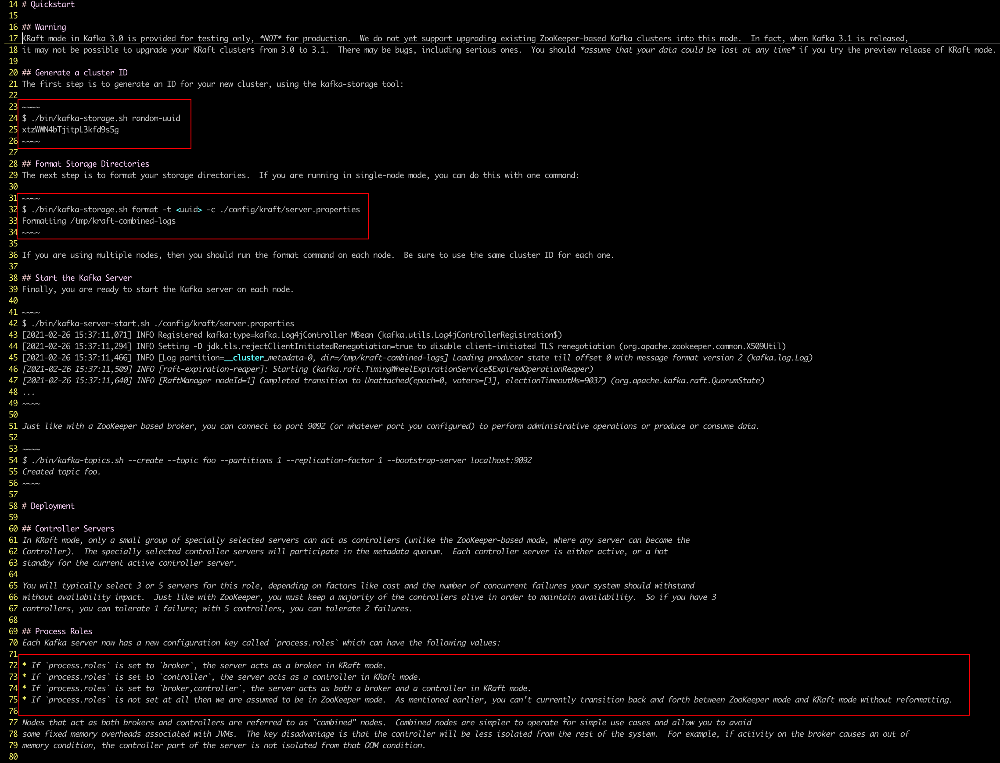
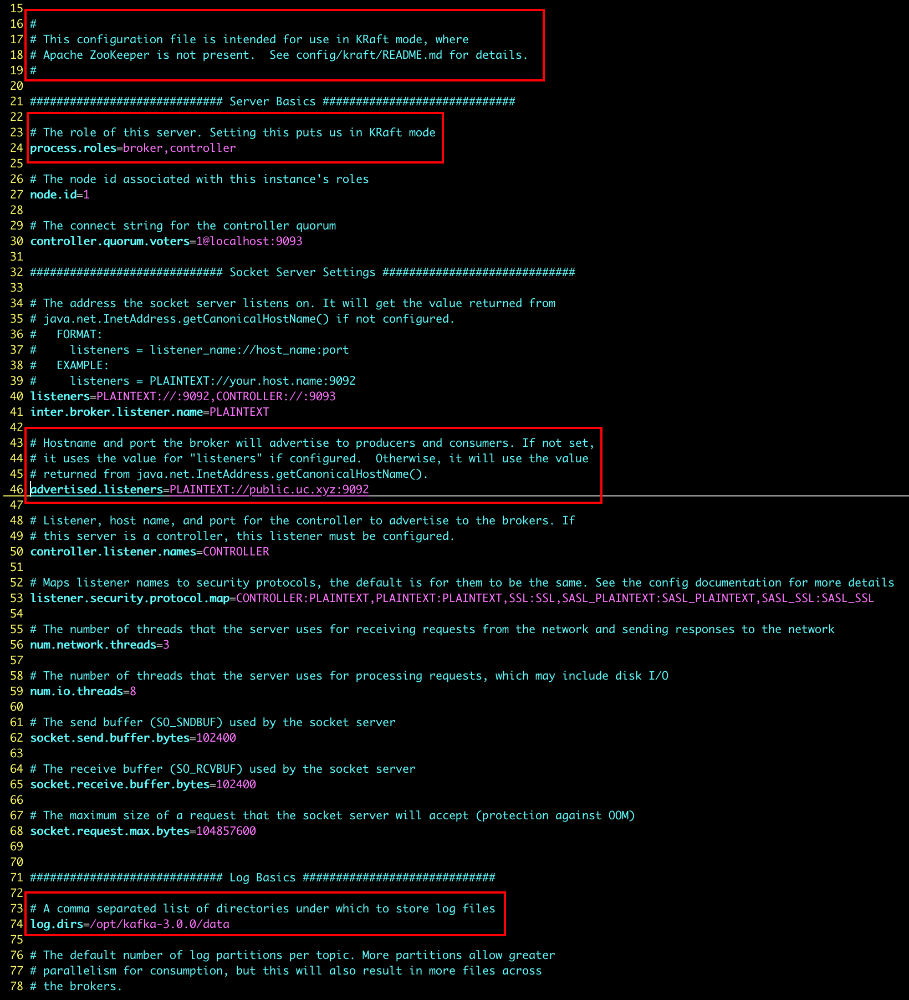
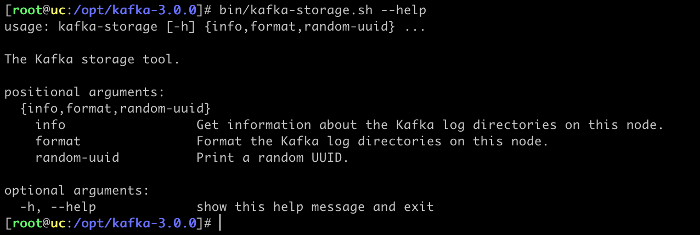

### 安装

-   https://mirrors.tuna.tsinghua.edu.cn/apache/kafka/3.0.0/
-   https://kafka.apache.org/quickstart

### KRaft 配置

-   `config/kraft/README.md`

    

-   `config/kraft/server.properties`

    

-   生成集群 ID

    ```shell
    bin/kafka-storage.sh random-uuid > uuid
    ```

    

-   格式化存储目录

    ```shell
    bin/kafka-storage.sh format -t `cat uuid` -c config/kraft/server.properties
    ```

### 启动

-   启动

    ```shell
    bin/kafka-server-start.sh -daemon config/kraft/server.properties
    ```

-   创建主题

    ```shell
    bin/kafka-topics.sh --create --topic foo --partitions 1 --replication-factor 1 --bootstrap-server localhost:9092
    ```
