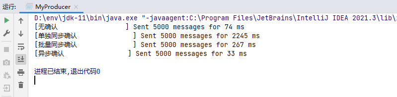
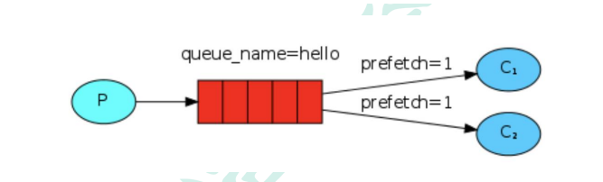

## 一、介绍

### 1.1 核心概念


#### Broker

接收和分发消息的应用，RabbitMQ Server 就是 Message Broker。

#### Virtual Host

出于多租户和安全因素而设计，把 AMQP 的基本组件划分到一个虚拟的分组中，类似于网络中的 Namespace 概念。当多个不同的用户使用同一个 RabbitMQ Server 提供的服务时，可以划分出多个 VHost，每个用户在自己的 VHost 创建 Exchange / Queue 等。

#### Connection

Producer / Consumer 和 Broker 之间的 TCP 连接。

#### Channel

如果每一次访问 RabbitMQ 都建立一个 Connection，在消息量大的时候建立 TCP Connection 道德开销将是巨大的，效率也较低。Channel 是在 Connection 内部建立的逻辑连接，如果应用程序支持多线程，通常每个 Thread 创建单独的 Channel 进行通讯，AMQP 方法包含了 Channel ID 帮助客户端和 Message Broker 识别 Channel，所以 Channel 之间是完全隔离的。Channel 作为轻量级的 Connection 极大减少了操作系统建立 TCP Connection 的开销。

#### Exchange

Message 到达 Broker 的第一站，根据分发规则匹配 Routing Key 分发消息到 Queue 中去。

交换机是 RabbitMQ 非常重要的一个部件，一方面它接收来自生产者的消息，另一方面它将消息推送到队列中。交换机必须确切知道如何处理它接收到的消息，是将这些消息推送到特定队列还是推送到多个队列，亦或者是把消息丢弃，这个都有交换机类型决定。

#### Queue

队列是 RabbitMQ 内部使用的一种数据结构，尽管消息流经 RabbitMQ 和应用程序，但它们只能存储在队列中。队列仅受主机的内存和磁盘限制的约束，本质上是一个大的消息缓冲区。

#### Binding

Exchange 和 Queue 之间的虚拟连接，Binding 中可以包含 Routing Key，Binding 信息被保存在 Exchange 中的查询表中，作为 Message 的分发依据。

## 二、安装

### 2.1 通过包管理器安装

通过 `--fix-missing` 选项自动解决需要的依赖（如 `erlang` 和 `socat` 等）。最新版本安装参考：https://www.rabbitmq.com/install-debian.html。

```shell
apt install rabbitmq-server -y --fix-missing
```

### 2.2 开启 Web 管理插件

```shell
rabbitmq-plugins enable rabbitmq_management
```

### 2.3 用户和授权

#### 默认用户

RabbitMQ 默认用户和密码都为 `guest`，但只能本地 `localhost` 访问。可以通过配置 `loopback_users = none` 解除限制，比如 RabbitMQ 的官方镜像容器的默认配置：

-   `/etc/rabbitmq/conf.d/10-default-guest-user.conf`

    ```properties
    ## DEFAULT SETTINGS ARE NOT MEANT TO BE TAKEN STRAIGHT INTO PRODUCTION
    ## see https://www.rabbitmq.com/configure.html for further information
    ## on configuring RabbitMQ

    ## allow access to the guest user from anywhere on the network
    ## https://www.rabbitmq.com/access-control.html#loopback-users
    ## https://www.rabbitmq.com/production-checklist.html#users
    loopback_users.guest = false
    ```

另一种方式是创建新的管理用户。

#### 创建管理用户

```shell
rabbitmqctl add_user admin admin

rabbitmqctl set_user_tags admin administrator

rabbitmqctl set_permissions -p / admin ".*" ".*" ".*"
```

#### 角色分类

-   None
    -   不能访问 Managment 插件
-   Management
    -   列出自己可以通过 AMQP 登入的 VHost
    -   查看自己的 VHost 节点的 Queue、Exchange、Binding 信息
    -   查看和关闭自己 Channel 和 Connection
    -   查看有关自己的 VHost 统计信息，包括其它用户在这个 VHost 中的活动信息
-   Poclicymaker
    -   包含 Management 所有权限
    -   查看和删除自己的 VHost 所属的 Policy 和 Parameter 信息
-   Monitoring
    -   包含 Management 所有权限
    -   列出所有的 VHost，包括不能登录的 VHost
    -   查看其它用户的 Connection 和 Channel 信息
    -   查看节点级别的数据，如 Clustering 和 Memory 使用情况
    -   查看所有的 VHost 的全局统计信息
-   Administrator
    -   最高权限
    -   可以创建和删除 VHost
    -   可以创建和删除 User
    -   可以创建 Permission
    -   可以关闭所有用户的 Connection

## 三、Java 客户端

### 3.1 依赖

客户端依赖：

```xml
<dependency>
    <groupId>com.rabbitmq</groupId>
    <artifactId>amqp-client</artifactId>
    <version>5.14.0</version>
</dependency>
```

日志依赖：

```xml
<dependency>
    <groupId>org.slf4j</groupId>
    <artifactId>slf4j-simple</artifactId>
    <version>1.7.32</version>
</dependency>
```

### 3.2 示例

#### 3.2.1 简单模式


##### 生产者

```java
/**
 * 简单模式-生产者
 */
public class MyProducer {
    public static void main(String[] args) {
        // 1. 创建连接工厂
        ConnectionFactory factory = new ConnectionFactory();
        factory.setHost("192.192.192.6");
        factory.setPort(5672);
        factory.setUsername("admin");
        factory.setPassword("admin");

        // 使用 try-with-resources 语法(发送完消息后连接自动释放)
        String connectionName = MyProducer.class.getSimpleName();
        try (
            // 2. 创建连接
            Connection connection = factory.newConnection(connectionName);

            // 3. 创建通道
            Channel channel = connection.createChannel()
        ) {
            // 4. 声明队列(声明一个队列是幂等的，只有当它不存在时才会创建)
            String queue = "q.tutorial_one";      // 队列名
            boolean durable = false;              // 是否持久化(重启后队列是否还存在)
            boolean exclusive = false;            // 是否独占
            boolean autoDelete = false;           // 是否自动删除
            Map<String, Object> arguments = null; // 其它参数
            channel.queueDeclare(queue, durable, exclusive, autoDelete, arguments);

            // 5. 发送消息
            String exchange = "";                 // 交换机名(默认交互机名称为 `AMQP default` 类型为 `direct`)
            String routingKey = queue;            // 路由键(默认交换机使用队列名匹配队列)
            AMQP.BasicProperties headers = null;  // 消息头
            String body = "This is a message";    // 消息体
            channel.basicPublish(exchange, routingKey, headers, body.getBytes());
            System.out.printf("Sent message='%s'\n", body);

            // 5. 循环发送消息
            // Scanner sc = new Scanner(System.in);
            // while (sc.hasNextLine()) {
            //     String body = sc.nextLine();
            //     channel.basicPublish(exchange, routingKey, null, body.getBytes());
            //     System.out.printf("Sent message='%s'\n", body);
            // }
        } catch (IOException | TimeoutException e) {
            e.printStackTrace();
        }
    }
}
```

##### 消费者

```java
/**
 * 简单模式-消费者
 */
public class MyConsumer {
    public static void main(String[] args) {
        // 1. 创建连接工厂
        ConnectionFactory factory = new ConnectionFactory();
        factory.setHost("192.192.192.6");
        factory.setPort(5672);
        factory.setUsername("admin");
        factory.setPassword("admin");

        // 不使用 try-with-resources 语法(避免消费完消息后连接自动释放)
        try {
            // 2. 创建连接
            Connection connection = factory.newConnection(MyConsumer.class.getSimpleName());

            // 3. 创建通道
            Channel channel = connection.createChannel();

            String queue = "q.tutorial_one";

            // 4. 声明队列(声明一个队列是幂等的，只有当它不存在时才会创建)
            channel.queueDeclare(queue, false, false, false, null);

            // 5. 消费消息
            boolean autoAck = true;                                        // 是否自动应答（默认为 false）
            DeliverCallback deliverCallback = (consumerTag, delivery) -> { // 消费回调
                String body = new String(delivery.getBody());
                System.out.printf("Received message='%s'\n", body);
            };
            CancelCallback cancelCallback = consumerTag -> {               // 取消消费回调(如在消费时队列被删除)
                System.err.println("Consuming was interrupted");
            };
            channel.basicConsume(queue, autoAck, deliverCallback, cancelCallback);
        } catch (IOException | TimeoutException e) {
            e.printStackTrace();
        }
    }
}
```

##### 工具类

可以发现生产消息和消费消息的整体流程是一致的：

1. 创建连接工厂
2. 创建通道
3. 操作 Channel

那么就可以封装一个可以直接提供 Channel 的工具方法：

```java
public class MyRabbitMQ {
    private static final ConnectionFactory CONNECTION_FACTORY = new ConnectionFactory();

    static {
        CONNECTION_FACTORY.setHost("192.192.192.6");
        CONNECTION_FACTORY.setPort(5672);
        CONNECTION_FACTORY.setUsername("admin");
        CONNECTION_FACTORY.setPassword("admin");
    }

    public static void start(String connectionName, boolean autoClose, ThrowableConsumer<Channel, Exception> throwableConsumer) {
        if (autoClose) {
            try (
                Connection connection = CONNECTION_FACTORY.newConnection(connectionName);
                Channel channel = connection.createChannel()
            ) {
                throwableConsumer.accept(channel);
            } catch (Exception e) {
                e.printStackTrace();
            }
        } else {
            try {
                Connection connection = CONNECTION_FACTORY.newConnection(connectionName);
                Channel channel = connection.createChannel();
                throwableConsumer.accept(channel);
            } catch (Exception e) {
                e.printStackTrace();
            }
        }
    }

    public static interface ThrowableConsumer<T, E extends Throwable> {
        void accept(T t) throws E;
    }
}
```

#### 3.2.2 工作队列模式


##### 生产者

```java
/**
 * 工作队列模式-生产者
 */
public class MyProducer {
    static final String EXCHANGE = "";            // 默认交换机
    static final String QUEUE = MyConsumer.QUEUE; // 队列一般在消费者端声明

    public static void main(String[] args) {
        MyRabbitMQ.start(MyProducer.class.getSimpleName(), true, channel -> {
            channel.queueDeclare(QUEUE, false, false, false, null);
            for (int i = 1; i <= 20; i++) {
                String body = "This is the " + i + "-th message";
                channel.basicPublish(EXCHANGE, QUEUE, null, body.getBytes());
                System.out.printf("Sent message='%s'\n", body);
            }
        });
    }
}

```

##### 消费者

```java
/**
 * 工作队列模式-消费者
 */
public class MyConsumer {
    static final String QUEUE = "q.tutorial_two";

    public static void main(String[] args) {
        String connectionName1 = MyConsumer.class.getSimpleName() + "1";
        String connectionName2 = MyConsumer.class.getSimpleName() + "2";
        long cost1 = 500L;
        long cost2 = 1500L;

        new Thread(() -> roundRobinDispatch(connectionName1, cost1)).start();
        new Thread(() -> roundRobinDispatch(connectionName2, cost2)).start();

        // new Thread(() -> fairDispatch(connectionName1, cost1)).start();
        // new Thread(() -> fairDispatch(connectionName2, cost2)).start();

        while (true) { }
    }

    /**
     * 工作队列模式-轮询分发
     */
    static void roundRobinDispatch(String connectionName, long cost) {
        MyRabbitMQ.start(connectionName, false, channel -> {
            channel.queueDeclare(QUEUE, false, false, false, null);
            DeliverCallback deliverCallback = (consumerTag, delivery) -> {
                // 1. 收到消息
                System.out.printf("Received consumer='%s' message='%s'\n", connectionName, new String(delivery.getBody()));
                // 2. 处理消息
                try { TimeUnit.MILLISECONDS.sleep(cost); } catch (Exception ignored) { }
            };
            channel.basicConsume(QUEUE, true, deliverCallback, consumerTag -> { });
        });
    }

    /**
     * 工作队列模式-公平分发
     */
    static void fairDispatch(String connectionName, long cost) {
        MyRabbitMQ.start(connectionName, false, channel -> {
            channel.queueDeclare(QUEUE, false, false, false, null);
            channel.basicQos(1); // 限制未确认消息缓冲区大小(一次只接收一条未确认的消息)
            DeliverCallback deliverCallback = (consumerTag, delivery) -> {
                // 1. 收到消息
                System.out.printf("Received consumer='%s' message='%s'\n", connectionName, new String(delivery.getBody()));

                // 2. 处理消息
                try { TimeUnit.MILLISECONDS.sleep(cost); } catch (Exception ignored) { }

                long deliveryTag = delivery.getEnvelope().getDeliveryTag(); // 消息 ID(服务器端向消费者推送消息，消息会携带一个 `deliveryTag` 参数，也可以称此参数为消息的唯一标识，是一个递增的正整数)
                boolean multiple = false;                                   // 是否批量应答(如当前 tag=8，并且通道上 tag 在 5-8 的消息还未应答，是否一次性应答当前 tag 及其之前所有尚未应答的消息)
                boolean requeue = false;                                    // 是否重新入队

                // 3. 手动应答(肯定确认)(告知 RabbitMQ 该消息被成功处理了)
                channel.basicAck(deliveryTag, multiple);

                // // 3. 手动应答(否定确认)(不处理该消息直接拒绝)
                // channel.basicNack(deliveryTag, multiple, requeue);
            };
            channel.basicConsume(QUEUE, false, deliverCallback, consumerTag -> { });
        });
    }
}
```

##### 效果


#### 3.2.3 发布订阅模式


##### 生产者

```java
/**
 * 发布订阅模式-生产者
 */
public class MyProducer {
    static final String EXCHANGE = "x.tutorial_three.fanout";
    static final String QUEUE1 = MyConsumer1.QUEUE;
    static final String QUEUE2 = MyConsumer2.QUEUE;
    static final String ROUTING_KEY = "";

    public static void main(String[] args) {
        MyRabbitMQ.start(MyProducer.class.getSimpleName(), true, channel -> {
            // 1. 声明交换机
            channel.exchangeDeclare(EXCHANGE, BuiltinExchangeType.FANOUT, false);
            // 2. 声明队列
            channel.queueDeclare(QUEUE1, false, false, false, null);
            channel.queueDeclare(QUEUE2, false, false, false, null);
            // 3. 绑定交换机和队列
            channel.queueBind(QUEUE1, EXCHANGE, ROUTING_KEY);
            channel.queueBind(QUEUE2, EXCHANGE, ROUTING_KEY);
            // 4. 发送消息
            String body = "This is a broadcast message";
            channel.basicPublish(EXCHANGE, ROUTING_KEY, null, body.getBytes());
            System.out.printf("Sent message='%s'\n", body);
        });
    }
}
```

##### 消费者一

```java
/**
 * 发布订阅模式-消费者-1
 */
public class MyConsumer1 {
    static final String QUEUE = "q.tutorial_three.queue1";

    public static void main(String[] args) {
        MyRabbitMQ.start(MyConsumer1.class.getSimpleName(), false, channel -> {
            channel.queueDeclare(QUEUE, false, false, false, null);
            DeliverCallback deliverCallback = (consumerTag, delivery) -> {
                System.out.printf("Received message='%s'\n", new String(delivery.getBody()));
            };
            channel.basicConsume(QUEUE, true, deliverCallback, consumerTag -> { });
        });
    }
}
```

##### 消费者二

```java
/**
 * 发布订阅模式-消费者-2
 */
public class MyConsumer2 {
    static final String QUEUE = "q.tutorial_three.queue2";

    public static void main(String[] args) {
        MyRabbitMQ.start(MyConsumer2.class.getSimpleName(), false, channel -> {
            channel.queueDeclare(QUEUE, false, false, false, null);
            DeliverCallback deliverCallback = (consumerTag, delivery) -> {
                System.out.printf("Received message='%s'\n", new String(delivery.getBody()));
            };
            channel.basicConsume(QUEUE, true, deliverCallback, consumerTag -> { });
        });
    }
}
```

##### 效果


#### 3.2.4 路由模式


##### 生产者

```java
/**
 * 路由模式-生产者
 */
public class MyProducer {
    static final String EXCHANGE = "x.tutorial_four.log.direct";
    static final String QUEUE_LOG = LogConsumer.QUEUE;
    static final String QUEUE_ERROR_LOG = ErrorLogConsumer.QUEUE;
    static final String ROUTING_KEY_INFO = "info";
    static final String ROUTING_KEY_WARN = "warn";
    static final String ROUTING_KEY_ERROR = "error";

    static final List<String> MESSAGE_LIST = List.of(
        "[2022-01-01 00:00:00.100][main      ][info ] This is an info log.",
        "[2022-01-01 00:00:00.200][main      ][warn ] This is a warn log.",
        "[2022-01-01 00:00:00.300][main      ][error] This is a error log."
    );

    public static void main(String[] args) {
        MyRabbitMQ.start(MyProducer.class.getSimpleName(), true, channel -> {
            // 1. 声明交换机
            channel.exchangeDeclare(EXCHANGE, BuiltinExchangeType.DIRECT, false);
            // 2. 声明队列
            channel.queueDeclare(QUEUE_LOG, false, false, false, null);
            channel.queueDeclare(QUEUE_ERROR_LOG, false, false, false, null);
            // 3. 绑定交换机和队列
            channel.queueBind(QUEUE_LOG, EXCHANGE, ROUTING_KEY_INFO);
            channel.queueBind(QUEUE_LOG, EXCHANGE, ROUTING_KEY_WARN);
            channel.queueBind(QUEUE_LOG, EXCHANGE, ROUTING_KEY_ERROR);
            channel.queueBind(QUEUE_ERROR_LOG, EXCHANGE, ROUTING_KEY_ERROR);
            // 4. 发送消息
            for (String body : MESSAGE_LIST) {
                String routingKey = body.substring(38, 43).trim();
                channel.basicPublish(EXCHANGE, routingKey, null, body.getBytes());
                System.out.printf("Sent routingKey='%s' message='%s'\n", routingKey, body);
            }
        });
    }
}
```

##### 收集所有日志消费者

```java
/**
 * 路由模式-收集所有日志消费者
 */
public class LogConsumer {
    static final String QUEUE = "q.tutorial_four.log";

    public static void main(String[] args) {
        MyRabbitMQ.start(LogConsumer.QUEUE, false, channel -> {
            channel.queueDeclare(QUEUE, false, false, false, null);
            DeliverCallback deliverCallback = (consumerTag, delivery) -> {
                System.out.printf("Received message='%s'\n", new String(delivery.getBody()));
            };
            channel.basicConsume(QUEUE, true, deliverCallback, consumerTag -> { });
        });
    }
}
```

##### 收集错误日志消费者

```java
/**
 * 路由模式-收集错误日志消费者
 */
public class ErrorLogConsumer {
    static final String QUEUE = "q.tutorial_four.error";

    public static void main(String[] args) {
        MyRabbitMQ.start(ErrorLogConsumer.class.getSimpleName(), false, channel -> {
            channel.queueDeclare(QUEUE, false, false, false, null);
            DeliverCallback deliverCallback = (consumerTag, delivery) -> {
                // 1. 收到消息
                System.out.printf("Received message='%s'\n", new String(delivery.getBody()));
                // 2. 处理消息（告警）
                try { TimeUnit.MILLISECONDS.sleep(500L); } catch (InterruptedException ignored) { }
                // 3. 手动应答
                channel.basicAck(delivery.getEnvelope().getDeliveryTag(), false);
            };
            channel.basicConsume(QUEUE, false, deliverCallback, consumerTag -> { });
        });
    }
}
```

##### 效果


#### 3.2.5 主题模式


##### 生产者

```java
/**
 * 主题模式-生产者
 */
public class MyProducer {
    static final String EXCHANGE = "x.tutorial_five.topic";
    static final String QUEUE_ORDER_LOG = OrderLogConsumer.QUEUE;
    static final String QUEUE_STOCK_LOG = StockLogConsumer.QUEUE;
    // 主题(主题是由多个单词以 `.` 隔开的路由键，`*` 表示有且仅有一个单词，`#` 表示有任意个单词)
    static final String TOPIC_ORDER = "order.#.log.*";
    static final String TOPIC_STOCK = "stock.#.log.*";

    static final List<String> MESSAGE_LIST = List.of(
        "-rw-r--r-- 1 root root 1M 2022-01-01 00:00 order.info.log.2022-01-01",  // 匹配订单主题
        "-rw-r--r-- 1 root root 1K 2022-01-01 00:00 order.warn.log.2022-01-01",  // 匹配订单主题
        "-rw-r--r-- 1 root root 10 2022-01-01 00:00 order.error.log.2022-01-01", // 匹配订单主题
        "-rw-r--r-- 1 root root  0 2022-01-01 00:00 stock.log",
        "-rw-r--r-- 1 root root 1M 2022-01-01 00:00 stock.log.2022-01-01"        // 匹配库存主题
    );

    public static void main(String[] args) {
        MyRabbitMQ.start(MyProducer.class.getSimpleName(), true, channel -> {
            channel.exchangeDeclare(EXCHANGE, BuiltinExchangeType.TOPIC, false);
            channel.queueDeclare(QUEUE_ORDER_LOG, false, false, false, null);
            channel.queueDeclare(QUEUE_STOCK_LOG, false, false, false, null);
            channel.queueBind(QUEUE_ORDER_LOG, EXCHANGE, TOPIC_ORDER);
            channel.queueBind(QUEUE_STOCK_LOG, EXCHANGE, TOPIC_STOCK);
            for (String body : MESSAGE_LIST) {
                // ls -AFlh --time-style=long-iso | awk '{ print $8 }'
                String[] split = body.split(" ");
                if (split.length == 8) {
                    String routingKey = split[7];
                    channel.basicPublish(EXCHANGE, routingKey, null, body.getBytes());
                    System.out.printf("sent routingKey='%s' message='%s'\n", routingKey, body);
                }
            }
        });
    }
}
```

##### 收集订单服务日志消费者

```java
/**
 * 主题模式-收集订单服务日志消费者
 */
public class OrderLogConsumer {
    static final String QUEUE = "q.tutorial_five.order.log";

    public static void main(String[] args) {
        MyRabbitMQ.start(OrderLogConsumer.class.getSimpleName(), false, channel -> {
            channel.queueDeclare(QUEUE, false, false, false, null);
            DeliverCallback deliverCallback = (consumerTag, delivery) -> {
                System.out.printf("Received message='%s'\n", new String(delivery.getBody()));
            };
            channel.basicConsume(QUEUE, true, deliverCallback, consumerTag -> { });
        });
    }
}
```

##### 收集库存服务日志消费者

```java
/**
 * 主题模式-收集库存服务日志消费者
 */
public class StockLogConsumer {
    static final String QUEUE = "q.tutorial_five.stock.log";

    public static void main(String[] args) {
        MyRabbitMQ.start(StockLogConsumer.class.getSimpleName(), false, channel -> {
            channel.queueDeclare(QUEUE, false, false, false, null);
            DeliverCallback deliverCallback = (consumerTag, delivery) -> {
                System.out.printf("Received message='%s'\n", new String(delivery.getBody()));
            };
            channel.basicConsume(QUEUE, true, deliverCallback, consumerTag -> { });
        });
    }
}
```

##### 效果


#### 3.2.6 远程调用模式


##### 服务端

```java
/**
 * 远程调用模式-服务端
 */
public class MyServer {
    static final String REQUEST_EXCHANGE = "";                          // 请求交换机
    static final String REQUEST_QUEUE = "q.tutorial_six.request";       // 请求队列
    static final String RESPONSE_EXCHANGE = MyClient.RESPONSE_EXCHANGE; // 响应交换机

    public static void main(String[] args) {
        MyRabbitMQ.start(MyServer.class.getSimpleName(), false, channel -> {
            channel.queueDeclare(REQUEST_QUEUE, false, false, false, null);

            channel.basicQos(1); // 限制未响应请求缓冲区大小(一次只处理一条请求)

            DeliverCallback handler = (consumerTag, delivery) -> {
                // 1. 请求头
                AMQP.BasicProperties requestHeaders = delivery.getProperties();
                String requestId = requestHeaders.getCorrelationId();
                String responseRoutingKey = requestHeaders.getReplyTo();

                // 2. 请求体
                String requestBody = new String(delivery.getBody());
                System.out.printf("Received requestId='%s' requestBody='%s' responseRoutingKey='%s'\n", requestId, requestBody, responseRoutingKey);

                // 3. 响应头
                AMQP.BasicProperties responseHeaders = new AMQP.BasicProperties
                    .Builder()
                    .correlationId(requestId)
                    .build();

                // 4. 响应体
                String responseBody = Integer.toString(f(Integer.parseInt(requestBody)));

                channel.basicPublish(RESPONSE_EXCHANGE, responseRoutingKey, responseHeaders, responseBody.getBytes());
                channel.basicAck(delivery.getEnvelope().getDeliveryTag(), false);
                System.out.printf("Responded requestId='%s' requestBody='%s' responseRoutingKey='%s' responseBody='%s'\n", requestId, requestBody, responseRoutingKey, responseBody);
            };
            channel.basicConsume(REQUEST_QUEUE, false, handler, consumerTag -> { });
        });
    }

    private static int f(int n) {
        if (n == 0) {
            return 0;
        } else if (n == 1) {
            return 1;
        } else {
            return f(n - 1) + f(n - 2);
        }
    }
}
```

##### 客户端

```java
/**
 * 远程调用模式-客户端
 */
public class MyClient {
    static final String REQUEST_EXCHANGE = MyServer.REQUEST_EXCHANGE; // 请求交换机
    static final String REQUEST_ROUTING_KEY = MyServer.REQUEST_QUEUE; // 请求路由键
    static final String RESPONSE_EXCHANGE = "";                       // 响应交换机

    public static void main(String[] args) {
        MyRabbitMQ.start(MyClient.class.getSimpleName(), true, channel -> {
            for (int i = 0; i < 10; i++) {
                int f = f(channel, i);
                System.out.printf("f(%d) = %d\n", i, f);
            }
        });
    }

    private static int f(Channel channel, int n) throws Exception {
        // 1. 请求头
        String requestId = UUID.randomUUID().toString();          // 请求 ID(服务端响应时携带请求 ID，客户端收到响应后根据判断请求 ID 是否一致，不一致可进行丢弃)
        String responseQueue = channel.queueDeclare().getQueue(); // 响应队列(每个请求单独创建临时队列，服务端将响应消息发送至该队列中)
        AMQP.BasicProperties requestHeaders = new AMQP.BasicProperties
            .Builder()
            .correlationId(requestId)
            .replyTo(responseQueue)
            .build();

        // 2. 请求体
        String requestBody = Integer.toString(n);

        channel.basicPublish(REQUEST_EXCHANGE, REQUEST_ROUTING_KEY, requestHeaders, requestBody.getBytes());
        System.out.printf("Requested requestId='%s' requestBody='%s' responseQueue='%s'\n", requestId, requestBody, responseQueue);

        BlockingQueue<String> response = new ArrayBlockingQueue<>(1); // 响应结果阻塞队列(一次只发起一条请求并等待请求响应)

        DeliverCallback responseCallback = (consumerTag, delivery) -> {
            // 3. 响应头
            AMQP.BasicProperties responseHeaders = delivery.getProperties();
            if (Objects.equals(responseHeaders.getCorrelationId(), requestId)) {
                // 4. 响应体
                String responseBody = new String(delivery.getBody());
                System.out.printf("Received requestId='%s' requestBody='%s' responseQueue='%s' responseBody='%s' \n", requestId, requestBody, responseQueue, responseBody);
                response.offer(responseBody);
            }
        };

        String cTag = channel.basicConsume(responseQueue, true, responseCallback, consumerTag -> { });
        String responseBody = response.take(); // 等待响应结果
        channel.basicCancel(cTag);             // 取消对响应队列的订阅

        return Integer.parseInt(responseBody);
    }
}
```

##### 效果


#### 3.2.7 发布确认模式

##### 生产者

```java
/**
 * 发布确认模式-生产者
 */
public class MyProducer {
    static final String EXCHANGE = "";

    static final List<String> MESSAGE_LIST = new ArrayList<>();

    static {
        for (int i = 1; i <= 5000; i++) {
            MESSAGE_LIST.add("msg" + i);
        }
    }

    public static void main(String[] args) {
        noConfirm();
        confirmIndividuallySync();
        confirmBatchSync();
        confirmAsync();
    }

    /**
     * 无确认
     */
    private static void noConfirm() {
        String mode = "无确认";
        MyRabbitMQ.start(MyProducer.class.getSimpleName(), true, channel -> {
            String queue = channel.queueDeclare().getQueue(); // 创建临时队列(主动声明一个由服务端命名的、排它的、自动删除的、非持久化的队列)
            long start = System.currentTimeMillis();
            for (String body : MESSAGE_LIST) {
                channel.basicPublish(EXCHANGE, queue, null, body.getBytes());
            }
            long end = System.currentTimeMillis();
            System.out.printf("[%-20s] Sent %d messages for %d ms\n", mode, MESSAGE_LIST.size(), end - start);
        });
    }

    /**
     * 单独同步确认
     */
    private static void confirmIndividuallySync() {
        String mode = "单独同步确认";
        MyRabbitMQ.start(MyProducer.class.getSimpleName(), true, channel -> {
            String queue = channel.queueDeclare().getQueue();
            channel.confirmSelect(); // 启用发布确认
            long start = System.currentTimeMillis();
            for (String body : MESSAGE_LIST) {
                channel.basicPublish(EXCHANGE, queue, null, body.getBytes());
                channel.waitForConfirmsOrDie(1000L); // 等待确认
            }
            long end = System.currentTimeMillis();
            System.out.printf("[%-20s] Sent %d messages for %d ms\n", mode, MESSAGE_LIST.size(), end - start);
        });
    }

    /**
     * 批量同步确认
     */
    private static void confirmBatchSync() {
        String mode = "批量同步确认";
        MyRabbitMQ.start(MyProducer.class.getSimpleName(), true, channel -> {
            String queue = channel.queueDeclare().getQueue();
            channel.confirmSelect();           // 启用发布确认
            long batchSize = 100L;             // 批次大小
            long outstandingMessageCount = 0L; // 未确认的消息数
            long start = System.currentTimeMillis();
            for (String body : MESSAGE_LIST) {
                channel.basicPublish(EXCHANGE, queue, null, body.getBytes());
                outstandingMessageCount++;
                if (outstandingMessageCount == batchSize) { // 批量等待确认(当未确认的消息数到达批次大小时再等待确认)
                    channel.waitForConfirmsOrDie(1000L);
                    outstandingMessageCount = 0L;
                }
            }
            if (outstandingMessageCount > 0) {              // 批量等待确认(消息全部发送后可能仍有未确认的消息)
                channel.waitForConfirmsOrDie(1000L);
                outstandingMessageCount = 0L;
            }
            long end = System.currentTimeMillis();
            System.out.printf("[%-20s] Sent %d messages for %d ms\n", mode, MESSAGE_LIST.size(), end - start);
        });
    }


    /**
     * 异步确认
     */
    private static void confirmAsync() {
        String mode = "异步确认";
        MyRabbitMQ.start(MyProducer.class.getSimpleName(), true, channel -> {
            String queue = channel.queueDeclare().getQueue();
            channel.confirmSelect(); // 启用发布确认
            channel.addConfirmListener(new ConfirmListener() { // 确认回调
                @Override
                public void handleAck(long deliveryTag, boolean multiple) throws IOException {

                }
                @Override
                public void handleNack(long deliveryTag, boolean multiple) throws IOException {
                    System.out.println("Publishing failed");
                }
            });
            long start = System.currentTimeMillis();
            for (String body : MESSAGE_LIST) {
                channel.basicPublish(EXCHANGE, queue, null, body.getBytes());
            }
            long end = System.currentTimeMillis();
            System.out.printf("[%-20s] Sent %d messages for %d ms\n", mode, MESSAGE_LIST.size(), end - start);
        });
    }
}
```

##### 效果



### 3.3 总结

#### 官方示例总结

在官方的七个示例中，可以概括如下：

1. 简单模式：默认 `direct` 类型交换机，队列名充当路由键。
2. 工作队列模式：同一队列不同消费者的消息分发机制。
3. 发布订阅模式：同一个交换机绑定多个队列，实现广播消息。
4. 路由模式：交换机根据分发规则将消息分发到不同的队列。
5. 主题模式：交换机可以根据模糊的分发规则将消息分发到不同的队列。
6. 远程调用模式：客户端发送请求到请求队列，并设置临时的响应队列，服务端订阅请求队列，并发送响应到临时的响应队列。
7. 发布确认模式：消息可靠发送。

#### 交换机类型总结

-   `fanout` 直连交换机：交换机忽略路由键，直接将消息分发到队列中。
-   `direct` 路由交换机：交换机通过路由键，将消息分发到不同的队列中。（默认交互机使用队列名作为路由键）
-   `topic` 主题交换机：交换机可以和队列绑定模糊的分发规则，以匹配不同的路由键。
-   `headers` 头部交换机：不依赖于路由键，而是绑定时指定一组键值对，并提取消息的键值对是否完全匹配绑定的键值对，如果完全匹配则会把消息路由到该队列中。

## 四、Spring AMQP

### 4.1 介绍

在 Spring 生态中提供了 Spring AMQP 项目，让我们更简便的使用 AMQP，其官网介绍如下：

-   它提供了一个 "模板" 作为发送消息的高级抽象。
-   它还通过 "监听器容器" 为消息驱动的 POJO 提供支持。
-   这些库促进 AMQP 资源的管理，同时促进使用依赖注入和申明式配置。
-   在所有这些情况下，您将看到与 Spring 框架中的 JMS 支持的相似之处。

该项目包括两个部分：

-   `spring-amqp` 是 AMQP 的基础抽象
-   `spring-rabbit` 是基于 RabbitMQ 对 AMQP 的具体实现

功能特性：

-   监听器容器：异步处理接收到的消息
-   `RabbitTemplate`：发送和接收消息
-   `RabbitAdmin`：自动创建队列、交换机、绑定关系

### 4.2 基本使用

#### 依赖

```xml
<dependency>
    <groupId>org.springframework.boot</groupId>
    <artifactId>spring-boot-starter-amqp</artifactId>
</dependency>
```

#### 配置文件

```properties
spring.rabbitmq.addresses=192.192.192.6:5672
spring.rabbitmq.username=admin
spring.rabbitmq.password=admin
spring.rabbitmq.virtual-host=/
```

#### 配置类

```java
@Configuration
public class RabbitMQConfig {
    public static final String EXCHANGE = "x.spring_boot.direct";
    public static final String QUEUE = "q.spring_boot";
    public static final String ROUTING_KEY = "";

    @Bean
    public Queue springBootQueue() {
        // boolean durable = false;
        // boolean exclusive = false;
        // boolean autoDelete = false;
        // Map<String, Object> arguments = null;
        // Queue queue = new Queue(QUEUE, durable, exclusive, autoDelete, arguments);
        return QueueBuilder
            .nonDurable(QUEUE)
            .build();
    }

    @Bean
    public Exchange springBootExchange() {
        // boolean durable = false;
        // boolean autoDelete = false;
        // Map<String, Object> arguments = null;
        // DirectExchange exchange = new DirectExchange(EXCHANGE, durable, autoDelete, arguments);
        return ExchangeBuilder
            .directExchange(EXCHANGE)
            .build();
    }

    @Bean
    public Binding binding1(@Qualifier("springBootQueue") Queue queue, @Qualifier("springBootExchange") Exchange exchange) {
        // Map<String, Object> arguments = null;
        // Binding binding = new Binding(QUEUE, Binding.DestinationType.QUEUE, EXCHANGE, ROUTING_KEY, arguments);
        return BindingBuilder
            .bind(queue)
            .to(exchange)
            .with(ROUTING_KEY)
            .noargs();
    }
}
```

#### 生产者

```java
@Component
public class MyProducer {
    @Autowired
    private RabbitTemplate rabbitTemplate;

    public void sendRaw(String raw) {
        MessageProperties properties = MessagePropertiesBuilder
            .newInstance()
            .setContentType(MessageProperties.CONTENT_TYPE_TEXT_PLAIN)
            .build();
        Message message = MessageBuilder
            .withBody(raw.getBytes())
            .andProperties(properties)
            .build();
        rabbitTemplate.convertAndSend(RabbitMQConfig.EXCHANGE, RabbitMQConfig.ROUTING_KEY, message);
    }
}
```

```java
@SpringBootTest(classes = { App.class })
class AppTest {
    @Autowired
    MyProducer producer;

    @Test
    void test1() {
        String raw = "{\"data\": \"This is a raw message\"}";
        producer.sendRaw(raw);
    }
}

```

#### 消费者

```java
@Component
public class MyConsumer {
    @RabbitListener(queues = { RabbitMQConfig.QUEUE })
    public void onMessage(Message message, Channel channel) {
        String raw = new String(message.getBody());
        System.out.printf("Received message='%s'\n", raw);
    }
}
```

参考文档：

-   https://docs.spring.io/spring-amqp/docs/current/reference/html/#async-consumer

参考类：

-   `org.springframework.amqp.core.MessageListener`

    ```java
    public interface MessageListener {
        void onMessage(Message message);
    }
    ```

-   `org.springframework.amqp.rabbit.listener.api.ChannelAwareMessageListener`

    ```java
    public interface ChannelAwareMessageListener {
        void onMessage(Message message, Channel channel) throws Exception;
    }
    ```

### 4.3 自定义消息类

#### 消息类

```java
@Data
@AllArgsConstructor
@NoArgsConstructor
public class MyMessage implements Serializable {
    private String data;
}
```

#### 生产者

```java
@Component
public class MyProducer {
    @Autowired
    private RabbitTemplate rabbitTemplate;

    public void sendObject(MyMessage object) {
        rabbitTemplate.convertAndSend(RabbitMQConfig.EXCHANGE, RabbitMQConfig.ROUTING_KEY, object);
    }
}
```

#### 消费者

```java
@Component
public class MyConsumer {
    @RabbitListener(queues = { RabbitMQConfig.QUEUE })
    public void handMessage(MyMessage object, Channel channel, Message message) {
        System.out.printf("Received object='%s' raw='%s'\n", object, new String(message.getBody()));
    }
}
```

#### JSON 序列化

默认情况下，`RabbitTempate` 消息转换器为 `SimpleMessageConverter`，使用 Java 的序列化。Spring Boot 也提供了 JSON 序列化的消息转换器：

```java
@Configuration
public class RabbitMQConfig {
    // ...

    @Bean
    public MessageConverter jsonMessageConverter() {
        return new Jackson2JsonMessageConverter();
    }
}
```


### 4.4 批量消息

#### 4.4.1 批量发送

##### 介绍

Spring AMQP 提供一个 `MessageBatch` 消息收集器，将发送给相同 Exchange 和 Routing Key 的消息，"悄悄" 收集在一起，当满足条件的时候，一次性批量发送提交给 RabbitMQ Broker。

Spring AMQP 通过 `BatchingRabbitTemplate` 提供批量发送的功能。如下是三个条件，满足任一即会批量发送：

-   数量（`batchSize`）：超过收集的消息最大条数。
-   空间（`bufferLimit`）：超过收集的消息占用的最大内存。
-   时间（`timeout`）：超过收集的实际的最大等待时长，单位为毫秒。不过要注意，这里的超时开始计时的实际，是以最后一次发送时间为起点，也就是说，每调用一次发送消息，都以当前时刻开始计时，重新达到 `timeout` 才算超时。

##### 配置类

```java
@Configuration
public class RabbitMQConfig {
	// ...

    @Bean
    public BatchingRabbitTemplate batchingRabbitTemplate(ConnectionFactory connectionFactory) {
        // 批量策略
        int batchSize = 100;                // 批量收集最大消息条数
        int bufferLimit = 16 * 1024 * 1024; // 批量发送最大内存
        long timeout = 60 * 1000L;          // 批量收集最长等待时间
        SimpleBatchingStrategy batchingStrategy = new SimpleBatchingStrategy(batchSize, bufferLimit, timeout);
        // 超时发送定时器
        TaskScheduler taskScheduler = new ConcurrentTaskScheduler();

        BatchingRabbitTemplate batchingRabbitTemplate = new BatchingRabbitTemplate(connectionFactory, batchingStrategy, taskScheduler);
        batchingRabbitTemplate.setMessageConverter(jsonMessageConverter());
        return batchingRabbitTemplate;
    }
}
```

##### 生产者

Spring AMQP 会静默收集消息来实现批量发送，所以 `BatchingRabbitTemplate` 和 `RabbitTemplate` 的使用方法还是一致的。

```java
@Component
public class MyProducer {
    @Autowired
    private BatchingRabbitTemplate batchingRabbitTemplate;

    public void batchingSendRaw(String raw) {
        Message message = MessageBuilder.withBody(raw.getBytes()).build();
        batchingRabbitTemplate.convertAndSend(RabbitMQConfig.EXCHANGE, RabbitMQConfig.ROUTING_KEY, message);
    }
}
```

```java
@SpringBootTest(classes = { App.class })
class AppTest {
    @Autowired
    MyProducer producer;

    @Test
    void test3() {
        for (int i = 1; i < 101; i++) {
            String raw = String.format("{\"data\": \"%s\"}", "This is the " + i + "-th message");
            producer.batchingSendRaw(raw);
        }
    }
}
```

#### 4.4.2 批量消费

##### 介绍

在【批量发送】章节中已经实现了批量发送消息到 RabbitMQ 中。那么，我们来思考一个问题，这批消息在 RabbitMQ 到底存储一条消息，还是多条消息？

实际上，RabbitMQ Broker 存储的是一条消息，又或者说，RabbitMQ 并没有提供批量接收消息的 API，"批量发送" 是 Spring AMQP 的 `SimpleBatchingStrategy` 所封装提供的：

-   在 Producer 最终批量发送消息时，`SimpleBatchingStrategy` 会通过 `assembleMessage()` 方法，将批量发送的多条消息组装成一条 "批量" 消息，然后进行发送。
-   在 Consumer 拉取到消息时， 会根据 `canDebatch()` 方法，判断该消息是否为一条 "批量" 消息，如果是，则调用 `deBatch()` 方法，将一条 "批量" 消息拆开，变成多条消息。


##### 配置类

```java
@Configuration
public class RabbitMQConfig {
	// ...
    @Bean
    public SimpleRabbitListenerContainerFactory batchingConsumeContainerFactory(SimpleRabbitListenerContainerFactoryConfigurer configurer, ConnectionFactory connectionFactory) {
        SimpleRabbitListenerContainerFactory factory = new SimpleRabbitListenerContainerFactory();
        configurer.configure(factory, connectionFactory);

        factory.setMessageConverter(jsonMessageConverter());
        // 启用批量消费
        factory.setBatchListener(true);
        factory.setConsumerBatchEnabled(true);
        // 阻塞等待最多 receiveTimeout 毫秒 拉取 batchSize 条消息进行消费
        factory.setBatchSize(100);
        factory.setReceiveTimeout(60 * 1000L);
        return factory;
    }
}
```

##### 消费者

```java
@Component
public class BatchingConsumer {
    @RabbitListener(queues = { RabbitMQConfig.QUEUE }, containerFactory = "batchingConsumeContainerFactory")
    public void onMessage(List<Message> messages, Channel channel) {
        for (Message message : messages) {
            System.out.printf("Received raw='%s'\n", new String(message.getBody()));
        }
    }
}
```

### 4.5 消费重试

##### 介绍

在消息消费失败的时候，Spring AMQP 会通过消费重试机制，重新投递给 Consumer，让 Consumer 有机会重新消费消息，实现消费成功。

当然，Spring AMQP 并不会无限重新投递消息给 Consumer 重新消费，而是在默认情况下，达到 N 次重试次数时，Consumer 还是会消费失败时，该消息就会进入死信队列。

那么消费失败达到最大次数的消息，是怎么进入到死信队列的呢？Spring AMQP 在消息到达最大消费次数的时候，会将该消息进行否定（`basicNack()`），并且 `requeue=false`，这样后续就可以利用 RabbitMQ 的死信队列机制，将该消息转发到死信队列。

在 Spring AMQP 的消费重试机制中，在消费失败到达最大次数后，会自动抛出 `AmqpRejectAndDontRequeueException` 异常，从而结束该消息的消费重试。这意味着如果我们在消费消息的逻辑中，主动抛出该异常，也能结束该消息的消息重试。

##### Spring AMQP 是怎么提供消费重试功能的

-   Spring AMQP 基于 `spring-retry` 项目提供的 `RetryTemplate` 实现重试功能。而 Spring AMQP 在获取到消息时，会交给 RetryTemplate 来调用消费者的监听器，实现该消息的消费重试。
-   在该消息的每次消费失败后，`RetryTemplate` 会通过 `BackOffPolicy` 来进行计算该消息的下一次重新消费的时候，通过 `Thread.sleep()` 方法实现重新消费的时间间隔。到达时间间隔后，`RetryTemplate`又会调用消费者监听器来消费该消息。
-   当该消息的重试消费达到上限后，`RetryTemplate` 会调用 `MethodInvocationRecoverer` 回调来实现恢复。而 Spring AMQP 自定义实现了 `RejectAndDontRequeueRecoverer` 来自动抛出 `AmqpRejectAndDontRequeueException` 异常，从而结束该消息的消费重试。
-   有一点需要注意，Spring AMQP 提供的消费重试的计数是在客户端级别的，重启 JVM 应用后，计数是会丢失的。

##### 配置（`application.yml`）

```properties
spring:
  rabbitmq:
    listener:
      simple:
        retry: # 消费重试
          enabled: true            # 开启消费重试机制
          max-attempts: 3          # 最大重试次数
          initial-interval: 1000ms # 重试间隔
```

### 4.6 并发消费

##### 介绍

在上述的示例中，我们配置的每一个 Spring AMQP 的 `@RabbitListener` 都是串行消费的。显然，这在监听的 Queue 每秒消息量比较大的时候，会导致消费不及时，导致消息积压问题。

虽然说，我们可以通过启动多个 JVM 进程，实现多进程的并发消费，从而加速消费的速度。但是怎么实现多线程的并发消费呢？

在 `@RabbitListener` 注解中，有 `concurrency` 属性，它可以指定并发消费的线程。例如，Spring AMQP 会根据 `@RabbitListener(concurrency = 2)` 注解配置，创建两个 Consumer，后续，每个 Consumer 会被单独分配到一个线程中，进行拉取消息，消费消息。

##### Spring AMQP 的容器类型（`ContainerType`）

第一种类型 `SIMPLE` 对应 `SimpleMessageListenerContainer` 消息监听器容器，它一共有两类线程：

-   Consumer 线程：负责从 RabbitMQ Broker 获取 Queue 中的消息，存储到内存中的 `BlockingQueue` 阻塞队列中。
-   Listener 线程，负责从内存中的 `BlockingQueue` 中获取消息，进行消费逻辑。

注意，每一个 Consumer 线程，对应一个 RabbitMQ Consumer，对应一个 Listener 线程，也就是说，它们三责是一一对应的。

第二种类型 `DIRECT` 对应 `DirectMessageListenerContainer` 消息监听器容器。它只有一类线程，既做 `SIMPLE` 的 Consumer 线程的工作，也做 `SIMPLE` 的 Listener 线程工作。

注意因为只有一类线程，所有它要么正在获取消息，要么正在消费消息，也就是说，获取消息和消费消息是串行的。

默认情况下，Spring AMQP 选择第一种类型，即 `SIMPLE` 容器类型。

##### 配置（`application.yml`）

```yaml
spring:
  rabbitmq:
    listener:
      type: simple
      simple:
        concurrency: 2
        max-concurrency: 10
```

##### 消费者

```java
@Component
public class ConcurrencyConsumer {
    @RabbitListener(queues = { RabbitMQConfig.QUEUE }, concurrency = "2")
    public void onMessage(Message message, Channel channel) {
        long thread = Thread.currentThread().getId();
        System.out.printf("Received thread='%d' raw='%s'\n", thread, new String(message.getBody()));
    }
}
```

### 4.7 事务消息

##### 配置

```java
@EnableTransactionManagement
@Configuration
public class RabbitMQConfig {
	// ...
    @Bean
    public RabbitTransactionManager rabbitTransactionManager(ConnectionFactory connectionFactory, RabbitTemplate rabbitTemplate) {
        rabbitTemplate.setChannelTransacted(true);
        return new RabbitTransactionManager(connectionFactory);
    }
}
```

### 4.8 消息异常处理器

#### 介绍

Spring AMQP 除了提供消息重试机制外，还可以自定义消费异常时的处理器，目前有两个接口：

-   `org.springframework.amqp.rabbit.listener.api.RabbitListenerErrorHandler`
-   `org.springframework.util.ErrorHandler`

#### `RabbitListenerErrorHandler`配置

```java
@Slf4j
@Component
public class MyRabbitListenerErrorHandler implements RabbitListenerErrorHandler {
    @Override
    public Object handleError(
        org.springframework.amqp.core.Message amqpMessage,
        org.springframework.messaging.Message<?> message,
        ListenerExecutionFailedException exception
    ) throws Exception {
        log.error("[handleError] amqpMessage='{}' message='{}'", amqpMessage, message);
        return null;
    }
}
```

#### `ErrorHandler` 配置

```java
@Slf4j
@Component
public class MyRabbitListenerErrorHandler implements ErrorHandler {
    public MyErrorHandler(SimpleRabbitListenerContainerFactory rabbitListenerContainerFactory) {
        rabbitListenerContainerFactory.setErrorHandler(this);
    }
    @Override
    public void handleError(Throwable t) {
        log.error("[handleError] {}", t.getMessage());
    }
}
```

## 五、消息应答

### 5.1 概念

消费者完成一个任务可能需要一段时间，如果其中一个消费者处理一个长的任务但是只完成了部分突然挂掉，会发生什么情况？

RabbitMQ 一旦向消费者传递了一条消息，便立即将该消息标记为删除。这这种情况下，突然有个消费者挂掉了，我们将丢失正在处理的消息，以及后续发送给该消费者的消息，因为该消费者无法接收到。

为了保证消息在发送过程中不丢失，RabbitMQ 引入消息应答机制：消费者在接收到消息并且处理掉消息之后，告诉 RabbitMQ 它已经处理了，RabbitMQ 可以把该消息删除了。

### 5.2 自动应答

消息发送后立即被认为已经传送成功，这种模式需要在高吞吐量和数据传输安全性方面做权衡，因为这种模式如果消息在接收到之前，消费者那边出现 Connection 或 Channel 关闭，那么消息就丢失了。

另一方面这种模式消费者那边可以传递过载的消息，没有对传递的消息数量进行消息，这样有可能使得消费者这边由于接收太多还来不及处理的消息，导致这些消息的积压，最终使得内存耗尽，最终这些消费者线程被操作系统杀死。

所以这种模式仅适用在消费者可以高效并以某种速率能够处理这些消息的情况下适用。

### 5.3 手动应答

#### 消息应答方法

-   `Channel.basicAck()` ：肯定确认（支持批量）
-   `Channel.basicNack()`：否定确认
-   `Channel.basicReject()`：否定确认（支持批量）

#### 批量应答


手动应答的好处是可以批量应答并且减少网络拥堵。`multiple` 表示是否一次性应答当前 Tag 及其之前所有尚未应答的消息。

比如 Channel 上的消息的 Tag 分别为 5、6、7、8，当前 Tag 为 8，那么 `multiple = true` 表示此时 Tag 为 5 到 8 的这些还未应答的消息都会被确认应答；`multiple = false` 则表示仅 Tag 为 8 的消息会被确认应答。

#### 消息自动重新入队


如果消费者由于某些原因失去连接（通过关闭、连接关闭等），导致消息为发送 ACK 确认，RabbitMQ 将了解到消息未完成处理，并将其重新排队。如果此时其它消费者可以处理，它将很快将其分发给另一个消费者。这样即使消费者偶尔死亡，也可以确认不会丢失任何消息。

## 六、工作队列

### 6.1 概念

当有多个消费者时，我们的消息会被哪个消费者消费呢？我们又该如何均衡消费者消息的多少呢？

### 6.2 轮询分发

一个消费者一条，按均分发。

轮询分发策略在某种场景下并不是很好，比如有两个消费者在处理任务，其中有个消费者处理任务的速度非常快，而另外一个消费者处理速度却很慢，这个时候如果还采用轮询分发策略，那么就会造成处理速度快的消费者很大一部分时间处于空闲状态，而处理慢的那个消费者一直在干活。

### 6.3 公平分发

根据消费者的消费能力进行分发，处理快的处理的多，处理慢的处理的少。

### 6.4 预取数

本身消息的发送就是异步发送的，所以在任何时候，Channel 上肯定不止只有一个消息，另外消费者的手动应答本质上也是异步的，因此这里就存在一个未确认的缓冲区，因此需要限制此缓冲区的大小，以避免缓冲区里面无限制的未确认消息问题。

这个时候可以通过 `Channel.basicQos()` 方法设置 “预取数”，该值定义通道上允许的未处理的消息最大数量。一旦达到与配置的数量，RabbitMQ 将停止在通道上传递更多消息，除非至少有一个未处理的消息被确认。

消息应答和 QoS 预取数对用户吞吐量有重大影响。通常增加预取数将提高向消费者传递消息的速度。虽然自动应答传输消息速度是最佳的，但是这种情况下已传递但尚未处理的消息的数量也会增加，从而增加了消费者的内存消耗（随机存取存储器）。



```java
int prefetchCount = 1;
channel.basicQos(prefetchCount);
```

表示如果这个任务我还没有处理完或者我没没有应答你，你先别分配给我，我目前只能处理一个任务，然后 RabbitMQ 就会把任务分配给没有那么忙的空闲消费者。当然如果所有的消费者都没有完成手上任务，队列还在不停的添加新任务，队列有可能会遇到被撑满的情况，这个时候就只能添加新的消费者或者改变其存储任务的策略。

## 七、RabbitMQ 持久化

### 7.1 概念

我们在 【消息应答机制】中了解了如何处理任务不丢失的情况，但是如果报账当 RabbitMQ 服务停掉以后消息生产者发送过来的消息不丢失？

默认情况下 RabbitMQ 退出或由于某种原因崩溃时，它将忽视队列和消息，除非告知它不要这样做。确保消息不会丢失需要将队列和消息都标记为持久化。

### 7.2 队列持久化

非持久化的队列在 RabbitMQ 重启后会被自动删除掉，如果要队列持久化，需要在声明队列的时候把 `durable` 参数设为 `true`。

```java
channel.queueDeclare(queue, true, exclusive, autoDelete, arguments);
```

需要注意的就是如果之前声明的队列不是持久化的，需要把原先队列先删除。

### 7.3 消息持久化

```java
channel.basicPublish(exchange, routingKey, MessageProperties.PERSISTENT_TEXT_PLAIN, body.getBytes());
```

将消息标记为持久化并不能完全报账不会丢失消息。尽管它告诉 RabbitMQ 将消息保存到磁盘，但是这里依然存在当消息刚准备存储在磁盘，但是还没有存储完的时候，消息还在缓存的一个间隔点。此时并没有真正写入磁盘。持久化保证并不强，但是对于简单的任务队列而言，这已经绰绰有余了。

对于更强有力的持久化策略，会在【发布确认】章节说明。

## 八、事务机制

### 8.1 概念

在使用 RabbitMQ 的时候，我们可以通过消息持久化操作来解决因为服务器的异常奔溃导致的消息丢失，除此之外我们还会遇到一个问题，当消息的发布者在将消息发送出去之后，消息到底有没有正确到达 Broker 服务器呢？

如果不进行特殊配置的话，默认情况下发布操作是不会返回任何消息给生产者的，也就是默认情况下我们的生产者是不知道消息有没有正确到达 Broker 的，如果消息到达 Broker 之前已经丢失的话，持久化操作也解决不了这个问题，因为消息根本没到达 Broker。

RabbitMQ 为我们提供了两种方式：

1. 通过 AMQP 事务机制实现，这也是 AMQP 协议层面提供的解决方案；
2. 通过讲发布确认机制来实习；

### 8.2 介绍

RabbitMQ 内置提供事务消息的支持，不过 RabbitMQ 提供的并不是完整的事务消息的支持，缺少了回查机制。

RabbitMQ 中与事务机制有关的方法有三个：

-   `channel.txSelect()`：用于将当前 Channel 设置成 Transaction 模式。
-   `channel.txCommit()`：用于提交事务。
-   `channel.txRollback()`：用于回滚事务。

### 8.2 关键代码

```java
channel.txSelect();
channel.basicPublish(ConfirmConfig.exchangeName, ConfirmConfig.routingKey, MessageProperties.PERSISTENT_TEXT_PLAIN, ConfirmConfig.msg_10B.getBytes());
channel.txCommit();
```

### 8.3 问题

事务确实能够解决 Producer 和 Broker 之间消息确认的问题，只有消息成功被 Broker 接收，事务提交才能成功，否则我们便可以在捕获异常异常进行事务回滚，同时进行消息重发。

但是使用事务机制的话会降低 RabbitMQ 的性能，那么有没有更好的方法既能保障 Producer 知道消息已经正确发送到 Broker，又能基本上不带来性能上的损失呢？

从 AMQP 协议的层面看是没有更好的办法，但是 RabbitMQ 提供了一个更好的方案，即将 Channel 设置为 发布确认模式。

## 九、发布确认机制

### 9.1 概念

生产者将通道设为 Confirm 模式，所有在该通道上发布的消息都会被指派一个唯一的 ID，消息被投递到所有匹配的队列之后，Broker 就会发送一个确认给生产者（包含消息的唯一 ID）。

这就使得生产者知道消息已经正确到达目的队列了，如果消息和队列是持久化的，那么确认消息会在消息写入磁盘之后发出，Broker 回传给生产者的确认消息中的 `deliveryTag` 包含了确认消息的序列号，此外 Broker 也可以设置 `multiple` 表示到这个序列号之前的所有消息都已经得到了处理。

Confirm 模式最大的好处在于它是异步的，一旦发布一条消息，生产者应用程序就可以在等待通道返回确认的同时继续发送下一条消息，当消息最终得到确认之后，生产者应用程序便可以通过回调方法来处理该确认消息，如果 RabbitMQ 因为自身内部错误导致消息丢失，也会发送一条 Nack 消息，生产者应用程序同样可以在回调方法中处理该 Nack 消息。

### 9.2 `mandatory` 参数

在仅开启了生产者确认机制的情况下，交换机收到消息后，会直接给消息生产者发送确认消息，如果发现该消息不可路由，那么消息会被直接丢弃，此时生产者是不知道消息被丢弃这个事件的。那么如果让生产者知道无法被路由的消息呢？

通过设置 `mandatory` 参数可以在当消息传递过程中不可达到目的地时将消息返回给生产者。

```java
boolean mandatory = true;
channel.basicPublish(EXCHANGE, ROUTING_KEY, mandatory, null, "Hello World".getBytes());
channel.addReturnListener(returnMessage -> {
    String replyText = returnMessage.getReplyText();
    String exchange = returnMessage.getExchange();
    String routingKey = returnMessage.getRoutingKey();
    AMQP.BasicProperties properties = returnMessage.getProperties();
    String body = new String(returnMessage.getBody());
});
```

### 9.3 备份交换机

有了 `mandatory` 参数和消息回退，我们获得了对无法投递消息的感知能力，有机会在生产者无法被投递时发现并处理。但有时候，我们并不知道如何处理这些无法路由的消息，最多打个日志，然后触发警告，再来手动处理。

通过日志处理这些无法路由的消息是很不优雅的做法，特别是当生产者所在的服务有多台机器的时候，手动复制日志会更加麻烦而且更容易出错。而且设置 `mandatory` 参数会增加生产者的复杂性，需要添加处理这些被回退消息的逻辑。

如果既不想增加生产者的复杂性，该怎么做呢？

在【死信队列】章节中会提到可以为队列设置死信交换机来存储那些处理失败的消息，可是这些不可路由的消息根本没有机会进入到队列，因此无法使用死信队列保存消息。

在 RabbitMQ 中有一种备份交换机机制存在，可以很好的应对这个问题。当交换机收到一条不可路由消息时，就会把这条消息转发到备份交换机中，由备份交换机来进行转发和处理。

通常设置备份交换机的类型为 `fanout`，这样就能把所有消息投递到与其绑定的队列中。当然我们还可以建立一个报警队列，用队列的消费者来进行监测和报警。

```java
static final String NORMAL_EXCHANGE = "x.normal.direct";
static final String BACKUP_EXCHANGE = "x.backup.fanout";

// ...

Map<String, Object> arguments = Map.of("alternate-exchange", BACKUP_EXCHANGE);
boolean durable = true;
boolean autoDelete = false;
channel.exchangeDeclare(BACKUP_EXCHANGE, BuiltinExchangeType.FANOUT, durable, autoDelete, null);
channel.exchangeDeclare(NORMAL_EXCHANGE, BuiltinExchangeType.DIRECT, durable, autoDelete, arguments);
```

## 十、死信队列

### 10.1 概念

正常情况下消费者从 Queue 中取出消息进行消费，但某些时候由于特定的原因导致 Queue 中的某些消息无法被消费，这样的消息如果没有后续的处理，就变成了死信。

为了保证业务的消息数据不丢失，当消息消费发生异常时，将消息投入死信队列中以进行后续处理。

### 10.2 死信的来源

-   消息 TTL 过期
-   队列达到最大长度
-   消息被拒绝并且 `requeue = false`

### 10.3 示例

#### 生产者

```java
/**
 * 死信队列-生产者
 */
public class MyProducer {
    static final String NORMAL_EXCHANGE = NormalConsumer.EXCHANGE;
    static final String NORMAL_ROUTING_KEY = NormalConsumer.ROUTING_KEY;

    static List<String> MESSAGE_LIST = new ArrayList<>();

    static {
        for (int i = 0; i < 10; i++) {
            MESSAGE_LIST.add(i + "");
        }
        for (int i = 0; i < 10; i++) {
            MESSAGE_LIST.add((char) (i + 65) + "");
        }
        Collections.shuffle(MESSAGE_LIST);
    }

    public static void main(String[] args) {
        MyRabbitMQ.start(MyProducer.class.getSimpleName(), true, channel -> {
            for (String message : MESSAGE_LIST) {
                String body = message + " " + LocalDateTime.now().format(DateTimeFormatter.ofPattern("yyyy-MM-dd HH:mm:ss"));
                channel.basicPublish(NORMAL_EXCHANGE, NORMAL_ROUTING_KEY, null, body.getBytes());
                System.out.printf("Sent message='%s'\n", body);
                TimeUnit.MILLISECONDS.sleep(1000);
            }
        });
    }
}
```

#### 普通消费者

```java
/**
 * 死信队列-正常消费者
 */
public class NormalConsumer {
    static final String EXCHANGE = "x.normal.direct";
    static final String QUEUE = "q.normal";
    static final String ROUTING_KEY = "";

    static final String DEAD_LETTER_EXCHANGE = DeadLetterConsumer.EXCHANGE;
    static final String DEAD_LETTER_ROUTING_KEY = DeadLetterConsumer.ROUTING_KEY;

    public static void main(String[] args) {
        MyRabbitMQ.start(NormalConsumer.class.getSimpleName(), false, channel -> {
            channel.exchangeDelete(EXCHANGE);
            channel.exchangeDeclare(EXCHANGE, BuiltinExchangeType.DIRECT);

            channel.queueDelete(QUEUE);
            // 正常队列绑定死信交换机
            Map<String, Object> arguments = Map.of(
                "x-dead-letter-exchange", DEAD_LETTER_EXCHANGE,       // 设置死信交换机
                "x-dead-letter-routing-key", DEAD_LETTER_ROUTING_KEY, // 设置死信路由键
                "x-message-ttl", 1000 * 60,                           // 设置队列消息存活时间
                "x-max-length", 10                                    // 设置队列消息最大容量(先入队列的会先进入死信队列)
            );
            channel.queueDeclare(QUEUE, false, false, false, arguments);

            channel.queueBind(QUEUE, EXCHANGE, ROUTING_KEY);

            DeliverCallback deliverCallback = (consumerTag, delivery) -> {
                long deliveryTag = delivery.getEnvelope().getDeliveryTag();
                String body = new String(delivery.getBody());
                String status;
                try {
                    Integer.parseInt(body.split(" ")[0]);
                    channel.basicAck(deliveryTag, false);
                    status = "ack";
                } catch (NumberFormatException | ArrayIndexOutOfBoundsException e) {
                    // 消息被拒
                    channel.basicNack(deliveryTag, false, false);
                    status = "nack";
                }
                System.out.printf("Received message='%s' status='%s'\n", body, status);
            };
            channel.basicConsume(QUEUE, false, deliverCallback, consumerTag -> { });
        });
    }
}
```

#### 死信消费者

```java
/**
 * 死信队列-死信消费者
 */
public class DeadLetterConsumer {
    static final String EXCHANGE = "x.dead_letter.direct";
    static final String QUEUE = "q.dead_letter";
    static final String ROUTING_KEY = "";

    public static void main(String[] args) {
        MyRabbitMQ.start(DeadLetterConsumer.class.getSimpleName(), false, channel -> {
            channel.exchangeDelete(EXCHANGE);
            channel.exchangeDeclare(EXCHANGE, BuiltinExchangeType.DIRECT);

            channel.queueDelete(QUEUE);
            channel.queueDeclare(QUEUE, false, false, false, null);

            channel.queueBind(QUEUE, EXCHANGE, ROUTING_KEY);

            DeliverCallback deliverCallback = (consumerTag, delivery) -> {
                String body = new String(delivery.getBody());
                String at = LocalDateTime.now().format(DateTimeFormatter.ofPattern("yyyy-MM-dd HH:mm:ss"));
                System.out.printf("Received message='%s' at='%s'\n", body, at);
            };
            channel.basicConsume(QUEUE, true, deliverCallback, consumerTag -> { });
        });
    }
}
```

## 十一、延迟队列

### 11.1 概念

延迟队列内部是有序的，最重要的特性就体现在它的延时属性上，延迟队列中的元素是希望在指定时间内取出处理。

### 11.2 使用场景

-   订单在十分钟之内未支付则自动取消
-   新创建的店铺，如果在十天内都没有上传过商品，则自动发送消息提醒
-   用户注册后，如果三天内没有登录则进行短信提醒
-   用户发起退款后，如果三天内没有得到处理则通知相关运营人员
-   预定会议后，需要在前十分钟通知各个与会人员参加会议

### 11.3 RabbitMQ 中的 TTL

#### 概念

如果一条消息设置了 TTL 属性或者进入了设置 TTL 属性的队列，那么这条消息如果在 TTL 设置的时间内没有被消费就会成为死信。如果同时配置了队列的 TTL 和消息的 TTL，那么较小的那个值将会被使用。

#### 两者区别

如果设置了队列的 TTL 属性，那么一旦消息过期，就会被队列丢弃（如果配置了死信队列则会被丢到死信队列）。

而第二种方式，即使消息过期，也不一定会被马上丢弃，因为消息是否过期是在即将投递到消费者之前判定的，如果当前队列有严重的消息积压情况，则已过期的消息也许还能存活较长时间。

### 11.4 延迟队列插件

#### 安装插件

-   https://www.rabbitmq.com/community-plugins.html
-   https://github.com/rabbitmq/rabbitmq-delayed-message-exchange

```shell
# 查看插件目录
rabbitmq-plugins directories

# 下载插件
cd /usr/lib/rabbitmq/lib/rabbitmq_server-3.9.13/plugins
wget https://github.com/rabbitmq/rabbitmq-delayed-message-exchange/releases/download/3.9.0/rabbitmq_delayed_message_exchange-3.9.0.ez

# 启用插件
rabbitmq-plugins enable rabbitmq_delayed_message_exchange
```

#### 生产者

```java
/**
 * 延迟队列-生产者
 */
public class MyProducer {
    static final String EXCHANGE = MyConsumer.EXCHANGE;
    static final String ROUTING_KEY = MyConsumer.ROUTING_KEY;

    public static void main(String[] args) {
        MyRabbitMQ.start(MyProducer.class.getSimpleName(), true, channel -> {
            for (int i = 1; i <= 10; i++) {
                AMQP.BasicProperties headers = new AMQP.BasicProperties
                    .Builder()
                    .headers(Map.of("x-delay", Long.toString(i * 1000L)))
                    .build();
                String body = i + " " + LocalDateTime.now().format(DateTimeFormatter.ofPattern("yyyy-MM-dd HH:mm:ss"));
                channel.basicPublish(EXCHANGE, ROUTING_KEY, headers, body.getBytes());
                System.out.printf("Sent message='%s'\n", body);
                TimeUnit.MILLISECONDS.sleep(1000);
            }
        });
    }
}
```

#### 消费者

```java
/**
 * 延迟队列-消费者
 */
public class MyConsumer {
    static final String EXCHANGE = "x.delayed.x-delayed-message";
    static final String QUEUE = "q.delayed";
    static final String ROUTING_KEY = "";

    public static void main(String[] args) {
        MyRabbitMQ.start(MyConsumer.class.getSimpleName(), false, channel -> {
            channel.exchangeDelete(EXCHANGE);
            Map<String, Object> arguments = Map.of("x-delayed-type", "direct");
            channel.exchangeDeclare(EXCHANGE, "x-delayed-message", false, false, arguments);

            channel.queueDelete(QUEUE);
            channel.queueDeclare(QUEUE, false, false, false, null);

            channel.queueBind(QUEUE, EXCHANGE, ROUTING_KEY);

            DeliverCallback deliverCallback = (consumerTag, delivery) -> {
                String body = new String(delivery.getBody());
                String at = LocalDateTime.now().format(DateTimeFormatter.ofPattern("yyyy-MM-dd HH:mm:ss"));
                System.out.printf("Received message='%s' at='%s'\n", body, at);
            };
            channel.basicConsume(QUEUE, true, deliverCallback, consumerTag -> { });
        });
    }
}
```

## 十二、幂等性

### 12.1 概念

用户对于同一操作发起的一次请求或者多次请求的结果是一致的，不会因为多次点击而产生了副作用。

举个最简单的例子，那就是支付，用户购买商品后支付，支付扣款成功，但是返回结果的时候网络异常，此时钱已经扣了，用户再次点击按钮，此时会进行第二次扣款，返回结果成功，用户查询余额发现多扣钱了，流水记录也变成了两条。

在以前的单应用系统中，我们只需要把数据操作放入事物中即可，发送错误立即回滚，但是再响应客户端的时候也有可能出现网络终端或者异常等等。

### 12.2 消息重复消费

消费者在消费 MQ 中的消息时，MQ 已把消息发送给消费者，消费者在给 MQ 返回 ACK 时网络中断，故 MQ 未收到确认消息，该条消息会重新发给其它的消费者，或者在网络重连后再次发送给该消费者，但实际上该消费者已成功消费了该条消息，造成消费者消费了重复的消息。

### 12.3 解决思路

MQ 消费者的幂等性的解决一般使用全局 ID 或者写个唯一标识比如时间戳或者 UUID，每次消费消息时先判断该消息是否已消费过。

### 12.4 消费端的幂等性保障

在海量订单生成的业务高峰期，生产端有可能就会重复发生了消息，这时候消费端就要实现幂等性，这就意味着我们的消息永远不会被消费多次。主流的幂等性操作有两种：

1. 唯一 ID + 指纹码机制：业务规则拼接唯一标识，利用数据库去重；
2. Redis 原子性：利用 Redis 执行 `SETNX` 命令；

## 十三、优先级队列

### 13.1 添加优先级

```java
Map<String, Object> arguments = Map.of("x-max-priority", 10);
channel.queueDeclare(queue, durable, exclusive, autoDelete, arguments);

// ...

AMQP.BasicProperties props = new AMQP.BasicProperties
    .Builder()
    .priority(5)
    .build();
channel.basicPublish(exchange, routingKey, props, body.getBytes());
```

## 十四、惰性队列

### 14.1 使用场景

RabbitMQ 从 3.6.0 版本开始引入了惰性队列的概念，惰性队列会尽可能的将消息存入磁盘，而在消费到相应的消息时才会被加载到内存中，它的一个重要的设计目标是能够支持更长的队列，即支持更多的消息存储。当消费者由于各种各样的原因（比如消费者下线，宕机，亦或者是由于维护而关闭等）而致使长时间内不能消费消息造成堆积时，惰性队列就很有必要了。

默认情况下，当生产者将消息发送到 RabbitMQ 的时候，队列中的消息会尽可能的存储在内存之中，这样可以更加快速的将消息发送给消费者。即使是持久化的消息，在被写入磁盘的同时也会在内存中驻留一份备份。当 RabbitMQ 需要释放内存的时候，会将内存中的消息换页至磁盘中，这个操作会耗费较长的实际，也会阻塞队列的操作，进而无法接收新的消息。

### 14.2 设置惰性队列

```java
Map<String, Object> arguments = Map.of("x-queue-mode", "lazy");
channel.queueDeclare(queue, durable, exclusive, autoDelete, arguments);
```

## 十五、集群

### 15.1 Clustering

#### 三个节点

```properties
192.192.192.101 ubuntu101
192.192.192.102 ubuntu102
192.192.192.103 ubuntu103
```

#### 各节点正常安装

```shell
apt install rabbitmq-server -y --fix-missing
```

```shell
rabbitmq-plugins enable rabbitmq_management

rabbitmqctl add_user admin admin

rabbitmqctl set_user_tags admin administrator

rabbitmqctl set_permissions -p / admin ".*" ".*" ".*"
```

#### 确保各几点的`.erlang.cookie` 相同

清除各节点用户级的 `.erlang.cookie`：

```shell
rm -rf ~/.erlang.cookie
```

同步各几点 RabbitMQ 的 `.erlang.cookie`：

```shell
scp /var/lib/rabbitmq/.erlang.cookie root@ubuntu102:/var/lib/rabbitmq/.erlang.cookie

scp /var/lib/rabbitmq/.erlang.cookie root@ubuntu103:/var/lib/rabbitmq/.erlang.cookie
```

重启服务：

```shell
systemctl restart rabbitmq-server
```

#### 加入集群（`ubuntu102`、`ubuntu103`）

```shell
rabbitmqctl stop_app

rabbitmqctl reset

rabbitmqctl join_cluster rabbit@ubuntu101

rabbitmqctl start_app

rabbitmqctl cluster_status
```

### 15.2 镜像队列

#### 原因

如果 RabbitMQ 集群只有一个 Broker 节点，那么该节点的失效将导致整体服务的临时性不可用，并且也可能导致消息的丢失。

可以将所有消息都设置为持久化，并且设置对应队列的持久化，但是这样仍然无法避免由于缓存导致的问题，因为消息在发送之后和被写入磁盘并执行刷盘动作之间存在一个短暂但会产生问题的时间窗。

通过发布确认机制能够确认客户端知道哪些消息已经存入磁盘，尽管如此，一般不希望遇到因单节点故障导致的服务不可用。

引入镜像队列的机制，可以将队列镜像到集群中的其它 Broker 节点之上，如果集群中的一个节点失效了，队列能自动切换到镜像中的另一个节点以保证服务的可用性。

#### 搭建步骤


其中 `Pattern` 是匹配队列名称的正则表达式。

#### 效果


