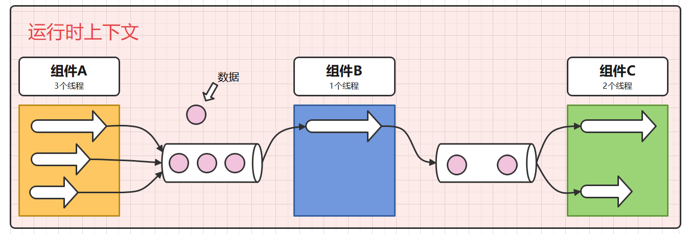
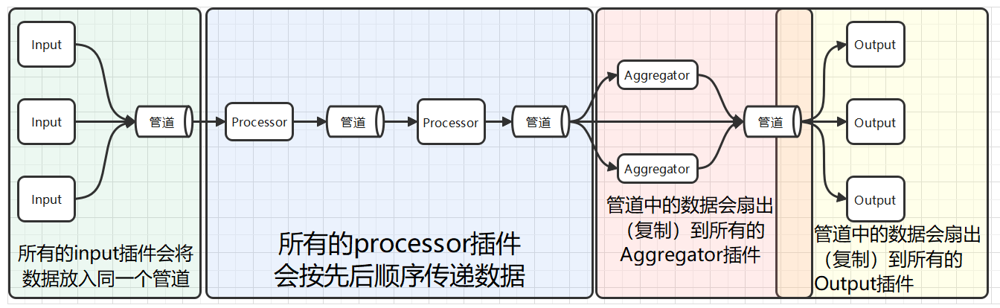

# Telegraf

## 一、认识 Telegraf

Telegraf 是一个基于插件的开源指标采集工具。本身是为 InfluxDB（一款时序数据库）量身打造的数据收集器，但是它过于优秀，能够将抓取的数据写到很多地方，尤其在时序数据库领域，很多时序数据库都能够与它配合使用。通常，它每隔一段时间抓取一批指标数据（比如机器的 CPU 使用情况，磁盘的 IO，网络情况，MySQL 服务端的会话数等等）并将他们发送到时序数据库、消息队列或者自定义导出到某个地方，供下游的应用处理（比如报警）。Telegraf 也能够对外提供一个服务，等待客户端推送数据。

它与 Logstash 类似，只不过 Logstash 是收集日志的，Telegraf 是收集指标的。

<br/>
<br/>

## 二、安装部署 Telegraf

> [https://portal.influxdata.com/downloads/](https://portal.influxdata.com/downloads/)

```shell
wget https://dl.influxdata.com/telegraf/releases/telegraf-1.26.0_linux_arm64.tar.gz
tar xf telegraf-1.26.0_linux_arm64.tar.gz
mv telegraf-1.26.0 telegraf
```

```shell
cd telegraf
tree -F
```

```
./
├── etc/
│   ├── logrotate.d/
│   │   └── telegraf
│   └── telegraf/
│       ├── telegraf.conf
│       └── telegraf.d/
├── usr/
│   ├── bin/
│   │   └── telegraf*
│   └── lib/
│       └── telegraf/
│           └── scripts/
│               ├── init.sh*
│               └── telegraf.service
└── var/
    └── log/
        └── telegraf/
```

<br/>
<br/>

## 三、快速入门 Telegraf

### 3.1 单输入输出工作流

-   编辑配置文件

    ```shell
    vim etc/telegraf/telegraf.d/example01.conf
    ```

    ```toml
    [agent]
      interval = "3s"

    [[inputs.cpu]]
      percpu = true
      totalcpu = true
      collect_cpu_time = false
      report_active = false
      core_tags = false

    [[outputs.file]]
      files = ["stdout"]
    ```

-   运行 Telegraf

    ```shell
    usr/bin/telegraf --config etc/telegraf/telegraf.d/example01.conf
    ```

    <br/>

### 3.2 配置文件含义

`example01.conf` 配置文件涉及到 3 个配置块。

-   `[agent]` 这里面是一些涉及全局的配置。此处我们设置 `interval="3s"`意思是让配置文件中所有 input 插件每隔 3 秒去采集一次指标。`interval` 的默认值是 10 秒。
-   `[[inputs.cpu]]` 这是一个 input 输入组件，这里的配置是说我们导出的指标会包含每一个 CPU 核的使用情况，而且还包含所有 CPU 总的使用情况。
-   `[[outputs.file]]` 这是一个 output 输出组件，这里我们用了一个名为 `file` 的输出组件，不过 `files` 参数设为了 `stdout`（标准输出）也就是控制台，这样程序运行起来我们应该可以看到数据打印在控制台上。

<br/>

### 3.3 数据输出

-   InfluxDB 行协议

    ```
    cpu,cpu=cpu0,host=vm006 usage_system=1.0033444816036312,usage_idle=97.65886287602467,usage_softirq=0,usage_steal=0,usage_guest_nice=0,usage_user=1.3377926421388087,usage_iowait=0,usage_irq=0,usage_guest=0,usage_nice=0 1680181074000000000
    cpu,cpu=cpu1,host=vm006 usage_system=0.6711409395992614,usage_steal=0,usage_guest=0,usage_guest_nice=0,usage_user=0.3355704697996307,usage_idle=98.65771812101512,usage_nice=0,usage_iowait=0,usage_irq=0,usage_softirq=0.3355704697999287 1680181074000000000
    cpu,cpu=cpu-total,host=vm006 usage_idle=98.16053511704587,usage_iowait=0,usage_softirq=0,usage_guest_nice=0,usage_user=1.0033444816070234,usage_nice=0,usage_irq=0,usage_steal=0,usage_guest=0,usage_system=0.8361204013385525 1680181074000000000
    cpu,cpu=cpu0,host=vm006 usage_system=1.0101010101006525,usage_nice=0,usage_iowait=0,usage_softirq=0,usage_guest=0,usage_guest_nice=0,usage_user=1.346801346799594,usage_idle=97.64309764310836,usage_irq=0,usage_steal=0 1680181077000000000
    cpu,cpu=cpu1,host=vm006 usage_user=2.6936026936030157,usage_system=1.0101010101016095,usage_nice=0,usage_iowait=0,usage_guest=0,usage_guest_nice=0,usage_idle=96.29629629627814,usage_irq=0,usage_softirq=0,usage_steal=0 1680181077000000000
    cpu,cpu=cpu-total,host=vm006 usage_user=2.0168067226901387,usage_steal=0,usage_guest_nice=0,usage_iowait=0.16806722689086478,usage_irq=0,usage_softirq=0,usage_guest=0,usage_system=1.176470588235755,usage_idle=96.63865546223214,usage_nice=0 1680181077000000000
    ```

<br/>
<br/>

## 四、Telegraf 内部数据结构

Telegraf 的本身是 InfluxData 公司专门为 InfluxDB 开发的数据采集器。上面这种数据格式师 InfluxDB 数据库使用的，只要数据符合上面这种格式，就能通过 InfluxDB 的 API 将数据导入数据库。

### 4.1 InfluxDB 行协议


1. Measurement（测量名称）（必须）

2. Tag Set（标签集）（可选）

    标签应该用在一些值范围有限，不太会变动的属性上。比如传感器的类型和 ID 等等。在 InfluxDB 中一个 Tag 相当于一个索引，给数据点加上 Tag 有利于将来对数据进行检索，但是如果索引太多了就会减慢数据的插入速度。

3. Field Set（字段集）（必须）

4. Timestamp（时间戳）（可选）

    如果时间戳没有指定，那么 InfluxDB 就使用当前系统的时间戳。如果数据里的时间戳不是以纳秒为单位额，那么需要再数据写入时指定时间戳的精度。

<br/>

### 4.2 协议中的数据类型及其格式

1. 浮点数

    IEEE-754 标准的 64 位浮点数，这是默认的数据类型。

2. 有符号整数

    有符号 64 位整数，需要再数字的尾部加上一个小写 `i`。

3. 无符号整数

    无符号的 64 位整数，需要在数字的尾部加上一个小写 `u`。

4. 字符串

    普通文本字符串，长度不能超过 64 KB。

5. 布尔值

6. 时间戳

7. 注释

    以 `#` 开头的一行会被当做注释。

<br/>
<br/>

## 五、Telegraf 架构

### 5.1 责任链设计模式

Telegraf 是典型的 Pipeline（流水线或管道）架构，这种架构使用了责任链设计模式的思想。

简单来说，这种设计模式的关键点就在”链“这个字上，代码的功能被拆分成一个一个独立的组件，而且能够根据需求，灵活的组合。

<br/>

### 5.2 Pipeline 架构

Telegraf 将输出的处理流程抽象为由多个插件组成的流水线，插件和插件之间用管道相连（可以理解为一个先进先出的队列），这种架构至少能体现出两种优势：

-   插件和插件之间实现了松耦合，下一个插件可以不用管上一个插件的内部逻辑是怎么实现的，它们只要按照约定好的格式传递数据就行。
-   流程配置化，谁和谁组合的决定可以推迟到运行时决定，而不是开发人员必须在开发时就把各种处理流程写死，相当于交给了用户一堆积木。

通常的 Pipeline 架构，除了要配置插件和组合顺序外，还会包括一层上下文配置，所以最终的常见 Pipeline 架构是如下图所示的。



<br/>

### 5.3 Telegraf 实现

#### 5.3.1 架构角度



Telegraf 内部设计了 4 种类型的插件，它们必须按照特定的顺序进行组合：

1. 输入插件

2. 处理插件

3. 聚合插件

4. 输出插件

并且插件之间框架是如何控制它们传值的，这一点也有特别的约定：

-   所有的 input 插件会将数据放入同一个管道；
-   所有的 processor 插件会按先后顺序传递数据（在配置文件中必须显式地指定顺序，否则 processor 之间会以随机顺序组合）；
-   aggregator 前的管道会把数据复制给所有的 aggregator 插件，不过 Telegraf 还为插件们设计了指标过滤器，插件可以选择性地接收部分数据；
-   output 前的管道也会将数据复制给所有的 output 组件，也可以使用过滤器组件选择性地接收。

#### 5.3.2 性能角度

Telegraf 使用 Go 语言开发，如果你使用的都是内部组件，那么每个插件都是一个独立的 goroutine。
