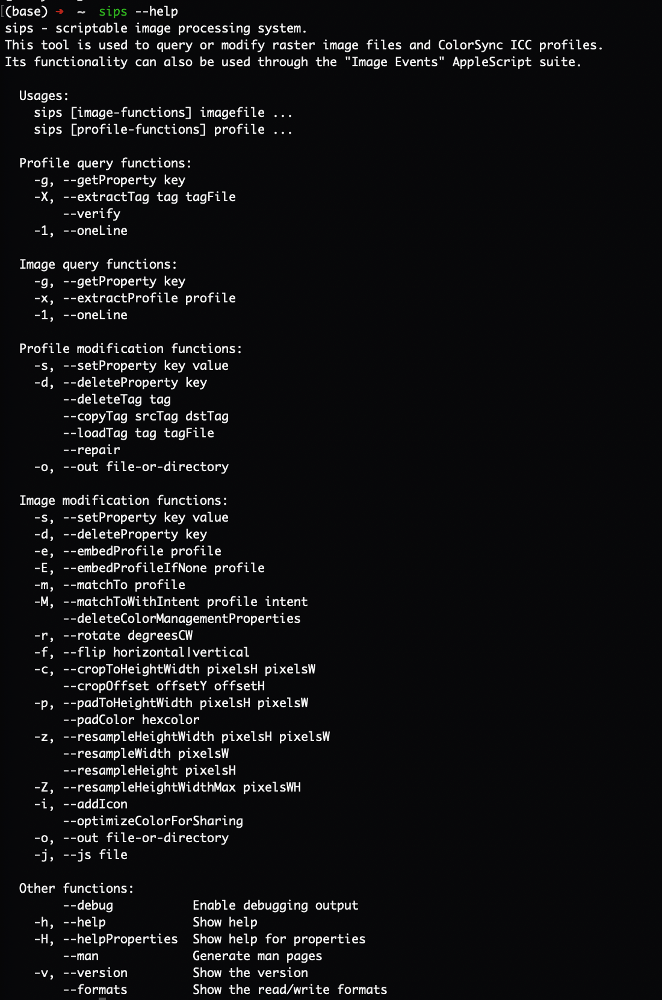

# 内置命令行图片处理工具 `sips`

## 快速开始

### 帮助



### 调整图片大小

将当前目录下所有 PNG 图片的宽度调整为 `800` 像素并保存至 `output` 目录。

```shell
mkdir -p output

sips --resampleWidth 800 *.png --out output
```

## 收藏

-   [sips 命令进行图片批量处理](https://www.jianshu.com/p/c906978a4d29)
-   [高效便捷！使用 macOS 的神奇命令行工具 sips，轻松批量调整图片大小！](https://zhuanlan.zhihu.com/p/628417653)
