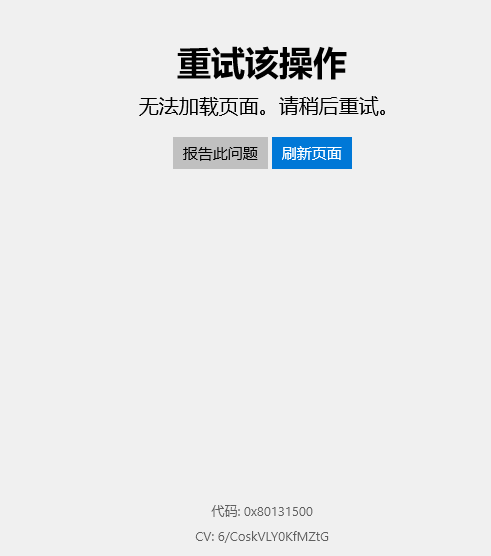
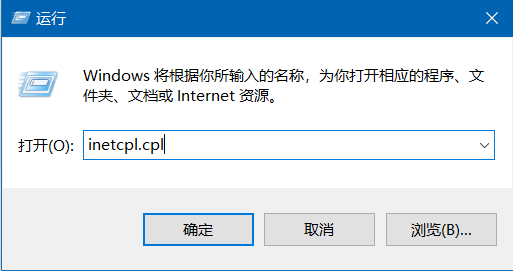
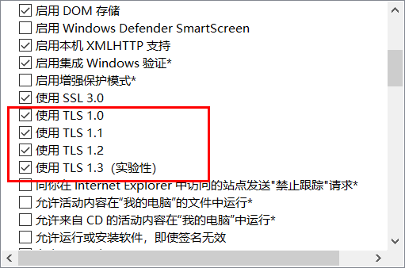

# Windows

## 收藏

#### [安装一些更新时出现问题 错误 0x800f081f](https://answers.microsoft.com/zh-hans/windows/forum/all/%E5%AE%89%E8%A3%85%E4%B8%80%E4%BA%9B%E6%9B%B4/0992128a-91a7-4eb1-97e5-b5b509a4527b?auth=1)

#### [电脑两个网卡同时访问内外网，路由表设置](https://blog.csdn.net/iamdereck/article/details/82778599)

#### [收集的一些优秀软件](https://ld246.com/article/1590298847904)

#### Windows11 设置右键显示全部菜单

1. 打开 PowerShell 输入如下命令

    ```shell
    reg.exe add "HKCU\Software\Classes\CLSID\{86ca1aa0-34aa-4e8b-a509-50c905bae2a2}\InprocServer32" /f /ve
    ```

2. 重启

## 常见问题

#### 应用商店无法更新。错误代码: 0x80131500

> -   [微软应用商店错误代码“0x80131500”怎么修复？](https://blog.csdn.net/q1246192888/article/details/122412728)





#### 关闭休眠

> Win + R 输入 `powershell` Ctrl + Shift 以管理员模式打开

```shell
powercfg -h off
```

#### 清理 DNS 和 ARP 缓存

```shell
ipconfig.exe /flushdns

netsh.exe interface ip delete arpcache
```

#### `winget` 命令

> 应用商店搜索“应用安装程序”并下载安装。

#### 离线下载 Chrome

> -   https://www.google.com/intl/zh-CN/chrome/?standalone=1
